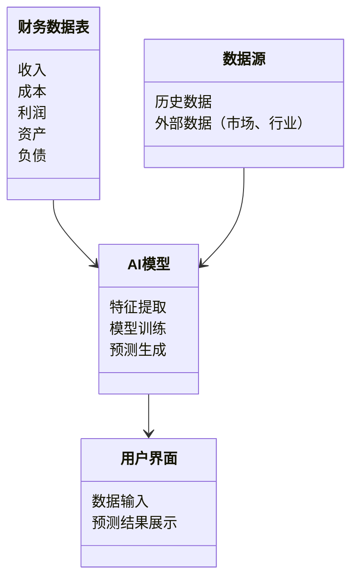
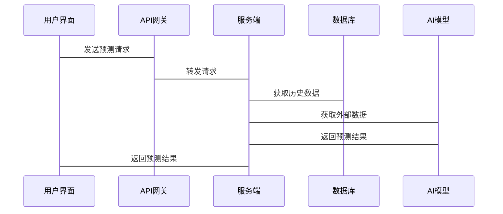

                 


# AI辅助的公司财务报表预测

> 关键词：AI辅助、财务报表预测、机器学习、自然语言处理、时间序列分析

> 摘要：本文深入探讨AI技术在公司财务报表预测中的应用，从核心概念、算法原理到系统设计，全面解析如何利用AI技术提升财务预测的准确性和效率。通过具体案例分析，展示AI在财务领域的实际应用价值。

---

# 第一部分: AI辅助的公司财务报表预测概述

## 第1章: AI在公司财务报表预测中的作用

### 1.1 什么是公司财务报表预测

#### 1.1.1 财务报表预测的定义
财务报表预测是指通过对历史财务数据和相关因素的分析，预测未来某一时期内公司的财务状况、经营成果和现金流量的过程。

#### 1.1.2 财务报表预测的核心要素
- **财务数据**：包括收入、支出、利润、资产负债等。
- **外部因素**：如市场环境、行业趋势、政策变化等。
- **内部因素**：如公司战略、管理决策、运营效率等。

#### 1.1.3 财务报表预测的边界与外延
财务报表预测不仅关注财务数据本身，还需要考虑数据生成的背景、假设和可能的风险因素。

### 1.2 AI辅助财务预测的背景与意义

#### 1.2.1 传统财务预测的局限性
- 传统财务预测主要依赖人工分析和经验判断，存在主观性强、效率低、覆盖面窄等问题。
- 数据量大、复杂性高时，传统方法难以准确捕捉关键趋势。

#### 1.2.2 AI技术在财务预测中的优势
- **数据处理能力**：AI能够处理海量数据，发现人类难以察觉的规律。
- **自动化与高效性**：AI可以自动进行数据清洗、特征提取和模型训练，显著提高预测效率。
- **动态适应性**：AI模型可以根据实时数据动态调整预测结果，适应市场变化。

#### 1.2.3 企业级应用开发的新范式
AI技术的应用推动了企业财务管理的数字化和智能化，为企业决策提供了更精准的支持。

### 1.3 本章小结
本章介绍了AI辅助财务报表预测的基本概念、背景和意义，为后续内容奠定了基础。

---

# 第二部分: 核心概念与联系

## 第2章: AI辅助财务预测的核心概念

### 2.1 机器学习与财务预测的关系

#### 2.1.1 机器学习的定义与特点
- **定义**：机器学习是一种通过数据训练模型，使其能够从经验中学习并做出预测或决策的技术。
- **特点**：数据驱动、模型自动优化、适应性强。

#### 2.1.2 机器学习在财务预测中的应用
- **时间序列分析**：用于预测收入、利润等指标的变化趋势。
- **分类与回归**：用于识别财务状况的类别（如健康、风险）或预测具体数值（如净利润）。

#### 2.1.3 机器学习与传统统计方法的对比
| 对比维度 | 传统统计方法 | 机器学习 |
|----------|---------------|----------|
| 数据需求 | 需要较小样本 | 需要大量样本 |
| 模型复杂性 | 简单线性模型为主 | 可处理非线性复杂关系 |
| 自适应性 | 需人工调整 | 可自适应数据变化 |

### 2.2 自然语言处理与财务报告分析

#### 2.2.1 NLP的定义与特点
- **定义**：自然语言处理是让计算机理解和生成人类语言的技术。
- **特点**：能够处理非结构化文本数据，提取隐含信息。

#### 2.2.2 NLP在财务报告分析中的应用
- **财务文本分析**：从财务报告中提取关键信息，如收入增长、成本变化等。
- **情感分析**：分析市场对公司的看法，预测股价波动。

#### 2.2.3 NLP与传统文本分析的对比
| 对比维度 | 传统文本分析 | NLP |
|----------|---------------|------|
| 技术基础 | 基于关键词匹配 | 基于深度学习模型 |
| 分析深度 | 浅层信息提取 | 深度语义理解 |
| 处理效率 | 人工或半自动化 | 自动化 |

### 2.3 数据挖掘与财务预测的关系

#### 2.3.1 数据挖掘的定义与特点
- **定义**：数据挖掘是从大量数据中发现模式、趋势和关联的过程。
- **特点**：注重数据的探索性分析，发现潜在规律。

#### 2.3.2 数据挖掘在财务预测中的应用
- **异常检测**：识别财务数据中的异常值，发现潜在问题。
- **聚类分析**：将公司按财务状况分为不同类别，便于制定针对性策略。

#### 2.3.3 数据挖掘与传统数据分析的对比
| 对比维度 | 传统数据分析 | 数据挖掘 |
|----------|---------------|----------|
| 分析目标 | 确定性问题 | 发现未知规律 |
| 方法论 | 假设驱动 | 数据驱动 |
| 工具支持 | 统计软件为主 | 专业数据挖掘工具 |

---

## 第3章: 核心概念的原理与联系

### 3.1 机器学习算法原理

#### 3.1.1 线性回归模型
- **定义**：线性回归是一种用于预测连续型变量的简单机器学习模型。
- **公式**：
  $$ y = \beta_0 + \beta_1x + \epsilon $$
  其中，$y$ 是目标变量，$x$ 是自变量，$\beta_0$ 和 $\beta_1$ 是回归系数，$\epsilon$ 是误差项。
- **应用**：用于预测公司的收入、成本等连续型变量。

#### 3.1.2 支持向量机（SVM）
- **定义**：SVM是一种监督学习模型，用于分类和回归问题。
- **对偶形式**：
  $$ \max_{\beta, \beta_0, \rho} \frac{1}{2}\|\beta\|^2 + C \sum_{i=1}^n \xi_i $$
  其中，$\beta$ 是权重向量，$\beta_0$ 是偏置项，$C$ 是惩罚参数，$\xi_i$ 是松弛变量。
- **应用**：用于分类财务状况，如区分健康与风险公司。

#### 3.1.3 随机森林与梯度提升树
- **随机森林**：一种基于树的集成学习方法，通过构建多棵决策树并进行投票或平均来提高预测准确率。
- **梯度提升树**：通过迭代地改进模型，每次优化前一个模型的误差。

### 3.2 NLP模型原理

#### 3.2.1 词嵌入（Word Embedding）
- **定义**：将词语映射为低维向量，保留词语之间的语义关系。
- **示例**：词嵌入可以通过Word2Vec、GloVe等技术实现。

#### 3.2.2 神经网络语言模型（NNLM）
- **定义**：基于神经网络的自然语言处理模型，能够直接从文本中学习词向量。
- **优势**：能够捕捉上下文关系，理解词语的语义。

#### 3.2.3 变量自注意力机制（Transformer）
- **定义**：Transformer模型通过自注意力机制，捕捉输入中的全局依赖关系。
- **公式**：
  $$ \text{Attention}(Q, K, V) = \text{softmax}\left(\frac{QK^T}{\sqrt{d_k}}\right)V $$
  其中，$Q$ 是查询向量，$K$ 是键向量，$V$ 是值向量，$d_k$ 是键向量的维度。

### 3.3 数据挖掘与特征工程

#### 3.3.1 数据清洗与预处理
- **数据清洗**：去除重复数据、处理缺失值、纠正错误值。
- **数据标准化**：对数据进行归一化或标准化处理，使其适合模型输入。

#### 3.3.2 特征选择与降维
- **特征选择**：通过统计检验或模型评估，选择对目标变量影响较大的特征。
- **主成分分析（PCA）**：
  $$ \text{最大化} \sum_{i=1}^k \lambda_i $$
  通过线性组合降维，减少特征数量。

#### 3.3.3 数据增强与扩展
- **数据增强**：通过生成新数据或变换现有数据，增加训练数据的多样性。
- **特征工程**：构建新的特征，如交互项、多项式特征等。

---

## 第4章: 核心概念的数学模型与公式

### 4.1 机器学习模型的数学基础

#### 4.1.1 线性回归模型
$$ y = \beta_0 + \beta_1x + \epsilon $$

#### 4.1.2 支持向量机（SVM）
$$ \max_{\beta, \beta_0, \rho} \frac{1}{2}\|\beta\|^2 + C \sum_{i=1}^n \xi_i $$

#### 4.1.3 随机森林与梯度提升树
- 随机森林通过集成学习提高预测准确性。
- 梯度提升树通过迭代优化模型，降低预测误差。

### 4.2 NLP模型的数学基础

#### 4.2.1 词嵌入的向量空间模型
$$ E(w) = v_w $$

#### 4.2.2 Transformer模型的自注意力机制
$$ \text{Attention}(Q, K, V) = \text{softmax}\left(\frac{QK^T}{\sqrt{d_k}}\right)V $$

### 4.3 数据挖掘与特征工程的数学基础

#### 4.3.1 主成分分析（PCA）
$$ \text{最大化} \sum_{i=1}^k \lambda_i $$

#### 4.3.2 K-means聚类算法
$$ \text{最小化} \sum_{i=1}^k \sum_{j=1}^n \sum_{m=1}^k (x_{ij} - c_{km})^2 $$

---

# 第三部分: 算法原理讲解

## 第5章: 时间序列分析与预测

### 5.1 时间序列的基本概念

#### 5.1.1 时间序列的定义
时间序列是指按照时间顺序排列的数据，常用于预测未来趋势。

#### 5.1.2 时间序列的特征
- **趋势**：数据整体的上升或下降趋势。
- **周期性**：数据在一定时间周期内重复出现的模式。
- **随机性**：数据中无法用确定性模型描述的部分。

#### 5.1.3 时间序列的分类
- **平稳时间序列**：均值和方差恒定。
- **非平稳时间序列**：均值或方差随时间变化。

### 5.2 时间序列分析的核心方法

#### 5.2.1 自回归积分滑动平均模型（ARIMA）
- **定义**：ARIMA模型通过自回归和移动平均部分，捕捉时间序列的动态特征。
- **公式**：
  $$ y_t = \phi_1 y_{t-1} + \phi_2 y_{t-2} + \theta_1 e_{t-1} + \theta_2 e_{t-2} + \epsilon_t $$

#### 5.2.2 长短期记忆网络（LSTM）
- **定义**：LSTM是一种特殊的RNN，能够有效处理时间序列中的长距离依赖关系。
- **结构**：包括输入门、遗忘门和输出门。

#### 5.2.3 卷积神经网络（CNN）
- **定义**：CNN通过卷积操作捕捉时间序列的空间特征。
- **优势**：适合处理局部依赖关系。

### 5.3 时间序列预测的流程

#### 5.3.1 数据预处理
- **平稳化**：通过差分等方法使时间序列平稳。
- **归一化**：对数据进行归一化处理，使其适合模型输入。

#### 5.3.2 模型训练
- **参数调优**：通过交叉验证选择最优模型参数。
- **超参数优化**：使用网格搜索或随机搜索优化模型性能。

#### 5.3.3 模型评估
- **回测**：在历史数据上验证模型的预测能力。
- **指标评估**：使用均方误差（MSE）、平均绝对误差（MAE）等指标衡量预测准确性。

---

## 第6章: 系统分析与架构设计方案

### 6.1 问题场景介绍

#### 6.1.1 项目背景
某公司希望通过AI技术提升财务预测的准确性和效率，优化财务管理流程。

#### 6.1.2 项目目标
- 实现对公司收入、成本、利润等关键财务指标的预测。
- 提供数据驱动的决策支持，辅助管理层制定更科学的财务策略。

### 6.2 系统功能设计

#### 6.2.1 领域模型（Mermaid类图）


#### 6.2.2 系统架构设计（Mermaid架构图）


#### 6.2.3 系统接口设计
- **输入接口**：接收财务数据和外部数据。
- **输出接口**：提供预测结果和相关分析报告。

#### 6.2.4 系统交互（Mermaid序列图）


### 6.3 系统实现细节

#### 6.3.1 数据采集与预处理
- **数据来源**：公司内部财务系统、外部市场数据接口。
- **数据清洗**：处理缺失值、异常值，进行数据归一化。

#### 6.3.2 模型训练与部署
- **模型选择**：根据数据特点选择合适的算法，如LSTM、ARIMA等。
- **模型部署**：将训练好的模型部署到服务端，提供API接口。

#### 6.3.3 系统优化与维护
- **模型更新**：定期重新训练模型，保持预测能力。
- **系统监控**：监控系统运行状态，及时发现并解决问题。

---

## 第7章: 项目实战

### 7.1 环境安装

#### 7.1.1 安装Python
- 安装Python 3.8及以上版本，建议使用Anaconda或virtualenv管理环境。

#### 7.1.2 安装相关库
```bash
pip install numpy pandas scikit-learn tensorflow transformers
```

### 7.2 系统核心实现源代码

#### 7.2.1 数据预处理代码
```python
import pandas as pd
import numpy as np

# 读取数据
data = pd.read_csv('financial_data.csv')

# 数据清洗
data.dropna(inplace=True)
data = data.drop_duplicates()

# 数据归一化
from sklearn.preprocessing import MinMaxScaler
scaler = MinMaxScaler()
scaled_data = scaler.fit_transform(data[['revenue', 'costs', 'profit']])
```

#### 7.2.2 模型训练代码
```python
from tensorflow.keras.models import Sequential
from tensorflow.keras.layers import LSTM, Dense

# 构建LSTM模型
model = Sequential()
model.add(LSTM(units=50, input_shape=(timesteps, features)))
model.add(Dense(1))
model.compile(loss='mean_squared_error', optimizer='adam')

# 训练模型
model.fit(X_train, y_train, epochs=100, batch_size=32)
```

#### 7.2.3 模型预测代码
```python
# 进行预测
predicted_values = model.predict(X_test)

# 反归一化
predicted_values = scaler.inverse_transform(predicted_values)
```

### 7.3 代码应用解读与分析

#### 7.3.1 数据预处理部分
- 使用Pandas读取数据，去除缺失值和重复值。
- 通过归一化处理，使数据适合模型输入。

#### 7.3.2 模型训练部分
- 使用LSTM模型捕捉时间序列的长期依赖关系。
- 通过Adam优化器和均方误差损失函数，优化模型性能。

#### 7.3.3 模型预测部分
- 使用训练好的模型进行预测。
- 反归一化处理，得到实际的预测值。

### 7.4 实际案例分析和详细讲解

#### 7.4.1 数据来源与特征
- 数据来源：公司过去5年的财务数据和市场数据。
- 关键特征：收入、成本、利润、行业指数、宏观经济指标。

#### 7.4.2 模型训练与验证
- 训练数据：过去4年的数据。
- 验证数据：最后1年的数据。
- 预测指标：下一年的收入和利润预测。

#### 7.4.3 模型评估与优化
- 评估指标：均方误差（MSE）、平均绝对误差（MAE）、R²系数。
- 优化策略：调整模型参数、使用早停法防止过拟合。

### 7.5 项目小结
通过本项目，我们成功实现了AI辅助的公司财务报表预测系统，验证了AI技术在财务管理中的巨大潜力。

---

## 第8章: 最佳实践与小结

### 8.1 最佳实践 tips

#### 8.1.1 数据处理
- 确保数据质量，进行充分的清洗和预处理。
- 结合业务背景，选择合适的特征。

#### 8.1.2 模型选择
- 根据数据特点选择模型，如时间序列数据适合LSTM或ARIMA。
- 对多个模型进行对比，选择表现最好的。

#### 8.1.3 模型部署
- 使用容器化技术（如Docker）部署模型，确保系统的稳定性和可扩展性。
- 定期更新模型，保持预测能力。

### 8.2 小结
AI技术正在深刻改变财务管理的方式，通过本文的讲解，读者可以系统地了解AI辅助公司财务报表预测的核心概念、算法原理和系统设计，为实际应用提供了理论基础和实践指导。

### 8.3 注意事项
- 数据隐私和安全问题需要高度重视。
- 模型解释性不足，可能影响实际应用。
- 需要结合业务知识，避免模型的片面性。

### 8.4 拓展阅读
- 《Deep Learning for Time Series Forecasting》
- 《Python机器学习实战》
- 《自然语言处理入门》

---

# 结语

AI辅助的公司财务报表预测不仅提升了财务管理的效率，还为企业的决策提供了更有力的支持。随着技术的不断进步，AI在财务领域的应用将更加广泛和深入，为企业创造更大的价值。

---

# 作者：AI天才研究院 & 禅与计算机程序设计艺术

