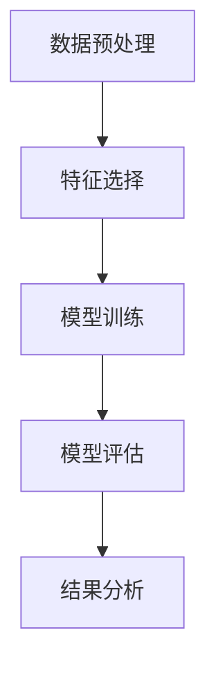
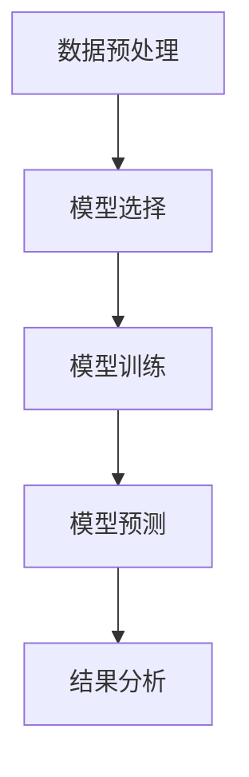
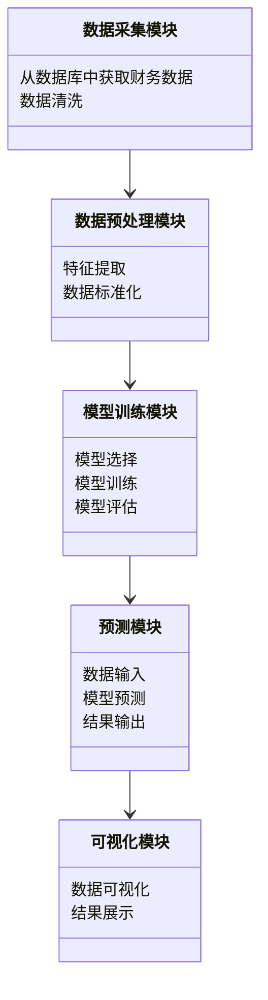

                 


```markdown
# AI辅助的公司财务报表预测与分析

> 关键词：AI, 财务报表, 预测分析, 机器学习, 深度学习, 自然语言处理

> 摘要：本文详细探讨了AI技术在公司财务报表预测与分析中的应用，从数据预处理到模型训练，再到结果的分析与可视化，系统地介绍了AI如何辅助财务分析。文章涵盖了从基础概念到高级算法的各个方面，结合实际案例和系统架构设计，为读者提供了一套完整的解决方案。

---

## 目录

1. [背景与概述](#背景与概述)
2. [核心概念与联系](#核心概念与联系)
3. [算法原理](#算法原理)
4. [数学模型与公式](#数学模型与公式)
5. [系统分析与架构设计](#系统分析与架构设计)
6. [项目实战](#项目实战)
7. [总结](#总结)

---

## 1. 背景与概述

### 1.1 AI在财务领域的应用现状

随着人工智能技术的飞速发展，AI在财务领域的应用越来越广泛。从自动化记账到智能预测，AI正在改变传统财务工作的模式。本文将重点探讨AI在公司财务报表预测与分析中的具体应用。

#### 1.1.1 AI技术在财务领域的应用现状

目前，AI在财务领域的应用主要集中在以下几个方面：

- **自动化数据处理**：利用自然语言处理（NLP）技术提取财务报表中的关键数据。
- **智能预测模型**：通过机器学习算法预测公司财务状况，如收入预测、支出预测等。
- **风险评估**：利用AI进行信用评估和欺诈检测，降低财务风险。

#### 1.1.2 财务报表预测与分析的背景和意义

财务报表是公司财务状况的重要反映，准确的预测和分析对于企业的经营决策至关重要。然而，传统的财务分析方法依赖于大量的人工计算和经验判断，效率低下且容易出错。AI技术的引入，极大地提高了财务分析的效率和准确性。

#### 1.1.3 AI辅助财务分析的核心价值

AI辅助财务分析的核心价值在于其强大的数据处理能力和预测能力。通过AI技术，可以快速从大量财务数据中提取有价值的信息，构建高精度的预测模型，为企业提供科学的决策支持。

---

### 1.2 财务报表预测与分析的基本概念

#### 1.2.1 财务报表的基本构成

公司财务报表主要包括资产负债表、利润表和现金流量表三部分。AI技术可以对这三部分数据进行综合分析，提供更全面的预测结果。

#### 1.2.2 AI辅助财务分析的实现方式

AI辅助财务分析主要通过以下几种方式实现：

- **数据采集与预处理**：利用爬虫技术从公开渠道获取财务数据，并进行清洗和标准化处理。
- **模型训练与优化**：基于历史数据训练机器学习模型，如线性回归、随机森林等。
- **结果分析与可视化**：对模型预测结果进行解读，并通过图表形式展示，便于决策者理解。

#### 1.2.3 财务报表预测的边界与外延

在实际应用中，财务报表预测的边界包括数据的完整性和准确性，而外延则涉及预测模型的泛化能力，即模型能否准确预测不同规模和行业的公司财务状况。

---

## 2. 核心概念与联系

### 2.1 AI辅助财务分析的核心概念

#### 2.1.1 数据驱动的财务分析

数据驱动的财务分析强调通过数据分析技术提取有价值的信息，帮助财务人员做出更科学的决策。

#### 2.1.2 AI算法在财务预测中的应用

常用的AI算法包括线性回归、支持向量机（SVM）、随机森林和神经网络等。这些算法在财务预测中的应用各有特点，例如线性回归适用于线性关系，而神经网络则适合处理复杂非线性关系。

#### 2.1.3 财务报表预测的边界与外延

财务报表预测的边界主要取决于数据质量和模型复杂度，而外延则取决于模型的泛化能力和应用场景。

### 2.2 核心概念的属性特征对比

以下是一些核心概念的属性特征对比：

| 概念          | 数据驱动 | AI算法 | 预测结果 |
|---------------|----------|--------|----------|
| 财务报表预测  | 高       | 高     | 高       |
| 财务分析      | 中       | 低     | 中       |
| 数据预处理    | 高       | 无     | 无       |

### 2.3 实体关系图（ER图）架构

以下是财务报表预测系统的核心实体关系图：

```mermaid
erDiagram
    customer[客户] {
        id : integer
        name : string
        email : string
    }
    transaction[交易] {
        id : integer
        amount : float
        date : date
    }
    report[财务报表] {
        id : integer
        type : string
        date : date
    }
    model[预测模型] {
        id : integer
        type : string
        accuracy : float
    }
    customer--|{many} transaction
    transaction-->report
    report-->model
```

---

## 3. 算法原理

### 3.1 常见的财务预测算法

#### 3.1.1 线性回归分析

线性回归是一种简单而有效的预测方法，适用于线性关系的财务数据。

##### 线性回归模型

$$ y = \beta_0 + \beta_1x + \epsilon $$

其中，$y$ 是预测目标，$x$ 是自变量，$\beta_0$ 和 $\beta_1$ 是回归系数，$\epsilon$ 是误差项。

##### 线性回归实现步骤



##### 线性回归的优缺点

- **优点**：简单易懂，计算效率高。
- **缺点**：仅适用于线性关系，对非线性关系表现不佳。

#### 3.1.2 时间序列分析

时间序列分析适用于具有时间依赖性的财务数据，如股票价格预测。

##### 时间序列分析模型

时间序列分析常用ARIMA模型：

$$ ARIMA(p, d, q) $$

其中，$p$ 是自回归阶数，$d$ 是差分阶数，$q$ 是移动平均阶数。

##### 时间序列分析流程



#### 3.1.3 机器学习算法

机器学习算法如随机森林和神经网络在财务预测中表现优异。

##### 随机森林算法

随机森林是一种基于树的集成算法，适用于高维数据。

##### 神经网络算法

神经网络通过多层感知器处理复杂的非线性关系。

---

## 4. 数学模型与公式

### 4.1 多元线性回归模型

多元线性回归模型可以表示为：

$$ y = \beta_0 + \beta_1x_1 + \beta_2x_2 + ... + \beta_nx_n + \epsilon $$

其中，$y$ 是目标变量，$x_i$ 是自变量，$\beta_i$ 是回归系数，$\epsilon$ 是误差项。

### 4.2 神经网络模型

神经网络模型通常包括输入层、隐藏层和输出层，其数学表达可以表示为：

$$ y = f(Wx + b) $$

其中，$W$ 是权重矩阵，$x$ 是输入向量，$b$ 是偏置项，$f$ 是激活函数。

---

## 5. 系统分析与架构设计

### 5.1 系统功能设计

以下是财务报表预测系统的功能模块设计：



### 5.2 系统架构设计

以下是系统的整体架构设计：

```mermaid
archiDiagram
    Data Source --> Data Processing
    Data Processing --> Model Training
    Model Training --> Prediction
    Prediction --> Visualization
```

---

## 6. 项目实战

### 6.1 环境安装

需要安装以下工具和库：

- Python 3.8+
- Jupyter Notebook
- pandas, numpy, scikit-learn, keras

### 6.2 核心实现代码

以下是线性回归模型的实现代码：

```python
import pandas as pd
import numpy as np
from sklearn.linear_model import LinearRegression
from sklearn.metrics import mean_squared_error

# 数据加载
data = pd.read_csv('financial_data.csv')

# 特征选择
X = data[['revenue', 'expenses']]
y = data['profit']

# 模型训练
model = LinearRegression()
model.fit(X, y)

# 模型预测
y_pred = model.predict(X)

# 模型评估
mse = mean_squared_error(y, y_pred)
print(f"均方误差: {mse}")
```

### 6.3 案例分析与总结

通过实际案例分析，验证模型的预测精度，并总结经验教训。

---

## 7. 总结

### 7.1 最佳实践 Tips

- 数据预处理是关键，确保数据的完整性和准确性。
- 选择合适的算法，根据数据特征和预测目标进行调整。
- 定期更新模型，以适应市场变化。

### 7.2 小结

本文详细探讨了AI在公司财务报表预测与分析中的应用，从算法原理到系统设计，为读者提供了一套完整的解决方案。

### 7.3 注意事项

- 数据隐私和安全问题需要高度重视。
- 模型的泛化能力有限，需结合领域知识进行调整。

### 7.4 拓展阅读

- 推荐阅读《机器学习实战》和《深度学习入门》等书籍，进一步深入学习AI技术。

---

## 作者

作者：AI天才研究院/AI Genius Institute & 禅与计算机程序设计艺术 /Zen And The Art of Computer Programming
```

