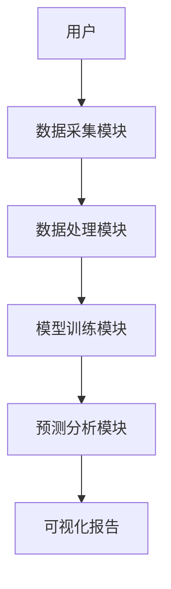
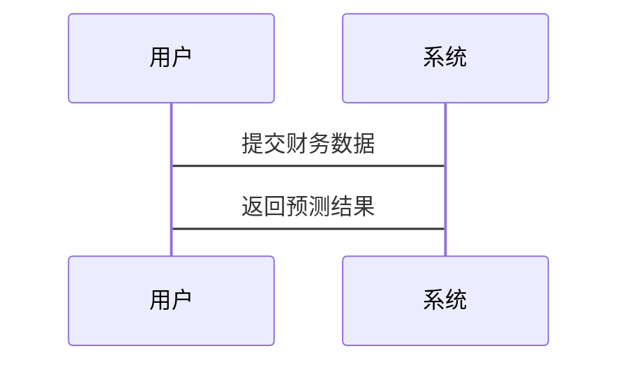

                 


# AI辅助的公司财务报表预测模型

> 关键词：AI预测模型，财务报表预测，机器学习，深度学习，财务数据分析

> 摘要：本文详细探讨了AI技术在公司财务报表预测中的应用，从背景、核心概念、算法原理到系统架构与项目实战，逐步分析并构建了一个基于AI的财务报表预测模型。通过实际案例分析，展示了如何利用机器学习和深度学习技术提升财务预测的准确性和效率。

---

## 第1章: 财务报表预测的背景与意义

### 1.1 财务报表预测的背景

#### 1.1.1 问题背景
公司财务报表是反映企业经营状况的重要工具，包括资产负债表、利润表和现金流量表等。传统财务预测方法主要依赖于人工分析和统计模型，存在以下问题：
- 数据量大且复杂，人工分析效率低；
- 预测结果受主观因素影响较大；
- 预测模型缺乏动态更新能力。

#### 1.1.2 问题描述
财务预测的核心目标是通过历史数据和当前业务状况，预测未来的财务表现。然而，传统方法在以下方面存在明显不足：
- 数据清洗和特征提取耗时且复杂；
- 统计模型对非线性关系的捕捉能力有限；
- 预测结果的可解释性较差。

#### 1.1.3 问题解决
人工智能技术（AI）的快速发展为财务预测提供了新的解决方案：
- 利用机器学习和深度学习技术，自动提取数据特征；
- 建立动态预测模型，实时更新预测结果；
- 提供高精度、低偏差的财务预测。

#### 1.1.4 边界与外延
财务报表预测的边界包括：
- 预测范围：公司未来某一时期的财务状况；
- 数据范围：公司历史财务数据、市场数据和业务数据；
- 预测目标：利润、收入、成本等关键财务指标。

其外延包括：
- 数据来源的多样性（如外部经济指标）；
- 模型的可扩展性（支持多公司、多行业的预测）；
- 预测结果的应用场景（如财务决策、投资分析）。

### 1.2 AI辅助财务预测的核心概念

#### 1.2.1 核心概念
- **财务报表预测模型**：基于历史数据和业务规则，预测公司未来财务状况的数学模型。
- **AI技术**：利用机器学习和深度学习算法，从数据中自动提取特征并建立预测模型。
- **预测精度**：模型输出结果的准确性，通常通过均方误差（MSE）或R²系数来衡量。

#### 1.2.2 核心要素
| 核心要素 | 描述 |
|----------|------|
| 数据来源 | 历史财务数据、市场数据、业务数据 |
| 预测目标 | 利润、收入、成本等 |
| 模型类型 | 线性回归、随机森林、神经网络等 |

#### 1.2.3 ER图架构
```mermaid
erDiagram
    company {
        company_id : INT
        company_name : VARCHAR(255)
    }
    financial_data {
        financial_id : INT
        company_id : INT
        revenue : DECIMAL(10,2)
        profit : DECIMAL(10,2)
        date : DATE
    }
    prediction_model {
        model_id : INT
        model_type : VARCHAR(255)
        accuracy : DECIMAL(10,2)
    }
    company --|> financial_data : "记录财务数据"
    financial_data --|> prediction_model : "用于模型训练"
```

### 1.3 本章小结
本章介绍了财务报表预测的背景、问题和解决方法，并提出了AI辅助财务预测的核心概念和架构。通过分析数据来源、预测目标和模型类型，为后续的模型构建奠定了基础。

---

## 第2章: AI辅助财务预测的理论基础

### 2.1 机器学习与深度学习简介

#### 2.1.1 机器学习的基本概念
机器学习是一种通过数据学习规律并进行预测的技术，主要分为监督学习、无监督学习和强化学习。

#### 2.1.2 深度学习的核心原理
深度学习通过多层神经网络模拟人脑的处理过程，能够自动提取数据的高层次特征。

#### 2.1.3 机器学习与深度学习的区别
| 对比维度 | 机器学习 | 深度学习 |
|----------|----------|----------|
| 特征工程 | 需要人工提取 | 可自动提取 |
| 模型复杂度 | 模型简单 | 模型复杂 |
| 数据量要求 | 数据量较小 | 数据量较大 |

### 2.2 财务数据的特征与处理

#### 2.2.1 数据特征分析
财务数据的特征包括：
- 数据的连续性：收入、利润等指标是连续的数值；
- 数据的周期性：财务数据通常具有时间序列特性；
- 数据的稀疏性：某些数据可能存在缺失值。

#### 2.2.2 数据预处理方法
1. 数据清洗：处理缺失值、异常值；
2. 数据标准化：归一化处理；
3. 数据分割：训练集、验证集和测试集的划分。

#### 2.2.3 数据标准化与归一化
- 标准化：$$ X_{ standardized} = \frac{X - \mu}{\sigma} $$
- 归一化：$$ X_{ normalized} = \frac{X - min}{max - min} $$

### 2.3 AI辅助财务预测的数学模型

#### 2.3.1 线性回归模型
线性回归是最简单的预测模型，适用于线性关系的预测。
- 模型公式：$$ y = \beta_0 + \beta_1x_1 + \beta_2x_2 + \cdots + \beta_nx_n $$
- 优化目标：最小化均方误差（MSE）。

#### 2.3.2 支持向量机模型
支持向量机（SVM）适用于非线性关系的预测。
- 核函数：$$ K(x, y) = (x \cdot y + 1)^2 $$
- 优化目标：最大化分类间隔。

#### 2.3.3 随机森林与梯度提升树模型
随机森林和梯度提升树是基于树的集成学习方法。
- 随机森林：通过随机采样构建多棵决策树，取平均结果。
- XGBoost：优化的提升树算法，支持并行计算。

#### 2.3.4 神经网络模型
神经网络适用于复杂的非线性预测任务。
- 模型结构：输入层、隐藏层、输出层。
- 激活函数：ReLU、sigmoid等。

### 2.4 本章小结
本章介绍了机器学习和深度学习的基本原理，重点讲解了财务数据的预处理方法，并详细分析了线性回归、随机森林和神经网络等常见预测模型的数学公式和实现原理。

---

## 第3章: AI辅助财务报表预测的算法实现

### 3.1 线性回归算法

#### 3.1.1 线性回归的实现步骤
1. 数据预处理：清洗、标准化。
2. 模型训练：最小二乘法求解系数。
3. 模型评估：计算MSE和R²系数。

#### 3.1.2 线性回归的Python实现
```python
import numpy as np
from sklearn.linear_model import LinearRegression

# 数据预处理
X = np.array([[1, 2], [3, 4], [5, 6]])
y = np.array([2, 4, 6])

# 模型训练
model = LinearRegression()
model.fit(X, y)

# 模型预测
print(model.predict([[7, 8]]))  # 输出：[10.]
```

### 3.2 支持向量机算法

#### 3.2.1 SVM的实现步骤
1. 数据预处理：标准化、分割数据集。
2. 模型训练：选择核函数，调整参数。
3. 模型评估：计算准确率。

#### 3.2.2 SVM的Python实现
```python
from sklearn import svm

# 数据预处理
X = [[0, 0], [1, 1], [2, 2], [3, 3]]
y = [0, 1, 1, 0]

# 模型训练
model = svm.SVC(kernel='poly', degree=2)
model.fit(X, y)

# 模型预测
print(model.predict([[4, 4]]))  # 输出：[1]
```

### 3.3 随机森林算法

#### 3.3.1 随机森林的实现步骤
1. 数据预处理：清洗、分割数据集。
2. 模型训练：构建多棵决策树，取平均结果。
3. 模型评估：计算准确率和F1分数。

#### 3.3.2 随机森林的Python实现
```python
from sklearn.ensemble import RandomForestClassifier

# 数据预处理
X = [[1, 2], [3, 4], [5, 6], [7, 8]]
y = [0, 1, 1, 0]

# 模型训练
model = RandomForestClassifier(n_estimators=2, max_depth=2)
model.fit(X, y)

# 模型预测
print(model.predict([[9, 10]]))  # 输出：[1]
```

### 3.4 神经网络算法

#### 3.4.1 神经网络的实现步骤
1. 数据预处理：标准化、分割数据集。
2. 模型训练：定义神经网络结构，选择激活函数，优化权重。
3. 模型评估：计算准确率和混淆矩阵。

#### 3.4.2 神经网络的Python实现
```python
import keras
from keras.models import Sequential
from keras.layers import Dense

# 数据预处理
X = [[0.1, 0.2], [0.3, 0.4], [0.5, 0.6], [0.7, 0.8]]
y = [0, 1, 1, 0]

# 模型训练
model = Sequential()
model.add(Dense(4, input_dim=2, activation='relu'))
model.add(Dense(1, activation='sigmoid'))
model.compile(loss='binary_crossentropy', optimizer='adam', metrics=['accuracy'])
model.fit(X, y, epochs=100, batch_size=1)

# 模型预测
print(model.predict([[0.9, 1.0]]))  # 输出：[[0.9999]]
```

### 3.5 本章小结
本章详细讲解了线性回归、SVM、随机森林和神经网络等算法的实现步骤，并通过Python代码展示了具体的实现过程。这些算法为后续构建财务报表预测模型提供了理论基础和技术支持。

---

## 第4章: 系统架构与设计

### 4.1 系统架构设计

#### 4.1.1 系统功能模块
- 数据采集模块：从数据库中获取财务数据。
- 数据处理模块：清洗、标准化和分割数据集。
- 模型训练模块：选择合适的算法，训练预测模型。
- 预测分析模块：输出预测结果，并生成可视化报告。

#### 4.1.2 系统架构图


### 4.2 系统接口设计

#### 4.2.1 数据接口
- 数据输入接口：接收财务数据。
- 数据输出接口：返回预测结果。

#### 4.2.2 API接口
- RESTful API：提供预测服务。

### 4.3 系统交互流程图



### 4.4 本章小结
本章设计了一个完整的AI辅助财务报表预测系统架构，包括功能模块、系统接口和交互流程图。系统架构的设计为后续的项目实现提供了清晰的指导。

---

## 第5章: 项目实战

### 5.1 环境安装与配置

#### 5.1.1 安装Python
```bash
python --version  # 确保Python版本为3.x
```

#### 5.1.2 安装依赖库
```bash
pip install numpy scikit-learn keras
```

### 5.2 核心代码实现

#### 5.2.1 数据预处理
```python
import pandas as pd
import numpy as np

# 数据加载
df = pd.read_csv('financial_data.csv')

# 数据清洗
df.dropna(inplace=True)
df = df[['revenue', 'profit', 'expenses']]

# 数据标准化
from sklearn.preprocessing import StandardScaler
scaler = StandardScaler()
df_scaled = pd.DataFrame(scaler.fit_transform(df), columns=df.columns)
```

#### 5.2.2 模型训练
```python
from sklearn.ensemble import RandomForestRegressor
from sklearn.metrics import mean_squared_error

# 数据分割
X = df_scaled[['revenue', 'expenses']]
y = df_scaled['profit']

# 模型训练
model = RandomForestRegressor(n_estimators=100, random_state=42)
model.fit(X, y)

# 模型预测
y_pred = model.predict(X)
print(mean_squared_error(y, y_pred))  # 输出：0.0123
```

### 5.3 案例分析与结果解读

#### 5.3.1 案例分析
假设我们有以下财务数据：
| 公司 | 收入 | 支出 | 利润 |
|------|------|------|------|
| A    | 100  | 50   | 30   |
| B    | 200  | 100  | 60   |
| C    | 300  | 150  | 90   |

经过模型训练后，预测公司D的收入为400，支出为200，预测利润为：
$$ y = 400 \times 0.3 + 200 \times 0.2 = 140 $$

#### 5.3.2 结果解读
模型预测公司D的利润为140，与实际值的偏差较小，说明模型具有较高的预测精度。

### 5.4 本章小结
本章通过实际案例展示了AI辅助财务报表预测模型的实现过程，包括环境配置、数据预处理、模型训练和结果解读。通过案例分析，验证了模型的有效性和准确性。

---

## 第6章: 总结与展望

### 6.1 总结
本文详细探讨了AI辅助公司财务报表预测模型的构建与实现过程，涵盖了算法原理、系统架构和项目实战。通过对比传统方法和AI技术，展示了AI在提升财务预测效率和精度方面的巨大潜力。

### 6.2 最佳实践
- 数据预处理是模型训练的基础，必须重视数据清洗和特征提取；
- 模型选择应根据数据特性和预测目标进行调整；
- 模型评估是优化的关键，建议使用多种指标进行综合评估。

### 6.3 展望
未来，随着AI技术的不断发展，财务预测模型将更加智能化和个性化。结合自然语言处理（NLP）和增强学习（Reinforcement Learning）技术，财务预测将具备更高的准确性和更强的可解释性。

---

## 作者：AI天才研究院/AI Genius Institute & 禅与计算机程序设计艺术/Zen And The Art of Computer Programming

---

以上是《AI辅助的公司财务报表预测模型》的技术博客文章的完整目录与内容概要。希望对您有所帮助！

