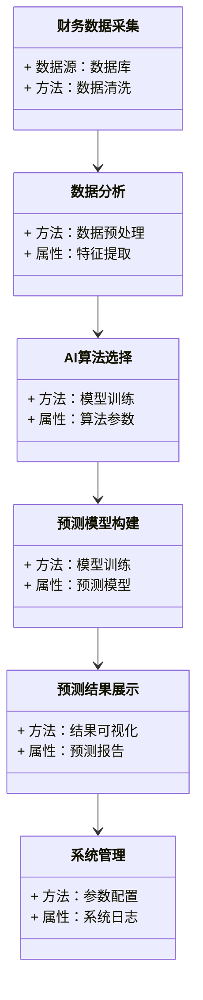
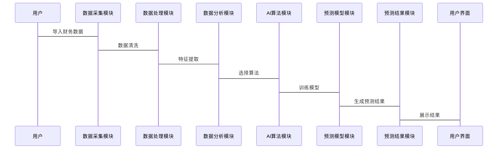

                 


# AI辅助的公司财务规划

> 关键词：AI辅助、财务规划、公司财务、人工智能、财务预测

> 摘要：本文探讨了AI技术在公司财务规划中的应用，分析了传统财务规划的局限性，详细介绍了AI辅助财务规划的核心概念、算法原理、系统架构以及项目实战，结合实际案例分析，给出了最佳实践建议。

---

# 第一章: AI辅助的公司财务规划背景与概念

## 1.1 传统公司财务规划的挑战与局限性

### 1.1.1 传统财务规划的核心流程与痛点
传统公司财务规划的核心流程包括预算制定、资金预测、成本控制和风险评估等。然而，这些流程存在以下痛点：
- 数据量大：企业财务数据种类繁多，包括收入、支出、成本等，手动处理效率低下。
- 复杂性高：财务规划需要考虑多种变量，如市场变化、政策调整等，传统方法难以全面预测。
- 人为误差：财务人员的经验和判断可能影响预测结果的准确性。

### 1.1.2 传统财务规划的局限性与改进需求
传统财务规划的局限性主要体现在以下几个方面：
- 数据处理能力有限：传统方法难以处理海量数据，且缺乏实时性。
- 预测精度不足：基于历史数据的简单外推难以捕捉市场波动和突发事件的影响。
- 可扩展性差：传统方法难以快速适应业务变化和多样化需求。

### 1.1.3 传统财务规划与现代企业发展的不匹配
随着企业规模的扩大和市场环境的复杂化，传统财务规划的效率和准确性已无法满足现代企业的需求。企业需要一种更高效、更智能的财务规划方式，以应对快速变化的市场环境。

---

## 1.2 AI技术在财务规划中的应用潜力

### 1.2.1 AI技术的基本概念与发展现状
AI技术是一种模拟人类智能的计算机技术，包括机器学习、自然语言处理、计算机视觉等。近年来，AI技术在各个领域的应用取得了显著进展，尤其是在数据分析和预测方面。

### 1.2.2 AI在财务领域的应用现状与趋势
AI技术在财务领域的应用主要集中在财务预测、风险评估、 fraud detection等领域。随着深度学习技术的发展，AI在财务规划中的应用潜力越来越大。

### 1.2.3 AI辅助财务规划的核心优势与价值
AI辅助财务规划的核心优势在于其高效性、准确性和可扩展性。AI能够快速处理海量数据，发现数据中的潜在规律，并提供精准的预测结果。此外，AI还能够根据企业的实时数据动态调整财务规划方案。

---

## 1.3 本章小结
本章介绍了传统公司财务规划的挑战与局限性，以及AI技术在财务规划中的应用潜力。通过对比分析，我们看到AI技术能够显著提升财务规划的效率和准确性，为企业提供更有力的支持。

---

# 第二章: AI辅助的公司财务规划核心概念与联系

## 2.1 AI辅助财务规划的定义与核心要素

### 2.1.1 定义与范围界定
AI辅助财务规划是指利用人工智能技术，通过分析财务数据，辅助企业制定更科学、更精准的财务规划方案。

### 2.1.2 核心要素与组成部分
AI辅助财务规划的核心要素包括：
- 财务数据：企业的收入、支出、成本等财务数据。
- AI算法：用于数据分析和预测的机器学习算法。
- 预测模型：基于AI算法构建的财务预测模型。
- 预测结果：AI生成的财务规划建议和预测结果。

### 2.1.3 核心概念的边界与外延
AI辅助财务规划的边界主要集中在财务数据的分析和预测，外延则包括对预测结果的应用和优化。

---

## 2.2 AI与财务规划的关联性分析

### 2.2.1 AI技术与财务数据的结合方式
AI技术与财务数据的结合主要通过数据清洗、特征提取和模型训练等方式实现。

### 2.2.2 AI算法在财务预测中的应用逻辑
AI算法通过分析历史财务数据，提取特征，构建预测模型，最终生成财务预测结果。

### 2.2.3 AI辅助财务规划的系统架构
AI辅助财务规划的系统架构包括数据采集、模型训练、预测分析和结果展示四个部分。

---

## 2.3 核心概念对比分析

### 2.3.1 AI辅助与传统财务规划的对比
| 对比维度 | 传统财务规划 | AI辅助财务规划 |
|----------|--------------|-----------------|
| 数据处理能力 | 有限 | 强大 |
| 预测精度 | 较低 | 高 |
| 可扩展性 | 差 | 好 |

### 2.3.2 不同AI算法在财务规划中的适用性
| AI算法 | 适用场景 | 优势 |
|--------|-----------|------|
| 线性回归 | 财务预测 | 简单易懂 |
| 聚类分析 | 财务数据分群 | 发现数据内在结构 |
| 时间序列分析 | 财务趋势预测 | 能够捕捉时间依赖性 |

### 2.3.3 财务数据特征与AI算法的匹配关系
财务数据特征包括数值型数据、时间序列数据和分类数据。不同的AI算法对数据特征有不同的要求，选择合适的算法能够提高预测精度。

---

## 2.4 本章小结
本章详细介绍了AI辅助财务规划的核心概念和其与财务规划的关联性，分析了不同AI算法在财务规划中的适用性，并通过对比分析明确了AI辅助财务规划的优势。

---

# 第三章: AI辅助的公司财务规划算法原理与实现

## 3.1 常见AI算法在财务规划中的应用

### 3.1.1 线性回归与财务预测

#### 3.1.1.1 线性回归的数学模型
线性回归的数学模型可以表示为：
$$ y = \beta_0 + \beta_1x + \epsilon $$
其中，$y$ 是目标变量，$x$ 是自变量，$\beta_0$ 是截距，$\beta_1$ 是回归系数，$\epsilon$ 是误差项。

#### 3.1.1.2 线性回归的实现步骤
1. 数据预处理：清洗数据，处理缺失值和异常值。
2. 特征提取：选择相关特征。
3. 模型训练：使用最小二乘法估计回归系数。
4. 模型评估：计算R平方值，评估模型拟合效果。

#### 3.1.1.3 示例代码
```python
import numpy as np
from sklearn.linear_model import LinearRegression
from sklearn.metrics import r2_score

# 示例数据
X = np.array([[1], [2], [3], [4], [5]])
y = np.array([2, 4, 5, 4, 6])

# 模型训练
model = LinearRegression()
model.fit(X, y)

# 预测结果
y_pred = model.predict(X)

# 模型评估
print("R平方值:", r2_score(y, y_pred))
```

---

### 3.1.2 聚类分析与财务数据分群

#### 3.1.2.1 聚类分析的数学模型
聚类分析常用的算法是K-means，其目标函数为：
$$ \arg \min \sum_{i=1}^k \sum_{j=1}^n w_{ij}||x_j - c_i||^2 $$
其中，$w_{ij}$ 是样本 $j$ 属于簇 $i$ 的权重，$c_i$ 是簇 $i$ 的中心。

#### 3.1.2.2 聚类分析的实现步骤
1. 数据预处理：标准化数据。
2. 簇数选择：使用 elbow 方法选择合适的簇数。
3. 模型训练：使用 K-means 算法进行聚类。
4. 结果分析：对每个簇进行分析，提取特征。

#### 3.1.2.3 示例代码
```python
from sklearn.cluster import KMeans
from sklearn.preprocessing import StandardScaler

# 示例数据
X = np.array([[1, 2], [5, 8], [1, 3], [8, 1], [2, 4]])

# 数据标准化
scaler = StandardScaler()
X_scaled = scaler.fit_transform(X)

# 模型训练
model = KMeans(n_clusters=2, random_state=0)
model.fit(X_scaled)

# 预测结果
y_pred = model.labels_
```

---

### 3.1.3 时间序列分析与财务预测

#### 3.1.3.1 时间序列分析的数学模型
时间序列分析常用的模型是ARIMA，其模型形式为：
$$ ARIMA(p, d, q) $$
其中，$p$ 是自回归阶数，$d$ 是差分阶数，$q$ 是移动平均阶数。

#### 3.1.3.2 时间序列分析的实现步骤
1. 数据预处理：检查数据的平稳性。
2. 模型选择：确定 $p$、$d$、$q$。
3. 模型训练：使用历史数据训练模型。
4. 模型预测：基于训练好的模型进行未来预测。

#### 3.1.3.3 示例代码
```python
from statsmodels.tsa.arima_model import ARIMA
import pandas as pd

# 示例数据
data = pd.read_csv('financial_data.csv')

# 数据处理
diff_data = data['value'].diff().dropna()

# 模型训练
model = ARIMA(diff_data, order=(1, 1, 1))
model_fit = model.fit()

# 预测结果
future_forecast = model_fit.forecast(steps=5)
```

---

## 3.2 本章小结
本章详细介绍了常见AI算法在财务规划中的应用，包括线性回归、聚类分析和时间序列分析，并通过示例代码展示了这些算法的实现过程。

---

# 第四章: AI辅助的公司财务规划系统分析与架构设计

## 4.1 问题场景介绍
本章将从实际应用场景出发，分析AI辅助财务规划系统的功能需求和架构设计。

---

## 4.2 系统功能设计

### 4.2.1 领域模型（Mermaid 类图）


---

## 4.3 系统架构设计

### 4.3.1 系统架构（Mermaid 架构图）
```mermaid
archi
    财务规划系统
    财务数据采集 --> 数据处理模块
    数据处理模块 --> 数据分析模块
    数据分析模块 --> AI算法模块
    AI算法模块 --> 预测模型模块
    预测模型模块 --> 预测结果模块
    预测结果模块 --> 用户界面
```

---

## 4.4 系统接口设计

### 4.4.1 接口描述
1. 数据接口：用于财务数据的导入和导出。
2. 模型接口：用于AI算法的选择和训练。
3. 结果接口：用于预测结果的展示和导出。

---

## 4.5 系统交互设计

### 4.5.1 系统交互流程（Mermaid 序列图）


---

## 4.6 本章小结
本章从实际应用场景出发，设计了AI辅助财务规划系统的功能模块、架构和接口，并通过mermaid图表展示了系统的交互流程。

---

# 第五章: AI辅助的公司财务规划项目实战

## 5.1 项目环境安装与数据准备

### 5.1.1 环境安装
1. 安装Python和必要的库：
   ```bash
   pip install numpy pandas scikit-learn statsmodels
   ```

### 5.1.2 数据准备
下载财务数据，例如：`financial_data.csv`

---

## 5.2 项目核心实现

### 5.2.1 数据预处理
```python
import pandas as pd
import numpy as np

# 读取数据
data = pd.read_csv('financial_data.csv')

# 数据清洗
data.dropna(inplace=True)
data = data[~data.duplicated()]
```

### 5.2.2 模型训练
```python
from sklearn.linear_model import LinearRegression
from sklearn.metrics import r2_score

# 特征选择
X = data[['revenue', 'expenses']]
y = data['profit']

# 模型训练
model = LinearRegression()
model.fit(X, y)

# 预测结果
y_pred = model.predict(X)
```

### 5.2.3 结果分析
```python
print("R平方值:", r2_score(y, y_pred))
```

---

## 5.3 项目实战小结
本章通过实际案例展示了AI辅助财务规划项目的实现过程，包括环境安装、数据预处理、模型训练和结果分析。

---

# 第六章: 总结与展望

## 6.1 本章总结
本文详细探讨了AI辅助公司财务规划的核心概念、算法原理和系统架构，并通过实际案例展示了项目的实现过程。

## 6.2 最佳实践 tips
1. 数据质量是关键，确保数据的完整性和准确性。
2. 模型选择要根据实际需求，不同的算法适用于不同的场景。
3. 结果分析要结合业务背景，避免片面解读。

## 6.3 未来展望
随着AI技术的不断发展，AI辅助财务规划的应用场景将更加广泛，预测精度也将进一步提升。

---

# 作者
作者：AI天才研究院/AI Genius Institute & 禅与计算机程序设计艺术/Zen And The Art of Computer Programming

