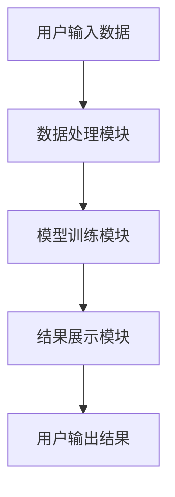

                 


# AI辅助的创业公司估值模型

**关键词**：AI辅助、创业公司估值、机器学习、深度学习、创业投资

**摘要**：  
本文探讨了如何利用人工智能技术构建创业公司估值模型，通过分析传统估值方法的局限性，结合AI技术的优势，提出了一种基于机器学习和深度学习的创业公司估值框架。文章详细介绍了模型构建的核心概念、算法原理、系统架构，并通过实战案例展示了如何在实际场景中应用这些模型。最后，总结了AI辅助创业公司估值的最佳实践和未来发展方向。

---

# 第1章 创业公司估值的基本概念

## 1.1 创业公司的定义与特点

### 1.1.1 创业公司的定义  
创业公司是指由创业者创立，旨在通过创新商业模式、产品或服务来实现商业目标的企业。这类公司通常具有高增长潜力，但也伴随着高风险。

### 1.1.2 创业公司的核心特点  
创业公司具有以下特点：  
1. **高增长性**：目标市场快速扩大，收入增长迅速。  
2. **高风险性**：市场不确定性大，失败率高。  
3. **创新性**：依赖创新的产品或商业模式。  
4. **资源有限性**：资金、团队、技术资源有限。  

### 1.1.3 创业公司估值的重要性  
创业公司估值是创业投资中的核心问题，直接影响投资者的决策。准确的估值可以帮助投资者识别潜在风险，优化投资组合。

---

## 1.2 传统创业公司估值方法

### 1.2.1 市盈率法  
市盈率法是通过将目标公司的市盈率与可比公司的市盈率进行比较，推导出目标公司的估值。公式为：  
$$ 估值 = 市盈率 \times 净利润 $$  

### 1.2.2 市净率法  
市净率法是通过比较目标公司的市净率与可比公司的市净率，推导出目标公司的估值。公式为：  
$$ 估值 = 市净率 \times 净资产 $$  

### 1.2.3 股权自由现金流法  
股权自由现金流法通过预测目标公司的自由现金流，使用折现率计算公司估值。公式为：  
$$ 估值 = \sum_{t=1}^{n} \frac{\text{现金流}_t}{(1 + r)^t} $$  

### 1.2.4 折现现金流法  
折现现金流法通过预测目标公司的未来现金流，使用折现率计算公司估值。公式为：  
$$ 估值 = \sum_{t=1}^{n} \frac{\text{现金流}_t}{(1 + r)^t} $$  

---

## 1.3 创业公司估值的挑战

### 1.3.1 数据不完整的问题  
创业公司通常财务数据有限，难以准确评估其价值。  

### 1.3.2 市场波动的影响  
市场波动可能导致估值模型结果不稳定。  

### 1.3.3 人为判断的局限性  
传统估值方法依赖主观判断，可能导致估值偏差。  

---

## 1.4 AI在创业公司估值中的应用前景

### 1.4.1 AI技术的基本原理  
人工智能通过模拟人类学习和推理能力，利用数据和算法进行模式识别和预测。  

### 1.4.2 AI在创业公司估值中的优势  
1. **数据处理能力**：AI可以处理大量非结构化数据，如新闻、社交媒体信息。  
2. **自动化预测**：AI可以通过机器学习模型自动预测公司估值。  
3. **实时更新**：AI模型可以实时更新，反映市场变化。  

### 1.4.3 AI辅助估值的潜在应用场景  
1. **早期创业公司估值**：通过AI分析团队背景、产品竞争力等非财务指标。  
2. **市场波动下的估值调整**：利用AI实时跟踪市场变化，调整估值模型。  
3. **风险评估**：通过AI分析公司风险因素，优化估值结果。  

---

## 1.5 本章小结  

本章介绍了创业公司的基本概念、传统估值方法及其挑战，并探讨了AI在创业公司估值中的应用前景。AI技术的引入为创业公司估值提供了新的可能性，但同时也需要解决数据不足和模型优化等问题。

---

# 第2章 AI辅助创业公司估值的核心概念

## 2.1 创业公司估值的关键要素

### 2.1.1 财务指标  
1. **收入**：公司收入增长情况。  
2. **利润**：净利润、毛利润等。  
3. **现金流**：自由现金流情况。  

### 2.1.2 市场表现  
1. **市场份额**：公司在市场中的占有率。  
2. **竞争环境**：行业竞争状况。  
3. **客户反馈**：客户满意度和口碑。  

### 2.1.3 团队能力  
1. **创始人背景**：创始人经验和成就。  
2. **团队构成**：团队成员的专业性和互补性。  
3. **历史表现**：团队过去的成功案例。  

### 2.1.4 产品竞争力  
1. **产品创新性**：产品的独特性和技术壁垒。  
2. **产品生命周期**：产品处于哪个阶段。  
3. **产品市场适应性**：产品是否符合市场需求。  

---

## 2.2 AI在创业公司估值中的核心作用

### 2.2.1 数据处理与分析  
AI可以通过自然语言处理（NLP）技术分析非结构化数据，如公司新闻、社交媒体评论等。  

### 2.2.2 模型预测与优化  
AI可以通过机器学习模型预测公司未来的收入、利润等财务指标，并优化估值模型。  

### 2.2.3 自动化决策支持  
AI可以为投资者提供实时的估值建议，辅助决策。  

---

## 2.3 创业公司估值模型的构建逻辑

### 2.3.1 数据收集与清洗  
1. **数据来源**：公司财务数据、行业报告、社交媒体数据等。  
2. **数据清洗**：去除噪声数据，填充缺失值。  

### 2.3.2 特征提取与选择  
1. **特征提取**：将非结构化数据转化为结构化特征，如情感分析结果。  
2. **特征选择**：使用特征重要性分析选择关键特征。  

### 2.3.3 模型训练与验证  
1. **模型选择**：选择适合的机器学习模型，如随机森林、神经网络等。  
2. **模型训练**：使用训练数据训练模型。  
3. **模型验证**：通过交叉验证评估模型性能。  

### 2.3.4 结果解释与应用  
1. **结果解释**：将模型输出转化为可理解的估值结果。  
2. **结果应用**：将估值结果应用于实际投资决策。  

---

## 2.4 本章小结  

本章详细探讨了创业公司估值的关键要素，分析了AI在估值中的核心作用，并提出了估值模型的构建逻辑。AI技术的引入可以显著提高估值的准确性和效率，但仍需解决数据质量和模型优化等问题。

---

# 第3章 AI驱动的创业公司估值模型

## 3.1 基于机器学习的创业公司估值模型

### 3.1.1 线性回归模型  
线性回归模型是一种简单的回归模型，适用于线性关系的预测。公式为：  
$$ y = \beta_0 + \beta_1x_1 + \beta_2x_2 + \dots + \beta_nx_n $$  

### 3.1.2 支持向量机模型  
支持向量机（SVM）是一种监督学习模型，适用于分类和回归问题。  

### 3.1.3 随机森林模型  
随机森林是一种基于树的集成学习模型，具有较强的抗过拟合能力。  

### 3.1.4 神经网络模型  
神经网络模型通过多层神经元模拟人脑的神经网络，适用于复杂的非线性关系。  

---

## 3.2 基于深度学习的创业公司估值模型

### 3.2.1 循序神经网络（RNN）  
RNN适用于处理时间序列数据，如公司财务数据的时间序列预测。  

### 3.2.2 卷积神经网络（CNN）  
CNN适用于处理图像和文本数据，如公司新闻的情感分析。  

### 3.2.3 图神经网络（GNN）  
GNN适用于处理图结构数据，如公司之间的关系网络。  

---

## 3.3 混合模型与集成学习

### 3.3.1 混合模型  
混合模型结合不同模型的优势，如将线性回归与随机森林结合，提高预测准确度。  

### 3.3.2 集成学习  
集成学习通过组合多个模型的结果，如投票法和加权平均法，提高预测稳定性。  

---

## 3.4 本章小结  

本章介绍了基于机器学习和深度学习的创业公司估值模型，分析了不同模型的优缺点，并提出了混合模型和集成学习的优化方法。AI技术的引入为创业公司估值提供了多种可能性，但仍需根据具体场景选择合适的模型。

---

# 第4章 系统架构与设计

## 4.1 系统需求分析

### 4.1.1 功能需求  
1. **数据输入**：支持多种数据格式的输入，如CSV、Excel等。  
2. **模型训练**：支持多种机器学习模型的训练。  
3. **结果输出**：提供可视化结果和文本报告。  

### 4.1.2 性能需求  
1. **处理速度**：快速处理大量数据。  
2. **模型准确度**：确保模型预测准确。  

### 4.1.3 用户界面需求  
1. **用户友好性**：界面简洁易用。  
2. **交互功能**：支持用户自定义参数。  

---

## 4.2 系统架构设计

### 4.2.1 模块划分  
1. **数据处理模块**：负责数据清洗和特征提取。  
2. **模型训练模块**：负责模型训练和验证。  
3. **结果展示模块**：负责结果的可视化和报告生成。  

### 4.2.2 模块交互流程  


---

## 4.3 系统接口设计

### 4.3.1 数据接口  
1. **数据输入接口**：支持多种数据格式的输入。  
2. **数据输出接口**：提供JSON格式的结果输出。  

### 4.3.2 模型接口  
1. **模型训练接口**：支持多种机器学习模型的训练。  
2. **模型预测接口**：提供实时预测服务。  

---

## 4.4 本章小结  

本章详细设计了AI辅助创业公司估值系统的架构，包括模块划分、交互流程和接口设计。通过合理的系统架构设计，可以提高系统的可扩展性和可维护性。

---

# 第5章 项目实战

## 5.1 环境搭建

### 5.1.1 安装Python  
安装Python 3.8以上版本，并安装必要的库，如NumPy、Pandas、Scikit-learn等。  

### 5.1.2 安装机器学习框架  
安装TensorFlow或PyTorch框架，用于深度学习模型的训练。  

---

## 5.2 数据准备

### 5.2.1 数据收集  
从公开数据源获取创业公司数据，如Crunchbase、PitchBook等。  

### 5.2.2 数据清洗  
使用Pandas进行数据清洗，处理缺失值和异常值。  

### 5.2.3 特征工程  
提取关键特征，如收入增长率、客户留存率等。  

---

## 5.3 模型训练

### 5.3.1 模型选择  
选择随机森林模型进行训练。  

### 5.3.2 训练代码  
```python
from sklearn.ensemble import RandomForestRegressor
from sklearn.model_selection import train_test_split
import pandas as pd

# 加载数据
data = pd.read_csv('创业公司数据.csv')

# 分割数据
X = data.drop('估值', axis=1)
y = data['估值']

X_train, X_test, y_train, y_test = train_test_split(X, y, test_size=0.2, random_state=42)

# 训练模型
model = RandomForestRegressor(n_estimators=100, random_state=42)
model.fit(X_train, y_train)

# 预测结果
y_pred = model.predict(X_test)

# 输出结果
print('预测值:', y_pred)
print('实际值:', y_test.values)
```

---

## 5.4 结果分析

### 5.4.1 模型评估  
使用均方误差（MSE）和决定系数（R²）评估模型性能。  
$$ MSE = \frac{1}{n}\sum_{i=1}^{n}(y_i - \hat{y}_i)^2 $$  
$$ R² = 1 - \frac{\sum_{i=1}^{n}(y_i - \hat{y}_i)^2}{\sum_{i=1}^{n}(y_i - \bar{y})^2} $$  

### 5.4.2 结果可视化  
使用Matplotlib绘制实际值与预测值的对比图。  

---

## 5.5 模型优化

### 5.5.1 超参数调优  
使用网格搜索（Grid Search）优化模型参数。  

### 5.5.2 模型集成  
将多个模型的结果进行集成，如随机森林和神经网络的结果进行投票或加权平均。  

---

## 5.6 本章小结  

本章通过实战案例展示了如何利用Python和机器学习模型构建创业公司估值系统。从环境搭建到数据准备，再到模型训练和结果分析，详细讲解了每一步的操作和实现。

---

# 第6章 最佳实践与小结

## 6.1 最佳实践

### 6.1.1 数据质量  
确保数据的完整性和准确性，尽量使用高质量的数据源。  

### 6.1.2 模型选择  
根据具体场景选择合适的模型，避免盲目使用复杂模型。  

### 6.1.3 模型解释性  
注重模型的可解释性，便于结果的分析和优化。  

---

## 6.2 本章小结  

本章总结了AI辅助创业公司估值模型的最佳实践，并提出了未来的发展方向。通过不断的优化和创新，AI技术将为创业公司估值带来更大的价值。

---

# 作者：AI天才研究院/AI Genius Institute & 禅与计算机程序设计艺术 /Zen And The Art of Computer Programming

---

以上是《AI辅助的创业公司估值模型》的目录大纲，涵盖了从背景介绍到实战应用的各个方面，确保内容详尽且结构清晰。希望对您有所帮助！

