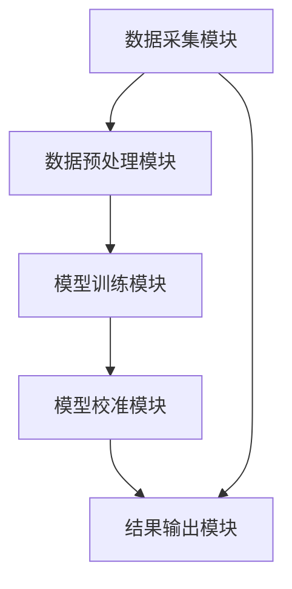
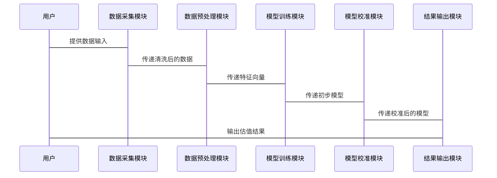

                 


# AI辅助的创业公司估值模型校准

> **关键词**：AI辅助、创业公司估值、模型校准、机器学习、金融科技  
> **摘要**：本文详细探讨了AI技术在创业公司估值模型中的应用，重点分析了如何通过AI辅助进行模型校准，以提高估值的准确性和效率。文章从创业公司估值的基本概念出发，逐步深入到AI辅助估值的核心技术、模型校准方法、系统架构设计以及实际项目案例，最后总结了最佳实践和未来发展方向。

---

# 第4章: 系统架构与实现方案

## 4.1 系统架构设计

### 4.1.1 系统模块划分
- 数据采集模块：负责收集创业公司的财务数据、市场数据、行业数据等。
- 数据预处理模块：对数据进行清洗、归一化处理，提取特征。
- 模型训练模块：基于机器学习算法（如神经网络、随机森林等）构建估值模型。
- 模型校准模块：通过超参数调优、数据增强等方法优化模型性能。
- 结果输出模块：将校准后的模型应用于实际数据，输出估值结果。

### 4.1.2 模块之间的关系
- 数据采集模块向数据预处理模块提供原始数据。
- 数据预处理模块为模型训练模块提供特征向量。
- 模型训练模块生成初步的估值模型，并将模型参数传递给模型校准模块。
- 校准后的模型由结果输出模块应用于新数据，输出最终估值。

### 4.1.3 系统的输入输出设计
- **输入**：创业公司的财务报表数据、市场指标、行业趋势等。
- **输出**：经过AI辅助校准后的公司估值、模型性能指标（如MAE、RMSE等）。

## 4.2 系统功能设计

### 4.2.1 数据采集模块
- 数据来源：公开财报、行业报告、市场数据等。
- 数据格式：结构化数据（如CSV、Excel）和非结构化数据（如新闻文本）。
- 数据清洗：处理缺失值、异常值、重复数据。

### 4.2.2 数据预处理模块
- 特征提取：将原始数据转换为模型可接受的特征向量。
- 数据归一化/标准化：确保不同特征之间的尺度一致。
- 数据增强：通过数据扩展技术（如合成数据）提高模型鲁棒性。

### 4.2.3 模型训练模块
- 选择合适的机器学习算法：如随机森林、支持向量机、神经网络等。
- 构建模型框架：使用深度学习框架（如TensorFlow、Keras）或机器学习库（如Scikit-learn）。
- 训练过程：通过梯度下降等优化算法调整模型参数。

### 4.2.4 模型校准模块
- 超参数调优：使用网格搜索、随机搜索或贝叶斯优化方法。
- 模型集成：通过投票、加权等方式结合多个模型的结果。
- 模型验证：使用交叉验证、ROC曲线等方法评估模型性能。

### 4.2.5 结果输出模块
- 估值结果：输出校准后的公司估值。
- 模型评估：展示模型的准确率、召回率、F1分数等指标。
- 可视化报告：生成图表（如折线图、散点图）展示估值结果与实际值的对比。

## 4.3 系统架构图



## 4.4 系统交互流程图



## 4.5 系统实现代码示例

```python
# 数据预处理模块
import pandas as pd
import numpy as np

# 假设data是原始数据
data = pd.read_csv('input.csv')
# 删除缺失值
data = data.dropna()
# 标准化处理
from sklearn.preprocessing import StandardScaler
scaler = StandardScaler()
data_scaled = scaler.fit_transform(data)
# 特征提取
features = data_scaled[:, :-1]
labels = data_scaled[:, -1]

# 模型训练模块
from sklearn.ensemble import RandomForestRegressor
model = RandomForestRegressor(n_estimators=100, random_state=42)
model.fit(features, labels)

# 模型校准模块
from sklearn.model_selection import GridSearchCV
param_grid = {
    'n_estimators': [100, 200],
    'max_depth': [None, 10],
}
grid_search = GridSearchCV(model, param_grid, cv=5, scoring='neg_mean_absolute_error')
grid_search.fit(features, labels)
best_model = grid_search.best_estimator_

# 结果输出模块
from sklearn.metrics import mean_absolute_error
val_features = ...  # 验证集特征
val_labels = ...    # 验证集标签
val_pred = best_model.predict(val_features)
mae = mean_absolute_error(val_labels, val_pred)
print(f'MAE: {mae}')
```

## 4.6 本章小结

---

# 第5章: 项目实战与案例分析

## 5.1 项目背景与目标
- **背景**：某创业公司希望利用AI技术优化其估值模型。
- **目标**：通过AI辅助校准模型，提高估值的准确性和效率。

## 5.2 数据准备与环境安装
- **数据来源**：公开的财务数据、行业报告、市场指标。
- **环境配置**：安装Python、TensorFlow、Scikit-learn等依赖库。

## 5.3 系统核心实现

### 5.3.1 数据采集模块实现
```python
import requests
import json

# 示例API接口
url = 'https://api.example.com/financial_data'
response = requests.get(url)
data = json.loads(response.text)
```

### 5.3.2 模型训练与校准
```python
# 训练模型
model.fit(X_train, y_train)

# 超参数调优
from sklearn.model_selection import GridSearchCV
param_grid = {
    'n_estimators': [100, 200],
    'max_depth': [None, 10],
}
grid_search = GridSearchCV(model, param_grid, cv=5)
grid_search.fit(X_train, y_train)
best_model = grid_search.best_estimator_

# 验证结果
y_pred = best_model.predict(X_test)
print('Best parameters:', grid_search.best_params_)
print('MAE:', mean_absolute_error(y_test, y_pred))
```

### 5.3.3 结果输出与分析
- **估值结果**：输出校准后的公司估值。
- **模型评估**：通过混淆矩阵、ROC曲线等方法评估模型性能。

## 5.4 案例分析与详细解读
- **案例背景**：某创业公司A的财务数据和市场指标。
- **数据处理**：清洗、归一化、特征提取。
- **模型训练**：构建随机森林模型。
- **模型校准**：通过网格搜索优化模型参数。
- **结果分析**：模型在测试集上的表现。

## 5.5 项目小结

---

# 第6章: 最佳实践与未来展望

## 6.1 最佳实践

### 6.1.1 数据质量管理
- 确保数据的完整性和准确性。
- 使用数据增强技术提高模型鲁棒性。

### 6.1.2 模型选择与优化
- 根据数据特点选择合适的模型。
- 使用集成学习和超参数调优提高模型性能。

### 6.1.3 模型部署与监控
- 将模型部署到生产环境，实时监控模型表现。
- 定期更新模型，应对市场变化。

## 6.2 小结与注意事项
- 定期验证模型性能。
- 关注行业动态和市场变化。
- 多与行业专家合作，优化估值模型。

## 6.3 未来展望
- 更多行业应用：将AI辅助估值扩展到更多领域。
- 模型优化：探索更先进的机器学习技术，如深度学习、强化学习。
- 多模态数据融合：结合文本、图像等多模态数据，提高估值准确性。

---

# 作者

作者：AI天才研究院/AI Genius Institute & 禅与计算机程序设计艺术/Zen And The Art of Computer Programming

