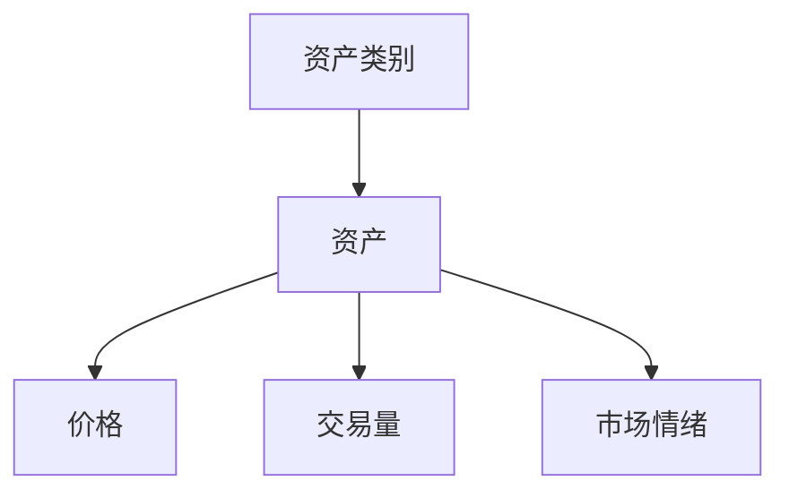
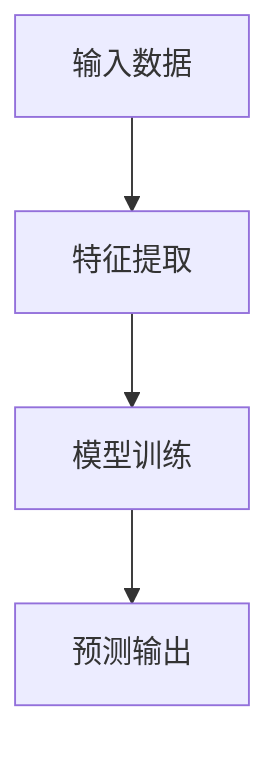
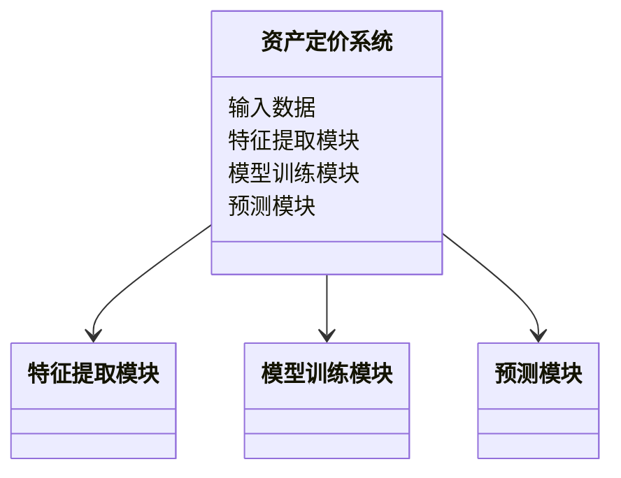

                 


# AI辅助的多资产类别定价模型

> 关键词：AI辅助，多资产类别，定价模型，机器学习，金融数据分析，深度学习

> 摘要：本文详细探讨了AI辅助的多资产类别定价模型的构建与应用。通过分析传统定价模型的局限性，结合机器学习和深度学习技术，提出了一种基于AI的多资产定价新方法。文章首先介绍了AI在金融定价中的作用，然后详细阐述了核心概念、数学模型、算法原理、系统架构设计及项目实战，最后给出了总结与展望。本文旨在为金融从业者、数据科学家及研究人员提供一个系统性、实用性的参考。

---

## 第1章: AI辅助的多资产类别定价模型背景

### 1.1 多资产类别定价的背景与意义

#### 1.1.1 传统资产定价模型的局限性
传统资产定价模型（如CAPM和APT）在单资产定价中表现出色，但在多资产类别定价中存在以下问题：
- **假设过于简化**：传统模型假设市场是完全有效的，且投资者理性，但在现实中市场存在摩擦和非理性行为。
- **数据依赖性强**：传统模型依赖历史收益和风险数据，难以捕捉实时市场动态和非结构化数据。
- **单一资产视角**：传统模型通常针对单一资产定价，难以处理多资产组合的复杂性。

#### 1.1.2 AI技术在金融领域的应用潜力
AI技术的快速发展为金融领域的创新提供了新的可能性。在资产定价中，AI的优势体现在：
- **非线性关系捕捉**：AI模型能够识别传统统计方法难以捕捉的非线性关系。
- **实时数据处理**：AI可以实时分析海量数据，包括文本、图像和时间序列数据。
- **个性化定价**：基于客户的特征和行为数据，AI可以实现个性化资产定价。

#### 1.1.3 多资产定价的复杂性与挑战
多资产定价涉及多个资产类别（如股票、债券、期货等），其复杂性主要体现在：
- **多目标优化**：需要在风险和收益之间找到平衡。
- **高维数据处理**：多资产定价涉及大量特征，数据维度高。
- **动态调整**：市场环境变化快，模型需要实时更新。

---

### 1.2 AI辅助定价的核心概念

#### 1.2.1 什么是多资产类别定价
多资产类别定价是指对多个资产类别（如股票、债券、商品等）进行同时定价的过程。其目标是在不同资产类别之间找到合理的定价关系，优化投资组合的风险收益比。

#### 1.2.2 AI在定价中的角色与作用
AI在多资产定价中的作用可以概括为：
- **数据处理**：AI能够高效处理海量结构化和非结构化数据。
- **特征提取**：通过深度学习模型提取有用的特征。
- **模型训练**：利用机器学习算法构建定价模型。
- **实时预测**：基于实时数据进行价格预测。

#### 1.2.3 多资产定价模型的演进与趋势
随着技术的发展，多资产定价模型经历了从传统统计模型到AI驱动模型的演进。未来趋势包括：
- **模型融合**：将传统模型与AI模型相结合。
- **实时定价**：基于实时数据进行动态调整。
- **个性化定价**：根据客户特征提供个性化定价服务。

---

## 第2章: AI辅助定价的核心概念与联系

### 2.1 核心概念原理

#### 2.1.1 机器学习模型在定价中的应用
机器学习模型在资产定价中的应用包括：
- **监督学习**：用于价格预测和分类。
- **无监督学习**：用于聚类和异常检测。
- **强化学习**：用于动态投资组合优化。

#### 2.1.2 特征工程与数据预处理
特征工程是AI定价模型的核心步骤，包括：
- **特征选择**：筛选重要特征。
- **特征变换**：将非结构化数据转化为结构化特征。
- **特征标准化**：对特征进行标准化或归一化处理。

#### 2.1.3 模型评估与优化
模型评估与优化包括：
- **交叉验证**：评估模型的泛化能力。
- **超参数优化**：通过网格搜索或随机搜索优化模型参数。
- **模型融合**：结合多个模型的结果提高准确性。

#### 2.1.4 案例分析：股票价格预测
**案例分析：使用LSTM预测股票价格**
- **数据来源**：使用历史股票价格数据。
- **模型选择**：选择LSTM网络进行时间序列预测。
- **结果分析**：对比实际价格与预测价格，评估模型性能。

---

### 2.2 核心概念对比表格

| 模型类型   | 优势                     | 劣势                     |
|------------|--------------------------|--------------------------|
| 线性回归    | 简单，易于解释           | 无法捕捉非线性关系       |
| 支持向量机  | 高维数据表现好           | 对参数敏感，计算复杂     |
| 随机森林    | 鲁棒性强，无过拟合风险    | 解释性较差               |
| LSTM网络    | 能捕捉时间序列模式       | 训练时间较长             |

---

### 2.3 ER实体关系图架构



---

## 第3章: AI辅助定价的数学模型与公式

### 3.1 回归分析

#### 3.1.1 线性回归模型
线性回归模型用于预测资产价格与特征之间的线性关系：
$$ y = \beta_0 + \beta_1x_1 + \beta_2x_2 + \dots + \beta_nx_n + \epsilon $$
其中，$y$是目标变量（资产价格），$x_i$是特征变量，$\beta$是回归系数，$\epsilon$是误差项。

#### 3.1.2 逻辑回归模型
逻辑回归模型用于分类问题，例如判断资产价格是否会上涨或下跌：
$$ P(y=1|x) = \frac{1}{1 + e^{-(\beta_0 + \beta_1x_1 + \dots + \beta_nx_n)}} $$

### 3.2 时间序列分析

#### 3.2.1 ARIMA模型
ARIMA模型用于时间序列预测：
$$ ARIMA(p, d, q) $$
其中，$p$是自回归阶数，$d$是差分阶数，$q$是移动平均阶数。

#### 3.2.2 GARCH模型
GARCH模型用于估计资产的波动性：
$$ \sigma_t^2 = a_0 + a_1r_{t-1}^2 + a_2\sigma_{t-1}^2 $$

### 3.3 深度学习模型

#### 3.3.1 LSTM网络
LSTM网络用于处理长序列数据：
$$ f_t = \text{遗忘门} \cdot \text{旧状态} + \text{输入门} \cdot \text{输入} + \text{输出门} \cdot \text{新状态} $$

#### 3.3.2 Transformer模型
Transformer模型用于捕捉资产之间的关系：
$$ \text{Attention}(Q, K, V) = \text{softmax}\left(\frac{QK^T}{\sqrt{d_k}}\right)V $$

---

## 第4章: AI辅助定价的算法原理

### 4.1 算法原理流程图



---

## 第5章: 系统架构设计

### 5.1 系统功能设计

#### 5.1.1 领域模型设计


---

## 第6章: 项目实战

### 6.1 环境安装与代码实现

#### 6.1.1 环境安装
```bash
pip install numpy pandas scikit-learn tensorflow
```

#### 6.1.2 核心代码实现
```python
import numpy as np
import pandas as pd
from sklearn.linear_model import LinearRegression
from sklearn.metrics import mean_squared_error

# 数据加载
data = pd.read_csv('assets.csv')

# 特征与目标分离
X = data[['feature1', 'feature2']]
y = data['price']

# 模型训练
model = LinearRegression()
model.fit(X, y)

# 预测与评估
y_pred = model.predict(X)
mse = mean_squared_error(y, y_pred)
print(f'MSE: {mse}')
```

---

## 第7章: 总结与展望

### 7.1 总结
本文详细介绍了AI辅助的多资产类别定价模型的构建与应用，涵盖了核心概念、数学模型、算法原理和系统架构设计。通过实际案例分析，展示了AI技术在金融定价中的巨大潜力。

### 7.2 未来展望
未来的研究方向包括：
- **模型融合**：结合传统模型与AI模型，提升定价精度。
- **实时定价**：基于实时数据，实现动态定价。
- **个性化定价**：根据客户特征，提供个性化定价服务。

---

## 作者信息

作者：AI天才研究院/AI Genius Institute & 禅与计算机程序设计艺术 /Zen And The Art of Computer Programming

---

以上是《AI辅助的多资产类别定价模型》的技术博客文章，内容涵盖了从基础概念到实际应用的各个方面，适合金融从业者、数据科学家及研究人员阅读和参考。

