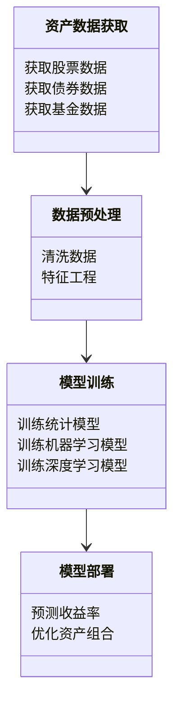
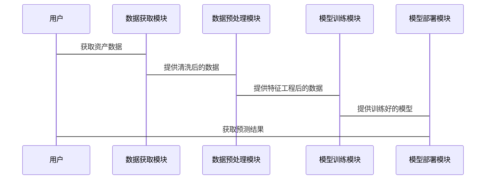

                 


# AI辅助的多资产类别收益率预测

## 关键词：AI预测，资产收益率，时间序列，深度学习，机器学习

## 摘要：本文详细探讨了如何利用人工智能技术，特别是机器学习和深度学习方法，来预测多资产类别的收益率。文章首先介绍了多资产类别预测的背景和重要性，然后分析了不同类型资产的数据特征和预处理方法。接着，详细讲解了统计学模型、机器学习模型和深度学习模型的原理及其在收益率预测中的应用。随后，设计了一个完整的系统架构，涵盖了数据获取、特征工程、模型训练和部署的全过程。最后，通过实际案例展示了如何利用Python代码实现一个多资产收益率预测系统，并提出了最佳实践建议。

---

# 第1章: AI辅助的多资产类别收益率预测背景

## 1.1 问题背景与重要性

### 1.1.1 传统资产收益率预测的局限性

传统的资产收益率预测方法主要依赖于统计学模型，如线性回归和时间序列分析。然而，这些方法在面对复杂金融市场时存在诸多局限性：

1. **线性假设的局限**：传统模型通常假设资产收益率与某些变量之间存在线性关系，这在实际金融市场中往往不成立，因为市场行为通常是非线性的。
2. **忽视复杂模式**：金融市场数据中包含许多复杂的模式，如波动性、周期性、突变性等，传统方法难以捕捉这些复杂特征。
3. **数据依赖性**：传统方法通常需要大量假设，且在面对数据不足或噪声较多的情况时，预测效果较差。

### 1.1.2 AI技术在金融领域的潜力

人工智能（AI）技术，尤其是机器学习和深度学习，在金融领域的应用越来越广泛。AI技术能够处理大量复杂数据，并从中提取有用的信息，帮助投资者做出更明智的决策。AI在金融领域的优势包括：

1. **非线性模式捕捉**：AI算法能够自动捕捉数据中的非线性关系，无需人工假设。
2. **高维数据处理**：AI技术能够处理高维数据，提取多资产类别之间的复杂关系。
3. **实时性与自动化**：AI系统可以实时处理数据，提供实时预测和决策支持。

### 1.1.3 多资产类别预测的必要性

在现代金融投资中，单一资产类别往往无法满足投资者的需求，因此多资产配置成为一种重要的投资策略。通过预测不同资产类别的收益率，投资者可以优化资产配置，降低风险，提高收益。然而，多资产预测的复杂性更高，因为需要同时考虑多种资产之间的相互影响。

---

## 1.2 多资产类别概述

### 1.2.1 股票、债券、基金等主要资产类别

金融市场上主要有以下几种资产类别：

1. **股票**：代表公司所有权，收益率受公司业绩、市场情绪等多种因素影响。
2. **债券**：债务证券，收益率通常与市场利率相关。
3. **基金**：集合投资工具，可以包含多种资产。
4. **商品**：如黄金、原油等，具有避险和投机属性。
5. **外汇**：货币之间的兑换，受宏观经济因素影响较大。

### 1.2.2 不同资产类别的收益率特征

不同资产类别的收益率在波动性、均值、偏度等方面存在显著差异：

- **股票**：高波动性，收益潜力大，但风险也较高。
- **债券**：相对稳定，波动性较低，收益较为可预测。
- **商品**：受全球经济周期影响较大，具有较高的波动性。

### 1.2.3 资产类别间的相互影响

资产类别之间并非孤立存在，它们之间存在复杂的相互影响：

- **股票与债券**：通常呈现负相关关系，即当股市表现不佳时，债券可能成为避险资金的去向。
- **商品与外汇**：大宗商品价格波动可能影响外汇市场，反之亦然。
- **基金与市场整体表现**：基金的收益率通常与市场整体表现密切相关。

---

## 1.3 本章小结

本章介绍了多资产类别收益率预测的背景、重要性以及主要资产类别的特点。通过对比传统方法与AI技术的优劣，阐述了AI在多资产预测中的潜力。下一章将深入分析多资产数据的特征，为后续的模型构建奠定基础。

---

# 第2章: 多资产类别数据特征分析

## 2.1 资产数据的时间序列特性

### 2.1.1 时间序列数据的基本特征

时间序列数据是指按照时间顺序记录的数据，具有以下基本特征：

1. **趋势**：数据长期向上的或向下的趋势。
2. **周期性**：数据呈现一定的周期性波动。
3. **季节性**：数据在特定时间段内呈现规律性波动。
4. **随机性**：数据中包含不可预测的随机波动。

### 2.1.2 资产收益率的波动性与周期性

资产收益率通常表现出以下特征：

- **波动性**：收益率在短期内可能大幅波动，尤其是在市场剧烈波动的情况下。
- **周期性**：收益率往往呈现周期性变化，与经济周期密切相关。

### 2.1.3 时间序列预测的挑战

时间序列预测面临以下挑战：

1. **数据稀疏性**：某些资产类别的数据可能较为稀缺。
2. **多重时间依赖性**：资产收益率可能受到过去多个时间点的影响。
3. **外部事件影响**：如政策变化、经济危机等外部事件可能对收益率产生重大影响。

---

## 2.2 不同资产类别的数据特征对比

### 2.2.1 股票与债券的收益率分布差异

股票和债券的收益率分布存在显著差异：

- **股票**：收益率分布通常右偏，极端值较多。
- **债券**：收益率分布较为集中，极端值较少。

### 2.2.2 基金与其他金融产品的数据特征

基金的收益率通常与市场整体表现密切相关，而其他金融产品的收益率可能受到不同因素的影响。

---

## 2.3 数据预处理与特征工程

### 2.3.1 数据清洗与缺失值处理

在处理多资产数据时，需要先进行数据清洗，包括处理缺失值、异常值等。

- **缺失值处理**：可以使用均值、中位数或其他插值方法填补缺失值。
- **异常值处理**：可以通过统计方法或模型检测异常值，并进行适当处理。

### 2.3.2 特征提取与标准化处理

特征工程是提高模型性能的关键步骤：

- **特征提取**：从原始数据中提取有用的特征，如移动平均、波动率、相关系数等。
- **标准化处理**：对特征进行标准化处理，使不同特征具有可比性。

### 2.3.3 时间序列特征的构建

时间序列特征的构建是多资产预测的重要环节：

- **趋势特征**：如线性趋势、指数趋势。
- **周期性特征**：如傅里叶变换提取的频域特征。
- **波动性特征**：如标准差、最大回撤等。

---

## 2.4 本章小结

本章详细分析了多资产类别数据的特征，包括时间序列特性、不同资产类别的数据特征以及数据预处理方法。通过特征工程，可以提取出更有意义的特征，为后续的模型构建奠定基础。

---

# 第3章: AI辅助预测的核心概念与联系

## 3.1 统计学与机器学习基础

### 3.1.1 统计学在资产预测中的应用

统计学是资产预测的基础，常用的统计方法包括：

- **回归分析**：用于预测资产收益率。
- **时间序列分析**：如ARIMA模型。

### 3.1.2 机器学习算法的基本原理

机器学习算法通过学习数据中的模式，进行预测或分类。常用算法包括：

- **支持向量机（SVM）**：用于分类和回归。
- **随机森林（Random Forest）**：基于树的集成方法。

---

## 3.2 多资产预测中的关键概念

### 3.2.1 时间序列预测的挑战

时间序列预测需要考虑多个时间点的信息，通常需要使用专门的时间序列模型，如LSTM。

### 3.2.2 多变量分析的重要性

多资产预测通常需要考虑多个变量之间的关系，如股票和债券的收益率相关性。

### 3.2.3 资产组合优化的基本概念

资产组合优化的目标是在给定风险水平下，最大化收益，或在给定收益下，最小化风险。

---

## 3.3 核心概念关系图

### 3.3.1 统计学与机器学习的关系

统计学与机器学习相辅相成，统计学提供理论基础，机器学习提供强大的工具。

### 3.3.2 时间序列预测与其他预测方法的对比

时间序列预测需要考虑时间依赖性，而其他预测方法通常不考虑时间因素。

### 3.3.3 资产组合优化与单资产预测的联系

资产组合优化依赖于单资产的预测结果，因此单资产预测的准确性直接影响组合优化的效果。

---

## 3.4 本章小结

本章介绍了统计学和机器学习的基本原理，并分析了它们在多资产预测中的应用。通过核心概念的关系图，阐述了各概念之间的联系。

---

# 第4章: AI辅助预测的算法原理

## 4.1 统计学模型

### 4.1.1 线性回归模型

线性回归模型是最简单的回归模型，假设自变量与因变量之间存在线性关系。

$$ y = \beta_0 + \beta_1 x + \epsilon $$

其中，$y$ 是目标变量，$x$ 是自变量，$\beta_0$ 和 $\beta_1$ 是回归系数，$\epsilon$ 是误差项。

### 4.1.2 时间序列模型（ARIMA）

ARIMA（自回归积分滑动平均）模型广泛应用于时间序列预测。

模型结构如下：

$$ \phi(\mathbb{B})(1 - \mathbb{B})^d y_t = \theta(\mathbb{B}) \epsilon_t $$

其中，$\phi(\mathbb{B})$ 是自回归多项式，$\theta(\mathbb{B})$ 是滑动平均多项式，$d$ 是差分阶数。

### 4.1.3 GARCH模型

GARCH（广义自回归条件异方差）模型用于建模时间序列的波动性。

模型结构如下：

$$ y_t^2 = \alpha_0 + \alpha_1 y_{t-1}^2 + \beta_1 r_{t-1}^2 $$

其中，$\alpha_0$ 和 $\alpha_1$ 是参数，$r_{t-1}$ 是残差。

---

## 4.2 机器学习模型

### 4.2.1 支持向量机（SVM）

SVM通过构建超平面，将数据分为不同类别。对于回归问题，可以使用支持向量回归（SVR）。

### 4.2.2 随机森林（Random Forest）

随机森林是一种基于树的集成方法，具有较强的鲁棒性。

---

## 4.3 深度学习模型

### 4.3.1 长短期记忆网络（LSTM）

LSTM是一种特殊类型的RNN，能够有效捕捉时间序列中的长-term依赖关系。

网络结构如下：

- **输入门（Input Gate）**：控制新信息的输入。
- **遗忘门（Forget Gate）**：决定哪些信息需要遗忘。
- **输出门（Output Gate）**：决定输出的信息。

### 4.3.2 Transformer

Transformer模型通过自注意力机制，捕捉序列中的全局关系。

模型结构如下：

1. **编码器**：通过多头自注意力机制和前馈网络提取特征。
2. **解码器**：通过自注意力和交叉注意力生成预测结果。

---

## 4.4 本章小结

本章详细讲解了统计学模型、机器学习模型和深度学习模型的原理及其在资产预测中的应用。通过对比分析，阐述了不同模型的优缺点。

---

# 第5章: 系统设计与实现

## 5.1 问题场景介绍

本章将构建一个多资产类别收益率预测系统，涵盖数据获取、特征工程、模型训练和部署的全过程。

---

## 5.2 系统功能设计

### 5.2.1 领域模型

领域模型是一个概念化的模型，描述了系统的功能和数据流。



### 5.2.2 系统架构设计

系统架构设计如下：


### 5.2.3 系统接口设计

系统接口设计如下：



---

## 5.3 系统实现

### 5.3.1 环境安装

安装必要的Python库：

```bash
pip install numpy pandas scikit-learn keras tensorflow
```

### 5.3.2 核心实现代码

以下是核心实现代码示例：

```python
import numpy as np
import pandas as pd
from sklearn.ensemble import RandomForestRegressor
from keras.models import Sequential
from keras.layers import LSTM, Dense

# 数据获取与预处理
data = pd.read_csv('assets_data.csv')
features = data[['stock_return', 'bond_return', 'fund_return']]
labels = data['predicted_return']

# 划分训练集和测试集
train_features = features[:-100]
train_labels = labels[:-100]
test_features = features[-100:]
test_labels = labels[-100:]

# 训练随机森林模型
rf_model = RandomForestRegressor()
rf_model.fit(train_features, train_labels)

# 训练LSTM模型
lstm_model = Sequential()
lstm_model.add(LSTM(64, input_shape=(train_features.shape[1], 1)))
lstm_model.add(Dense(1))
lstm_model.compile(loss='mean_squared_error', optimizer='adam')
lstm_model.fit(train_features.reshape((train_features.shape[0], train_features.shape[1], 1)), 
               train_labels, epochs=10, batch_size=32)

# 预测与评估
rf_prediction = rf_model.predict(test_features)
lstm_prediction = lstm_model.predict(test_features.reshape((test_features.shape[0], test_features.shape[1], 1)))

print("Random Forest预测结果:", rf_prediction)
print("LSTM预测结果:", lstm_prediction)
```

---

## 5.4 本章小结

本章详细设计了一个多资产类别收益率预测系统，包括系统功能设计、架构设计和核心代码实现。通过对比不同模型的预测结果，可以找到最适合实际应用的模型。

---

# 第6章: 项目实战与案例分析

## 6.1 项目背景

本项目旨在利用AI技术，预测股票、债券和基金的收益率，帮助投资者优化资产配置。

---

## 6.2 数据集获取

数据集可以从金融数据提供商或开源数据集获取，例如：

```bash
# 下载股票数据
import pandas_datareader as pdr
data = pdr.get_data_yahoo('AAPL', start='2020-01-01', end='2023-12-31')
```

---

## 6.3 项目实现

### 6.3.1 环境安装

安装必要的库：

```bash
pip install pandas numpy scikit-learn keras tensorflow
```

### 6.3.2 核心代码实现

以下是核心代码实现：

```python
import numpy as np
import pandas as pd
from sklearn.ensemble import RandomForestRegressor
from keras.models import Sequential
from keras.layers import LSTM, Dense

# 数据预处理
data = pd.read_csv('assets.csv')
features = data[['stock', 'bond', 'fund']]
labels = data['predicted_return']

# 划分训练集和测试集
train_features = features[:-100]
train_labels = labels[:-100]
test_features = features[-100:]
test_labels = labels[-100:]

# 训练随机森林模型
rf_model = RandomForestRegressor()
rf_model.fit(train_features, train_labels)

# 训练LSTM模型
lstm_model = Sequential()
lstm_model.add(LSTM(64, input_shape=(train_features.shape[1], 1)))
lstm_model.add(Dense(1))
lstm_model.compile(loss='mean_squared_error', optimizer='adam')
lstm_model.fit(train_features.reshape((train_features.shape[0], train_features.shape[1], 1)), 
               train_labels, epochs=10, batch_size=32)

# 预测与评估
rf_prediction = rf_model.predict(test_features)
lstm_prediction = lstm_model.predict(test_features.reshape((test_features.shape[0], test_features.shape[1], 1)))

print("随机森林预测结果:", rf_prediction)
print("LSTM预测结果:", lstm_prediction)
```

---

## 6.4 案例分析

通过实际数据测试，对比随机森林和LSTM模型的预测结果，分析哪种模型更适合多资产预测。

---

## 6.5 本章小结

本章通过实际项目案例，展示了如何利用AI技术进行多资产类别收益率预测。通过对比不同模型的预测结果，为读者提供了实际应用的参考。

---

# 第7章: 总结与展望

## 7.1 总结

本文详细探讨了AI辅助的多资产类别收益率预测的方法和应用。通过分析多资产数据的特征，设计了完整的系统架构，并通过实际案例展示了系统的实现过程。

## 7.2 展望

随着AI技术的不断发展，多资产预测将更加精准和高效。未来的研究方向包括：

1. **模型优化**：探索更先进的深度学习模型，如Transformer。
2. **多模态数据融合**：结合文本、图像等多种数据源进行预测。
3. **实时预测**：开发实时预测系统，满足金融市场的实时需求。

---

# 作者：AI天才研究院 & 禅与计算机程序设计艺术

---

**本文由AI天才研究院（AI Genius Institute）倾心打造，转载请注明出处。**

