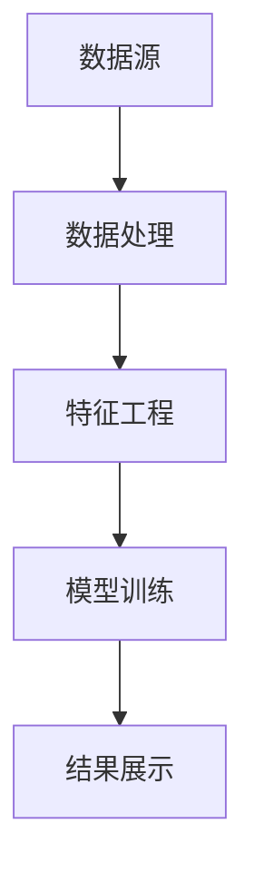

                 


# AI辅助的多资产类别收益率预测与资产配置

## 关键词：AI，资产配置，收益率预测，机器学习，多资产类别

## 摘要：本文探讨了如何利用人工智能技术，特别是机器学习算法，来辅助多资产类别的收益率预测与资产配置。通过系统化的分析和实际案例，本文详细阐述了AI在金融投资中的应用原理、实现方法及实际效果，为投资者和金融机构提供了优化资产配置的新思路。

---

## 第一部分: AI辅助的多资产类别收益率预测与资产配置背景介绍

### 第1章: 问题背景与描述

#### 1.1 问题背景
##### 1.1.1 传统资产配置的挑战
传统的资产配置方法依赖于历史数据分析和经验判断，存在以下挑战：
1. **数据复杂性**：多资产类别涉及股票、债券、基金等多种资产，数据维度高且相互影响。
2. **市场波动**：金融市场波动频繁，传统模型难以捕捉复杂市场变化。
3. **计算复杂度**：优化多资产配置需要考虑多个变量，计算复杂且耗时。

##### 1.1.2 AI技术在金融领域的应用潜力
人工智能（AI）和机器学习（ML）技术在金融领域的应用潜力巨大，特别是在处理复杂数据和预测方面。AI能够通过深度学习模型捕捉数据中的非线性关系，提供更精准的预测。

##### 1.1.3 多资产类别投资的重要性
多资产类别投资通过分散投资降低风险，同时提高收益。在复杂的市场环境中，优化多资产配置能够帮助投资者更好地应对不确定性。

#### 1.2 问题描述
##### 1.2.1 收益率预测的核心问题
收益率预测是投资决策的核心，准确预测各类资产的收益率有助于优化投资组合。然而，传统方法在面对复杂市场时表现不佳，需要借助AI技术提高预测精度。

##### 1.2.2 资产配置的复杂性
资产配置涉及多个变量，如风险、收益、流动性等。传统方法难以在多目标优化中找到最优解，而AI技术可以通过强化学习等方法解决复杂优化问题。

##### 1.2.3 当前方法的局限性
当前的资产配置方法存在以下局限性：
1. **数据依赖性**：传统模型依赖历史数据，难以预测未来突发事件。
2. **计算能力限制**：复杂的多目标优化需要强大的计算能力。
3. **模型假设限制**：传统模型假设市场有效，忽略市场异效因素。

#### 1.3 问题解决
##### 1.3.1 AI在收益率预测中的优势
AI技术通过机器学习算法能够处理海量数据，捕捉复杂市场中的细微变化，提高预测精度。例如，使用LSTM网络可以有效捕捉时间序列数据中的趋势。

##### 1.3.2 资产配置优化的AI解决方案
通过AI技术，可以构建一个多目标优化模型，综合考虑风险、收益、流动性等因素，优化投资组合。

##### 1.3.3 多资产类别协同优化的可行性
AI技术可以通过协同优化算法，在多资产类别间找到平衡点，实现整体收益的最大化。

#### 1.4 边界与外延
##### 1.4.1 收益率预测的边界条件
收益率预测的边界条件包括数据质量、模型假设和市场环境。模型需要基于可靠的数据，并假设在合理的时间范围内有效。

##### 1.4.2 资产配置的适用范围
资产配置的适用范围包括机构投资和个人投资，尤其适合需要分散投资的场景。然而，对于小规模投资，AI技术的应用可能受到成本限制。

##### 1.4.3 外部因素的考虑
外部因素如政策变化、经济指标等对资产配置有重要影响。AI模型需要整合这些外部数据，以提高预测的准确性。

#### 1.5 核心要素组成
##### 1.5.1 数据来源与特征
数据来源包括历史价格、财务报表、市场指标等。特征包括技术指标、宏观经济指标等。

##### 1.5.2 模型选择与优化
选择合适的模型，如随机森林、LSTM等，并通过交叉验证优化模型参数。

##### 1.5.3 风险管理与调整
通过风险指标如VaR、CVaR进行风险评估，并根据市场变化动态调整投资组合。

---

## 第二部分: 核心概念与联系

### 第2章: AI辅助的多资产类别收益率预测原理

#### 2.1 核心概念原理
##### 2.1.1 机器学习在金融中的应用
机器学习在金融中的应用包括预测、分类、聚类等。特别是深度学习在时间序列预测中表现优异。

##### 2.1.2 时间序列预测的基本原理
时间序列预测通过分析历史数据的模式，预测未来趋势。常用模型包括ARIMA、LSTM等。

##### 2.1.3 多资产类别预测的挑战
多资产类别预测需要考虑各资产之间的相关性，避免过度分散或集中。

#### 2.2 模型对比表格
| 模型类型 | 输入特征 | 输出结果 | 优点 | 缺点 |
|---------|----------|----------|------|------|
| 线性回归 | 数值型 | 数值型 | 简单易懂 | 模型假设严格 |
| 支持向量机 | 数值型 | 数值型 | 高维数据表现好 | 参数敏感 |
| 随机森林 | 数值型 | 数值型 | 抗噪声好 | 解释性差 |
| LSTM | 时间序列 | 时间序列 | 适合时间依赖 | 训练时间长 |

#### 2.3 ER实体关系图
```mermaid
erDiagram
    investor {
        id : integer
        name : string
        portfolio : string
    }
    asset_class {
        id : integer
        name : string
        risk : float
        return : float
    }
    investment {
        investor_id : integer
        asset_id : integer
        amount : float
    }
    investor--| investment
    asset_class--| investment
```

---

## 第三部分: 算法原理讲解

### 第3章: 算法原理与实现

#### 3.1 线性回归
##### 3.1.1 模型原理
线性回归通过最小二乘法拟合直线，预测目标变量。
$$ y = \beta_0 + \beta_1x + \epsilon $$

##### 3.1.2 Python实现
```python
import numpy as np
from sklearn.linear_model import LinearRegression

# 示例数据
X = np.array([1, 2, 3, 4, 5])
y = np.array([2, 4, 5, 4, 5])

# 训练模型
model = LinearRegression()
model.fit(X.reshape(-1, 1), y)

# 预测
print(model.predict([[6]]))
```

#### 3.2 支持向量机
##### 3.2.1 模型原理
SVM通过找到超平面，将数据点分类到不同类别。支持向量回归用于回归问题。

##### 3.2.2 Python实现
```python
from sklearn.svm import SVR

# 示例数据
X = np.array([1, 2, 3, 4, 5])
y = np.array([2, 4, 5, 4, 5])

# 训练模型
model = SVR(kernel='linear')
model.fit(X.reshape(-1, 1), y)

# 预测
print(model.predict([[6]]))
```

#### 3.3 随机森林
##### 3.3.1 模型原理
随机森林通过集成多个决策树，提高模型鲁棒性。

##### 3.3.2 Python实现
```python
from sklearn.ensemble import RandomForestRegressor

# 示例数据
X = np.array([[1], [2], [3], [4], [5]])
y = np.array([2, 4, 5, 4, 5])

# 训练模型
model = RandomForestRegressor(n_estimators=10)
model.fit(X, y)

# 预测
print(model.predict([[6]]))
```

#### 3.4 神经网络
##### 3.4.1 模型原理
神经网络通过多层感知机模拟非线性关系，适合处理复杂数据。

##### 3.4.2 Python实现
```python
import tensorflow as tf
from tensorflow.keras import layers

# 示例数据
X = np.array([1, 2, 3, 4, 5])
y = np.array([2, 4, 5, 4, 5])

# 构建模型
model = tf.keras.Sequential([
    layers.Dense(64, activation='relu'),
    layers.Dense(1)
])

model.compile(optimizer='adam', loss='mse')

# 训练
model.fit(X.reshape(-1, 1), y, epochs=100, batch_size=5)

# 预测
print(model.predict([[6]]))
```

---

## 第四部分: 系统分析与架构设计方案

### 第4章: 系统分析与架构设计

#### 4.1 项目介绍
AI辅助的多资产类别收益率预测与资产配置系统旨在通过机器学习算法，帮助投资者优化投资组合。

#### 4.2 系统功能设计
##### 4.2.1 数据采集模块
从金融数据源获取实时数据，包括股票价格、债券收益率等。

##### 4.2.2 特征工程模块
对数据进行特征提取和处理，如计算技术指标、宏观经济指标。

##### 4.2.3 模型训练模块
训练机器学习模型，如随机森林、神经网络等。

##### 4.2.4 模型评估模块
评估模型性能，选择最优模型。

##### 4.2.5 结果展示模块
展示预测结果和优化后的资产配置建议。

#### 4.3 系统架构设计
##### 4.3.1 系统架构图


##### 4.3.2 接口设计
系统提供API接口，供其他系统调用预测结果和资产配置建议。

#### 4.4 系统交互流程
##### 4.4.1 用户请求预测
用户通过界面提交投资需求。

##### 4.4.2 系统处理
系统接收请求，处理数据，训练模型，返回预测结果和资产配置建议。

##### 4.4.3 结果展示
系统展示预测结果和优化建议。

---

## 第五部分: 项目实战

### 第5章: 项目实战

#### 5.1 环境配置
安装必要的Python库，如Pandas、NumPy、Scikit-learn、TensorFlow等。

#### 5.2 数据获取与预处理
从Yahoo Finance获取股票数据，进行清洗和特征提取。

#### 5.3 模型选择与训练
选择随机森林模型，进行训练和优化。

#### 5.4 模型评估
通过回测和风险指标评估模型性能。

#### 5.5 实际案例分析
以实际市场数据为例，展示模型预测结果和资产配置建议。

---

## 第六部分: 最佳实践与总结

### 第6章: 最佳实践

#### 6.1 小结
AI技术在多资产类别收益率预测和资产配置中具有重要应用价值，能够提高预测精度和优化投资组合。

#### 6.2 注意事项
1. 数据质量对模型性能影响重大，需确保数据准确和完整。
2. 模型选择需结合实际需求和数据特点。
3. 风险管理是投资的重要环节，需动态调整投资组合。

#### 6.3 拓展阅读
推荐相关书籍和论文，深入学习AI在金融中的应用。

---

## 作者：AI天才研究院 & 禅与计算机程序设计艺术

---

这篇博客文章详细探讨了AI在多资产类别收益率预测与资产配置中的应用，通过理论分析和实际案例，为读者提供了全面的指导和启示。

