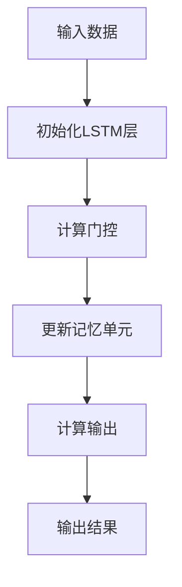
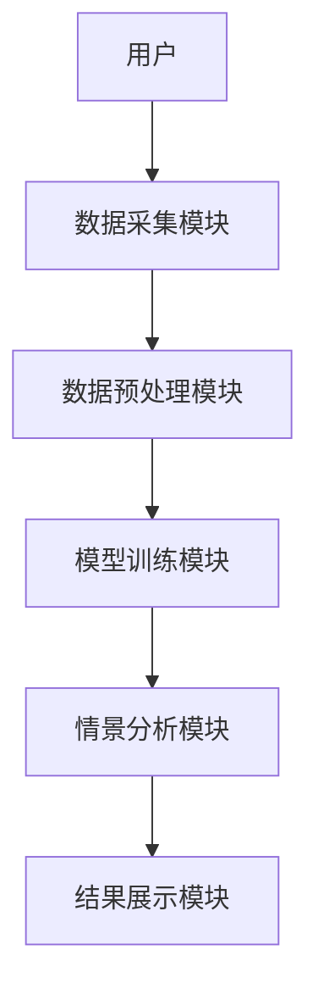

                 


# AI辅助的宏观经济情景分析

## 关键词：人工智能，宏观经济，情景分析，机器学习，深度学习，图神经网络

## 摘要：本文详细探讨了如何利用人工智能技术辅助宏观经济情景分析。从宏观经济分析的基本概念到AI技术的应用，从数学模型的构建到系统架构的设计，从项目实战到总结与展望，全面分析了AI在宏观经济情景分析中的作用与实现方式。通过本文，读者将能够理解宏观经济情景分析的核心问题，掌握AI技术在其中的应用方法，以及如何通过系统化的架构设计实现高效的宏观经济分析。

---

# 第一部分: 宏观经济情景分析的AI辅助基础

## 第1章: 宏观经济情景分析概述

### 1.1 宏观经济情景分析的背景与意义

#### 1.1.1 宏观经济分析的基本概念
宏观经济分析是指对整个经济体系的总体运行状况进行研究，包括GDP、通货膨胀率、失业率、利率、汇率等关键指标的分析。通过宏观经济分析，可以了解经济的整体走势，为企业决策、政策制定提供依据。

#### 1.1.2 宏观经济情景分析的定义与特点
宏观经济情景分析是一种通过对多种经济指标和因素进行建模和预测，来评估不同经济情景下可能产生的结果的方法。其特点包括：
- **综合性**：涉及多个经济变量的综合分析。
- **不确定性**：经济变量受多种因素影响，具有较强的不确定性。
- **情景驱动**：通过构建不同的情景（如最佳、平均、最坏情况），分析其对经济的影响。

#### 1.1.3 AI在宏观经济分析中的作用
AI技术，尤其是机器学习和深度学习，能够处理海量的经济数据，发现传统统计方法难以捕捉的复杂模式，从而提高宏观经济预测的准确性和效率。

---

### 1.2 宏观经济情景分析的核心问题

#### 1.2.1 宏观经济预测的挑战
- 数据复杂性：宏观经济数据涉及多个变量，且变量之间可能存在非线性关系。
- 数据稀疏性：某些经济指标的数据可能不够丰富，导致模型训练困难。
- 数据噪声：经济数据可能受到短期波动的影响，如突发事件（如疫情、自然灾害）。

#### 1.2.2 情景分析的关键要素
- **输入数据**：包括GDP、CPI、失业率、利率等经济指标。
- **模型构建**：选择合适的模型（如ARIMA、LSTM）进行经济预测。
- **情景模拟**：根据模型预测结果，生成不同的情景分析报告。

#### 1.2.3 AI辅助情景分析的优势
- **高效性**：AI能够快速处理和分析大量数据。
- **准确性**：通过机器学习模型，可以捕捉数据中的复杂模式，提高预测的准确性。
- **灵活性**：可以根据不同的经济环境，动态调整模型参数。

---

### 1.3 宏观经济情景分析的边界与外延

#### 1.3.1 宏观经济分析的范围界定
宏观经济分析的范围通常包括：
- 宏观经济政策分析。
- 经济周期分析。
- 经济波动预测。

#### 1.3.2 情景分析的适用场景
- 政策制定：如财政政策、货币政策的评估。
- 企业决策：如投资决策、风险管理。
- 学术研究：如经济理论的验证与创新。

#### 1.3.3 AI技术的局限性与适用性
- **局限性**：AI模型依赖于数据质量，数据偏差可能导致预测结果的偏差。
- **适用性**：适用于数据量大、变量复杂且需要动态调整的经济分析场景。

---

## 第2章: AI辅助宏观经济情景分析的核心概念

### 2.1 宏观经济数据与模型

#### 2.1.1 宏观经济数据的分类
- **时间序列数据**：如GDP、CPI等。
- **截面数据**：如不同地区的经济指标。
- **混合数据**：结合时间序列和截面数据。

#### 2.1.2 宏观经济模型的类型
- **计量经济学模型**：如线性回归模型。
- **时间序列模型**：如ARIMA、GARCH。
- **系统动力学模型**：如反馈环模型。

#### 2.1.3 数据与模型的关联性
数据的质量和数量直接影响模型的预测效果。高质量的数据能够提高模型的准确性，而数据的缺失或噪声可能导致模型预测的偏差。

---

### 2.2 AI技术在宏观经济分析中的应用

#### 2.2.1 机器学习在宏观经济预测中的应用
- **监督学习**：如随机森林、支持向量机（SVM）用于分类和回归问题。
- **无监督学习**：如聚类分析用于市场细分。

#### 2.2.2 自然语言处理在经济文本分析中的应用
- **情感分析**：分析市场情绪对经济指标的影响。
- **信息提取**：从新闻、报告中提取经济相关的信息。

#### 2.2.3 图神经网络在经济关系建模中的应用
- **经济网络分析**：如企业间的关系网络、金融市场网络。

---

### 2.3 宏观经济情景分析的AI辅助流程

#### 2.3.1 数据收集与预处理
- 数据来源：政府统计机构、金融市场数据、学术研究数据。
- 数据清洗：处理缺失值、异常值。
- 数据转换：如标准化、归一化。

#### 2.3.2 模型训练与优化
- 模型选择：根据数据特点选择合适的模型。
- 参数调优：通过交叉验证优化模型参数。
- 模型评估：通过回测、准确率等指标评估模型性能。

#### 2.3.3 情景模拟与结果分析
- 情景生成：根据模型预测结果生成不同的情景。
- 结果分析：分析不同情景对经济指标的影响。

---

## 第3章: 宏观经济情景分析的数学模型与算法原理

### 3.1 宏观经济预测的数学模型

#### 3.1.1 时间序列分析模型
- **ARIMA模型**：自回归积分滑动平均模型。
- **LSTM模型**：长短期记忆网络。

#### 3.1.2 统计回归模型
- **线性回归模型**：用于预测经济指标之间的线性关系。
- **非线性回归模型**：用于复杂关系的建模。

#### 3.1.3 非参数统计模型
- **K最近邻算法（KNN）**：用于分类和回归问题。

---

### 3.2 AI算法在宏观经济分析中的应用

#### 3.2.1 机器学习算法
- **随机森林**：用于特征重要性分析。
- **支持向量机（SVM）**：用于分类和回归问题。

#### 3.2.2 深度学习算法
- **LSTM网络**：用于时间序列预测。
- **Transformer网络**：用于处理序列数据。

#### 3.2.3 图神经网络算法
- **图卷积网络（GCN）**：用于经济网络分析。

---

### 3.3 算法原理与流程图

#### 3.3.1 LSTM算法流程图


#### 3.3.2 统计回归模型的公式
$$
y = \beta_0 + \beta_1x_1 + \beta_2x_2 + \cdots + \beta_nx_n + \epsilon
$$

---

## 第4章: 宏观经济情景分析的系统架构设计

### 4.1 系统功能设计

#### 4.1.1 数据采集模块
- 数据来源：政府统计机构、金融市场数据、学术研究数据。

#### 4.1.2 数据预处理模块
- 数据清洗：处理缺失值、异常值。
- 数据转换：如标准化、归一化。

#### 4.1.3 模型训练模块
- 模型选择：根据数据特点选择合适的模型。
- 参数调优：通过交叉验证优化模型参数。

---

### 4.2 系统架构设计

#### 4.2.1 系统架构图


---

## 第5章: 项目实战

### 5.1 环境安装
- Python版本：3.8以上。
- 需要的库：numpy、pandas、scikit-learn、keras、tensorflow、pymermaid。

### 5.2 核心实现源代码
```python
import numpy as np
import pandas as pd
from sklearn.model_selection import train_test_split
from sklearn.ensemble import RandomForestRegressor
from sklearn.metrics import mean_squared_error

# 数据加载
data = pd.read_csv('macroeconomic_data.csv')
X = data[['GDP', 'CPI', ' unemployment']]
y = data['GDP_growth']

# 数据分割
X_train, X_test, y_train, y_test = train_test_split(X, y, test_size=0.2, random_state=42)

# 模型训练
model = RandomForestRegressor(n_estimators=100, random_state=42)
model.fit(X_train, y_train)

# 模型预测
y_pred = model.predict(X_test)

# 模型评估
 mse = mean_squared_error(y_test, y_pred)
 print(f'Mean Squared Error: {mse}')
```

---

## 第6章: 总结与展望

### 6.1 本章总结
通过本文的介绍，读者可以了解到AI技术在宏观经济情景分析中的重要作用，以及如何通过系统化的架构设计实现高效的宏观经济分析。

### 6.2 展望
随着AI技术的不断发展，宏观经济情景分析将更加精准和高效。未来，可以通过引入更多先进的AI技术（如强化学习、图神经网络）进一步提升宏观经济分析的准确性。

---

## 作者：AI天才研究院 & 禅与计算机程序设计艺术

---

希望这篇博客文章能够为您提供有价值的信息，并帮助您更好地理解AI在宏观经济情景分析中的应用。

