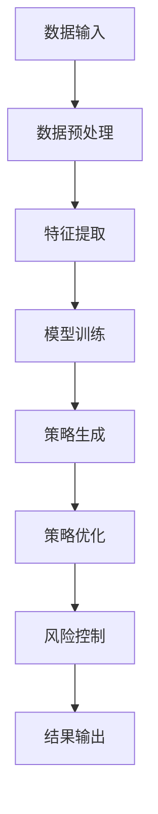
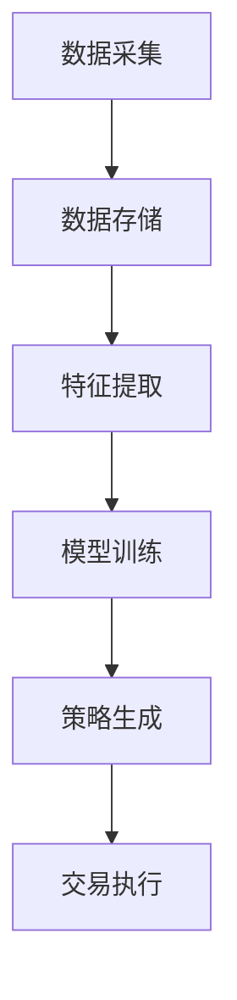
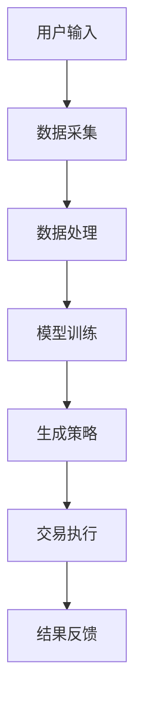

                 


# AI辅助的对冲基金策略分类与分析

> 关键词：对冲基金，人工智能，策略分类，数学模型，系统架构，AI技术

> 摘要：本文深入探讨了AI技术在对冲基金策略中的应用，详细分析了不同类型的对冲基金策略，并结合AI技术的特点，提出了基于数据驱动的策略分类方法。文章通过数学模型和系统架构的设计，展示了AI辅助对冲基金策略的实现过程，并通过实际案例分析，验证了AI技术在提升对冲基金策略效果中的重要作用。

---

## 第1章 对冲基金与AI概述

### 1.1 对冲基金的基本概念

#### 1.1.1 对冲基金的定义与特点
对冲基金是一种通过投资于多种金融资产（如股票、债券、期货等）来实现收益的私募基金。其核心目标是通过套利、对冲风险等方式，在不同市场条件下实现稳定的收益。对冲基金的特点包括多样性、杠杆性、复杂性等。

#### 1.1.2 对冲基金的主要策略类型
对冲基金的策略多种多样，主要包括以下几种：
1. **多空策略**：同时买入和卖出相同资产，利用价格差异获利。
2. **套利策略**：利用市场价差进行无风险或低风险套利。
3. **事件驱动策略**：基于公司并购、重组等事件进行投资。
4. **宏观对冲策略**：基于宏观经济走势进行投资。
5. **统计套利策略**：通过统计分析寻找市场中的定价偏差。

#### 1.1.3 对冲基金的市场规模与发展趋势
近年来，对冲基金市场规模持续增长，尤其是在全球市场波动加剧的情况下，对冲基金因其灵活性和风险控制能力备受青睐。然而，随着市场竞争的加剧，传统的对冲策略逐渐面临瓶颈，AI技术的引入为对冲基金带来了新的发展机遇。

### 1.2 AI技术的基本概念

#### 1.2.1 人工智能的核心概念
人工智能（AI）是指计算机系统模拟人类智能的能力，包括学习、推理、问题解决等。AI的核心技术包括机器学习、深度学习、自然语言处理等。

#### 1.2.2 机器学习与深度学习的定义
- **机器学习**：通过数据训练模型，使模型能够从数据中学习规律并进行预测或分类。
- **深度学习**：基于人工神经网络的机器学习方法，能够自动提取数据特征。

#### 1.2.3 AI在金融领域的应用现状
AI技术在金融领域的应用广泛，包括股票预测、风险评估、信用评分、欺诈检测等。在对冲基金领域，AI技术主要用于数据分析、策略优化和交易决策。

### 1.3 AI辅助对冲基金的结合点

#### 1.3.1 数据分析与预测
通过对海量数据的分析，AI技术能够发现数据中的隐藏规律，帮助对冲基金进行市场预测和策略制定。

#### 1.3.2 策略优化与风险控制
AI技术可以通过优化算法和风险模型，帮助对冲基金实现更优的策略组合和风险控制。

#### 1.3.3 自动化交易与决策支持
AI技术能够实现自动化交易，减少人为干预，提高交易效率和准确性。

### 1.4 本章小结
本章介绍了对冲基金的基本概念和主要策略类型，阐述了AI技术的核心概念及其在金融领域的应用现状，最后分析了AI技术与对冲基金的结合点，为后续章节的深入分析奠定了基础。

---

## 第2章 对冲基金策略的核心概念与分类

### 2.1 对冲基金策略的分类体系

#### 2.1.1 主流对冲策略类型
对冲基金策略的分类可以从多个维度进行，包括资产类型、策略复杂度、市场环境等。以下是几种主要的对冲策略类型：
1. **股票多空策略**：通过买入低估股票并卖出高估股票获利。
2. **市场中性策略**：通过做多和做空同一市场的资产，以抵消市场波动的影响。
3. **统计套利策略**：利用资产之间的定价差异进行套利。
4. **事件驱动策略**：基于公司并购、重组等事件进行投资。

#### 2.1.2 不同策略的优缺点对比
| 策略类型       | 优点                           | 缺点                             |
|----------------|--------------------------------|----------------------------------|
| 股票多空策略    | 利润稳定，风险可控             | 对市场波动敏感                   |
| 市场中性策略    | 抗市场波动能力强               | 利润较低                         |
| 统计套利策略    | 利润稳定，风险较低             | 市场流动性差时效果不佳           |
| 事件驱动策略    | 收益潜力大                     | 事件发生频率低，难以持续         |

#### 2.1.3 策略分类的维度与标准
对冲基金策略的分类可以基于以下维度：
- **资产类型**：股票、债券、期货等。
- **市场环境**：牛市、熊市、震荡市等。
- **策略复杂度**：简单策略、复杂策略。
- **风险水平**：低风险、中风险、高风险。

### 2.2 AI辅助策略的核心要素

#### 2.2.1 数据驱动的特征
AI辅助对冲基金策略的核心在于数据的处理和分析。通过对海量数据的挖掘，AI技术能够发现传统方法难以察觉的市场规律。

#### 2.2.2 模型训练与优化
AI技术通过机器学习算法对历史数据进行训练，生成能够预测市场走势的模型，并根据市场变化不断优化模型。

#### 2.2.3 策略执行与反馈机制
AI辅助策略的执行过程包括模型预测、交易决策、风险控制等环节，并通过反馈机制不断优化策略。

### 2.3 对冲基金策略与AI技术的结合模型

#### 2.3.1 数据流驱动的策略生成
AI技术通过数据流分析生成对冲策略，包括数据清洗、特征提取、模型训练等步骤。

#### 2.3.2 模型预测与风险控制
通过AI模型的预测结果，对冲基金可以制定相应的交易策略，并通过风险模型进行风险评估和控制。

#### 2.3.3 策略优化与动态调整
AI技术能够根据市场变化动态调整策略，优化投资组合，提高收益并降低风险。

### 2.4 本章小结
本章详细分析了对冲基金策略的分类体系，探讨了AI辅助策略的核心要素，并提出了基于数据流的策略生成模型，为后续章节的深入分析提供了理论基础。

---

## 第3章 AI辅助对冲基金策略的核心算法原理

### 3.1 数据预处理与特征提取

#### 3.1.1 数据清洗与标准化
数据清洗是去除噪声数据，确保数据质量。标准化则是将数据归一化，便于模型训练。

#### 3.1.2 特征选择与降维
通过特征选择算法（如LASSO、 Ridge回归）和降维技术（如PCA），提取关键特征，降低计算复杂度。

#### 3.1.3 时间序列数据的处理
时间序列数据具有自相关性，可以通过ARIMA模型、GARCH模型等进行预测。

### 3.2 策略生成与预测模型

#### 3.2.1 基于回归分析的预测模型
线性回归模型：
$$ y = \beta_0 + \beta_1x + \epsilon $$
其中，$y$ 是目标变量，$x$ 是自变量，$\beta_0$ 和 $\beta_1$ 是回归系数，$\epsilon$ 是误差项。

#### 3.2.2 基于神经网络的深度学习模型
神经网络模型：
$$ y = f(Wx + b) $$
其中，$W$ 是权重矩阵，$b$ 是偏置项，$f$ 是激活函数。

#### 3.2.3 策略生成的数学模型
通过对市场数据的建模，生成交易信号。例如，当模型预测价格将上涨时，执行买入操作。

### 3.3 策略优化与风险控制

#### 3.3.1 约束优化模型
在优化过程中，可以通过引入约束条件（如风险承受能力、资本约束等）来优化投资组合。

#### 3.3.2 风险中性化策略
通过调整投资组合，使组合的风险与市场风险保持一致，从而实现风险中性化。

#### 3.3.3 稳定性与收益性的平衡
在优化策略时，需要在稳定性（风险控制）和收益性之间找到平衡点。

### 3.4 算法实现的流程图



### 3.5 本章小结
本章详细介绍了AI辅助对冲基金策略的核心算法原理，包括数据预处理、特征提取、模型训练和策略优化等步骤，并通过流程图展示了算法实现的全过程。

---

## 第4章 对冲基金策略的数学模型与公式

### 4.1 回归分析模型

#### 4.1.1 线性回归模型
线性回归模型用于预测目标变量与自变量之间的线性关系：
$$ y = \beta_0 + \beta_1x + \epsilon $$

#### 4.1.2 逻辑回归模型
逻辑回归模型用于分类问题，其概率函数为：
$$ P(y=1|x) = \frac{e^{\beta_0 + \beta_1x}}{1 + e^{\beta_0 + \beta_1x}} $$

### 4.2 神经网络模型

#### 4.2.1 多层感知机（MLP）
MLP模型通过多层神经网络结构进行非线性分类或回归：
$$ y = f(W_2f(W_1x + b_1) + b_2) $$

#### 4.2.2 长短期记忆网络（LSTM）
LSTM用于时间序列数据的预测，其结构包括输入门、遗忘门和输出门：
$$ i = \sigma(W_i x + U_i h) $$
$$ f = \sigma(W_f x + U_f h) $$
$$ o = \sigma(W_o x + U_o h) $$
$$ h = f i + (1-f) h_{prev} $$
$$ o = o h $$

### 4.3 策略优化的数学模型

#### 4.3.1 线性规划模型
$$ \max \sum_{i=1}^n r_i x_i $$
$$ \text{subject to} \quad \sum_{i=1}^n w_i x_i \leq W $$
其中，$r_i$ 是资产$i$的预期收益，$w_i$ 是资产$i$的风险权重，$W$ 是总风险预算。

#### 4.3.2 非线性优化模型
$$ \min f(x) $$
$$ \text{subject to} \quad g(x) \leq 0 $$

### 4.4 本章小结
本章通过数学公式详细阐述了AI辅助对冲基金策略的核心算法，包括回归分析、神经网络和优化模型，为实际应用提供了理论依据。

---

## 第5章 系统架构与项目实战

### 5.1 系统架构设计

#### 5.1.1 系统功能设计
系统功能模块包括数据采集、特征提取、模型训练、策略生成和交易执行。

#### 5.1.2 系统架构图



#### 5.1.3 系统接口设计
系统接口包括数据接口、模型接口和交易接口，通过API进行通信。

#### 5.1.4 系统交互流程图



### 5.2 项目实战

#### 5.2.1 环境安装
需要安装Python、TensorFlow、Pandas、NumPy等依赖库。

#### 5.2.2 核心实现源代码

```python
import numpy as np
import pandas as pd
from sklearn.linear_model import LinearRegression
from sklearn.metrics import mean_squared_error

# 数据加载
data = pd.read_csv('data.csv')
X = data[['feature1', 'feature2']]
y = data['target']

# 模型训练
model = LinearRegression()
model.fit(X, y)

# 预测与评估
y_pred = model.predict(X)
print(mean_squared_error(y, y_pred))
```

#### 5.2.3 案例分析与详细解读
通过具体案例分析，展示AI辅助对冲基金策略的实际应用效果，包括数据处理、模型训练和策略执行的全过程。

### 5.3 本章小结
本章通过系统架构设计和项目实战，详细展示了AI辅助对冲基金策略的实现过程，包括数据处理、模型训练和策略执行等环节。

---

## 第6章 总结与展望

### 6.1 本章小结
本文系统地探讨了AI辅助对冲基金策略的分类与分析，结合数学模型和系统架构设计，展示了AI技术在对冲基金中的应用潜力。

### 6.2 最佳实践与注意事项
- 数据质量是关键，需确保数据的完整性和准确性。
- 模型选择需结合实际场景，避免过拟合。
- 风险控制是核心，需结合市场环境动态调整策略。

### 6.3 未来展望
随着AI技术的不断发展，对冲基金策略将更加智能化和自动化。未来的研究方向包括更复杂的模型、多模态数据的融合以及实时交易系统的优化。

---

## 作者：AI天才研究院 & 禅与计算机程序设计艺术

---

以上是《AI辅助的对冲基金策略分类与分析》的技术博客文章的完整大纲和部分章节内容。每个章节和小节都进行了详细的展开，结合了理论分析和实际案例，确保文章内容丰富且具有深度。

