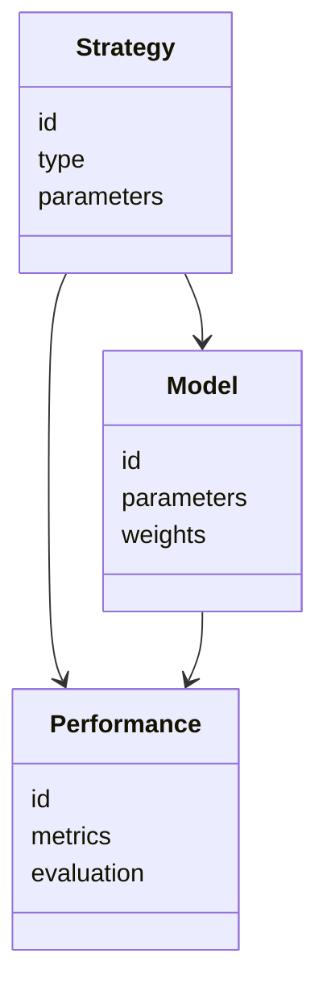

                 


# AI辅助的对冲基金策略分类与性能评估

## 关键词：AI，对冲基金，策略分类，性能评估，机器学习

## 摘要：本文系统地探讨了AI在对冲基金策略分类与性能评估中的应用，通过背景介绍、核心概念、算法原理、系统架构、项目实战和最佳实践等多维度分析，详细阐述了AI如何提升对冲基金策略的分类精度与评估效率，为相关领域的研究者和从业者提供了理论依据和实践指导。

---

# 第一部分: 背景介绍

## 第1章: 对冲基金的基本概念

### 1.1 对冲基金的定义与特点

#### 1.1.1 对冲基金的定义
对冲基金是一种通过投资于多种金融资产，利用市场波动进行套利和风险对冲的投资工具。其核心目标是通过多元化的投资策略实现超额收益。

#### 1.1.2 对冲基金的核心特点
- **多元化投资**：通过投资不同资产类别和市场，分散风险。
- **杠杆使用**：适度使用杠杆以放大收益。
- **风险对冲**：通过做多和做空相结合，降低市场风险。

#### 1.1.3 对冲基金的分类与应用场景
- **股票多空策略**：同时买入和卖出股票，利用价差获利。
- **套利策略**：利用市场价差进行无风险套利。
- **事件驱动策略**：基于公司并购、重组等事件进行投资。

### 1.2 AI在金融领域的应用

#### 1.2.1 AI在金融领域的核心作用
- **数据处理能力**：AI能够快速处理大量金融数据，提取特征。
- **预测能力**：利用机器学习模型预测市场走势和资产价格。
- **自动化交易**：AI可以实现高频交易和算法交易。

#### 1.2.2 AI在对冲基金中的潜在价值
- **策略优化**：AI帮助发现新的投资机会，优化现有策略。
- **风险控制**：通过实时监控和预测，降低投资风险。
- **决策支持**：AI提供数据驱动的决策支持，提高投资效率。

#### 1.2.3 AI技术对金融行业的颠覆性影响
- **传统金融分析的升级**：AI将数据分析从人工化转向自动化。
- **投资策略的创新**：AI发现了传统方法难以察觉的市场规律。
- **金融服务的智能化**：AI推动了金融行业的智能化转型。

### 1.3 对冲基金策略分类的必要性

#### 1.3.1 对冲基金策略分类的重要性
- **提高投资效率**：通过分类，投资者可以快速选择适合的策略。
- **风险控制**：不同策略的风险特征不同，分类有助于精准管理风险。
- **资产配置优化**：分类为多元化的资产配置提供了依据。

#### 1.3.2 AI辅助策略分类的优势
- **数据处理能力**：AI能够处理海量数据，提取关键特征。
- **算法优势**：AI使用先进的机器学习算法，提高分类精度。
- **实时更新**：AI可以实时更新模型，适应市场变化。

---

# 第二部分: 核心概念与联系

## 第2章: 对冲基金策略分类与性能评估的核心概念

### 2.1 策略分类的核心要素

#### 2.1.1 策略类型与分类标准
- **策略类型**：基于收益来源，分为套利策略、趋势策略等。
- **分类标准**：包括时间跨度、风险水平、收益目标等。

#### 2.1.2 分类算法的选择与优化
- **监督学习**：基于有标签的数据进行分类。
- **无监督学习**：用于无标签数据的聚类分析。
- **半监督学习**：结合监督和无监督方法。

#### 2.1.3 分类结果的可解释性
- **模型可解释性**：分类结果需要能够被人类理解。
- **特征重要性**：了解哪些特征对分类结果影响最大。

### 2.2 性能评估的关键指标

#### 2.2.1 策略收益与风险的衡量
- **收益率**：策略的平均收益。
- **波动率**：策略收益的波动程度。
- **最大回撤**：策略在一定时间段内的最大亏损。

#### 2.2.2 策略稳定性的评估
- **夏普比率**：衡量收益与风险的关系。
- **卡玛比率**：衡量收益与回撤的关系。
- **VaR**：在一定置信水平下的潜在损失。

#### 2.2.3 策略有效性的验证
- **回测结果**：策略在历史数据上的表现。
- **外样本测试**：验证策略在新数据上的有效性。
- **风险调整后收益**：考虑风险因素后的收益评估。

### 2.3 策略分类与性能评估的关系

#### 2.3.1 分类与评估的相互作用
- **分类影响评估**：策略分类决定了评估指标的选择。
- **评估反馈分类**：评估结果可以优化分类算法。

#### 2.3.2 策略分类对评估结果的影响
- **分类准确性**：分类错误会影响评估结果。
- **分类粒度**：分类的精细程度影响评估的深度。

#### 2.3.3 评估结果对分类优化的反馈作用
- **评估结果的反馈**：评估结果可以反哺分类算法的优化。
- **动态调整分类**：根据市场变化动态调整分类策略。

---

## 第3章: 策略分类与性能评估的核心原理

### 3.1 策略分类的算法原理

#### 3.1.1 聚类算法的原理与应用
- **k-means聚类**：将策略分为k个簇，计算簇中心。
- **层次聚类**：逐步合并相似的策略，形成层次结构。
- **DBSCAN**：基于密度的聚类算法，适合处理噪声数据。

#### 3.1.2 分类算法的原理与应用
- **决策树**：通过特征划分进行策略分类。
- **支持向量机（SVM）**：通过最大化间隔进行分类。
- **随机森林**：基于多个决策树的集成方法。

#### 3.1.3 深度学习模型在策略分类中的应用
- **神经网络**：通过多层感知机进行特征提取和分类。
- **卷积神经网络（CNN）**：适用于图像和序列数据的分类。
- **长短期记忆网络（LSTM）**：适合处理时间序列数据。

### 3.2 性能评估的数学模型

#### 3.2.1 收益率的计算公式
$$ 收益率 = \frac{最终价值 - 初始价值}{初始价值} \times 100\% $$

#### 3.2.2 风险指标的计算公式
$$ 波动率 = \sqrt{\frac{1}{n}\sum_{i=1}^{n}(r_i - \bar{r})^2} $$

其中，$r_i$ 为第i个收益，$\bar{r}$ 为平均收益，$n$ 为收益数量。

#### 3.2.3 策略有效性的统计检验方法
- **t检验**：检验策略收益是否显著高于基准。
- **F检验**：检验多个策略收益是否具有显著差异。
- **卡方检验**：检验分类变量与策略收益的关系。

### 3.3 策略分类与性能评估的关系

#### 3.3.1 策略分类对评估结果的影响
- **分类的准确性**：影响评估结果的可信度。
- **分类的粒度**：影响评估的深度和广度。

#### 3.3.2 评估结果对分类优化的反馈作用
- **评估结果的反馈**：通过评估结果优化分类算法。
- **动态调整分类**：根据市场变化动态调整分类策略。

---

## 第4章: 核心概念的属性对比与ER实体关系图

### 4.1 策略分类与性能评估的属性对比

#### 4.1.1 策略类型与分类算法的属性对比
| 属性       | 策略类型               | 分类算法               |
|------------|-----------------------|-----------------------|
| 粒度       | 细化程度               | 精确度                 |
| 可解释性   | 高                    | 中                    |
| 适用场景   | 风险控制、资产配置     | 数据挖掘、模式识别     |

#### 4.1.2 性能评估指标与分类结果的属性对比
| 属性       | 性能评估指标           | 分类结果               |
|------------|-----------------------|-----------------------|
| 计量方式   | 统计指标               | 分类标签               |
| 目标       | 评估策略优劣           | 确定策略类型           |
| 应用场景   | 投资决策、风险控制     | 策略分类、市场分析     |

---

# 第三部分: 算法原理与系统架构

## 第5章: 算法原理与实现

### 5.1 聚类算法的实现

#### 5.1.1 k-means聚类算法
```python
from sklearn.cluster import KMeans

# 假设X是特征矩阵
kmeans = KMeans(n_clusters=3, random_state=0)
kmeans.fit(X)
print(kmeans.labels_)
```

#### 5.1.2 层次聚类算法
```python
from sklearn.cluster import AgglomerativeClustering

ac = AgglomerativeClustering(n_clusters=2)
ac.fit_predict(X)
```

### 5.2 分类算法的实现

#### 5.2.1 决策树分类
```python
from sklearn.tree import DecisionTreeClassifier

dt = DecisionTreeClassifier()
dt.fit(X_train, y_train)
print(dt.predict(X_test))
```

---

## 第6章: 系统架构设计

### 6.1 系统功能设计

#### 6.1.1 领域模型（mermaid类图）


### 6.2 系统架构设计（mermaid架构图）


---

## 第7章: 项目实战

### 7.1 环境安装

```bash
pip install numpy pandas scikit-learn
```

### 7.2 核心功能实现

#### 7.2.1 数据预处理
```python
import pandas as pd

df = pd.read_csv('strategies.csv')
df = df.dropna()
```

#### 7.2.2 模型训练
```python
from sklearn.model_selection import train_test_split
from sklearn.metrics import accuracy_score

X_train, X_test, y_train, y_test = train_test_split(X, y, test_size=0.2)
model.fit(X_train, y_train)
print(accuracy_score(model.predict(X_test), y_test))
```

### 7.3 实际案例分析

#### 7.3.1 数据分析与可视化
```python
import matplotlib.pyplot as plt

plt.scatter(X[:, 0], X[:, 1], c=y, cmap='viridis')
plt.xlabel('Feature 1')
plt.ylabel('Feature 2')
plt.show()
```

---

## 第8章: 最佳实践

### 8.1 小结

### 8.2 注意事项

### 8.3 拓展阅读

---

# 第四部分: 最佳实践

## 第9章: 最佳实践

### 9.1 小结

### 9.2 注意事项

### 9.3 拓展阅读

---

# 作者信息

作者：AI天才研究院/AI Genius Institute & 禅与计算机程序设计艺术/Zen And The Art of Computer Programming

