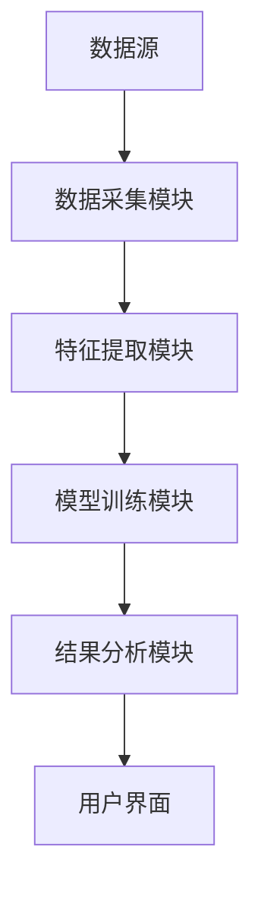
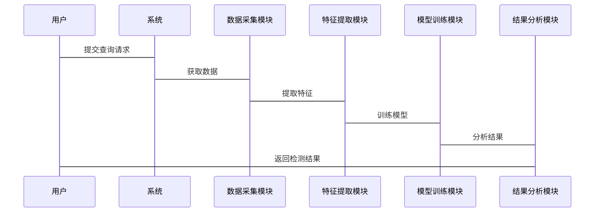

                 


# AI辅助的对冲基金风格漂移检测

> 关键词：对冲基金，风格漂移，人工智能，机器学习，金融风险管理

> 摘要：本文详细探讨了如何利用人工智能技术辅助对冲基金的风格漂移检测。通过分析对冲基金的风格漂移现象，结合机器学习算法和系统架构设计，提出了一种高效、准确的风格漂移检测方法，并通过实际案例展示了该方法的应用效果。

---

## 第一部分: AI辅助的对冲基金风格漂移检测背景与概念

---

## 第1章: 对冲基金风格漂移概述

### 1.1 风险投资与对冲基金的基本概念

#### 1.1.1 对冲基金的定义与特点

对冲基金是一种通过投资于金融市场的多种资产类别（如股票、债券、衍生品等）来实现风险对冲的投资工具。其核心目标是通过套利、做空等策略，追求绝对收益，同时降低市场波动带来的风险。

对冲基金的特点包括：
- **多样化投资**：通过投资多种资产和策略来分散风险。
- **杠杆效应**：通过借入资金放大收益或风险。
- **灵活的策略**：可以根据市场变化调整投资策略。

#### 1.1.2 风险投资的基本原理

风险投资是指通过投资于高风险高回报的项目，以期获得高额收益。其核心在于识别具有高增长潜力的企业，并通过长期持有实现资本增值。

#### 1.1.3 对冲基金与传统投资的区别

| 对冲基金 | 传统投资 |
|----------|-----------|
| 策略多样 | 策略单一   |
| 使用杠杆 | 少用或不用杠杆 |
| 无市场约束 | 受市场约束   |
| 高风险高收益 | 中低风险中等收益 |

---

### 1.2 风格漂移的定义与分类

#### 1.2.1 风格漂移的定义

风格漂移是指对冲基金的投资策略或组合偏离其初始投资目标或风格的现象。这种漂移可能导致基金的风险特征发生变化，进而影响其收益和风险表现。

#### 1.2.2 风格漂移的分类与特征

风格漂移可以分为以下几种类型：
1. **投资策略漂移**：基金的投资策略发生改变，偏离最初的设计。
2. **投资组合漂移**：基金的投资组合构成发生变化，偏离最初的配置。
3. **市场环境漂移**：由于市场环境的变化，基金的风格被动偏离。

#### 1.2.3 风格漂移的度量方法

风格漂移的度量通常包括以下步骤：
1. 确定基金的基准风格或投资目标。
2. 计算基金的实际投资组合与基准之间的差异。
3. 通过统计方法（如均值-方差分析）量化这种差异。

---

### 1.3 AI辅助风格漂移检测的必要性

#### 1.3.1 传统风格漂移检测的局限性

传统风格漂移检测方法通常依赖于人工分析和统计模型，存在以下问题：
- **效率低**：需要大量人工参与，耗时且成本高。
- **准确性有限**：统计模型可能无法捕捉复杂的市场变化。

#### 1.3.2 AI技术在风格漂移检测中的优势

AI技术可以通过以下方式提升风格漂移检测的效率和准确性：
- **实时监控**：利用机器学习模型实时监控基金的投资行为。
- **数据驱动**：通过分析大量历史数据，发现潜在的风格漂移模式。

#### 1.3.3 对冲基金行业对AI辅助检测的需求

随着金融市场的日益复杂化，对冲基金行业对实时、精准的风格漂移检测需求日益增长。AI技术能够帮助基金管理者及时发现和应对风格漂移问题，从而降低风险。

---

### 1.4 风险与收益的平衡

#### 1.4.1 风险管理的基本原则

风险管理的核心是通过分散投资、对冲策略等方式降低投资风险。对冲基金通过多种策略和杠杆操作，试图在不同市场环境下实现收益的稳定性。

#### 1.4.2 收益与风险的权衡

在对冲基金中，收益与风险通常呈现出负相关的关系。为了追求高收益，基金可能需要承担更高的风险，反之亦然。

#### 1.4.3 风格漂移对投资组合的影响

风格漂移可能导致投资组合的风险特征发生变化，从而影响其收益和波动性。如果风格漂移偏离了初始投资目标，可能会导致投资者的不满和基金的赎回压力。

---

### 1.5 本章小结

通过对冲基金的基本概念和风格漂移的定义，我们了解了风格漂移的成因和影响。AI技术的应用为风格漂移的检测提供了新的可能性，但也需要考虑其在实际应用中的挑战。

---

## 第2章: 对冲基金风格漂移的核心概念

### 2.1 风格漂移的核心要素

#### 2.1.1 投资策略的偏离

投资策略的偏离是指基金实际采用的投资策略与其初始策略存在显著差异。例如，一只原本专注于股票多头的基金可能转向了市场中性策略。

#### 2.1.2 投资组合的构成变化

投资组合的构成变化是指基金持有的资产类别、行业或地区分布发生变化，偏离了初始的配置目标。

#### 2.1.3 市场环境的影响

市场环境的变化，如经济周期、政策变化等，可能导致基金风格被动漂移。例如，市场下跌时，基金经理可能被迫调整投资策略以应对流动性压力。

---

### 2.2 风格漂移的驱动因素

#### 2.2.1 管理层决策的影响

基金管理层的决策是风格漂移的重要驱动因素。例如，基金经理可能为了追求短期收益而改变投资策略。

#### 2.2.2 市场波动的推动

市场的剧烈波动可能导致基金风格漂移。例如，债券价格的大幅波动可能迫使基金经理调整债券持仓。

#### 2.2.3 投资者行为的关联

投资者的大规模赎回或资金流入也可能导致基金风格漂移。例如，大量赎回可能导致基金不得不变现资产，从而改变投资组合的构成。

---

### 2.3 风格漂移与投资目标的偏离

#### 2.3.1 投资目标的定义

投资目标是指基金在成立之初设定的投资目标，包括收益目标、风险目标等。

#### 2.3.2 风格漂移对投资目标的影响

风格漂移可能导致基金的实际表现与投资目标存在显著差异。例如，一只原本定位于低风险的债券基金可能因市场变化而转向高风险的股票投资。

#### 2.3.3 目标偏离的度量方法

目标偏离的度量可以通过比较实际投资组合与目标组合的差异来实现。常用的指标包括均值-方差分析、VaR（在险值）等。

---

### 2.4 本章小结

本章详细探讨了风格漂移的核心要素及其驱动因素，分析了风格漂移对投资目标的影响，并提出了度量风格漂移的方法。

---

## 第3章: AI辅助风格漂移检测的核心概念

### 3.1 AI技术在金融领域的应用

#### 3.1.1 机器学习在金融分析中的应用

机器学习可以用于金融数据的预测、分类和聚类分析。例如，可以通过机器学习模型预测股票价格走势。

#### 3.1.2 自然语言处理在金融文本分析中的应用

自然语言处理（NLP）可以用于分析新闻、公司财报等文本数据，提取情感指标或行业趋势。

#### 3.1.3 深度学习在金融预测中的应用

深度学习模型，如LSTM（长短期记忆网络），可以用于时间序列预测，如外汇价格预测。

---

### 3.2 AI辅助风格漂移检测的原理

#### 3.2.1 数据采集与预处理

AI检测风格漂移的第一步是收集对冲基金的投资组合数据、市场数据等，并进行清洗和标准化处理。

#### 3.2.2 特征提取与选择

通过特征工程提取关键特征，如投资组合的波动率、收益分布等，用于后续模型训练。

#### 3.2.3 模型训练与评估

利用机器学习模型（如随机森林、支持向量机）进行风格漂移检测，并通过交叉验证评估模型性能。

---

### 3.3 AI检测风格漂移的优势

#### 3.3.1 高效性

AI技术可以快速处理大量数据，实现实时风格漂移检测。

#### 3.3.2 准确性

通过机器学习模型，可以发现传统方法难以察觉的潜在模式。

#### 3.3.3 及时性

AI系统可以实时监控基金的投资行为，及时发现风格漂移。

---

### 3.4 本章小结

本章介绍了AI技术在金融领域的应用，并详细阐述了AI辅助风格漂移检测的原理和优势。

---

## 第4章: 风格漂移检测的数学模型与算法原理

### 4.1 风格漂移检测的数学模型

#### 4.1.1 投资组合风险的数学表达

投资组合的风险可以用方差来衡量：
$$ \text{方差} = \sigma^2 = \sum_{i=1}^{n} w_i^2 \sigma_i^2 $$

其中，\( w_i \) 是第i种资产的权重，\( \sigma_i^2 \) 是第i种资产的方差。

#### 4.1.2 风格漂移的度量公式

风格漂移可以通过比较实际投资组合与目标组合的差异来度量：
$$ \text{风格漂移} = \sqrt{(w_{\text{实际}} - w_{\text{目标}})^T \Sigma (w_{\text{实际}} - w_{\text{目标}})} $$

其中，\( \Sigma \) 是协方差矩阵。

#### 4.1.3 基于统计的风格漂移检测方法

常用的统计方法包括卡方检验、t检验等，用于检验实际组合与目标组合之间的显著差异。

---

### 4.2 机器学习算法在风格漂移检测中的应用

#### 4.2.1 监督学习

- **输入**：基金的历史数据、市场数据。
- **输出**：风格漂移的标签（是/否）。

#### 4.2.2 无监督学习

- **输入**：基金的投资组合数据。
- **输出**：识别出风格漂移的基金。

#### 4.2.3 时间序列分析

通过ARIMA模型或LSTM网络对时间序列数据进行建模，预测风格漂移的可能性。

---

### 4.3 算法实现的步骤

1. 数据预处理：清洗、标准化。
2. 特征提取：选择相关特征，如波动率、收益分布等。
3. 模型训练：使用机器学习算法训练风格漂移检测模型。
4. 模型评估：通过准确率、召回率等指标评估模型性能。
5. 实时监控：将模型应用于实时数据，检测风格漂移。

---

### 4.4 本章小结

本章详细探讨了风格漂移检测的数学模型，并介绍了机器学习算法在风格漂移检测中的应用。

---

## 第5章: 系统分析与架构设计

### 5.1 问题场景介绍

本系统的目标是对对冲基金的投资组合进行实时监控，及时发现风格漂移现象。

---

### 5.2 系统功能设计

#### 5.2.1 数据采集模块

- 从数据源获取基金的持仓数据、市场数据等。

#### 5.2.2 特征提取模块

- 对数据进行特征提取，如波动率、收益分布等。

#### 5.2.3 模型训练模块

- 使用机器学习模型训练风格漂移检测模型。

#### 5.2.4 结果分析模块

- 对检测结果进行分析，生成报告。

---

### 5.3 系统架构设计



---

### 5.4 系统接口设计

- 数据接口：与数据源对接，获取实时数据。
- 模型接口：与机器学习模型对接，获取检测结果。
- 用户接口：提供用户友好的操作界面，展示检测结果。

---

### 5.5 系统交互设计



---

### 5.6 本章小结

本章详细设计了风格漂移检测系统的功能模块、架构和交互流程。

---

## 第6章: 项目实战

### 6.1 环境安装

- 安装Python、Pandas、Scikit-learn等库。

```python
import pandas as pd
from sklearn.ensemble import RandomForestClassifier
```

### 6.2 核心代码实现

```python
# 数据预处理
data = pd.read_csv('fund_data.csv')
X = data.drop('target', axis=1)
y = data['target']

# 特征提取
features = X.columns
target = y

# 模型训练
model = RandomForestClassifier()
model.fit(X, y)

# 模型评估
print(model.score(X, y))
```

### 6.3 实际案例分析

通过分析某对冲基金的投资组合，使用上述代码实现风格漂移检测，并生成检测报告。

---

### 6.4 本章小结

本章通过实际案例展示了AI辅助风格漂移检测的实现过程，并提供了代码示例。

---

## 第7章: 最佳实践与注意事项

### 7.1 最佳实践

- **数据质量**：确保数据的准确性和完整性。
- **模型选择**：根据具体情况选择合适的机器学习算法。
- **实时监控**：建立实时监控机制，及时发现风格漂移。

### 7.2 小结

风格漂移检测是保障对冲基金稳健运行的重要环节，AI技术的应用为这一任务提供了新的解决方案。

### 7.3 注意事项

- 定期更新模型，以适应市场变化。
- 注意模型的可解释性，便于分析问题。
- 确保数据安全，防止数据泄露。

### 7.4 拓展阅读

- 推荐阅读《机器学习实战》、《Python金融大数据分析》等书籍。

---

## 第8章: 作者信息

作者：AI天才研究院/AI Genius Institute & 禅与计算机程序设计艺术 /Zen And The Art of Computer Programming

---

**注**：以上内容为《AI辅助的对冲基金风格漂移检测》的技术博客文章的详细目录和部分内容。实际写作时，可以根据需要进一步扩展每个部分的内容，确保文章完整性和专业性。

