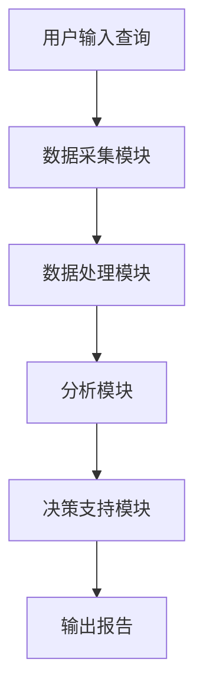
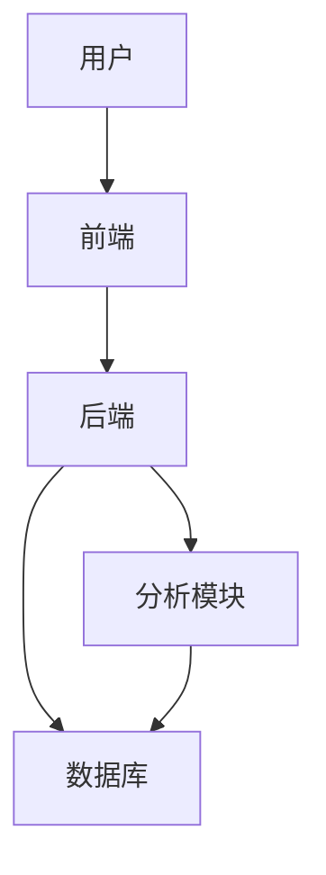
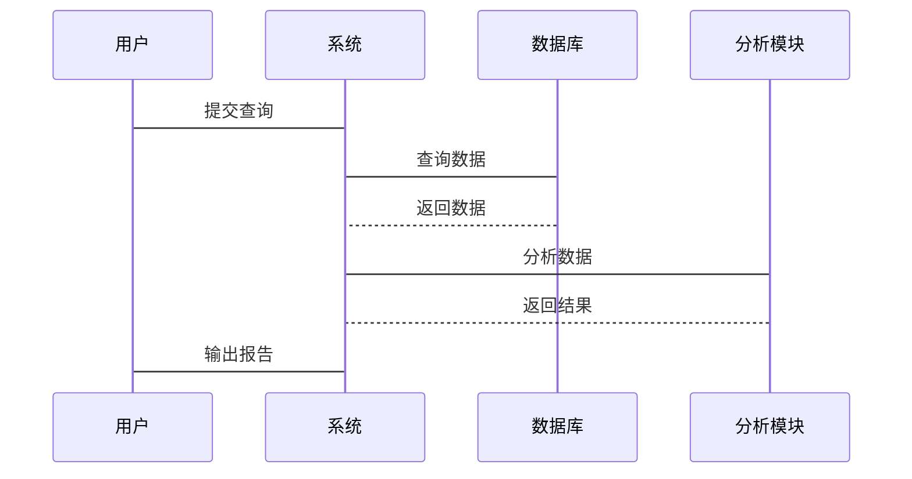

                 


# AI辅助的并购交易分析

> 关键词：AI，并购交易，自然语言处理，机器学习，大数据分析

> 摘要：本文探讨了人工智能在并购交易分析中的应用，涵盖NLP、机器学习和大数据分析等技术，详细分析了算法原理、系统架构，并通过案例展示了项目实战。

---

# 第一部分: AI辅助的并购交易分析基础

# 第1章: 并购交易分析概述

## 1.1 并购交易的基本概念

### 1.1.1 并购的定义与分类

并购（Mergers and Acquisitions，简称M&A）是指一家企业与其他企业合并或收购其资产、股权等行为。并购可以分为两类：

- **合并（Merger）**：两家或多家企业合并为一家新公司。
- **收购（Acquisition）**：一家企业购买另一家企业的全部或部分资产或股权。

### 1.1.2 并购交易的流程与关键环节

并购交易通常包括以下几个关键环节：

1. **尽职调查（Due Diligence）**：对目标公司进行详细调查，包括财务、法律、运营等方面。
2. **估值与定价**：评估目标公司的价值，确定交易价格。
3. **谈判与协议签署**：双方协商达成一致，签署并购协议。
4. **整合与实施**：完成并购后的整合，包括组织结构、业务流程等。

### 1.1.3 并购交易中的主要参与者

- **买方**：通常是希望通过并购实现扩张或优化的企业。
- **卖方**：希望通过出售资产或股权获得资金的企业。
- **中介**：包括投行、律师、会计师等专业服务机构。

## 1.2 AI在并购交易中的应用背景

### 1.2.1 并购交易分析的传统方法

传统的并购分析主要依赖于人工收集和分析数据，效率低且容易出错。具体步骤包括：

1. 手动收集目标公司的财务报表、法律文件等信息。
2. 人工分析这些数据，评估目标公司的价值和风险。

### 1.2.2 传统方法的局限性

传统方法存在以下问题：

- **效率低下**：人工收集和分析数据耗时长，且容易出错。
- **信息不全面**：难以获取足够的外部数据，如新闻、社交媒体等。
- **主观性**：分析结果依赖于分析师的经验和判断，缺乏客观性。

### 1.2.3 AI技术如何解决并购分析中的问题

人工智能技术可以通过以下方式解决传统方法的局限性：

- **自动化数据收集**：利用爬虫技术自动收集目标公司及相关市场的数据。
- **智能分析**：利用NLP和机器学习技术对数据进行自动分析，提高效率和准确性。
- **预测与决策支持**：通过机器学习模型预测并购风险和价值，为决策提供支持。

## 1.3 AI辅助并购交易分析的核心价值

### 1.3.1 提高分析效率

AI技术可以自动化处理大量数据，显著缩短分析时间。

### 1.3.2 增强数据处理能力

通过整合结构化和非结构化数据，AI能够提供更全面的分析结果。

### 1.3.3 提供更精准的决策支持

基于大数据分析和机器学习模型，AI可以提供更准确的估值和风险预测，帮助决策者做出更明智的选择。

## 1.4 本章小结

本章介绍了并购交易的基本概念、传统分析方法及其局限性，以及AI技术在并购分析中的应用背景和核心价值。

---

# 第二部分: AI辅助并购交易分析的技术基础

# 第2章: 自然语言处理（NLP）在并购分析中的应用

## 2.1 NLP的基本概念与技术

### 2.1.1 NLP的定义与核心任务

自然语言处理（NLP）是人工智能的重要分支，旨在使计算机能够理解、处理和生成人类语言。其核心任务包括：

- **文本分类**：将文本归类到预定类别中。
- **信息抽取**：从文本中提取特定信息。
- **情感分析**：分析文本中的情感倾向。

### 2.1.2 常见的NLP技术与工具

- **分词**：将文本分割成单词或短语。
- **实体识别**：识别文本中的命名实体（如人名、地名等）。
- **句法分析**：分析句子的语法结构。
- **工具**：如spaCy、NLTK、Gensim等。

## 2.2 NLP在并购交易中的应用场景

### 2.2.1 文本信息提取

从新闻报道、公司财报等文本中提取关键信息，如财务数据、市场动态等。

### 2.2.2 文本相似度计算

通过计算目标公司与行业基准的相似度，评估其市场地位和风险。

### 2.2.3 情感分析与风险评估

分析新闻、社交媒体等文本的情感倾向，评估市场对并购交易的反应。

## 2.3 NLP在并购交易中的实际案例

### 2.3.1 某公司并购案例分析

以某科技公司并购为例，NLP技术被用于分析目标公司的新闻报道和财报，提取关键信息并评估其市场风险。

### 2.3.2 NLP在案例中的具体应用

- 使用分词技术提取公司名称和关键词。
- 使用实体识别技术识别财务数据。
- 使用情感分析技术评估市场情绪。

## 2.4 本章小结

本章介绍了NLP的基本概念与技术，并详细探讨了其在并购交易中的应用场景和实际案例。

---

# 第3章: 机器学习在并购分析中的应用

## 3.1 机器学习的基本概念与技术

### 3.1.1 机器学习的定义与分类

机器学习是一种人工智能技术，通过数据训练模型，使其能够进行预测和分类。常见的机器学习算法包括：

- **监督学习**：如线性回归、支持向量机（SVM）。
- **无监督学习**：如聚类、主成分分析（PCA）。
- **深度学习**：如神经网络、卷积神经网络（CNN）。

### 3.1.2 常见的机器学习算法

- **线性回归**：用于预测连续型变量。
- **决策树**：用于分类和回归。
- **随机森林**：基于决策树的集成学习方法。

## 3.2 机器学习在并购分析中的应用场景

### 3.2.1 风险评估与预测

利用历史数据训练模型，预测并购交易的成功概率和潜在风险。

### 3.2.2 并购价值评估

基于目标公司的财务数据和市场表现，评估其并购价值。

### 3.2.3 并购成功概率预测

通过分析历史并购案例，预测当前并购交易的成功概率。

## 3.3 机器学习在并购分析中的实际案例

### 3.3.1 某行业并购案例分析

以某行业并购案例为例，机器学习技术被用于分析目标公司的财务数据和市场表现，预测并购交易的风险和价值。

### 3.3.2 机器学习在案例中的具体应用

- 使用线性回归模型预测并购价值。
- 使用随机森林模型评估并购风险。
- 使用神经网络模型预测并购成功概率。

## 3.4 本章小结

本章介绍了机器学习的基本概念与技术，并详细探讨了其在并购分析中的应用场景和实际案例。

---

# 第三部分: AI辅助并购交易分析的系统架构

# 第4章: 系统架构与实现

## 4.1 系统功能设计

### 4.1.1 系统功能模块

- **数据采集模块**：自动采集目标公司和市场的数据。
- **数据处理模块**：对数据进行清洗和预处理。
- **分析模块**：利用NLP和机器学习技术进行分析。
- **决策支持模块**：提供可视化报告和决策建议。

### 4.1.2 系统功能流程图



## 4.2 系统架构设计

### 4.2.1 系统架构图



### 4.2.2 系统接口设计

- **API接口**：提供RESTful API，供前端调用。
- **数据库接口**：与数据库进行交互，存储和检索数据。

## 4.3 系统交互设计

### 4.3.1 系统交互流程图



## 4.4 本章小结

本章详细设计了AI辅助并购交易分析系统的架构，包括功能模块、系统架构图和交互流程图。

---

# 第四部分: 项目实战

# 第5章: 项目实战

## 5.1 环境安装

### 5.1.1 安装Python

```bash
# 安装Python
sudo apt-get install python3
```

### 5.1.2 安装相关库

```bash
# 安装NLP库
pip install numpy pandas scikit-learn
```

## 5.2 系统核心实现源代码

### 5.2.1 数据采集模块

```python
import requests
from bs4 import BeautifulSoup

def fetch_data(url):
    response = requests.get(url)
    soup = BeautifulSoup(response.text, 'html.parser')
    return soup
```

### 5.2.2 数据处理模块

```python
import pandas as pd

def preprocess_data(data):
    df = pd.DataFrame(data)
    df.dropna(inplace=True)
    return df
```

### 5.2.3 分析模块

```python
from sklearn.model import LinearRegression

def train_model(X, y):
    model = LinearRegression()
    model.fit(X, y)
    return model
```

## 5.3 代码应用解读与分析

### 5.3.1 数据采集模块

上述代码通过`requests`库获取网页内容，并使用`BeautifulSoup`库解析HTML结构，提取所需数据。

### 5.3.2 数据处理模块

上述代码使用`pandas`库对数据进行清洗，删除缺失值，确保数据质量。

### 5.3.3 分析模块

上述代码使用`scikit-learn`库中的线性回归模型进行训练，预测目标公司的并购价值。

## 5.4 实际案例分析

### 5.4.1 案例背景

以某科技公司并购为例，目标是分析其并购风险和价值。

### 5.4.2 数据收集与处理

收集目标公司的财务报表、新闻报道等数据，清洗并预处理。

### 5.4.3 模型训练与预测

使用线性回归模型训练，预测并购交易的成功概率和价值。

## 5.5 项目小结

本章通过实际案例展示了AI辅助并购交易分析系统的实现过程，包括环境安装、代码实现和案例分析。

---

# 第五部分: 总结与展望

# 第6章: 总结与展望

## 6.1 本章总结

本文详细探讨了人工智能在并购交易分析中的应用，涵盖NLP、机器学习和系统架构等技术，通过实际案例展示了系统的实现和应用。

## 6.2 未来展望

随着AI技术的不断发展，未来的并购交易分析将更加智能化和自动化。可能出现的新趋势包括：

- **更复杂的模型**：如深度学习和强化学习的应用。
- **多模态分析**：结合文本、图像等多种数据源进行分析。
- **实时分析**：实时监控市场动态，提供实时决策支持。

## 6.3 最佳实践 Tips

- 在进行并购分析时，建议结合多种AI技术，如NLP和机器学习，以提高分析的全面性和准确性。
- 定期更新模型，以适应市场变化和新的数据源。

## 6.4 本章小结

本章总结了全文内容，并展望了未来的发展方向，同时提供了最佳实践的建议。

---

# 作者：AI天才研究院/AI Genius Institute & 禅与计算机程序设计艺术 /Zen And The Art of Computer Programming

---

感谢您的阅读！希望本文对您理解AI在并购交易分析中的应用有所帮助。如需进一步探讨或获取更多资源，请随时联系。

