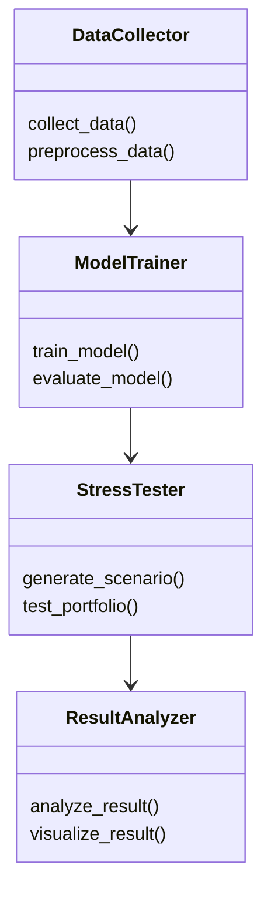
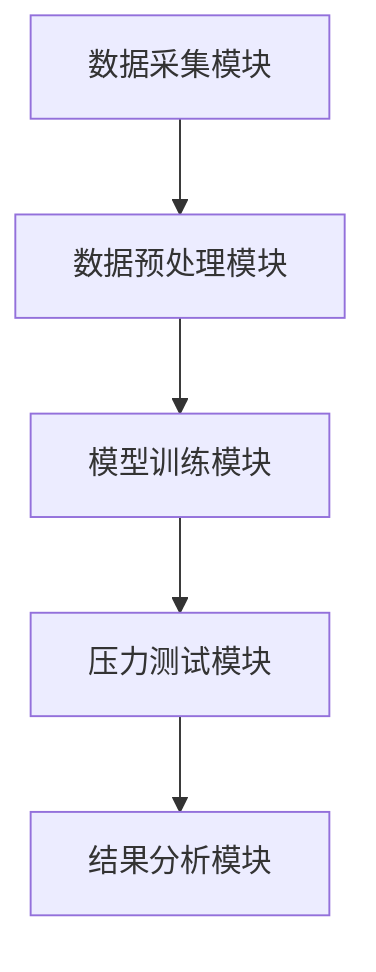
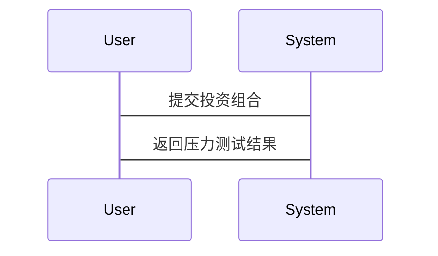

                 


# AI辅助的投资组合压力测试平台

## 关键词：AI，投资组合，压力测试，风险管理，金融，算法

## 摘要：  
本文探讨了AI技术在投资组合压力测试中的应用，详细分析了传统压力测试的局限性以及AI如何通过强化学习和蒙特卡洛模拟等算法提升压力测试的效率和准确性。文章从背景、核心概念、算法原理、系统架构到项目实战，全面解析了AI辅助压力测试平台的构建过程，并结合实际案例展示了其在金融风险管理中的价值。

---

## 第一部分：背景介绍

### 第1章：投资组合压力测试的背景与挑战

#### 1.1 投资组合压力测试的重要性  
压力测试是评估投资组合在极端市场条件下的表现和风险的重要工具，帮助投资者制定应对策略，降低潜在损失。然而，传统压力测试方法依赖人工经验和简化假设，存在效率低、覆盖面有限等问题。

#### 1.2 传统压力测试的局限性  
- 数据处理能力有限，难以覆盖所有可能的市场情景。  
- 模型假设过于简化，可能导致结果偏差。  
- 手动操作为主，效率低下，难以实时更新。  

#### 1.3 AI技术如何解决传统压力测试的痛点  
AI技术通过大数据处理、自动化建模和深度学习算法，能够快速生成多种极端市场情景，提供更精准的压力测试结果，显著提升效率和准确性。

---

### 第2章：AI在金融领域的应用现状

#### 2.1 投资组合管理中的AI应用  
AI技术在资产配置、风险评估和交易决策等领域展现了巨大潜力，尤其是在压力测试中，AI能够快速分析海量数据，生成复杂的市场情景。  

#### 2.2 当前市场对AI辅助压力测试的需求  
随着金融市场波动加剧，机构投资者对实时、精准的压力测试工具需求日益增长，AI技术成为解决这一需求的关键。

---

## 第二部分：核心概念与框架

### 第3章：AI辅助压力测试的核心概念与框架

#### 3.1 核心概念  
- **数据采集与预处理**：收集历史市场数据、宏观经济指标等，进行清洗和特征提取。  
- **模型训练与优化**：利用深度学习和强化学习算法，训练压力测试模型。  
- **压力测试策略生成**：基于AI模型生成极端市场情景，并模拟投资组合表现。  
- **结果分析与可视化**：对测试结果进行分析，生成可视化报告，帮助用户制定应对策略。  

#### 3.2 AI辅助压力测试的框架体系  
通过模块化设计，AI压力测试平台能够高效处理数据、训练模型、生成测试策略，并提供直观的结果分析。

#### 3.3 核心概念对比分析  
- **压力测试方法对比表格**  
| 方法 | 优点 | 缺点 |  
|------|------|------|  
| Monte Carlo模拟 | 能够生成大量情景，结果精确 | 计算复杂度高 |  
| 强化学习 | 策略优化能力强 | 对环境建模要求高 |  

- **ER实体关系图**  
使用Mermaid图展示系统中各实体及其关系：  
```mermaid
erDiagram
    customer[客户] {
        id : integer
        name : string
    }
    stress_test[压力测试] {
        id : integer
        scenario : string
        result : float
    }
    investment_portfolio[投资组合] {
        id : integer
        asset_class : string
        risk_level : integer
    }
    customer --> stress_test
    investment_portfolio --> stress_test
```

---

## 第三部分：算法原理

### 第4章：AI辅助压力测试的算法原理

#### 4.1 强化学习算法在压力测试中的应用  
- **基本原理**  
强化学习通过试错机制，优化投资组合在极端市场情景下的表现。  
- **数学模型**  
$$ V(s) = \max_{a} [ r + \gamma V(s') ] $$  
其中，$V(s)$ 表示状态 $s$ 的价值，$r$ 是动作 $a$ 的奖励，$\gamma$ 是折扣因子，$s'$ 是下一步状态。  

- **Python代码示例**  
```python
def reinforce_learning(env):
    # 初始化参数
    # 训练过程
    # 返回最优策略
    pass
```

#### 4.2 蒙特卡洛模拟在压力测试中的应用  
- **基本原理**  
蒙特卡洛模拟通过生成大量随机市场情景，评估投资组合在不同情景下的表现。  
- **数学模型**  
$$ E[X] = \frac{1}{N}\sum_{i=1}^{N} X_i $$  
其中，$E[X]$ 是期望值，$X_i$ 是第 $i$ 次模拟的结果，$N$ 是模拟次数。  

- **Python代码示例**  
```python
import numpy as np

def monte_carlo_simulation(portfolio, scenarios):
    returns = []
    for scenario in scenarios:
        portfolio_return = calculate_return(portfolio, scenario)
        returns.append(portfolio_return)
    average_return = np.mean(returns)
    return average_return
```

---

### 第5章：系统分析与架构设计

#### 5.1 系统功能设计  
- **领域模型**  


#### 5.2 系统架构设计  
- **系统架构图**  


#### 5.3 系统交互设计  
- **交互流程图**  


---

### 第6章：项目实战

#### 6.1 环境安装  
- 安装Python和相关库（如numpy、pandas、tensorflow）。  
- 安装Jupyter Notebook用于代码开发与调试。  

#### 6.2 核心代码实现  
- **数据预处理**  
```python
import pandas as pd

def preprocess_data(data):
    # 数据清洗与特征提取
    return processed_data
```

- **模型训练**  
```python
import tensorflow as tf

def build_model(input_shape):
    model = tf.keras.Sequential([
        tf.keras.layers.Dense(64, activation='relu', input_shape=input_shape),
        tf.keras.layers.Dense(1, activation='linear')
    ])
    return model
```

- **压力测试**  
```python
def perform_stress_test(portfolio, model):
    # 生成极端市场情景
    # 模型预测结果
    return results
```

#### 6.3 案例分析  
- 通过具体案例分析，展示AI辅助压力测试平台的实际应用效果和优势。  

---

### 第7章：最佳实践

#### 7.1 小结  
本文详细介绍了AI辅助投资组合压力测试平台的构建过程，从背景、核心概念到算法实现，再到系统架构和项目实战，全面展示了AI技术在金融风险管理中的潜力。

#### 7.2 注意事项  
- 数据质量对模型性能影响巨大，需确保数据的准确性和完整性。  
- 模型需要定期更新，以适应市场变化。  

#### 7.3 拓展阅读  
建议读者进一步阅读相关领域的经典文献，如《Reinforcement Learning: Theory and Algorithms》和《Monte Carlo Methods in Financial Engineering》。

---

## 作者：AI天才研究院/AI Genius Institute & 禅与计算机程序设计艺术 /Zen And The Art of Computer Programming

