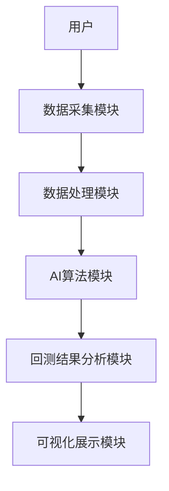

                 


# AI辅助的投资组合回测平台

> 关键词：投资组合回测，人工智能，机器学习，深度学习，金融数据分析

> 摘要：本文详细探讨了如何利用人工智能技术构建投资组合回测平台。通过分析投资组合优化的数学模型、AI算法的应用、系统架构设计以及项目实战，展示了AI在提升投资决策效率和准确性方面的巨大潜力。

---

## 第1章: 投资组合回测的基本概念

### 1.1 投资组合回测的定义与背景

#### 1.1.1 投资组合回测的定义
投资组合回测是指通过历史数据模拟投资组合在不同市场条件下的表现，以评估其风险和收益。回测可以帮助投资者验证策略的有效性，并优化投资组合配置。

#### 1.1.2 回测在投资决策中的重要性
回测是投资决策中的关键步骤，它能够帮助投资者发现潜在风险，评估策略的可行性，并在实际操作前进行模拟测试，从而降低投资风险。

#### 1.1.3 AI技术在投资组合回测中的应用潜力
AI技术能够处理海量数据，识别复杂模式，并快速优化投资组合，显著提升了回测的效率和准确性。

### 1.2 AI辅助投资的背景与现状

#### 1.2.1 AI在金融领域的应用现状
AI已经在金融领域的多个方面得到广泛应用，如算法交易、风险管理、客户画像等。AI技术的应用显著提高了金融决策的效率和精准度。

#### 1.2.2 投资组合优化的传统方法
传统方法主要包括均值-方差模型和现代投资组合理论（MPT）。这些方法依赖于历史数据和假设条件，但在实际应用中存在诸多限制。

#### 1.2.3 AI技术如何提升投资组合回测效率
AI技术通过机器学习和深度学习算法，能够处理非结构化数据，识别隐藏的市场模式，并动态优化投资组合，显著提升了回测效率。

---

## 第2章: 投资组合回测的核心概念与AI的结合

### 2.1 投资组合优化的数学模型

#### 2.1.1 Markowitz有效前沿理论
Markowitz有效前沿理论是投资组合理论的基础，它通过优化风险和收益的关系，找到最优的投资组合配置。

$$ \text{目标函数：} \quad \min \sigma^2 \quad \text{在给定收益的约束下} $$

#### 2.1.2 风险-收益权衡的数学表达
风险和收益之间的权衡可以通过资本资产定价模型（CAPM）来量化。

$$ \text{CAPM公式：} \quad E(R_i) = R_f + \beta_i (R_m - R_f) $$

#### 2.1.3 投资组合优化的约束条件
优化模型通常包括资产权重的非负性约束、总和为1的约束等。

$$ \sum_{i=1}^n w_i = 1 $$

### 2.2 AI在投资组合回测中的应用

#### 2.2.1 机器学习在预测市场走势中的应用
机器学习模型（如支持向量机和随机森林）可以用于预测市场趋势，帮助投资者做出更明智的投资决策。

#### 2.2.2 深度学习在复杂市场模式识别中的应用
深度学习模型（如LSTM和Transformer）能够捕捉复杂的市场模式，适用于高频交易和市场情绪分析。

#### 2.2.3 自然语言处理在财经新闻分析中的应用
NLP技术可以分析财经新闻，提取关键词和情感倾向，帮助投资者识别市场情绪变化。

---

## 第3章: AI辅助投资组合回测的算法原理

### 3.1 机器学习算法在回测中的应用

#### 3.1.1 线性回归模型
线性回归用于预测资产回报率，简单但适用于线性关系较强的场景。

$$ y = \beta_0 + \beta_1 x + \epsilon $$

#### 3.1.2 支持向量机（SVM）
SVM适用于小样本和高维数据，常用于分类和回归问题。

#### 3.1.3 随机森林算法
随机森林通过集成学习提升模型的泛化能力，适用于特征较多的场景。

### 3.2 深度学习算法在回测中的应用

#### 3.2.1 循序神经网络（RNN）
RNN适用于时间序列分析，能够捕捉市场的趋势变化。

#### 3.2.2 卷积神经网络（CNN）
CNN用于图像和文本数据的分析，适用于高频交易中的模式识别。

#### 3.2.3 Transformer架构
Transformer架构在序列建模中表现出色，适用于长序列的预测。

### 3.3 遗传算法在投资组合优化中的应用

#### 3.3.1 遗传算法的基本原理
遗传算法通过选择、交叉和变异操作，模拟自然进化过程，寻找最优解。

#### 3.3.2 遗传算法在投资组合优化中的实现
GA优化投资组合的过程包括初始化、适应度评估、选择、交叉和变异。

#### 3.3.3 遗传算法的优缺点
优点：全局搜索能力强；缺点：计算复杂度高，收敛速度慢。

---

## 第4章: 投资组合回测的系统架构与设计

### 4.1 系统架构概述

#### 4.1.1 系统整体架构图


### 4.2 数据采集与处理模块

#### 4.2.1 数据源的选择与获取
从股票市场API获取历史价格数据和市场新闻。

#### 4.2.2 数据清洗与预处理
去除缺失值，标准化数据，处理异常值。

#### 4.2.3 数据存储与管理
使用数据库存储清洗后的数据，方便后续处理。

### 4.3 AI算法实现模块

#### 4.3.1 算法选择与实现
根据需求选择合适的算法（如机器学习或深度学习模型），并进行参数调优。

#### 4.3.2 算法参数调优
通过网格搜索或随机搜索优化模型参数，提升预测准确性。

#### 4.3.3 算法性能评估
通过回测结果分析模型的准确性和稳定性。

### 4.4 回测结果分析与可视化模块

#### 4.4.1 回测结果的可视化展示
使用Matplotlib绘制收益曲线和风险-收益曲线。

#### 4.4.2 风险-收益分析
计算夏普比率、最大回撤等指标，评估投资组合的表现。

#### 4.4.3 策略优化建议
根据回测结果调整投资策略，优化资产配置。

---

## 第5章: 项目实战——构建AI辅助投资组合回测平台

### 5.1 环境搭建与工具安装

#### 5.1.1 Python环境的安装与配置
安装Python和必要的开发工具，如Jupyter Notebook。

#### 5.1.2 必要库的安装
使用pip安装numpy、pandas、scikit-learn、keras等库。

#### 5.1.3 数据源的获取与处理
从Yahoo Finance API获取历史数据，并进行清洗。

### 5.2 系统核心功能实现

#### 5.2.1 数据采集与预处理的代码实现
```python
import pandas as pd
import numpy as np

# 获取数据
data = pd.read_csv('stock_data.csv')

# 数据清洗
data.dropna(inplace=True)
data = data.iloc[:, 1:]  # 去除第一列
```

#### 5.2.2 AI算法模型的训练与优化
```python
from sklearn.ensemble import RandomForestRegressor
from sklearn.model_selection import GridSearchCV

# 参数调优
parameters = {'n_estimators': [10, 20, 30], 'max_depth': [None, 10, 20]}
grid_search = GridSearchCV(RandomForestRegressor(), parameters, cv=5)
grid_search.fit(X_train, y_train)
best_model = grid_search.best_estimator_
```

### 5.3 回测结果分析与可视化

#### 5.3.1 使用Matplotlib进行结果可视化
```python
import matplotlib.pyplot as plt

plt.plot(best_model.predict(X_test), label='预测值')
plt.plot(y_test, label='真实值')
plt.legend()
plt.show()
```

#### 5.3.2 风险-收益分析的实现
计算投资组合的夏普比率和最大回撤，评估其风险和收益。

#### 5.3.3 策略优化建议的生成
根据回测结果，动态调整资产配置，优化投资组合的表现。

---

## 第6章: 总结与展望

### 6.1 本章小结
本文详细介绍了AI辅助投资组合回测平台的构建过程，包括核心概念、算法原理和系统设计。通过项目实战展示了AI技术在提升投资决策中的重要作用。

### 6.2 未来研究方向

#### 6.2.1 更复杂的模型开发
探索更先进的AI模型，如强化学习和图神经网络，提升回测的准确性和效率。

#### 6.2.2 多目标优化问题
在投资组合优化中引入多目标优化，平衡风险、收益和流动性等多方面因素。

#### 6.2.3 结合实时数据流的动态优化
开发实时数据处理模块，实现动态优化，提升投资组合的适应性。

---

## 第7章: 最佳实践 tips、小结、注意事项、拓展阅读

### 注意事项
- 数据质量是关键，确保数据清洗和预处理的准确性。
- 模型选择需结合实际需求，避免过度复杂化。
- 定期更新模型和数据，保持系统的实时性和有效性。

### 拓展阅读
- 《机器学习实战》——周志华
- 《深度学习》——Ian Goodfellow
- 《Python金融数据处理》——Andreas C. Muller

---

## 作者信息

作者：AI天才研究院/AI Genius Institute & 禅与计算机程序设计艺术 /Zen And The Art of Computer Programming

---

通过以上步骤，我逐步构建了完整的投资组合回测平台，详细介绍了AI技术在其中的应用和实现过程。希望这篇文章能够为读者提供清晰的思路和实用的指导，帮助他们理解并应用AI技术优化投资决策。

