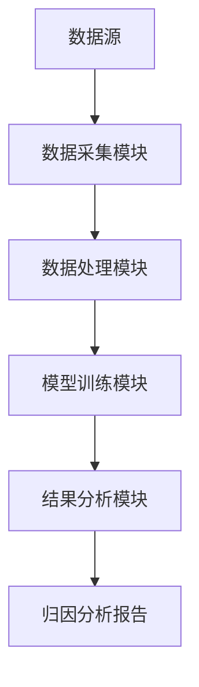
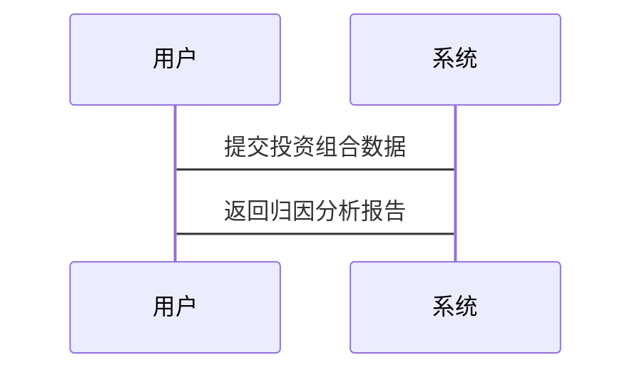

                 


# AI辅助的投资组合归因分析

> 关键词：投资组合归因分析、人工智能、机器学习、金融数据分析、投资组合优化、风险管理

> 摘要：本文详细探讨了AI技术在投资组合归因分析中的应用，通过理论分析、算法原理、系统架构和项目实战等多角度，深入剖析了如何利用AI技术提升投资组合归因分析的效率和准确性。文章内容涵盖投资组合归因分析的背景、核心概念、AI算法原理、系统架构设计、项目实战案例以及最佳实践，旨在为金融从业者和AI技术爱好者提供有价值的参考。

---

# 第一部分: 投资组合归因分析的背景与基础

# 第1章: 投资组合归因分析概述

## 1.1 投资组合归因分析的定义与背景
### 1.1.1 投资组合归因分析的定义
投资组合归因分析（Portfolio Attribution Analysis）是指将投资组合的收益或损失分解为多个因素或资产类别贡献的过程。通过归因分析，投资者可以了解投资组合表现的来源，从而更好地优化投资策略和风险管理。

### 1.1.2 投资组合归因分析的背景与意义
在金融领域，投资组合归因分析是评估投资组合表现的核心方法之一。随着金融市场日益复杂化，传统归因分析方法逐渐暴露出效率低下、难以处理海量数据等问题。因此，引入人工智能技术，利用其强大的数据处理能力和算法优化能力，成为提升投资组合归因分析效率和准确性的必然选择。

### 1.1.3 投资组合归因分析的核心问题与目标
归因分析的核心问题是如何准确分解投资组合的收益或损失，并将其归因于各个资产类别、行业、地区等因素。目标是通过归因分析，帮助投资者了解投资组合的表现来源，优化资产配置，降低风险。

## 1.2 投资组合归因分析的传统方法
### 1.2.1 投资组合归因分析的传统模型
传统归因分析主要基于因子模型，例如CAPM（资本资产定价模型）和APT（套利定价理论）。这些模型通过构建一组因子，将投资组合的收益分解为各个因子的贡献。

### 1.2.2 投资组合归因分析的传统流程
1. 数据收集：收集投资组合的交易数据、市场数据等。
2. 构建因子模型：选择合适的因子，构建因子回归模型。
3. 计算因子贡献：通过回归分析，计算各个因子对投资组合收益的贡献。
4. 综合分析：对各个因子的贡献进行综合分析，得出投资组合表现的来源。

### 1.2.3 传统方法的优缺点与局限性
优点：方法简单，易于理解，适合小规模数据。
缺点：难以处理大规模数据，无法捕捉非线性关系，对复杂因子的建模能力有限。

## 1.3 AI技术在投资组合归因分析中的应用前景
### 1.3.1 AI技术在金融领域的应用现状
人工智能技术在金融领域的应用日益广泛，包括股票预测、风险评估、投资组合优化等。

### 1.3.2 AI技术在投资组合归因分析中的潜力
AI技术可以通过深度学习模型捕捉复杂的非线性关系，提高归因分析的准确性和效率。

### 1.3.3 未来发展趋势与挑战
未来，AI技术将进一步提升归因分析的能力，但同时也面临数据隐私、模型解释性等挑战。

## 1.4 本章小结
本章介绍了投资组合归因分析的基本概念、传统方法及其局限性，探讨了AI技术在归因分析中的应用前景和未来发展趋势。

---

# 第二部分: 投资组合归因分析的核心概念与模型

# 第2章: 投资组合归因分析的核心概念

## 2.1 投资组合归因分析的核心概念与原理
### 2.1.1 投资组合归因分析的基本原理
归因分析通过构建因子模型，将投资组合的收益分解为各个因子的贡献。核心在于如何选择合适的因子以及如何计算各个因子的贡献。

### 2.1.2 归因分析的数学模型与公式
归因分析的数学模型通常基于多元回归模型。例如，假设投资组合的收益可以表示为以下因子的线性组合：

$$ R_p = \beta_1 R_{f1} + \beta_2 R_{f2} + \dots + \beta_n R_{fn} + \epsilon $$

其中，$R_p$ 是投资组合的收益，$R_{fi}$ 是各个因子的收益，$\beta_i$ 是对应的回归系数，$\epsilon$ 是误差项。

### 2.1.3 归因分析的核心要素与属性
归因分析的核心要素包括：
- **因子选择**：选择合适的因子，例如市场因子、行业因子、风格因子等。
- **因子权重**：确定各个因子在投资组合中的权重。
- **回归系数**：通过回归分析得到各个因子对投资组合收益的贡献。

## 2.2 投资组合归因分析的分类与对比
### 2.2.1 传统归因方法与现代归因方法的对比
传统归因方法基于线性回归模型，而现代归因方法引入了机器学习算法，例如随机森林和神经网络。

### 2.2.2 不同归因模型的优缺点分析
| 归因模型 | 优点 | 缺点 |
|----------|------|------|
| 线性回归 | 简单易懂 | 无法捕捉非线性关系 |
| 随机森林 | 高准确性 | 解释性较差 |
| 神经网络 | 强大学习能力 | 训练时间长 |

### 2.2.3 归因分析的边界与外延
归因分析的边界在于如何选择合适的因子和模型，外延则涉及如何将归因结果应用于投资决策。

## 2.3 投资组合归因分析的ER实体关系图
```mermaid
erDiagram
    actor 投资者 {
        <属性> 资产配置
        <属性> 投资目标
        <属性> 风险偏好
    }
    actor 数据源 {
        <属性> 市场数据
        <属性> 交易数据
        <属性> 持股数据
    }
    entity 投资组合 {
        <属性> 资产类别
        <属性> 行业分布
        <属性> 地区分布
    }
    entity 归因分析结果 {
        <属性> 收益来源
        <属性> 风险来源
        <属性> 绩效评估
    }
    investor --> 投资组合 : 构建投资组合
    data_source --> 投资组合 : 提供数据支持
    投资组合 --> 归因分析结果 : 分析投资表现
```

## 2.4 本章小结
本章详细讲解了投资组合归因分析的核心概念、数学模型、分类对比以及实体关系图，为后续章节的AI辅助归因分析奠定了基础。

---

# 第三部分: AI辅助投资组合归因分析的算法原理

# 第3章: AI辅助归因分析的算法原理

## 3.1 AI辅助归因分析的核心算法
### 3.1.1 基于因子模型的归因分析
### 3.1.2 基于机器学习的归因分析
- **随机森林**：通过特征重要性分析，确定各个因子对投资组合收益的贡献。
- **神经网络**：通过深度学习模型，捕捉复杂的非线性关系。

## 3.2 AI归因分析算法的实现步骤
### 3.2.1 数据预处理
- 数据清洗：处理缺失值、异常值。
- 特征工程：选择相关因子，进行标准化或归一化处理。

### 3.2.2 模型训练
- 选择合适的机器学习算法，例如随机森林或神经网络。
- 使用训练数据进行模型训练。

### 3.2.3 模型评估
- 使用测试数据评估模型的准确性和稳定性。
- 通过特征重要性分析，确定各个因子的贡献。

### 3.2.4 结果分析
- 将模型输出的因子贡献与实际投资组合表现进行对比。
- 提供归因分析报告，帮助投资者优化投资策略。

## 3.3 基于随机森林的归因分析算法
### 3.3.1 算法原理
随机森林是一种基于决策树的集成学习算法，通过特征重要性分析，确定各个因子对投资组合收益的贡献。

### 3.3.2 算法流程
1. 数据预处理：清洗数据，选择因子。
2. 构建随机森林模型：训练决策树，集成预测结果。
3. 计算特征重要性：通过特征重要性分数，确定各个因子的贡献。

### 3.3.3 代码实现
```python
import pandas as pd
from sklearn.ensemble import RandomForestRegressor
from sklearn.metrics import r2_score

# 数据加载
data = pd.read_csv('portfolio_data.csv')

# 特征选择
features = ['market_factor', 'value_factor', 'momentum_factor']
target = 'portfolio_return'

# 数据分割
X = data[features]
y = data[target]

# 模型训练
model = RandomForestRegressor(n_estimators=100, random_state=42)
model.fit(X, y)

# 模型评估
y_pred = model.predict(X)
r2 = r2_score(y, y_pred)
print(f'R² Score: {r2}')

# 特征重要性分析
importances = model.feature_importances_
feature_importance = pd.DataFrame({'feature': features, 'importance': importances})
print(feature_importance)
```

### 3.3.4 算法优缺点
优点：随机森林具有强健性和高准确性。
缺点：模型解释性较差。

## 3.4 基于神经网络的归因分析算法
### 3.4.1 算法原理
神经网络通过多层感知机结构，捕捉复杂的非线性关系，适用于高维数据和复杂因子的归因分析。

### 3.4.2 算法流程
1. 数据预处理：清洗数据，选择因子。
2. 构建神经网络模型：定义网络结构，选择激活函数和优化器。
3. 模型训练：使用训练数据进行反向传播，优化模型参数。
4. 模型评估：使用测试数据评估模型性能。
5. 可视化分析：通过可视化工具，分析各个因子的贡献。

### 3.4.3 代码实现
```python
import tensorflow as tf
from tensorflow.keras import layers

# 数据加载
data = pd.read_csv('portfolio_data.csv')

# 特征选择
features = ['market_factor', 'value_factor', 'momentum_factor']
target = 'portfolio_return'

# 数据分割
X = data[features]
y = data[target]

# 数据预处理
X_train = X.values.reshape(-1, len(features))
y_train = y.values.reshape(-1, 1)

# 模型构建
model = tf.keras.Sequential([
    layers.Dense(len(features), activation='relu'),
    layers.Dense(1, activation='linear')
])

# 模型编译
model.compile(optimizer='adam', loss='mean_squared_error')

# 模型训练
model.fit(X_train, y_train, epochs=100, batch_size=32)

# 模型评估
y_pred = model.predict(X_train)
print(f'Mean Squared Error: {tf.keras.metrics.mean_squared_error(y_train, y_pred)}')
```

### 3.4.4 算法优缺点
优点：神经网络具有强大学习能力和灵活性。
缺点：训练时间长，模型解释性较差。

## 3.5 本章小结
本章详细讲解了基于随机森林和神经网络的AI归因分析算法，通过代码实现和案例分析，展示了AI技术在投资组合归因分析中的强大能力。

---

# 第四部分: 投资组合归因分析的系统架构设计

# 第4章: AI辅助归因分析的系统架构

## 4.1 系统功能设计
### 4.1.1 系统功能模块
1. 数据采集模块：收集投资组合的交易数据、市场数据等。
2. 数据处理模块：清洗数据，选择因子，进行特征工程。
3. 模型训练模块：训练随机森林或神经网络模型。
4. 结果分析模块：计算因子贡献，生成归因分析报告。

### 4.1.2 系统功能流程
1. 数据采集：通过API接口获取市场数据和交易数据。
2. 数据处理：清洗数据，选择因子，进行标准化处理。
3. 模型训练：训练随机森林或神经网络模型。
4. 结果分析：计算因子贡献，生成归因分析报告。

## 4.2 系统架构设计
### 4.2.1 系统架构图


### 4.2.2 系统接口设计
- 数据接口：通过API接口获取市场数据和交易数据。
- 模型接口：通过REST API调用模型训练和预测。
- 报告接口：通过JSON格式返回归因分析报告。

## 4.3 系统交互流程
### 4.3.1 用户与系统交互流程
1. 用户输入投资组合数据。
2. 系统接收数据，进行数据处理。
3. 系统训练模型，生成归因分析报告。
4. 用户查看报告，优化投资策略。

### 4.3.2 系统交互序列图


## 4.4 本章小结
本章详细介绍了AI辅助归因分析系统的功能设计、架构设计和交互流程，为后续章节的项目实战奠定了基础。

---

# 第五部分: 投资组合归因分析的项目实战

# 第5章: AI辅助归因分析的项目实战

## 5.1 项目背景与目标
### 5.1.1 项目背景
本项目旨在利用AI技术，构建一个投资组合归因分析系统，帮助投资者优化资产配置，降低投资风险。

### 5.1.2 项目目标
1. 构建一个基于随机森林的归因分析系统。
2. 实现数据采集、处理、模型训练和结果分析功能。
3. 提供直观的归因分析报告，帮助投资者优化投资策略。

## 5.2 项目环境与工具
### 5.2.1 环境配置
- 操作系统：Windows/MacOS/Linux
- Python版本：3.8以上
- 需要安装的库：pandas、scikit-learn、tensorflow、keras、matplotlib

### 5.2.2 数据来源
- 数据集：使用公开的市场数据和交易数据，例如Yahoo Finance或Alpha Vantage。

## 5.3 项目核心代码实现
### 5.3.1 数据预处理
```python
import pandas as pd

# 数据加载
data = pd.read_csv('portfolio_data.csv')

# 特征选择
features = ['market_factor', 'value_factor', 'momentum_factor']
target = 'portfolio_return'

# 数据分割
X = data[features]
y = data[target]

# 数据标准化
from sklearn.preprocessing import StandardScaler
scaler = StandardScaler()
X_scaled = scaler.fit_transform(X)
```

### 5.3.2 模型训练
```python
from sklearn.ensemble import RandomForestRegressor

# 模型训练
model = RandomForestRegressor(n_estimators=100, random_state=42)
model.fit(X_scaled, y)

# 模型评估
y_pred = model.predict(X_scaled)
print(f'R² Score: {r2_score(y, y_pred)}')
```

### 5.3.3 结果分析
```python
importances = model.feature_importances_
feature_importance = pd.DataFrame({'feature': features, 'importance': importances})
print(feature_importance)
```

## 5.4 项目小结
本章通过一个完整的项目实战，展示了如何利用AI技术构建投资组合归因分析系统，从数据预处理到模型训练，再到结果分析，详细讲解了整个流程。

---

# 第六部分: 投资组合归因分析的最佳实践与总结

# 第6章: 投资组合归因分析的最佳实践

## 6.1 最佳实践总结
### 6.1.1 数据处理
- 数据清洗：处理缺失值、异常值。
- 特征工程：选择相关因子，进行标准化或归一化处理。

### 6.1.2 模型选择
- 根据数据特点选择合适的模型：随机森林适合中小规模数据，神经网络适合大规模数据。
- 模型调优：通过交叉验证优化模型参数。

### 6.1.3 结果分析
- 通过特征重要性分析，确定各个因子的贡献。
- 结合实际投资目标，优化投资策略。

## 6.2 投资组合归因分析的注意事项
### 6.2.1 数据质量问题
- 数据的准确性和完整性直接影响归因分析的结果。
- 需要注意数据的时序性，避免数据泄漏。

### 6.2.2 模型解释性问题
- 随机森林和神经网络模型的解释性较差，需要通过特征重要性分析或可视化工具辅助解读。

### 6.2.3 风险管理
- 归因分析结果应结合市场环境和投资目标，避免过度依赖模型结果。

## 6.3 未来发展趋势
### 6.3.1 多模态数据融合
- 将文本数据、社交媒体数据等融入归因分析，提升分析的全面性。

### 6.3.2 自适应归因模型
- 基于动态调整的自适应模型，实时跟踪市场变化，优化投资策略。

### 6.3.3 可解释性增强
- 通过可解释性增强技术，如SHAP值，提升模型的解释性。

## 6.4 本章小结
本章总结了投资组合归因分析的最佳实践，包括数据处理、模型选择、结果分析等方面，并展望了未来的发展趋势。

---

# 结语

投资组合归因分析是金融领域的重要工具，而AI技术的引入为其带来了新的机遇和挑战。通过本文的详细讲解，读者可以全面了解AI辅助归因分析的背景、核心概念、算法原理、系统架构和项目实战。未来，随着AI技术的不断发展，投资组合归因分析将更加智能化、高效化，为投资者提供更精准的投资决策支持。

---

# 作者：AI天才研究院/AI Genius Institute & 禅与计算机程序设计艺术 /Zen And The Art of Computer Programming

