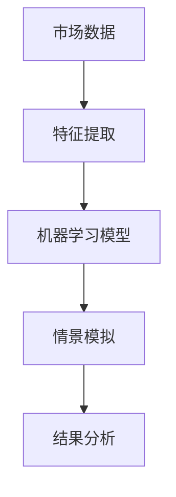
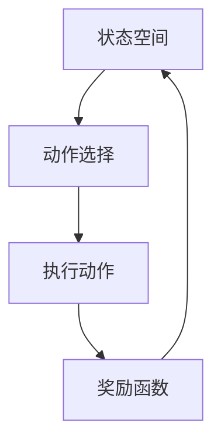
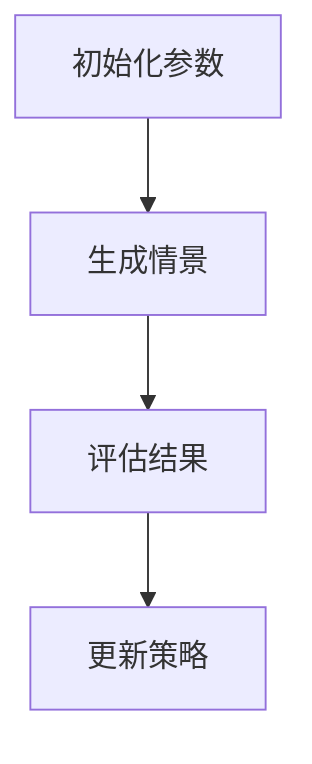
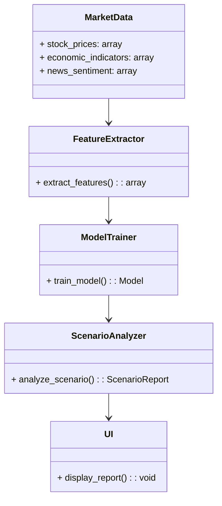
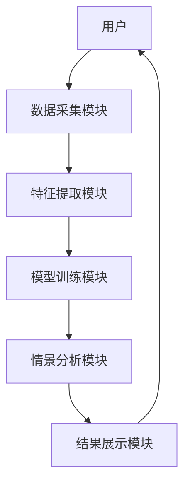
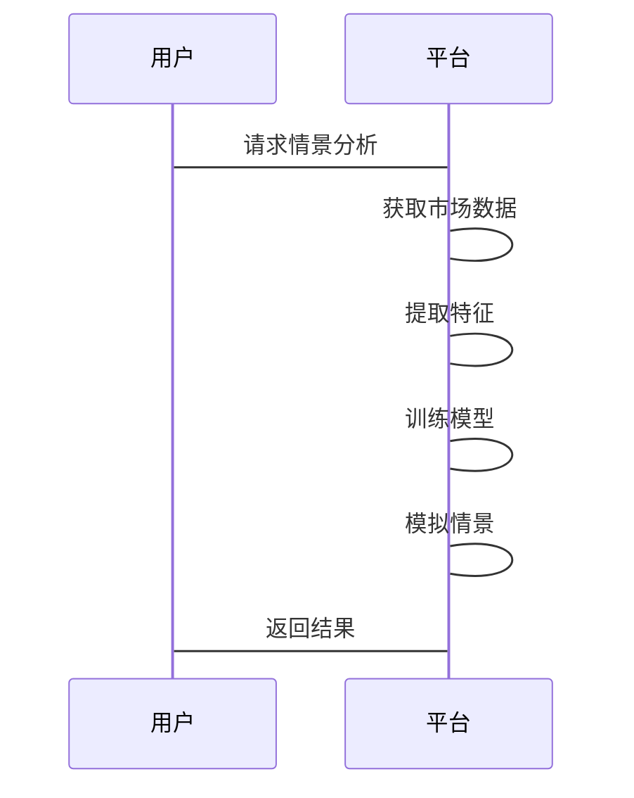

                 


# AI辅助的投资组合情景分析平台

## 关键词：AI，投资组合，情景分析，金融建模，机器学习

## 摘要：本文探讨了AI在投资组合情景分析中的应用，详细介绍了平台的构建过程，包括算法选择、系统架构设计和项目实战，展示了如何利用AI优化投资决策。

---

# 第一部分: AI辅助的投资组合情景分析平台概述

## 第1章: 投资组合情景分析的背景与需求

### 1.1 问题背景

#### 1.1.1 传统投资组合管理的局限性
传统投资组合管理依赖于人工分析和历史数据，存在效率低、主观性强、难以应对复杂市场变化等问题。

#### 1.1.2 AI技术在金融领域的应用潜力
AI技术能够处理大量数据，识别复杂模式，提供实时分析，为投资决策提供支持。

#### 1.1.3 投资组合情景分析的核心问题
情景分析旨在评估不同市场条件下投资组合的表现，帮助投资者制定稳健的策略。

### 1.2 问题描述

#### 1.2.1 投资组合情景分析的定义
通过模拟不同市场情景，评估投资组合的风险和收益。

#### 1.2.2 情景分析的关键要素
包括市场趋势、宏观经济指标、资产配置等。

#### 1.2.3 现有解决方案的不足
传统方法依赖假设，难以捕捉复杂市场动态。

### 1.3 问题解决思路

#### 1.3.1 引入AI技术的核心目标
利用机器学习模型捕捉数据中的潜在模式，提高分析的准确性和效率。

#### 1.3.2 数据驱动的投资决策优势
通过大数据分析，提供更精准的情景模拟和预测。

#### 1.3.3 多因素情景分析的实现路径
结合多种数据源，构建多维度模型，模拟不同情景下的投资组合表现。

### 1.4 边界与外延

#### 1.4.1 平台的功能边界
专注于情景分析，不涉及实际交易执行。

#### 1.4.2 相关领域的外延
涵盖风险管理、资产配置、市场预测等多个方面。

#### 1.4.3 与其他金融工具的协同关系
与投资组合优化、风险管理工具等协同工作，提升整体投资效率。

### 1.5 核心概念结构与要素组成

#### 1.5.1 核心概念的层次结构
从数据输入到情景模拟，再到结果分析，构建完整的分析流程。

#### 1.5.2 各要素的属性与关系
数据特征、模型参数、情景模拟结果相互关联，共同影响最终的分析结论。

#### 1.5.3 系统架构的初步框架
初步确定数据采集、分析引擎、用户界面三个主要模块。

---

# 第二部分: AI与投资组合分析的结合原理

## 第2章: AI与投资组合分析的结合原理

### 2.1 AI在投资组合分析中的作用

#### 2.1.1 数据处理与特征提取
使用自然语言处理和统计方法提取市场数据中的有用信息。

#### 2.1.2 模型训练与预测
构建机器学习模型，预测市场趋势和资产价格。

#### 2.1.3 情景生成与优化
通过生成对抗网络等技术，模拟多种市场情景，优化投资组合配置。

### 2.2 核心概念的原理分析

#### 2.2.1 机器学习模型的训练过程
从数据预处理到模型训练，再到结果评估，详细解释每一步骤。

#### 2.2.2 数据特征对模型性能的影响
分析不同特征对模型预测能力的影响，优化特征选择。

#### 2.2.3 情景分析的数学模型
介绍基于强化学习的动态规划模型，用于模拟不同市场情景。

### 2.3 核心概念的特征对比

#### 2.3.1 不同模型的性能对比
通过实验对比，展示不同AI模型在情景分析中的表现差异。

#### 2.3.2 数据特征的维度分析
分析特征的维度对模型泛化能力的影响。

#### 2.3.3 情景分析的精度评估
使用准确率、召回率等指标，评估模型的性能。

### 2.4 ER实体关系图



---

# 第三部分: 算法原理

## 第3章: 算法原理

### 3.1 强化学习算法

#### 3.1.1 算法流程



#### 3.1.2 Python代码实现

```python
class Agent:
    def __init__(self, state_space):
        self.state_space = state_space
        # 初始化策略模型
        self.model = self.build_model()

    def build_model(self):
        # 构建神经网络模型
        model = Sequential()
        model.add(Dense(64, activation='relu', input_dim=state_space))
        model.add(Dense(1, activation='sigmoid'))
        model.compile(optimizer='adam', loss='binary_crossentropy')
        return model

    def act(self, state):
        # 选择动作
        return self.model.predict(state)

    def update(self, reward):
        # 更新模型参数
        self.model.fit(state, action, epochs=1, verbose=0)
```

#### 3.1.3 数学模型与公式

投资组合优化的强化学习模型可以表示为：

$$
V(s) = \max_{a} [ r(s,a) + V(s') ]
$$

其中，\( s \) 是状态，\( a \) 是动作，\( r \) 是奖励函数，\( s' \) 是下一个状态。

### 3.2 蒙特卡洛模拟

#### 3.2.1 算法流程



#### 3.2.2 Python代码实现

```python
import numpy as np

def monte_carlo_simulation(assets, scenarios):
    returns = []
    for _ in range(scenarios):
        # 生成随机收益
        asset_returns = np.random.normal(0, 1, len(assets))
        returns.append(asset_returns)
    return returns

# 示例用法
assets = ['stock', 'bond']
scenarios = 1000
sim_results = monte_carlo_simulation(assets, scenarios)
```

#### 3.2.3 数学模型与公式

蒙特卡洛模拟基于概率分布，计算投资组合在不同情景下的期望收益和风险：

$$
E[return] = \frac{1}{n}\sum_{i=1}^{n} r_i
$$

其中，\( r_i \) 是第 \( i \) 种情景下的收益，\( n \) 是情景数量。

---

# 第四部分: 系统分析与架构设计

## 第4章: 系统分析与架构设计

### 4.1 问题场景介绍

#### 4.1.1 投资者需求
投资者需要实时监控市场变化，评估不同情景下的投资组合表现。

#### 4.1.2 系统目标
构建一个基于AI的平台，提供实时情景分析和优化建议。

### 4.2 项目介绍

#### 4.2.1 项目目标
开发一个高效的情景分析平台，帮助投资者优化投资策略。

#### 4.2.2 项目范围
涵盖数据采集、模型训练、情景模拟和结果展示。

### 4.3 系统功能设计

#### 4.3.1 领域模型设计



#### 4.3.2 系统架构设计



#### 4.3.3 接口设计
定义RESTful API接口，实现数据输入、模型调用和结果返回。

#### 4.3.4 交互流程设计



---

# 第五部分: 项目实战

## 第5章: 项目实战

### 5.1 环境安装

#### 5.1.1 安装Python和相关库
安装TensorFlow、Keras、Scikit-learn等库。

#### 5.1.2 安装开发环境
安装Jupyter Notebook或PyCharm作为开发环境。

### 5.2 系统核心实现

#### 5.2.1 核心代码实现

```python
import numpy as np
from tensorflow.keras import layers, models

def build_model(input_dim):
    model = models.Sequential()
    model.add(layers.Dense(64, activation='relu', input_dim=input_dim))
    model.add(layers.Dense(1, activation='sigmoid'))
    model.compile(optimizer='adam', loss='binary_crossentropy', metrics=['accuracy'])
    return model

# 示例用法
model = build_model(64)
model.fit(X_train, y_train, epochs=10, batch_size=32)
```

#### 5.2.2 代码功能解读
模型训练部分实现特征提取和分类，用于预测市场趋势。

### 5.3 项目应用解读与分析

#### 5.3.1 案例分析
分析一个具体投资组合在不同市场情景下的表现。

#### 5.3.2 分步解释
从数据输入到结果展示，详细解释每一步的操作和结果。

### 5.4 项目小结

#### 5.4.1 项目成果
构建了一个高效的情景分析平台，能够实时模拟多种市场情景。

#### 5.4.2 经验总结
数据质量对模型性能影响巨大，特征选择至关重要。

---

# 第六部分: 总结

## 第6章: 总结

### 6.1 最佳实践 tips

#### 6.1.1 数据质量管理
确保数据的准确性和完整性，避免噪声干扰。

#### 6.1.2 模型调优
通过交叉验证和超参数优化，提升模型性能。

#### 6.1.3 情景模拟的多样性
模拟多种市场情景，全面评估投资组合的风险和收益。

### 6.2 小结

本文详细介绍了AI辅助的投资组合情景分析平台的构建过程，从算法选择到系统设计，再到项目实战，全面展示了AI在金融领域的应用潜力。

### 6.3 注意事项

#### 6.3.1 数据隐私
确保用户数据的安全和隐私。

#### 6.3.2 模型解释性
选择可解释性较强的模型，便于用户理解和信任。

#### 6.3.3 系统稳定性
确保系统的稳定性和高可用性，避免因技术问题导致的损失。

### 6.4 拓展阅读

#### 6.4.1 推荐书籍
《机器学习实战》、《金融风险管理》。

#### 6.4.2 推荐在线课程
Coursera上的《金融工程与风险管理》、Udemy上的《机器学习在金融中的应用》。

---

# 作者：AI天才研究院/AI Genius Institute & 禅与计算机程序设计艺术 /Zen And The Art of Computer Programming

---

通过以上目录和内容的规划，我们可以看到，AI辅助的投资组合情景分析平台在金融领域具有重要的应用价值。通过结合AI技术，投资者能够更高效、更精准地进行投资决策，降低风险，提高收益。希望本文能为读者提供有价值的参考和启示。

