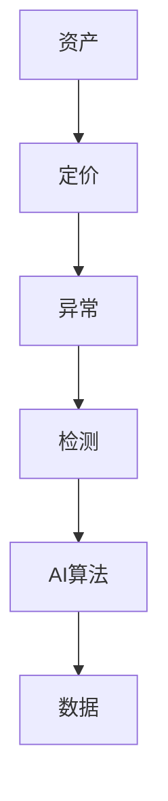
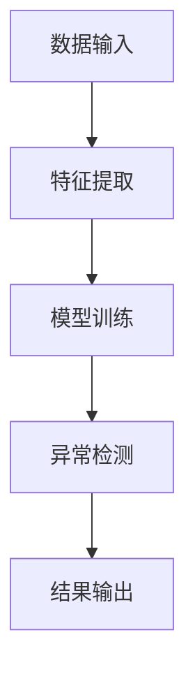
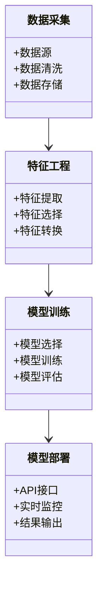
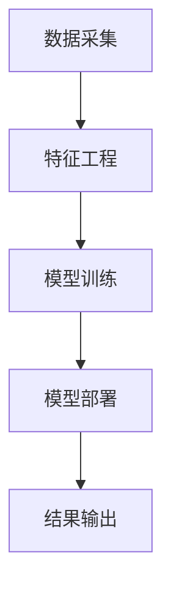
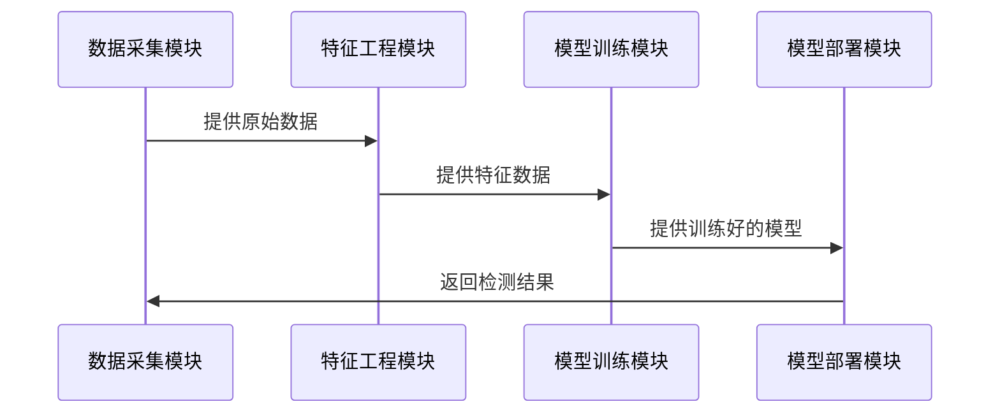

                 


# AI辅助的资产定价异常检测

## 关键词：AI, 资产定价, 异常检测, 机器学习, 深度学习, 金融分析

## 摘要：本文探讨了AI在资产定价异常检测中的应用，分析了其核心概念、算法原理、系统架构及实际案例。通过详细讲解Isolation Forest和Autoencoder等算法，结合系统设计和项目实战，展示了如何利用AI技术提升资产定价的准确性和异常检测的效率。本文还提供了丰富的代码示例和系统架构图，帮助读者全面理解AI在金融领域的应用。

---

## 第1章: 资产定价异常检测的背景与挑战

### 1.1 资产定价的基本概念

#### 1.1.1 资产定价的定义
资产定价是指对资产的价值进行评估和确定的过程，目的是为资产在市场上的交易提供合理的参考价格。资产可以是股票、债券、房地产等金融资产或实物资产。

#### 1.1.2 资产定价的理论基础
资产定价的理论基础主要包括现代资产组合理论（CAPM）、套利定价理论（APT）等。这些理论为资产定价提供了数学模型和方法。

#### 1.1.3 资产定价的核心要素
资产定价的核心要素包括资产的风险、收益、市场预期、流动性等。

### 1.2 异常检测的基本概念

#### 1.2.1 异常检测的定义
异常检测是指识别数据中偏离预期模式或行为的过程。在金融领域，异常检测常用于识别市场操纵、欺诈交易等行为。

#### 1.2.2 异常检测的分类
异常检测可以分为基于统计的方法、基于机器学习的方法和基于深度学习的方法。

#### 1.2.3 异常检测的应用场景
异常检测在金融领域的应用场景包括股价异常波动检测、交易量异常检测、市场操纵识别等。

### 1.3 AI在资产定价异常检测中的作用

#### 1.3.1 AI技术在金融领域的应用
AI技术在金融领域的应用包括股票预测、风险评估、欺诈检测等。

#### 1.3.2 AI在资产定价中的优势
AI在资产定价中的优势包括高精度、自动化、实时性等。

#### 1.3.3 AI在异常检测中的独特价值
AI能够通过大数据分析和复杂模型发现隐藏的模式，从而提高异常检测的准确性和效率。

### 1.4 本章小结
本章介绍了资产定价和异常检测的基本概念，并阐述了AI在资产定价异常检测中的作用和优势。

---

## 第2章: 资产定价异常检测的核心概念与联系

### 2.1 资产定价与异常检测的关系

#### 2.1.1 资产定价与异常检测的相互作用
资产定价异常检测通过识别价格偏离正常波动的情况，帮助投资者和监管机构及时发现潜在风险。

#### 2.1.2 异常检测在资产定价中的应用
异常检测可以用于识别市场操纵、突发事件对资产价格的影响等。

#### 2.1.3 资产定价异常检测的核心要素
资产定价异常检测的核心要素包括价格波动、交易量、市场情绪等。

### 2.2 资产定价异常检测的数学模型

#### 2.2.1 资产定价模型的分类
资产定价模型主要包括均值-方差模型、CAPM、APT等。

#### 2.2.2 异常检测模型的分类
异常检测模型主要包括基于统计的模型（如Z-score）、基于机器学习的模型（如随机森林）和基于深度学习的模型（如LSTM）。

#### 2.2.3 资产定价异常检测的数学框架
资产定价异常检测的数学框架可以表示为：
$$
\text{异常检测} = f(\text{价格}, \text{交易量}, \text{市场情绪})
$$
其中，$f$是一个非线性函数，用于判断价格是否偏离正常范围。

### 2.3 资产定价异常检测的实体关系图



### 2.4 本章小结
本章详细阐述了资产定价异常检测的核心概念，并通过数学模型和实体关系图展示了各要素之间的联系。

---

## 第3章: AI辅助资产定价异常检测的算法原理

### 3.1 常见的资产定价异常检测算法

#### 3.1.1 基于统计的异常检测算法
基于统计的异常检测算法包括Z-score、概率密度函数等。

#### 3.1.2 基于机器学习的异常检测算法
基于机器学习的异常检测算法包括随机森林、孤立林（Isolation Forest）等。

#### 3.1.3 基于深度学习的异常检测算法
基于深度学习的异常检测算法包括自动编码器（Autoencoder）、LSTM等。

### 3.2 基于Isolation Forest的异常检测算法

#### 3.2.1 Isolation Forest算法原理
Isolation Forest是一种基于树结构的异常检测算法，通过构建隔离树将数据点隔离出来，从而判断其是否为异常点。

#### 3.2.2 Isolation Forest算法的实现
以下是Isolation Forest算法的Python实现示例：

```python
from sklearn.ensemble import IsolationForest
import numpy as np

# 生成数据
X = np.random.randn(100, 2)
outliers = np.random.uniform(low=-4, high=4, size=(10, 2))
X = np.vstack([X, outliers])

# 训练模型
model = IsolationForest(contamination=0.1)
model.fit(X)

# 预测异常点
y_pred = model.predict(X)
print(y_pred)
```

#### 3.2.3 Isolation Forest算法的优缺点
Isolation Forest算法的优点包括计算效率高、适用于高维数据等。缺点包括对异常点的标记不够精确等。

### 3.3 基于Autoencoder的异常检测算法

#### 3.3.1 Autoencoder算法原理
Autoencoder是一种基于神经网络的异常检测算法，通过重建输入数据来发现异常点。

#### 3.3.2 Autoencoder算法的实现
以下是Autoencoder算法的Python实现示例：

```python
import tensorflow as tf
from tensorflow.keras import layers

# 定义模型
model = tf.keras.Sequential()
model.add(layers.Dense(32, activation='relu', input_shape=(100,)))
model.add(layers.Dense(16, activation='relu'))
model.add(layers.Dense(32, activation='relu'))
model.add(layers.Dense(100, activation='sigmoid'))

# 编译模型
model.compile(optimizer='adam', loss='binary_crossentropy')

# 训练模型
model.fit(X_train, y_train, epochs=10, batch_size=32)
```

#### 3.3.3 Autoencoder算法的优缺点
Autoencoder算法的优点包括能够捕捉数据的高维特征、适用于复杂数据等。缺点包括训练时间较长等。

### 3.4 算法流程图



### 3.5 本章小结
本章详细介绍了几种常用的资产定价异常检测算法，并通过代码示例展示了它们的实现过程。

---

## 第4章: 资产定价异常检测的系统分析与架构设计

### 4.1 问题场景介绍
本章以一个典型的资产定价异常检测系统为背景，描述了系统的功能需求和设计目标。

### 4.2 系统功能设计

#### 4.2.1 领域模型
以下是系统功能的类图：



### 4.3 系统架构设计

#### 4.3.1 系统架构图
以下是系统的架构图：



### 4.4 系统接口设计
系统接口包括数据接口、模型接口和结果接口。数据接口用于获取原始数据，模型接口用于调用检测模型，结果接口用于输出检测结果。

### 4.5 系统交互流程图



### 4.6 本章小结
本章详细描述了资产定价异常检测系统的功能需求、架构设计和交互流程。

---

## 第5章: 资产定价异常检测的项目实战

### 5.1 环境安装
需要安装的环境包括Python、TensorFlow、Scikit-learn等。

### 5.2 系统核心实现源代码

#### 5.2.1 数据采集与预处理
```python
import pandas as pd
import numpy as np

# 数据采集
df = pd.read_csv('data.csv')

# 数据清洗
df.dropna(inplace=True)
df = df[~df.isin([np.nan, np.inf, -np.inf]).any(axis=1)]
```

#### 5.2.2 特征工程
```python
from sklearn.preprocessing import StandardScaler

# 特征提取
features = df[['open', 'high', 'low', 'close', 'volume']]

# 特征标准化
scaler = StandardScaler()
features_scaled = scaler.fit_transform(features)
```

#### 5.2.3 模型训练
```python
from sklearn.ensemble import IsolationForest

# 训练模型
model = IsolationForest(contamination=0.1)
model.fit(features_scaled)

# 预测异常点
y_pred = model.predict(features_scaled)
```

#### 5.2.4 模型部署
```python
# 定义API接口
from flask import Flask, jsonify

app = Flask(__name__)

@app.route('/detect_anomaly', methods=['POST'])
def detect_anomaly():
    data = request.json['data']
    # 数据预处理
    features = pd.DataFrame(data)
    features_scaled = scaler.transform(features)
    # 模型预测
    y_pred = model.predict(features_scaled)
    return jsonify({'result': y_pred.tolist()})

if __name__ == '__main__':
    app.run(debug=True)
```

### 5.3 代码应用解读与分析
通过上述代码，我们可以实现一个简单的资产定价异常检测系统，能够实时接收数据并返回异常检测结果。

### 5.4 实际案例分析
以某股票的历史交易数据为例，展示如何利用上述系统进行异常检测。

### 5.5 本章小结
本章通过实际案例展示了如何利用AI技术实现资产定价异常检测系统的开发和部署。

---

## 第6章: 总结与最佳实践

### 6.1 本章小结
本章总结了全文的主要内容，并强调了AI在资产定价异常检测中的重要性和应用前景。

### 6.2 最佳实践

#### 6.2.1 小结
资产定价异常检测是金融领域的重要研究方向，AI技术为其提供了新的解决方案。

#### 6.2.2 注意事项
在实际应用中，需要注意数据的质量、模型的可解释性以及算法的实时性等问题。

#### 6.2.3 拓展阅读
建议读者进一步学习时间序列分析、强化学习等技术，以提升资产定价异常检测的准确性和效率。

---

## 作者：AI天才研究院/AI Genius Institute & 禅与计算机程序设计艺术 /Zen And The Art of Computer Programming

