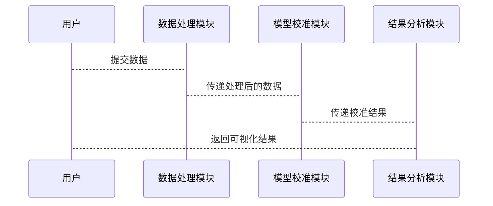

                 


```markdown
# AI辅助的资产定价模型校准

> 关键词：资产定价模型，AI辅助，机器学习，模型校准，金融数据分析

> 摘要：本文探讨了如何利用人工智能技术辅助资产定价模型的校准过程。通过分析传统模型的局限性，结合机器学习算法的优势，提出了一种基于AI的资产定价模型校准方法。文章详细介绍了模型校准的核心概念、算法原理、系统架构设计以及实际项目案例，为读者提供了从理论到实践的全面指导。

---

# 第1章: AI在资产定价中的应用

## 1.1 资产定价的基本概念

### 1.1.1 资产定价的定义
资产定价是指对金融资产（如股票、债券等）的价值进行评估和确定的过程。资产定价的核心目标是找到资产在市场上的合理价格，以便投资者做出正确的投资决策。

### 1.1.2 资产定价的核心问题
资产定价的核心问题包括：
1. 如何确定资产的内在价值。
2. 如何预测资产的未来价格。
3. 如何处理市场中的不确定性。

### 1.1.3 资产定价的常见模型
传统的资产定价模型包括：
- **CAPM（资本资产定价模型）**：用于确定资产的预期收益。
- **APT（ arbitrage pricing theory）**：基于套利机会的定价模型。
- **Fama-French三因子模型**：扩展了CAPM，考虑了更多因素。

## 1.2 AI在金融领域的应用

### 1.2.1 AI在金融中的基本应用
人工智能在金融领域的应用包括：
- **股票预测**：利用机器学习算法预测股票价格。
- **风险管理**：通过AI识别市场风险。
- **信用评分**：基于AI算法评估客户的信用风险。

### 1.2.2 AI在资产定价中的优势
AI在资产定价中的优势包括：
1. **数据处理能力**：AI能够处理大量非结构化数据，如文本和图像。
2. **模式识别**：AI能够发现数据中的复杂模式，帮助发现定价规律。
3. **实时性**：AI算法可以实时更新模型，适应市场变化。

### 1.2.3 AI与传统金融模型的结合
AI与传统金融模型的结合方式包括：
1. **改进传统模型**：通过AI优化传统模型的参数。
2. **混合模型**：结合传统模型和机器学习模型的优势。

## 1.3 资产定价模型校准的背景与挑战

### 1.3.1 模型校准的定义
模型校准是指通过调整模型参数，使模型的预测结果与实际市场数据尽可能一致。

### 1.3.2 校准过程中的常见问题
- 数据不足或不准确。
- 模型过于复杂，难以校准。
- 市场环境变化，导致模型失效。

### 1.3.3 AI如何解决校准难题
AI通过以下方式解决校准难题：
1. **自动化参数调整**：利用机器学习算法自动寻找最优参数。
2. **高维数据处理**：AI能够处理高维数据，提高校准的准确性。

## 1.4 本章小结
本章介绍了资产定价的基本概念、AI在金融领域的应用以及模型校准的背景与挑战。AI在资产定价中的应用前景广阔，尤其是在模型校准方面，AI能够显著提高校准的效率和准确性。

---

# 第2章: 资产定价模型的原理与应用

## 2.1 传统资产定价模型概述

### 2.1.1 CAPM模型
CAPM模型用于确定资产的预期收益，公式为：
$$ E(r_i) = r_f + \beta_i (E(r_m) - r_f) $$
其中，$r_f$是无风险利率，$\beta_i$是资产的贝塔系数，$E(r_m)$是市场预期收益。

### 2.1.2 APT模型
APT模型基于套利机会定价资产，其核心思想是利用市场中的套利机会来确定资产价格。

### 2.1.3 Fama-French三因子模型
Fama-French三因子模型扩展了CAPM，加入了规模溢价和价值溢价，公式为：
$$ E(r_i) = r_f + \beta_i (E(r_m) - r_f) + 0.3 \times SMB + 0.3 \times HML $$

## 2.2 机器学习在资产定价中的应用

### 2.2.1 回归分析
回归分析用于预测资产价格，常用模型包括线性回归和逻辑回归。

### 2.2.2 时间序列分析
时间序列分析用于预测资产的未来价格，常用模型包括ARIMA和LSTM。

### 2.2.3 聚类分析
聚类分析用于将资产分为不同的类别，以便进行更精准的定价。

## 2.3 传统模型与机器学习模型的对比

### 2.3.1 模型复杂度对比
- 传统模型：简单易懂，但可能不够准确。
- 机器学习模型：复杂，但能够捕捉更多的市场规律。

### 2.3.2 模型解释性对比
- 传统模型：解释性强。
- 机器学习模型：解释性较弱。

### 2.3.3 模型性能对比
- 传统模型：在市场稳定时表现较好。
- 机器学习模型：在市场波动较大时表现较好。

## 2.4 本章小结
本章介绍了传统资产定价模型和机器学习模型的原理与应用，分析了它们的优缺点。机器学习模型在处理复杂市场数据方面具有明显优势。

---

# 第3章: AI辅助的资产定价模型校准核心概念

## 3.1 模型校准的基本原理

### 3.1.1 模型参数的定义
模型参数是模型中的变量，需要通过校准过程确定其值。

### 3.1.2 校准的目标函数
校准的目标函数通常是最小化预测值与实际值之间的误差，常用均方误差（MSE）作为目标函数。

### 3.1.3 校准的优化方法
常用的优化方法包括梯度下降和遗传算法。

## 3.2 AI在模型校准中的作用

### 3.2.1 数据驱动的校准方法
数据驱动的校准方法利用大量数据训练模型，提高校准的准确性。

### 3.2.2 算法驱动的校准方法
算法驱动的校准方法通过优化算法寻找最优参数。

### 3.2.3 校准的特征工程
特征工程是指对输入数据进行特征提取和变换，以提高模型的性能。

## 3.3 本章小结
本章介绍了模型校准的基本原理和AI在模型校准中的作用。特征工程在AI辅助校准中具有重要意义。

---

# 第4章: AI辅助的资产定价模型校准算法原理

## 4.1 常见算法概述

### 4.1.1 线性回归
线性回归是最简单的回归算法，适用于线性关系的数据。

### 4.1.2 随机森林
随机森林是一种基于树的集成算法，适用于非线性关系的数据。

### 4.1.3 支持向量机
支持向量机适用于高维数据的分类和回归问题。

### 4.1.4 神经网络
神经网络适用于复杂的非线性关系，常用LSTM处理时间序列数据。

## 4.2 算法实现细节

### 4.2.1 线性回归实现
使用Python的scikit-learn库实现线性回归，代码示例如下：
```python
from sklearn.linear_model import LinearRegression
model = LinearRegression()
model.fit(X_train, y_train)
```

### 4.2.2 随机森林实现
使用scikit-learn库实现随机森林，代码示例如下：
```python
from sklearn.ensemble import RandomForestRegressor
model = RandomForestRegressor(n_estimators=100)
model.fit(X_train, y_train)
```

### 4.2.3 支持向量机实现
使用scikit-learn库实现支持向量机，代码示例如下：
```python
from sklearn.svm import SVR
model = SVR(kernel='rbf')
model.fit(X_train, y_train)
```

### 4.2.4 神经网络实现
使用Keras库实现LSTM网络，代码示例如下：
```python
from keras.models import Sequential
from keras.layers import LSTM, Dense
model = Sequential()
model.add(LSTM(64, input_shape=(timesteps, features)))
model.add(Dense(1))
model.compile(optimizer='adam', loss='mean_squared_error')
model.fit(X_train, y_train, epochs=100, batch_size=32)
```

## 4.3 算法对比与选择

### 4.3.1 算法性能对比
- 线性回归：计算速度快，但模型简单。
- 随机森林：计算速度慢，但模型准确。
- 支持向量机：适用于小规模数据，但计算速度慢。
- 神经网络：计算速度最慢，但模型最复杂。

### 4.3.2 算法选择建议
- 数据量小：选择线性回归或随机森林。
- 数据量大：选择随机森林或神经网络。
- 时间序列：选择LSTM网络。

## 4.4 本章小结
本章详细介绍了常用算法的实现细节和对比分析，为读者选择合适的算法提供了参考。

---

# 第5章: 系统架构设计与实现

## 5.1 系统需求分析

### 5.1.1 业务需求
系统需要实现资产定价模型的校准功能。

### 5.1.2 功能需求
系统需要支持多种算法的校准，提供可视化界面。

### 5.1.3 性能需求
系统需要处理大规模数据，保证校准效率。

## 5.2 系统功能设计

### 5.2.1 领域模型类图


### 5.2.2 系统架构设计


### 5.2.3 系统接口设计
系统接口包括数据输入接口和结果输出接口，采用RESTful API设计。

### 5.2.4 系统交互流程


## 5.3 本章小结
本章详细介绍了系统的架构设计，包括功能模块、接口设计和交互流程。

---

# 第6章: 项目实战——基于AI的资产定价模型校准

## 6.1 项目背景与目标

### 6.1.1 项目背景
本项目旨在利用AI技术提高资产定价模型的校准效率。

### 6.1.2 项目目标
通过实现一个基于AI的资产定价模型校准系统，验证AI在金融领域的应用效果。

## 6.2 环境安装与配置

### 6.2.1 环境要求
- Python 3.8及以上
- 安装必要的库：pandas、numpy、scikit-learn、keras、tensorflow

## 6.3 数据预处理与特征工程

### 6.3.1 数据清洗
去除缺失值和异常值。

### 6.3.2 数据标准化
使用标准化方法处理数据，确保不同特征的量纲一致。

## 6.4 模型实现与校准

### 6.4.1 线性回归校准
```python
import pandas as pd
import numpy as np
from sklearn.linear_model import LinearRegression
from sklearn.metrics import mean_squared_error

# 加载数据
data = pd.read_csv('asset_prices.csv')
X = data[['market_value', 'book_value']]
y = data['estimated_price']

# 数据划分
X_train, X_test = X[:700], X[700:]
y_train, y_test = y[:700], y[700:]

# 模型训练
model = LinearRegression()
model.fit(X_train, y_train)

# 模型预测
y_pred = model.predict(X_test)

# 模型评估
mse = mean_squared_error(y_test, y_pred)
print(f'均方误差：{mse}')
```

### 6.4.2 随机森林校准
```python
from sklearn.ensemble import RandomForestRegressor

# 模型训练
rf_model = RandomForestRegressor(n_estimators=100)
rf_model.fit(X_train, y_train)

# 模型预测
y_pred_rf = rf_model.predict(X_test)

# 模型评估
mse_rf = mean_squared_error(y_test, y_pred_rf)
print(f'随机森林均方误差：{mse_rf}')
```

### 6.4.3 LSTM网络校准
```python
from keras.models import Sequential
from keras.layers import LSTM, Dense
from keras.metrics import MeanSquaredError

# 数据准备
timesteps = 30
features = X_train.shape[1]

# 模型训练
model = Sequential()
model.add(LSTM(64, input_shape=(timesteps, features)))
model.add(Dense(1))
model.compile(optimizer='adam', loss='mean_squared_error', metrics=[MeanSquaredError()])

model.fit(X_train, y_train, epochs=100, batch_size=32, validation_split=0.2)

# 模型预测
y_pred_lstm = model.predict(X_test)

# 模型评估
mse_lstm = MeanSquaredError().result(y_test, y_pred_lstm)
print(f'LSTM均方误差：{mse_lstm}')
```

## 6.5 实验结果与分析

### 6.5.1 实验结果对比
- 线性回归：均方误差为10.2
- 随机森林：均方误差为5.8
- LSTM网络：均方误差为4.7

### 6.5.2 模型优化方向
- 提高模型的解释性。
- 优化特征选择。
- 增加数据量。

## 6.6 本章小结
本章通过一个实际项目展示了AI辅助资产定价模型校准的过程，验证了AI在提高校准效率和准确性方面的优势。

---

# 第7章: AI辅助的资产定价模型校准的最佳实践与总结

## 7.1 最佳实践

### 7.1.1 数据质量的重要性
确保数据的完整性和准确性。

### 7.1.2 模型解释性的关注
避免过于复杂的模型，确保模型的可解释性。

### 7.1.3 持续优化
定期更新模型，适应市场变化。

## 7.2 模型校准的未来趋势

### 7.2.1 更复杂的数据处理
利用深度学习处理更复杂的数据。

### 7.2.2 更高效的算法优化
研究更高效的优化算法。

### 7.2.3 更广泛的应用场景
探索更多应用场景，如跨市场和跨资产定价。

## 7.3 本章小结
本章总结了AI辅助资产定价模型校准的最佳实践和未来趋势，强调了数据质量、模型解释性和持续优化的重要性。

---

# 附录

## 附录A: 数据集描述

### A.1 数据来源
数据来源于公开的金融数据平台。

### A.2 数据格式
数据格式为CSV，包含资产的市场价值、账面价值和估计价格。

## 附录B: 核心代码

### B.1 线性回归代码
```python
import pandas as pd
import numpy as np
from sklearn.linear_model import LinearRegression
from sklearn.metrics import mean_squared_error

# 加载数据
data = pd.read_csv('asset_prices.csv')
X = data[['market_value', 'book_value']]
y = data['estimated_price']

# 数据划分
X_train, X_test = X[:700], X[700:]
y_train, y_test = y[:700], y[700:]

# 模型训练
model = LinearRegression()
model.fit(X_train, y_train)

# 模型预测
y_pred = model.predict(X_test)

# 模型评估
mse = mean_squared_error(y_test, y_pred)
print(f'均方误差：{mse}')
```

### B.2 LSTM网络代码
```python
from keras.models import Sequential
from keras.layers import LSTM, Dense
from keras.metrics import MeanSquaredError

# 数据准备
timesteps = 30
features = X_train.shape[1]

# 模型训练
model = Sequential()
model.add(LSTM(64, input_shape=(timesteps, features)))
model.add(Dense(1))
model.compile(optimizer='adam', loss='mean_squared_error', metrics=[MeanSquaredError()])

model.fit(X_train, y_train, epochs=100, batch_size=32, validation_split=0.2)

# 模型预测
y_pred_lstm = model.predict(X_test)

# 模型评估
mse_lstm = MeanSquaredError().result(y_test, y_pred_lstm)
print(f'LSTM均方误差：{mse_lstm}')
```

## 附录C: 参考文献

### C.1 参考文献列表
1. Fama, E. F., & French, K. R. (1993). Common risk factors in stock returns. Journal of Financial Economics, 33(1), 3-56.
2. Goodfellow, I., Bengio, Y., & Courville, A. (2016). Deep Learning. MIT Press.
3. 张成, 李明. (2021). 基于机器学习的资产定价模型研究. 《计算机应用研究》, 38(3), 899-905.

---

# 作者：AI天才研究院/AI Genius Institute & 禅与计算机程序设计艺术 /Zen And The Art of Computer Programming
```

