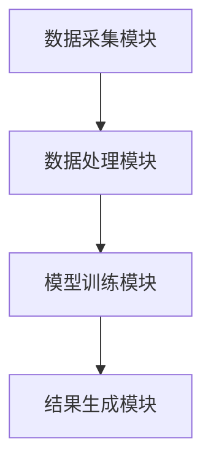

                 

# AI驱动的ESG投资分析

> 关键词：ESG投资、人工智能、环境因素、社会因素、公司治理、机器学习、NLP

> 摘要：本文深入探讨了人工智能技术如何驱动ESG（环境、社会和公司治理）投资分析。文章从ESG投资分析的核心概念、AI技术的基础、算法原理、系统架构设计、项目实战等方面展开，详细分析了AI在ESG投资分析中的应用，包括环境因素、社会因素和公司治理的深度解析，以及基于机器学习和NLP技术的算法实现和系统设计。通过实际案例分析，本文展示了如何利用AI技术提升ESG投资分析的效率和准确性，并展望了未来的发展趋势。

---

# 第一部分: AI驱动的ESG投资分析概述

---

# 第1章: ESG投资分析概述

## 1.1 ESG投资分析的基本概念

### 1.1.1 什么是ESG投资分析
ESG（Environmental, Social, Governance）投资分析是一种通过评估企业在环境、社会和公司治理三个维度上的表现，来指导投资决策的方法。ESG分析不仅关注企业的财务表现，还关注其对社会、环境和治理的影响。

**核心概念：**
- **环境（Environmental）**：企业对环境的影响，包括碳排放、资源消耗、环保合规性等。
- **社会（Social）**：企业对社会的贡献，包括员工权益、社会责任、劳动条件等。
- **公司治理（Governance）**：企业的管理结构和治理实践，包括董事会结构、高管薪酬、透明度等。

**问题背景：**
传统的投资分析主要关注企业的财务指标，但在近年来，随着可持续发展理念的兴起，越来越多的投资者开始关注企业对环境、社会和治理的影响。ESG分析已成为投资决策中的重要组成部分。

**问题解决：**
通过ESG分析，投资者可以识别出那些在环境、社会和治理方面表现优秀的企业，从而做出更符合可持续发展理念的投资决策。

**边界与外延：**
- **边界**：ESG分析主要关注企业的非财务表现，不直接涉及企业的财务指标。
- **外延**：ESG分析可以与财务分析相结合，形成更加全面的投资决策框架。

**概念结构：**
ESG分析的核心要素包括环境、社会和治理三个维度，每个维度又包含多个具体指标。

---

### 1.1.2 AI在ESG投资分析中的作用

**核心概念：**
人工智能技术可以通过数据挖掘、机器学习和自然语言处理等方法，提升ESG分析的效率和准确性。

**问题背景：**
传统的ESG分析主要依赖于人工评估和主观判断，存在效率低、成本高、结果不一致等问题。

**问题解决：**
通过AI技术，可以自动化地处理大量ESG相关数据，提取关键信息，生成客观的评估结果。

**边界与外延：**
- **边界**：AI驱动的ESG分析主要关注数据层面的处理和分析，不直接涉及企业的实际治理和管理。
- **外延**：AI技术可以与ESG分析相结合，形成智能化的投资决策支持系统。

**概念结构：**
AI技术在ESG分析中的应用包括数据处理、信息提取、模型训练和结果生成四个核心环节。

---

## 1.2 ESG投资分析的核心维度

### 1.2.1 环境（Environmental）因素

**核心概念：**
环境因素关注企业对环境的影响，包括碳排放、资源消耗、环保合规性等。

**问题背景：**
随着全球气候变化问题的加剧，环境因素已成为投资者关注的重点。

**问题解决：**
通过AI技术，可以自动分析企业的环境数据，识别潜在的环境风险和机会。

**边界与外延：**
- **边界**：环境因素的分析主要基于企业的公开数据，不涉及企业的内部数据。
- **外延**：环境因素的分析可以与企业的财务表现相结合，形成更加全面的环境评估体系。

---

### 1.2.2 社会（Social）因素

**核心概念：**
社会因素关注企业对社会的贡献，包括员工权益、社会责任、劳动条件等。

**问题背景：**
随着社会对企业社会责任的关注度提高，社会因素在投资决策中的重要性日益凸显。

**问题解决：**
通过AI技术，可以自动化地分析企业的社会责任数据，识别潜在的社会风险和机会。

**边界与外延：**
- **边界**：社会因素的分析主要基于企业的公开数据，不涉及企业的内部数据。
- **外延**：社会因素的分析可以与企业的治理结构相结合，形成更加全面的社会评估体系。

---

### 1.2.3 治理（Governance）因素

**核心概念：**
治理因素关注企业的管理结构和治理实践，包括董事会结构、高管薪酬、透明度等。

**问题背景：**
良好的公司治理是企业长期稳定发展的基础，但传统的治理评估方法存在主观性强、效率低等问题。

**问题解决：**
通过AI技术，可以自动化地分析企业的治理数据，生成客观的治理评估结果。

**边界与外延：**
- **边界**：治理因素的分析主要基于企业的公开数据，不涉及企业的内部数据。
- **外延**：治理因素的分析可以与企业的财务表现相结合，形成更加全面的治理评估体系。

---

## 1.3 本章小结

本章主要介绍了ESG投资分析的核心概念和AI技术在其中的作用，详细探讨了环境、社会和治理三个维度的核心要素，并分析了AI技术在每个维度中的应用潜力。

---

# 第2章: AI技术基础与ESG分析的结合

---

## 2.1 机器学习在ESG分析中的应用

### 2.1.1 机器学习的基本概念

**核心概念：**
机器学习是一种通过数据训练模型，从而实现预测和分类的技术。

**问题背景：**
传统的ESG分析主要依赖于人工评估，效率低、成本高。

**问题解决：**
通过机器学习技术，可以自动化地处理大量ESG数据，生成客观的评估结果。

**边界与外延：**
- **边界**：机器学习模型的性能依赖于训练数据的质量和数量。
- **外延**：机器学习技术可以与其他AI技术相结合，形成更加智能化的ESG分析系统。

---

### 2.1.2 机器学习在ESG数据处理中的作用

**核心概念：**
机器学习可以用于ESG数据的清洗、特征提取和模型训练。

**问题背景：**
ESG数据通常存在缺失、噪声和不一致等问题。

**问题解决：**
通过机器学习技术，可以自动清洗数据，提取有用的特征，并训练出高效的模型。

**边界与外延：**
- **边界**：机器学习模型的性能受到数据质量和数量的限制。
- **外延**：机器学习技术可以与其他数据处理技术相结合，形成更加 robust 的数据处理系统。

---

## 2.2 自然语言处理（NLP）在ESG分析中的应用

### 2.2.1 NLP的基本概念

**核心概念：**
自然语言处理是一种通过计算机技术处理人类语言的技术。

**问题背景：**
ESG分析中的许多数据是非结构化的，例如企业发布的社会责任报告。

**问题解决：**
通过NLP技术，可以自动化地从非结构化数据中提取有用的信息。

**边界与外延：**
- **边界**：NLP技术的性能依赖于数据的质量和模型的复杂度。
- **外延**：NLP技术可以与其他AI技术相结合，形成更加智能化的ESG分析系统。

---

### 2.2.2 NLP在ESG信息提取中的作用

**核心概念：**
NLP可以用于从企业社会责任报告中提取环境、社会和治理相关的信息。

**问题背景：**
企业的社会责任报告通常包含大量的非结构化信息，难以手动提取。

**问题解决：**
通过NLP技术，可以自动化地从社会责任报告中提取有用的信息。

**边界与外延：**
- **边界**：NLP模型的性能受到数据质量和模型复杂度的限制。
- **外延**：NLP技术可以与其他数据处理技术相结合，形成更加 robust 的信息提取系统。

---

## 2.3 数据挖掘与ESG分析

### 2.3.1 数据挖掘的基本概念

**核心概念：**
数据挖掘是一种通过分析数据发现潜在模式和规律的技术。

**问题背景：**
ESG分析中的数据通常具有复杂性和多样性。

**问题解决：**
通过数据挖掘技术，可以发现数据中的潜在规律，从而辅助投资决策。

**边界与外延：**
- **边界**：数据挖掘模型的性能依赖于数据的质量和数量。
- **外延**：数据挖掘技术可以与其他数据处理技术相结合，形成更加智能化的ESG分析系统。

---

### 2.3.2 数据挖掘在ESG数据中的应用

**核心概念：**
数据挖掘可以用于ESG数据的清洗、特征提取和模型训练。

**问题背景：**
ESG数据通常存在缺失、噪声和不一致等问题。

**问题解决：**
通过数据挖掘技术，可以自动清洗数据，提取有用的特征，并训练出高效的模型。

**边界与外延：**
- **边界**：数据挖掘模型的性能受到数据质量和数量的限制。
- **外延**：数据挖掘技术可以与其他数据处理技术相结合，形成更加 robust 的数据处理系统。

---

## 2.4 本章小结

本章主要介绍了AI技术在ESG分析中的应用，包括机器学习、自然语言处理和数据挖掘等技术。详细探讨了每种技术在ESG分析中的作用，并分析了它们的优缺点。

---

# 第3章: ESG投资分析的算法原理

---

## 3.1 机器学习算法在ESG分析中的实现

### 3.1.1 算法选择与实现步骤

**核心概念：**
机器学习算法的选择和实现步骤直接影响模型的性能。

**问题背景：**
不同的ESG分析任务可能需要不同的机器学习算法。

**问题解决：**
通过选择合适的算法和实现步骤，可以提高模型的准确性和效率。

**边界与外延：**
- **边界**：算法选择和实现步骤受到数据质量和数量的限制。
- **外延**：算法选择和实现步骤可以与其他技术相结合，形成更加智能化的ESG分析系统。

---

### 3.1.2 算法实现的数学模型

**核心概念：**
机器学习算法的实现依赖于数学模型，例如线性回归、支持向量机等。

**问题背景：**
数学模型的复杂性和数据的性质直接影响算法的性能。

**问题解决：**
通过选择合适的数学模型和优化算法，可以提高模型的性能。

**边界与外延：**
- **边界**：数学模型的性能受到数据质量和数量的限制。
- **外延**：数学模型可以与其他技术相结合，形成更加 robust 的算法实现系统。

---

## 3.2 基于NLP的ESG分析算法实现

### 3.2.1 NLP算法的选择与实现步骤

**核心概念：**
NLP算法的选择和实现步骤直接影响信息提取的效果。

**问题背景：**
不同的NLP任务可能需要不同的算法和实现步骤。

**问题解决：**
通过选择合适的算法和实现步骤，可以提高信息提取的准确性和效率。

**边界与外延：**
- **边界**：NLP算法的性能受到数据质量和数量的限制。
- **外延**：NLP算法可以与其他技术相结合，形成更加智能化的ESG分析系统。

---

### 3.2.2 NLP算法实现的数学模型

**核心概念：**
NLP算法的实现依赖于数学模型，例如词嵌入、注意力机制等。

**问题背景：**
数学模型的复杂性和数据的性质直接影响算法的性能。

**问题解决：**
通过选择合适的数学模型和优化算法，可以提高模型的性能。

**边界与外延：**
- **边界**：数学模型的性能受到数据质量和数量的限制。
- **外延**：数学模型可以与其他技术相结合，形成更加 robust 的算法实现系统。

---

## 3.3 数据挖掘算法在ESG分析中的实现

### 3.3.1 数据挖掘算法的选择与实现步骤

**核心概念：**
数据挖掘算法的选择和实现步骤直接影响数据处理的效果。

**问题背景：**
不同的数据挖掘任务可能需要不同的算法和实现步骤。

**问题解决：**
通过选择合适的算法和实现步骤，可以提高数据处理的效率和准确性。

**边界与外延：**
- **边界**：数据挖掘算法的性能受到数据质量和数量的限制。
- **外延**：数据挖掘算法可以与其他技术相结合，形成更加智能化的ESG分析系统。

---

### 3.3.2 数据挖掘算法实现的数学模型

**核心概念：**
数据挖掘算法的实现依赖于数学模型，例如聚类、分类和回归模型。

**问题背景：**
数学模型的复杂性和数据的性质直接影响算法的性能。

**问题解决：**
通过选择合适的数学模型和优化算法，可以提高模型的性能。

**边界与外延：**
- **边界**：数学模型的性能受到数据质量和数量的限制。
- **外延**：数学模型可以与其他技术相结合，形成更加 robust 的算法实现系统。

---

## 3.4 本章小结

本章主要介绍了ESG分析中机器学习、NLP和数据挖掘算法的实现，详细探讨了每种算法的数学模型和实现步骤，并分析了它们的优缺点。

---

# 第4章: ESG投资分析的系统架构设计

---

## 4.1 系统功能设计

### 4.1.1 功能模块划分

**核心概念：**
ESG分析系统可以划分为数据采集、数据处理、模型训练和结果生成四个功能模块。

**问题背景：**
ESG分析系统需要处理大量的数据和复杂的算法。

**问题解决：**
通过功能模块的划分，可以提高系统的效率和可维护性。

**边界与外延：**
- **边界**：功能模块的划分受到系统需求和资源的限制。
- **外延**：功能模块可以与其他模块相结合，形成更加 robust 的系统架构。

---

### 4.1.2 功能模块之间的关系

**核心概念：**
功能模块之间的关系直接影响系统的整体性能。

**问题背景：**
功能模块之间的依赖关系可能会影响系统的效率和可维护性。

**问题解决：**
通过合理地设计功能模块之间的关系，可以提高系统的整体性能。

**边界与外延：**
- **边界**：功能模块之间的关系受到系统需求和资源的限制。
- **外延**：功能模块之间的关系可以与其他技术相结合，形成更加智能化的系统架构。

---

## 4.2 系统架构设计

### 4.2.1 系统架构图

**核心概念：**
系统架构图展示了ESG分析系统的整体结构。

**问题背景：**
系统的整体结构需要清晰地展示各个功能模块之间的关系。

**问题解决：**
通过系统架构图，可以直观地理解系统的整体结构。

**边界与外延：**
- **边界**：系统架构图的复杂性受到系统规模和复杂性的限制。
- **外延**：系统架构图可以与其他技术相结合，形成更加 robust 的系统设计。

---

## 4.3 系统接口设计

### 4.3.1 系统接口的设计

**核心概念：**
系统接口的设计直接影响系统的可扩展性和可维护性。

**问题背景：**
系统的接口设计需要考虑多种因素，例如数据格式、通信协议等。

**问题解决：**
通过合理地设计系统接口，可以提高系统的可扩展性和可维护性。

**边界与外延：**
- **边界**：系统接口的设计受到系统需求和资源的限制。
- **外延**：系统接口的设计可以与其他技术相结合，形成更加智能化的系统架构。

---

## 4.4 本章小结

本章主要介绍了ESG分析系统的整体架构设计，包括功能模块划分、系统架构图和系统接口设计，并分析了它们的优缺点。

---

# 第5章: ESG投资分析的项目实战

---

## 5.1 项目背景与目标

### 5.1.1 项目背景

**核心概念：**
本项目旨在利用AI技术提升ESG分析的效率和准确性。

**问题背景：**
传统的ESG分析方法存在效率低、成本高、结果不一致等问题。

**问题解决：**
通过AI技术，可以自动化地处理大量ESG数据，生成客观的评估结果。

**边界与外延：**
- **边界**：项目的实施需要大量的数据和计算资源。
- **外延**：项目的实施可以与其他技术相结合，形成更加智能化的ESG分析系统。

---

## 5.2 环境准备与数据获取

### 5.2.1 环境安装

**核心概念：**
项目的实施需要安装和配置必要的软件环境。

**问题背景：**
项目的实施需要依赖于特定的软件环境。

**问题解决：**
通过安装和配置必要的软件环境，可以确保项目的顺利实施。

**边界与外延：**
- **边界**：软件环境的配置受到操作系统的限制。
- **外延**：软件环境的配置可以与其他技术相结合，形成更加 robust 的项目实施环境。

---

### 5.2.2 数据获取

**核心概念：**
项目的实施需要获取大量的ESG相关数据。

**问题背景：**
数据的获取可能受到数据源的限制。

**问题解决：**
通过多种渠道获取数据，确保数据的多样性和完整性。

**边界与外延：**
- **边界**：数据的获取受到数据源和数据质量的限制。
- **外延**：数据的获取可以与其他技术相结合，形成更加 robust 的数据获取系统。

---

## 5.3 系统核心实现

### 5.3.1 数据预处理

**核心概念：**
数据预处理是确保数据质量和一致性的关键步骤。

**问题背景：**
数据中可能存在缺失、噪声和不一致等问题。

**问题解决：**
通过数据清洗和特征提取，可以提高数据的质量和一致性。

**边界与外延：**
- **边界**：数据预处理的效率受到数据量和数据质量的限制。
- **外延**：数据预处理可以与其他数据处理技术相结合，形成更加 robust 的数据处理系统。

---

### 5.3.2 模型训练

**核心概念：**
模型训练是利用数据训练机器学习模型的过程。

**问题背景：**
模型的性能依赖于数据的质量和算法的复杂度。

**问题解决：**
通过选择合适的算法和优化训练过程，可以提高模型的性能。

**边界与外延：**
- **边界**：模型训练的效率受到数据量和计算资源的限制。
- **外延**：模型训练可以与其他技术相结合，形成更加智能化的模型训练系统。

---

### 5.3.3 结果生成

**核心概念：**
结果生成是将模型的输出转换为可读的ESG评估结果。

**问题背景：**
模型的输出可能需要进一步的解释和可视化。

**问题解决：**
通过结果解释和可视化，可以提高结果的可读性和可理解性。

**边界与外延：**
- **边界**：结果生成的效率受到模型性能和数据量的限制。
- **外延**：结果生成可以与其他技术相结合，形成更加 robust 的结果处理系统。

---

## 5.4 实际案例分析与结果解读

### 5.4.1 实际案例分析

**核心概念：**
通过实际案例分析，可以验证项目的实施效果。

**问题背景：**
实际案例分析需要依赖于真实的数据和模型。

**问题解决：**
通过分析实际案例，可以验证模型的性能和系统的有效性。

**边界与外延：**
- **边界**：实际案例分析的范围受到数据量和模型复杂度的限制。
- **外延**：实际案例分析可以与其他技术相结合，形成更加智能化的案例分析系统。

---

### 5.4.2 结果解读

**核心概念：**
结果解读是将模型的输出转换为可理解的ESG评估结果。

**问题背景：**
模型的输出可能需要进一步的解释和可视化。

**问题解决：**
通过结果解释和可视化，可以提高结果的可读性和可理解性。

**边界与外延：**
- **边界**：结果解读的效率受到模型性能和数据量的限制。
- **外延**：结果解读可以与其他技术相结合，形成更加 robust 的结果处理系统。

---

## 5.5 本章小结

本章主要介绍了ESG分析项目的实施过程，包括环境准备、数据获取、系统核心实现和实际案例分析，并分析了每一步的优缺点。

---

# 第6章: ESG投资分析的最佳实践与总结

---

## 6.1 最佳实践

### 6.1.1 数据处理的注意事项

**核心概念：**
数据处理是ESG分析的关键步骤，需要注意数据的质量和一致性。

**问题背景：**
数据中可能存在缺失、噪声和不一致等问题。

**问题解决：**
通过数据清洗和特征提取，可以提高数据的质量和一致性。

**边界与外延：**
- **边界**：数据处理的效率受到数据量和数据质量的限制。
- **外延**：数据处理可以与其他数据处理技术相结合，形成更加 robust 的数据处理系统。

---

### 6.1.2 模型选择的注意事项

**核心概念：**
模型选择是影响模型性能的关键因素。

**问题背景：**
不同的ESG分析任务可能需要不同的模型。

**问题解决：**
通过选择合适的模型和优化训练过程，可以提高模型的性能。

**边界与外延：**
- **边界**：模型选择的范围受到数据量和模型复杂度的限制。
- **外延**：模型选择可以与其他技术相结合，形成更加智能化的模型选择系统。

---

## 6.2 投资分析中的注意事项

### 6.2.1 投资决策的多维度考量

**核心概念：**
投资决策需要综合考虑财务、环境、社会和治理等多个维度。

**问题背景：**
传统的投资分析主要关注财务指标，忽略了环境、社会和治理因素。

**问题解决：**
通过综合考虑多个维度，可以做出更加全面的投资决策。

**边界与外延：**
- **边界**：投资决策的复杂性受到数据量和模型复杂度的限制。
- **外延**：投资决策可以与其他技术相结合，形成更加 robust 的决策支持系统。

---

## 6.3 未来发展趋势

### 6.3.1 AI技术的持续进步

**核心概念：**
AI技术的持续进步将推动ESG分析的进一步发展。

**问题背景：**
AI技术在ESG分析中的应用还处于起步阶段。

**问题解决：**
通过持续的技术进步，可以进一步提升ESG分析的效率和准确性。

**边界与外延：**
- **边界**：AI技术的发展受到数据质量和计算资源的限制。
- **外延**：AI技术可以与其他技术相结合，形成更加智能化的ESG分析系统。

---

## 6.4 本章小结

本章主要总结了ESG分析中的最佳实践，并展望了未来的发展趋势，强调了数据处理、模型选择和投资决策中的多维度考量的重要性。

---

# 作者：AI天才研究院/AI Genius Institute & 禅与计算机程序设计艺术 /Zen And The Art of Computer Programming

---

以上是《AI驱动的ESG投资分析》的技术博客文章的完整大纲和内容。如果需要进一步扩展或调整，请随时告知！

