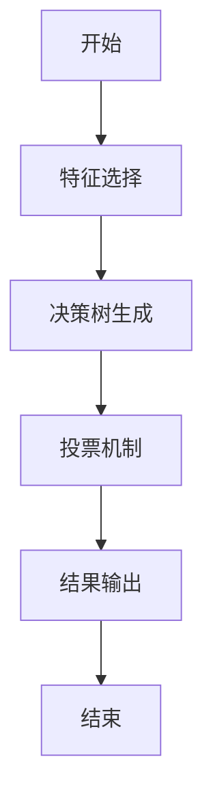
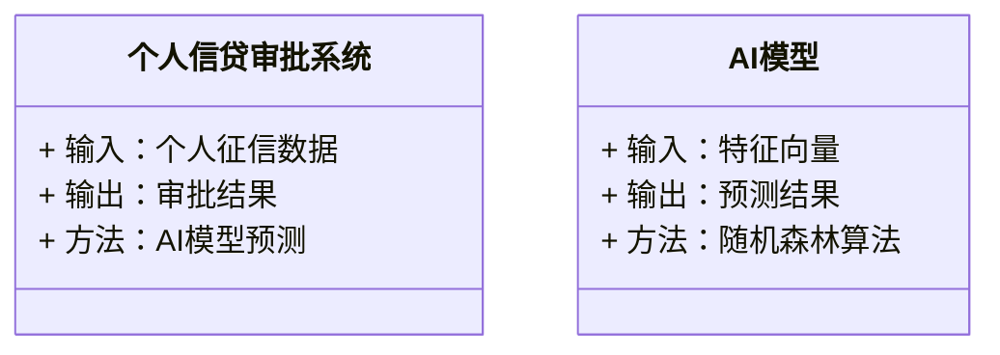
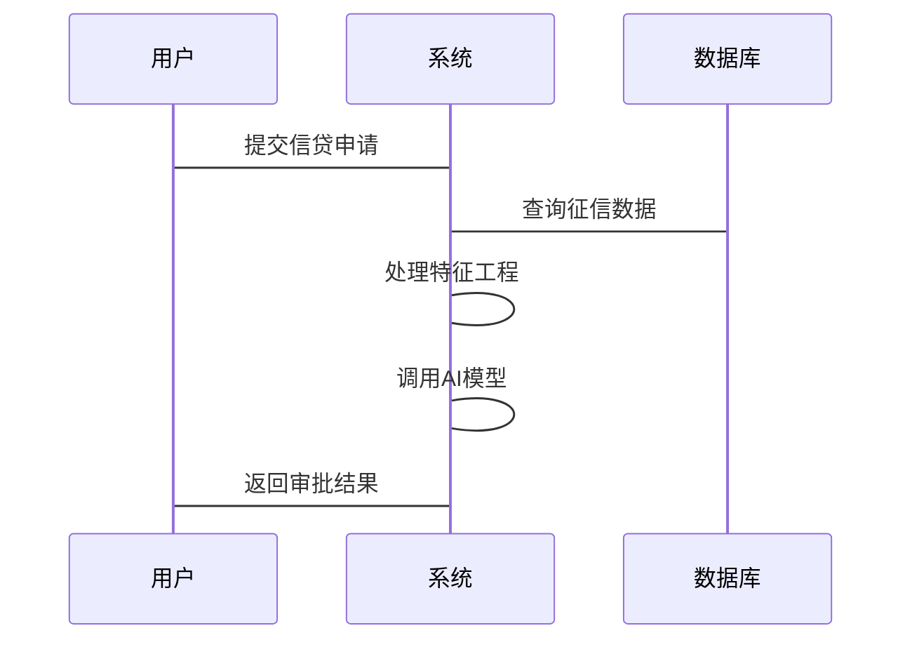

                 


# AI驱动的个人信贷审批系统设计

> 关键词：AI驱动，个人信贷，审批系统，机器学习，金融系统设计

> 摘要：本文详细探讨了AI驱动的个人信贷审批系统的设计与实现，分析了AI技术在金融领域的应用前景，系统地介绍了信贷审批的核心流程、AI算法原理、系统架构设计以及项目实现的细节。通过实际案例分析，本文为读者提供了一套基于AI技术的个人信贷审批系统的完整解决方案。

---

# 第一部分: AI驱动的个人信贷审批系统背景介绍

## 第1章: AI在金融领域的应用

### 1.1 AI在金融领域的核心应用

#### 1.1.1 从传统金融到智能金融的演变

- 传统金融的核心特征
- 智能金融的崛起
- AI技术在金融领域的渗透与应用

#### 1.1.2 AI在金融领域的核心应用场景

- 金融预测
- 风险控制
- 信贷审批
- 投资决策

#### 1.1.3 个人信贷审批的AI驱动趋势

- 传统信贷审批的痛点
- AI驱动信贷审批的优势
- 未来发展趋势

## 第2章: 个人信贷审批的背景与挑战

### 2.1 个人信贷审批的核心问题

#### 2.1.1 信贷审批的基本流程

- 贷前审查
- 风险评估
- 审批决策

#### 2.1.2 传统信贷审批的痛点

- 人工审查效率低
- 主观判断偏差
- 数据孤岛与信息不对称

#### 2.1.3 AI驱动的信贷审批优势

- 高效性
- 准确性
- 可扩展性

## 第3章: AI驱动的个人信贷审批系统定义

### 3.1 系统定义与核心目标

#### 3.1.1 系统定义

- 系统目标：基于AI技术实现个人信贷审批的自动化、智能化
- 系统输入：个人信用数据、财务数据、行为数据等
- 系统输出：审批结果、风险评分、建议方案

#### 3.1.2 系统的核心目标

- 提高审批效率
- 降低风险成本
- 实现个性化服务

#### 3.1.3 系统的边界与外延

- 边界：仅限于个人信贷审批，不包括企业信贷
- 外延：可扩展至其他金融业务领域

### 3.2 核心要素与组成结构

#### 3.2.1 数据输入与处理

- 数据来源：个人征信数据、银行流水、社交数据等
- 数据清洗与特征提取

#### 3.2.2 模型训练与部署

- 选择合适的AI算法（如随机森林、XGBoost等）
- 模型训练与调优
- 模型部署与应用

#### 3.2.3 系统输出与反馈

- 审批结果输出
- 风险评分
- 反馈机制与结果优化

---

# 第二部分: AI驱动的个人信贷审批系统核心概念与联系

## 第4章: AI技术与信贷审批流程的关系

### 4.1 AI技术的核心原理

#### 4.1.1 机器学习算法简介

- 监督学习
- 无监督学习
- 强化学习

#### 4.1.2 深度学习算法简介

- 神经网络
- 卷积神经网络（CNN）
- 循环神经网络（RNN）

#### 4.1.3 AI技术在信贷审批中的应用

- 风险评估
- 信用评分
- 反欺诈检测

### 4.2 信贷审批流程的系统化分析

#### 4.2.1 信贷审批的标准化流程

- 贷前审查
- 风险评估
- 审批决策

#### 4.2.2 AI技术如何优化信贷审批流程

- 数据驱动的自动化审查
- AI辅助的决策支持
- 智能监控与反馈

#### 4.2.3 信贷审批流程的系统架构

- 数据层
- 模型层
- 业务逻辑层
- 接口层

---

# 第三部分: AI驱动的个人信贷审批系统算法原理讲解

## 第5章: 算法原理与实现

### 5.1 随机森林算法原理

#### 5.1.1 算法概述

- 随机森林是一种基于决策树的集成学习算法
- 通过投票机制进行分类
- 适合处理高维数据

#### 5.1.2 算法流程图



#### 5.1.3 算法实现

```python
from sklearn.ensemble import RandomForestClassifier
import pandas as pd

# 加载数据
data = pd.read_csv('credit_data.csv')
X = data.drop('target', axis=1)
y = data['target']

# 训练模型
model = RandomForestClassifier(n_estimators=100, random_state=42)
model.fit(X, y)

# 预测
 predictions = model.predict(X)
```

#### 5.1.4 算法优势与不足

- 优势：高准确性、易于解释
- 不足：对特征重要性依赖性强

---

# 第四部分: AI驱动的个人信贷审批系统分析与设计

## 第6章: 系统分析与架构设计

### 6.1 项目背景与目标

- 项目目标：开发一个基于AI的个人信贷审批系统
- 项目范围：个人信贷审批
- 项目需求：自动化审批、风险控制、实时反馈

### 6.2 系统功能设计

#### 6.2.1 领域模型设计



### 6.3 系统架构设计

#### 6.3.1 分层架构

- 数据层：数据存储与访问
- 特征工程层：数据处理与特征提取
- 模型服务层：AI模型训练与预测
- 接口层：API接口设计

#### 6.3.2 接口设计



---

# 第五部分: 项目实战

## 第7章: 项目实现与案例分析

### 7.1 环境安装与配置

- 安装Python与必要的库（如scikit-learn、pandas、numpy）
- 安装Jupyter Notebook

### 7.2 系统核心代码实现

#### 7.2.1 数据预处理

```python
import pandas as pd
from sklearn.model_selection import train_test_split
from sklearn.preprocessing import StandardScaler

# 加载数据
data = pd.read_csv('credit_data.csv')

# 数据清洗
data = data.dropna()
data = pd.get_dummies(data)

# 划分训练集与测试集
X_train, X_test, y_train, y_test = train_test_split(data.drop('target', axis=1), data['target'], test_size=0.2)

# 特征标准化
scaler = StandardScaler()
X_train_scaled = scaler.fit_transform(X_train)
X_test_scaled = scaler.transform(X_test)
```

#### 7.2.2 模型训练与预测

```python
from sklearn.ensemble import RandomForestClassifier

# 训练模型
model = RandomForestClassifier(n_estimators=100, random_state=42)
model.fit(X_train_scaled, y_train)

# 预测
y_pred = model.predict(X_test_scaled)

# 评估
from sklearn.metrics import accuracy_score
print('准确率:', accuracy_score(y_test, y_pred))
```

### 7.3 案例分析与详细解读

- 数据预处理的具体步骤
- 模型调优的关键点
- 算法选择的依据
- 系统实现的细节

### 7.4 项目小结

- 项目实现的关键点
- 项目中的难点与解决方案
- 项目的优化方向

---

# 第六部分: 最佳实践与总结

## 第8章: 最佳实践

### 8.1 小结

- 本系统的核心价值
- 系统设计的关键点
- 系统实现的要点

### 8.2 注意事项

- 数据安全的重要性
- 模型的可解释性
- 系统的可扩展性

### 8.3 拓展阅读

- 推荐的书籍与资源
- 进一步学习的方向
- 未来的研究课题

---

作者：AI天才研究院 & 禅与计算机程序设计艺术

