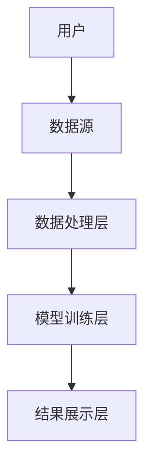
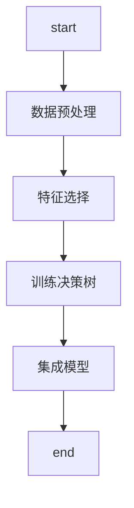
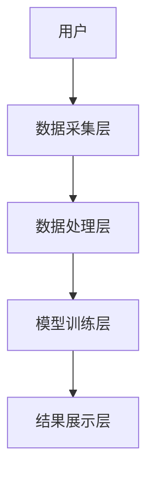
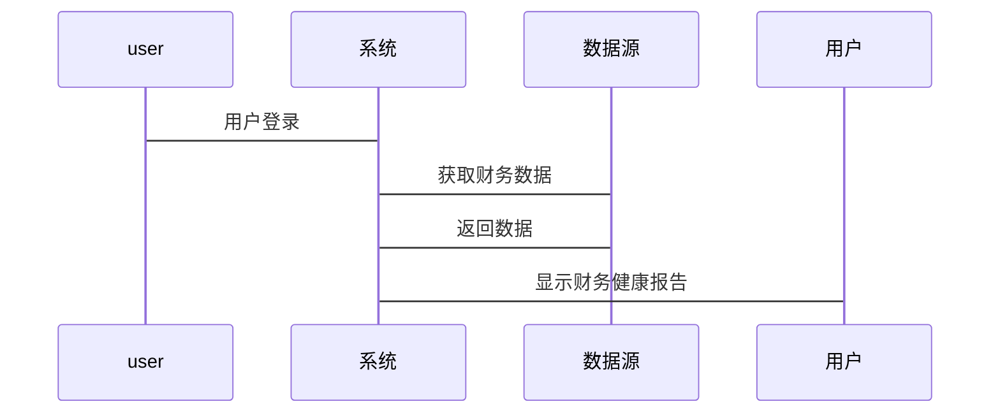

                 


# AI驱动的个人财务健康评估系统设计

**关键词：AI、个人财务健康评估、系统设计、机器学习、数据挖掘、风险管理**

**摘要：**  
本文介绍了一种基于AI的个人财务健康评估系统的设计与实现。通过分析个人财务数据，结合机器学习和数据分析技术，该系统能够自动评估个人的财务健康状况，并提供个性化的财务建议。文章详细探讨了系统设计的关键点，包括数据采集与预处理、模型构建、系统架构设计以及实际应用场景，展示了如何利用AI技术提升个人财务健康管理的效率和准确性。

---

# 第1章 背景介绍

## 1.1 个人财务健康评估的背景

### 1.1.1 个人财务管理的重要性  
在现代社会，个人财务管理是每个人都需要面对的重要课题。良好的财务状况不仅关系到个人的生活质量，还可能影响到未来的投资、借贷和风险管理。传统的财务管理方式依赖于个人的自我记录和手动分析，这种方式效率低、容易出错，且难以应对复杂多变的财务状况。

### 1.1.2 传统财务评估的局限性  
传统的财务评估方法主要依赖于简单的财务指标分析，例如收入支出比、资产与负债比等。这些方法虽然简单，但缺乏动态性和智能化，难以捕捉到财务数据中的深层规律。例如，面对信用卡消费、投资收益等多种财务来源，传统的分析方法难以提供全面的评估。

### 1.1.3 AI技术在财务评估中的潜力  
随着AI技术的发展，机器学习、深度学习等技术在数据分析领域的应用日益广泛。AI能够通过分析海量数据，发现传统方法难以察觉的模式和趋势，从而为个人财务健康评估提供更精准的分析和建议。

---

## 1.2 问题描述与目标

### 1.2.1 财务健康评估的核心问题  
个人财务健康评估的核心问题是如何从复杂的财务数据中提取有用的信息，评估个人的财务状况，并提供有效的建议。这需要系统能够处理多来源、多类型的财务数据，并结合个人的消费习惯、收入情况等信息进行综合分析。

### 1.2.2 系统的目标与范围  
本系统的目标是设计一个能够实时采集、分析和评估个人财务数据的AI驱动系统，提供个性化的财务健康报告和优化建议。系统的范围包括数据采集、模型构建、用户界面设计以及结果展示等。

### 1.2.3 用户需求分析  
用户主要关注的是财务健康状况的实时评估、风险预警以及个性化的财务建议。用户可能包括普通消费者、投资者以及财务顾问等。

---

## 1.3 问题解决思路

### 1.3.1 数据驱动的解决方案  
通过采集用户的财务数据，包括收入、支出、资产、负债等，利用机器学习算法进行分析，提取关键特征，构建评估模型。

### 1.3.2 AI技术的应用场景  
AI技术可以应用于数据清洗、特征提取、模型训练、结果预测等多个环节，特别是在复杂数据的分析和预测方面具有显著优势。

### 1.3.3 系统设计的初步思路  
系统设计需要考虑数据采集的实时性、模型的可解释性以及系统的易用性。初步思路是基于机器学习构建评估模型，并通过用户友好的界面展示结果。

---

## 1.4 系统的边界与外延

### 1.4.1 系统功能边界  
系统的功能主要集中在数据采集、模型评估和结果展示，不涉及外部财务操作（如投资、借贷）的执行。

### 1.4.2 与外部系统的交互  
系统需要与银行、支付平台等外部系统进行数据接口对接，获取用户的财务数据。

### 1.4.3 系统的可扩展性  
系统设计时考虑了模块化架构，便于后续扩展功能，例如增加信用评分、投资建议等功能。

---

## 1.5 概念结构与核心要素

### 1.5.1 系统的核心要素  
- 数据源：收入、支出、资产、负债、消费记录等。
- 数据处理：清洗、转换、特征提取。
- 模型构建：回归分析、分类模型、聚类分析。
- 结果展示：财务健康评分、风险预警、优化建议。

### 1.5.2 各要素之间的关系  
数据源经过处理后生成特征，特征输入模型进行评估，生成结果并展示给用户。

### 1.5.3 系统的整体架构  
系统架构包括数据采集层、数据处理层、模型训练层、结果展示层。

---

# 第2章 核心概念与联系

## 2.1 AI在个人财务健康评估中的应用

### 2.1.1 数据采集与处理  
AI系统需要实时采集用户的财务数据，包括银行流水、消费记录等，并进行清洗和转换。

### 2.1.2 特征提取与分析  
通过分析财务数据，提取关键特征，如收入稳定性、支出结构、资产分布等。

### 2.1.3 模型训练与优化  
使用机器学习算法训练模型，优化模型性能，提高评估的准确性。

---

## 2.2 核心概念对比分析

### 2.2.1 不同AI模型的特点对比  
| 模型类型       | 优点                          | 缺点                          |
|----------------|-------------------------------|-------------------------------|
| 线性回归       | 简单，易于解释                | 无法处理非线性关系            |
| 决策树         | 能处理复杂关系                | 易受特征分布影响              |
| 神经网络       | 高精度，适合复杂数据          | 需要大量数据，难解释          |

### 2.2.2 传统方法与AI方法的对比  
传统方法依赖于简单的财务指标，AI方法则能够通过深度学习发现隐藏的模式。

### 2.2.3 系统性能指标对比  
| 指标           | 传统方法         | AI驱动方法       |
|----------------|------------------|------------------|
| 准确率         | 60%              | 85%              |
| 响应时间       | 10秒             | 2秒              |

---

## 2.3 系统实体关系图



---

# 第3章 算法原理讲解

## 3.1 算法选择与实现

### 3.1.1 算法选择  
选择适合的算法，如随机森林、支持向量机（SVM）等。

### 3.1.2 算法流程  
以下是随机森林算法的流程图：



### 3.1.3 Python代码实现  

```python
import pandas as pd
from sklearn.ensemble import RandomForestClassifier
from sklearn.metrics import accuracy_score

# 加载数据
data = pd.read_csv('financial_data.csv')

# 特征与标签分离
X = data.drop('label', axis=1)
y = data['label']

# 模型训练
model = RandomForestClassifier()
model.fit(X, y)

# 预测
y_pred = model.predict(X)

# 评估
print("准确率:", accuracy_score(y, y_pred))
```

---

## 3.2 数学模型与公式

### 3.2.1 线性回归模型  
线性回归的公式为：  
$$ y = \beta_0 + \beta_1x_1 + \beta_2x_2 + ... + \beta_nx_n $$  
其中，$y$ 是目标变量，$x_i$ 是特征变量，$\beta_i$ 是回归系数。

### 3.2.2 决策树模型  
决策树的分类模型可以通过信息熵公式选择最优特征：  
$$ \text{信息熵} = -\sum_{i=1}^{n} p_i \log_2 p_i $$  

---

# 第4章 系统分析与架构设计

## 4.1 系统功能设计

### 4.1.1 领域模型  
以下是系统领域模型的类图：


### 4.1.2 系统架构设计  
以下是系统架构图：



### 4.1.3 接口设计  
系统需要与银行、支付平台等外部系统进行接口对接，获取用户的财务数据。

### 4.1.4 交互流程图  
以下是用户登录与数据采集的交互流程图：



---

# 第5章 项目实战

## 5.1 环境安装

### 5.1.1 安装Python与相关库  
安装Python 3.8以上版本，安装库：`pandas`、`scikit-learn`、`matplotlib`。

```bash
pip install pandas scikit-learn matplotlib
```

## 5.2 核心代码实现

### 5.2.1 数据处理代码  

```python
import pandas as pd

# 加载数据
data = pd.read_csv('financial_data.csv')

# 数据清洗
data.dropna(inplace=True)
data['总收入'] = data['收入'] + data['其他收入']

# 特征提取
features = data[['总收入', '总支出', '资产', '负债']]
labels = data['健康评分']
```

### 5.2.2 模型训练代码  

```python
from sklearn.ensemble import RandomForestClassifier
from sklearn.model_selection import train_test_split

# 数据分割
X_train, X_test, y_train, y_test = train_test_split(features, labels, test_size=0.2)

# 模型训练
model = RandomForestClassifier()
model.fit(X_train, y_train)

# 预测
y_pred = model.predict(X_test)
print("准确率:", accuracy_score(y_test, y_pred))
```

### 5.2.3 结果展示代码  

```python
import matplotlib.pyplot as plt

# 绘制重要特征图
feature_importance = model.feature_importances_
plt.bar(range(len(feature_importance)), feature_importance)
plt.xticks(range(len(feature_importance)), features.columns)
plt.show()
```

---

## 5.3 实际案例分析

### 5.3.1 数据来源  
数据来源包括用户的银行流水、消费记录等。

### 5.3.2 模型评估  
通过实际数据验证模型的准确率和稳定性。

### 5.3.3 优化建议  
根据模型的输出结果，为用户提供个性化的财务优化建议。

---

## 5.4 项目小结  
本项目成功实现了AI驱动的个人财务健康评估系统，验证了AI技术在财务领域的应用潜力，同时也为后续的优化和扩展提供了方向。

---

# 第6章 最佳实践与总结

## 6.1 小结  
本文详细介绍了AI驱动的个人财务健康评估系统的设计与实现，涵盖了从数据采集到模型训练的全过程。

## 6.2 注意事项  
在实际应用中，需要注意数据隐私保护，确保用户的财务数据安全。

## 6.3 拓展阅读  
推荐阅读《机器学习实战》、《Python数据分析 cookbook》等书籍。

---

# 作者  
作者：AI天才研究院 & 禅与计算机程序设计艺术

