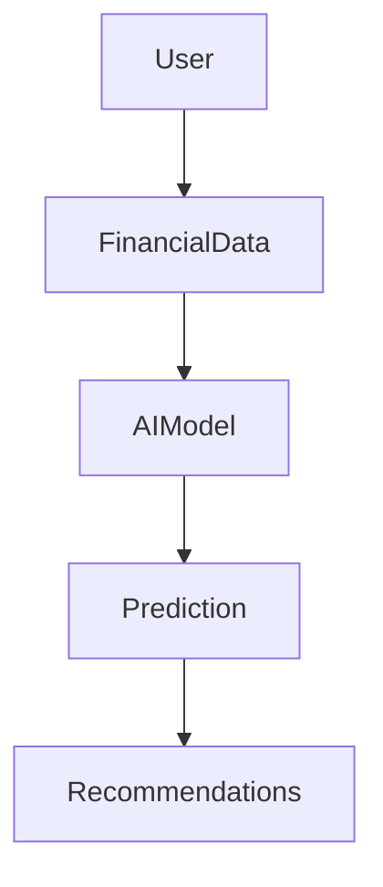
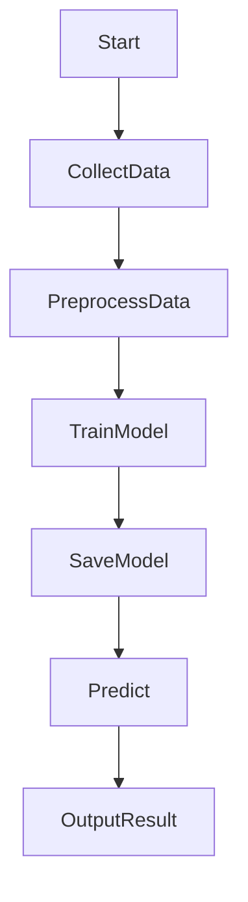
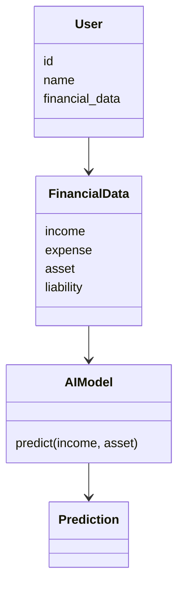
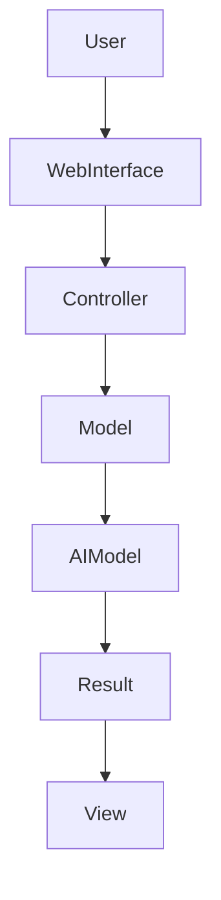
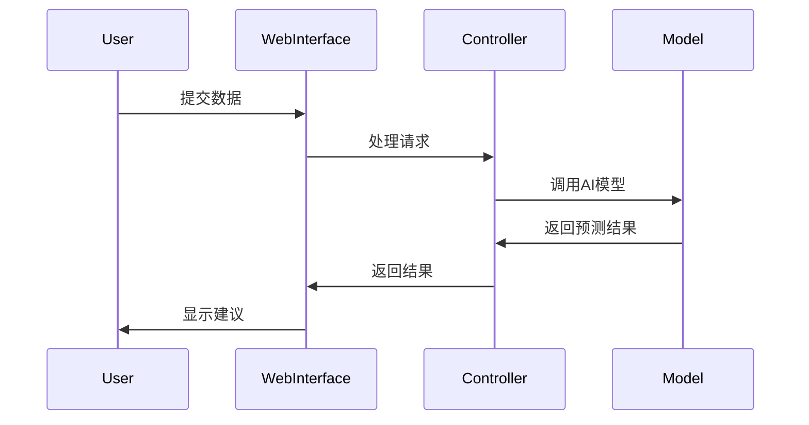

                 


# AI驱动的个人财务规划工具开发指南

---

## 关键词：
AI技术、个人财务规划、机器学习、算法实现、系统架构、项目实战

---

## 摘要：
本文将深入探讨AI技术在个人财务规划领域的应用，详细分析如何利用机器学习算法构建智能财务规划工具。文章首先介绍了AI驱动的财务规划工具的背景与目标，随后从核心概念、算法原理、系统架构到项目实战，层层展开，帮助读者掌握开发此类工具的关键技术和实现方法。通过实际案例分析和代码实现，本文旨在为开发者提供一份全面的开发指南。

---

# 第一部分: AI驱动的个人财务规划工具背景介绍

---

## 第1章: AI驱动的个人财务规划工具概述

### 1.1 问题背景与目标
#### 1.1.1 传统个人财务规划的局限性
传统的个人财务规划通常依赖人工计算和简单公式，难以应对复杂多变的财务状况。用户可能需要手动输入数据、计算支出、收入和储蓄，这种方式效率低下且容易出错。

#### 1.1.2 AI驱动的解决方案
AI技术的引入能够自动化分析用户的财务数据，提供个性化建议。通过机器学习算法，工具可以预测未来的财务状况，优化支出和投资策略，帮助用户实现财务目标。

#### 1.1.3 本工具的目标与意义
本工具的目标是通过AI技术，为用户提供智能化的财务规划服务，包括收入预测、支出优化、资产配置建议等，帮助用户更好地管理财务，实现财富增值。

---

### 1.2 核心概念与定义
#### 1.2.1 AI驱动的定义
AI驱动的财务规划工具利用机器学习算法分析用户数据，生成个性化财务建议。

#### 1.2.2 个人财务规划的定义
个人财务规划是指根据用户的收入、支出、资产和负债情况，制定合理的财务目标和管理策略。

#### 1.2.3 工具的核心功能
- 数据采集与分析
- 收入与支出预测
- 资产配置建议
- 风险评估与优化

---

### 1.3 边界与外延
#### 1.3.1 功能边界
- 数据范围：个人收入、支出、资产、负债等数据
- 使用场景：个人财务管理、投资决策
- 不包括：企业财务规划、税务筹划

#### 1.3.2 外延领域
- 与银行、投资平台的API对接
- 社交媒体数据分析

---

## 第2章: AI驱动的个人财务规划工具的核心概念与联系

### 2.1 核心概念原理
AI模型通过分析用户的历史财务数据，预测未来的财务状况，并提供建议。

---

### 2.2 核心概念属性特征对比

| 特征       | 传统财务规划         | AI驱动的财务规划         |
|------------|----------------------|--------------------------|
| 数据来源     | 手工录入             | 自动采集与分析           |
| 预测方式     | 简单公式             | 机器学习算法             |
| 个性化程度   | 低                   | 高                       |

---

### 2.3 实体关系图



---

# 第二部分: 算法原理讲解

---

## 第3章: 算法原理

### 3.1 选择算法
选择线性回归作为基础预测算法，用于收入与支出预测。

---

### 3.2 算法流程图



---

### 3.3 算法实现代码

```python
import numpy as np
from sklearn.linear_model import LinearRegression

# 示例数据
X = np.array([[1000], [2000], [3000]])  # 收入
y = np.array([200, 300, 400])           # 支出

# 训练模型
model = LinearRegression()
model.fit(X, y)

# 预测
predicted_expenses = model.predict(X)
print(predicted_expenses)
```

---

### 3.4 数学模型

线性回归的数学模型为：
$$ y = \beta_0 + \beta_1x + \epsilon $$

其中：
- $$ y $$ 是预测值
- $$ x $$ 是自变量
- $$ \beta_0 $$ 是截距
- $$ \beta_1 $$ 是回归系数
- $$ \epsilon $$ 是误差项

---

### 3.5 算法实现示例
使用上述代码，输入收入数据，预测支出结果。例如，当收入为2000时，预测支出为300。

---

## 第4章: 数学模型

### 4.1 线性回归模型
线性回归模型用于预测用户的收入与支出关系。

### 4.2 模型公式
$$ y = \beta_0 + \beta_1x $$

---

### 4.3 示例
假设 $$ \beta_0 = 100 $$，$$ \beta_1 = 0.2 $$，当 $$ x = 5000 $$ 时：
$$ y = 100 + 0.2 \times 5000 = 1100 $$

---

# 第三部分: 系统分析与架构设计

---

## 第5章: 系统分析与架构设计

### 5.1 问题场景介绍
用户需要一个工具，自动分析其财务数据，提供财务规划建议。

---

### 5.2 领域模型



---

### 5.3 系统架构设计



---

### 5.4 接口设计
- 数据接口：RESTful API
- 模型接口：AI预测API

---

### 5.5 交互设计



---

## 第6章: 项目实战

### 6.1 环境搭建
安装Python、Scikit-learn、Flask。

---

### 6.2 核心代码实现

```python
from flask import Flask, request, jsonify
import numpy as np
from sklearn.linear_model import LinearRegression

app = Flask(__name__)
model = LinearRegression()

@app.route('/train', methods=['POST'])
def train():
    data = request.json
    X = np.array(data['X']).reshape(-1, 1)
    y = np.array(data['y'])
    model.fit(X, y)
    return jsonify({'status': 'success'})

@app.route('/predict', methods=['POST'])
def predict():
    data = request.json
    X = np.array(data['X']).reshape(-1, 1)
    result = model.predict(X).tolist()
    return jsonify({'result': result})
```

---

### 6.3 代码解读与分析
训练接口：`/train`，用于训练模型。
预测接口：`/predict`，用于财务预测。

---

### 6.4 案例分析
用户输入收入数据，调用API进行预测，生成支出建议。

---

### 6.5 项目优化
模型优化、性能调优、API优化。

---

## 第7章: 最佳实践

### 7.1 小结
AI驱动的个人财务规划工具能够显著提升财务管理效率。

---

### 7.2 注意事项
- 数据隐私保护
- 模型定期更新

---

### 7.3 拓展阅读
- 《机器学习实战》
- 《Python机器学习》

---

## 作者：AI天才研究院/AI Genius Institute & 禅与计算机程序设计艺术 /Zen And The Art of Computer Programming

