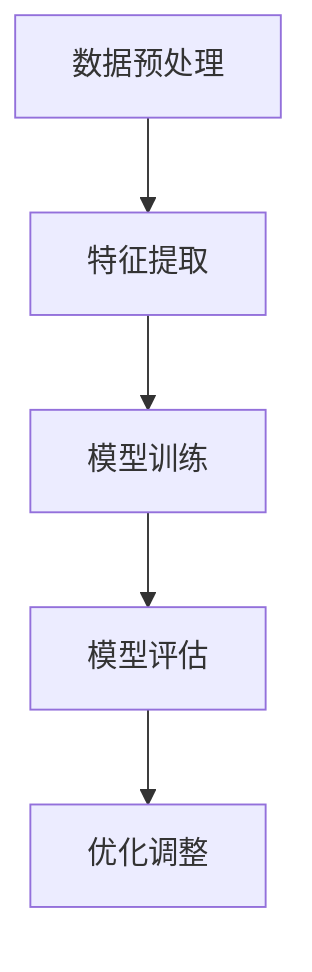
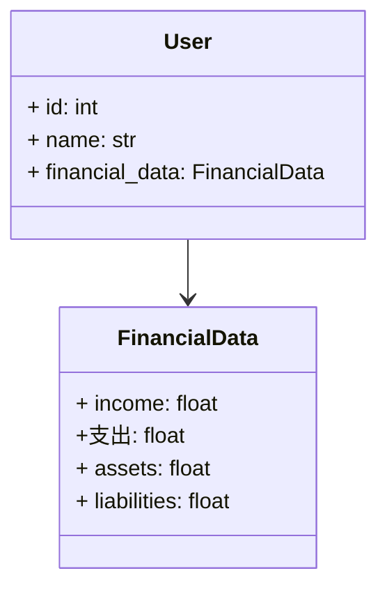
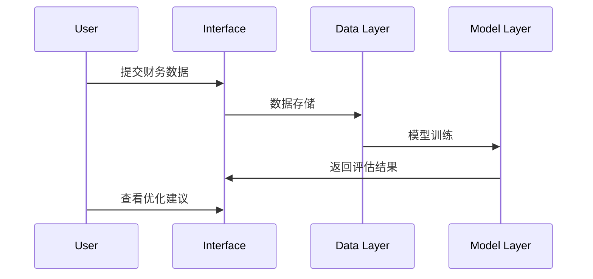

                 


# AI驱动的个人财务韧性评估与增强系统

## 关键词
AI, 财务韧性, 个人财务, 系统架构, 深度学习

## 摘要
本文详细探讨了如何利用人工智能技术构建个人财务韧性评估与增强系统。通过分析个人财务数据，结合深度学习算法，系统能够实时评估财务健康状况，并提供个性化的优化建议。文章从背景、核心概念、算法原理、系统架构到项目实战，全面阐述了系统的构建过程，并通过实际案例展示了其应用价值。

---

# 第1章 AI驱动的个人财务韧性评估与增强系统背景

## 1.1 个人财务韧性评估的重要性

### 1.1.1 个人财务韧性定义
个人财务韧性是指个人在面对经济波动、收入变化或突发事件时，能够维持财务稳定并实现长期目标的能力。它包括收入稳定性、储蓄水平、债务负担、应急资金储备等多个维度。

### 1.1.2 个人财务韧性评估的必要性
随着经济环境的不确定性增加，个人财务规划的重要性日益凸显。传统财务管理方式依赖人工分析，效率低且难以应对复杂场景。AI技术的应用为自动化、智能化的财务评估提供了可能。

### 1.1.3 AI技术在个人财务韧性评估中的作用
AI技术可以通过大数据分析和机器学习算法，快速识别财务风险，预测潜在问题，并提出优化建议。例如，通过自然语言处理（NLP）技术，系统可以分析用户的消费习惯，识别潜在的财务隐患。

## 1.2 AI驱动的个人财务系统发展现状

### 1.2.1 传统个人财务管理的局限性
传统财务管理主要依赖手工记录和简单的电子表格工具，难以处理复杂的数据分析和预测。用户缺乏专业的财务知识，容易忽视潜在风险。

### 1.2.2 AI技术在财务管理中的应用现状
目前，AI技术在财务管理领域的应用已取得显著进展。例如，智能记账应用通过OCR技术识别消费记录，生成详细的财务报表；智能投顾系统根据市场变化调整投资组合。

### 1.2.3 当前系统的主要挑战与不足
尽管AI技术在财务管理中表现出巨大潜力，但现有系统仍存在数据隐私保护不足、模型泛化能力有限、用户体验不佳等问题。

## 1.3 本书的目标与内容框架

### 1.3.1 本书的核心目标
本书旨在介绍如何利用AI技术构建个人财务韧性评估与增强系统，通过技术实现自动化、智能化的财务管理和优化。

### 1.3.2 本书的主要内容框架
本书将从背景、核心概念、算法原理、系统架构到项目实战，全面介绍系统的构建过程，并通过实际案例展示其应用价值。

### 1.3.3 本书的读者群体
本书适合对AI技术感兴趣且希望将其应用于财务管理的读者，包括程序员、数据科学家和财务从业者。

## 1.4 本章小结
本章从个人财务韧性的定义、AI技术的作用以及当前系统的挑战出发，为后续内容奠定了基础。

---

# 第2章 AI驱动的个人财务韧性评估系统的核心概念与联系

## 2.1 AI模型在个人财务分析中的应用

### 2.1.1 AI模型的基本原理
AI模型通过训练大量数据，学习用户的行为模式和财务特征，从而实现对财务状况的预测和评估。

### 2.1.2 AI模型在财务分析中的优势
AI模型可以快速处理大量数据，发现人类难以察觉的模式，提供精准的财务分析和预测。

### 2.1.3 AI模型在个人财务韧性评估中的具体应用
AI模型可以用于消费行为分析、债务风险评估、投资组合优化等领域。

## 2.2 AI驱动的财务韧性评估系统的核心要素

### 2.2.1 数据输入与处理
系统需要收集用户的收入、支出、资产、负债等数据，并进行清洗和预处理。

### 2.2.2 模型训练与优化
通过机器学习算法，对数据进行建模，训练出能够评估财务韧性的AI模型。

### 2.2.3 结果输出与反馈
系统将评估结果反馈给用户，并根据结果提供个性化的财务优化建议。

## 2.3 系统核心概念之间的关系

### 2.3.1 数据流与信息流的关系
数据流是信息流的基础，信息流指导数据流的方向和处理方式。

### 2.3.2 模型训练与实际应用的关系
模型训练是系统的核心，实际应用是模型价值的体现。

### 2.3.3 用户输入与系统反馈的关系
用户输入是系统的触发点，系统反馈是用户行动的指导。

## 2.4 本章小结
本章详细阐述了AI模型在个人财务分析中的应用，并分析了系统各核心要素之间的关系。

---

# 第3章 AI驱动的个人财务韧性评估系统的算法原理

## 3.1 基于AI的个人财务分析算法概述

### 3.1.1 传统算法与AI算法的对比
传统算法依赖规则和统计分析，AI算法则通过深度学习等技术，能够自动学习和优化。

### 3.1.2 基于深度学习的AI算法优势
深度学习模型具有强大的特征提取能力和非线性拟合能力，能够处理复杂的财务数据。

### 3.1.3 算法选择与优化策略
根据具体需求选择合适的算法，并通过超参数调优和模型融合提升性能。

## 3.2 算法实现的详细步骤

### 3.2.1 数据预处理与特征提取
对数据进行清洗、归一化处理，并提取关键特征。

### 3.2.2 模型训练与参数调整
使用训练数据训练模型，并通过验证集调整模型参数，防止过拟合。

### 3.2.3 模型评估与优化
通过测试集评估模型性能，并进行优化调整。

## 3.3 算法的数学模型与公式

### 3.3.1 模型的数学表达式
常用深度学习模型（如LSTM）的数学表达式如下：

$$
f(x) = \text{LSTM}(x)
$$

### 3.3.2 损失函数与优化目标
常用的损失函数为均方误差（MSE）：

$$
\text{Loss} = \frac{1}{N}\sum_{i=1}^{N}(y_i - \hat{y}_i)^2
$$

优化目标是通过梯度下降方法最小化损失函数。

### 3.3.3 算法流程图（使用mermaid）



## 3.4 算法的实现代码示例

### 3.4.1 数据读取与处理代码

```python
import pandas as pd

data = pd.read_csv('financial_data.csv')
data = data.dropna().astype(float)
```

### 3.4.2 模型训练代码

```python
from tensorflow.keras import layers

model = tf.keras.Sequential()
model.add(layers.LSTM(64, input_shape=(None, 1)))
model.add(layers.Dense(1))
model.compile(loss='mse', optimizer='adam')
model.fit(X_train, y_train, epochs=10, batch_size=32)
```

### 3.4.3 模型评估代码

```python
loss = model.evaluate(X_test, y_test)
print(f"Test loss: {loss}")
```

## 3.5 本章小结
本章详细讲解了AI模型在个人财务分析中的算法原理，并通过代码示例展示了实现过程。

---

# 第4章 AI驱动的个人财务韧性评估系统的系统分析与架构设计

## 4.1 问题场景介绍
本系统旨在帮助用户实时评估财务状况，并提供优化建议。

## 4.2 项目介绍

### 4.2.1 系统功能设计
系统主要功能包括数据采集、财务评估、优化建议和用户反馈。

### 4.2.2 系统架构设计
系统架构采用模块化设计，包括数据层、计算层、展示层。

## 4.3 系统功能设计（领域模型）



## 4.4 系统架构设计


## 4.5 系统接口设计
系统通过API接口与第三方数据源（如银行账户）对接，获取用户的财务数据。

## 4.6 系统交互设计



## 4.7 本章小结
本章详细介绍了系统的架构设计和功能模块，为后续的实现奠定了基础。

---

# 第5章 AI驱动的个人财务韧性评估系统的项目实战

## 5.1 环境安装

### 5.1.1 安装Python环境
使用Anaconda安装Python 3.8及以上版本。

### 5.1.2 安装依赖库
安装TensorFlow、Pandas、Mermaid等依赖库。

## 5.2 系统核心实现源代码

### 5.2.1 数据读取与预处理

```python
import pandas as pd

def load_data():
    data = pd.read_csv('financial_data.csv')
    data = data.dropna().astype(float)
    return data
```

### 5.2.2 模型训练

```python
import tensorflow as tf

def build_model(input_shape):
    model = tf.keras.Sequential()
    model.add(tf.keras.layers.LSTM(64, input_shape=input_shape))
    model.add(tf.keras.layers.Dense(1))
    return model

model = build_model((None, 1))
model.compile(loss='mse', optimizer='adam')
model.fit(X_train, y_train, epochs=10, batch_size=32)
```

### 5.2.3 模型评估

```python
loss = model.evaluate(X_test, y_test)
print(f"Test loss: {loss}")
```

## 5.3 代码应用解读与分析
通过上述代码，我们可以实现一个基本的AI驱动的个人财务评估系统。

## 5.4 实际案例分析

### 5.4.1 案例背景
用户A每月收入1万元，支出8000元，资产10万元，负债5万元。

### 5.4.2 系统评估结果
系统评估用户的财务韧性指数为75分，建议增加应急储备金。

## 5.5 详细讲解剖析
通过案例分析，我们可以看到系统如何根据用户数据提供个性化的优化建议。

## 5.6 本章小结
本章通过实际案例展示了系统的实现过程和应用价值。

---

# 第6章 系统优化与扩展

## 6.1 系统性能优化

### 6.1.1 模型调优
通过调整超参数和使用早停法防止过拟合。

### 6.1.2 数据处理优化
采用分布式训练和数据增强技术提升模型性能。

## 6.2 功能扩展

### 6.2.1 多语言支持
系统支持多种语言，以满足不同用户的需求。

### 6.2.2 社交功能
用户可以分享财务状况和优化建议，形成社区氛围。

## 6.3 本章小结
本章介绍了系统优化和功能扩展的方法，为系统的进一步发展提供了方向。

---

# 第7章 总结与展望

## 7.1 本书的核心内容回顾
本书系统介绍了AI驱动的个人财务韧性评估与增强系统的构建过程。

## 7.2 本书的主要收获与启发
读者可以通过本书掌握AI技术在财务管理中的应用方法。

## 7.3 未来研究与发展方向
未来可以进一步研究模型的可解释性，探索多模态数据的融合应用。

## 7.4 本章小结
本章总结了本书的核心内容，并展望了未来的研究方向。

---

# 作者：AI天才研究院/AI Genius Institute & 禅与计算机程序设计艺术 /Zen And The Art of Computer Programming

---

**本文通过系统介绍AI驱动的个人财务韧性评估与增强系统的构建过程，展示了AI技术在财务管理中的巨大潜力。希望读者能够通过本文，掌握相关技术，并将其应用于实际场景中。**

