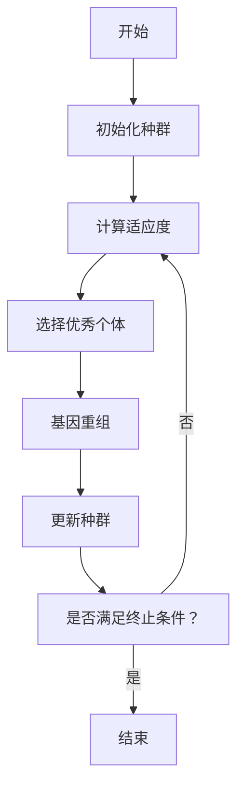
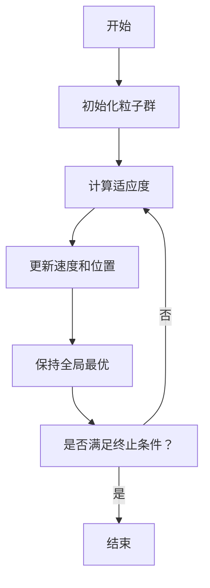
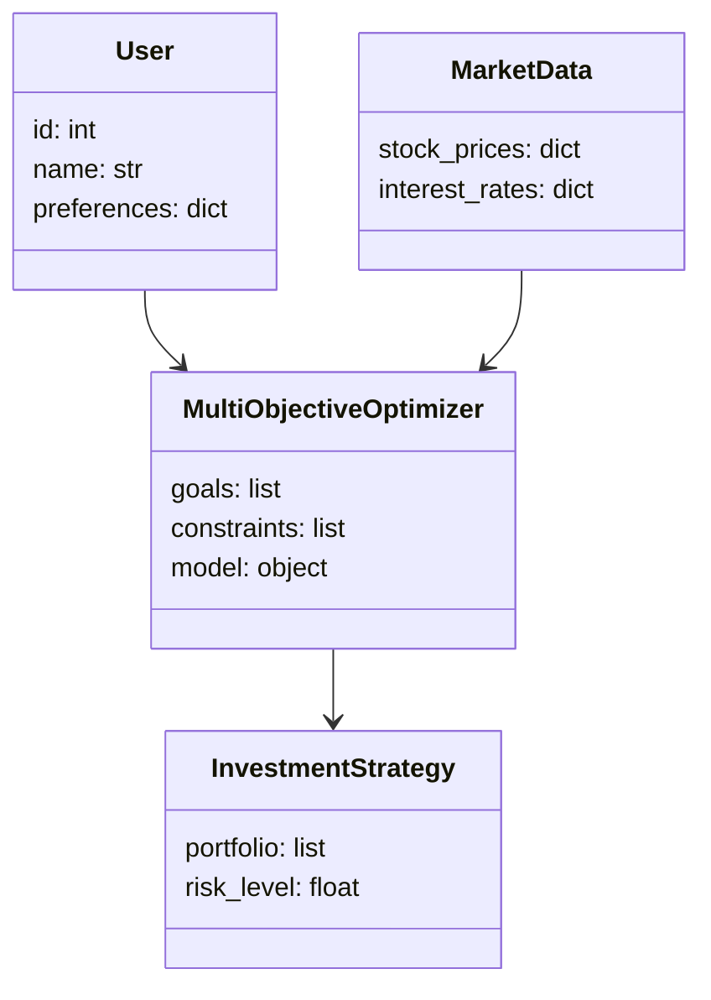
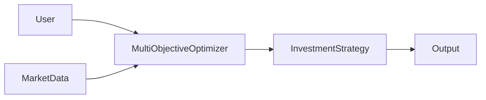
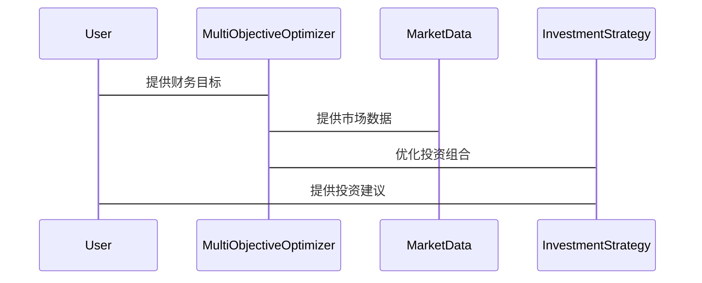

                 


# AI驱动的个人财富积累路径多目标优化器

## 关键词：AI驱动、财富积累、多目标优化、投资组合、风险管理、机器学习、个人财务规划

## 摘要：本文介绍了一种基于人工智能技术的个人财富积累路径多目标优化器。通过结合多目标优化算法和机器学习技术，该优化器能够帮助个人在复杂的财务环境中实现财富的最优积累。文章详细探讨了多目标优化的核心概念、AI驱动优化器的算法原理、系统架构设计以及实际应用案例，为读者提供了一套科学的财富管理方法。

---

# 第一部分: AI驱动的个人财富积累路径多目标优化器背景介绍

## 第1章: 个人财富积累的多目标优化问题

### 1.1 财富积累的核心问题

#### 1.1.1 财富积累的基本概念
财富积累是指通过合理配置资产、投资和风险管理，实现个人财富的长期增长和保值。财富积累的核心在于在不确定的市场环境中做出最优决策，以实现多个财务目标的平衡。

#### 1.1.2 多目标优化在财富积累中的重要性
传统的财富管理往往关注单一目标，如最大化收益或最小化风险。然而，个人财务规划通常涉及多个目标，例如追求高回报、保持流动性、降低风险等。多目标优化能够帮助在这些目标之间找到最佳平衡点，从而实现整体财务目标的最优解。

#### 1.1.3 传统财富管理的局限性
传统的财富管理方法通常依赖经验丰富的财务顾问，但这种方法难以应对复杂的多目标优化问题。此外，传统方法往往忽视了市场的动态变化和个体差异，导致优化结果不够精确。

### 1.2 AI驱动的财富管理新范式

#### 1.2.1 AI在财富管理中的应用现状
人工智能技术的快速发展为财富管理带来了新的可能性。通过机器学习算法，AI能够处理海量数据，发现潜在的市场规律，并提供个性化的投资建议。

#### 1.2.2 多目标优化在AI驱动财富管理中的作用
AI驱动的多目标优化器能够同时考虑多个财务目标，如收益、风险、流动性等，从而提供更加全面和个性化的财务规划方案。

#### 1.2.3 个人财富积累的AI驱动优化器的必要性
随着金融市场日益复杂化，个人需要更加智能化的工具来优化财富积累路径。AI驱动的多目标优化器能够帮助个人在复杂的市场环境中做出最优决策，实现财富的高效积累。

---

## 第2章: 多目标优化问题的背景与挑战

### 2.1 多目标优化的基本概念

#### 2.1.1 优化问题的分类
优化问题可以分为单目标优化和多目标优化。单目标优化关注单一目标的最优解，而多目标优化则需要在多个目标之间找到平衡点。

#### 2.1.2 多目标优化的核心特点
多目标优化的核心特点在于多个目标之间的冲突与协调。优化过程中需要找到帕累托最优解，即无法在不损害一个目标的情况下进一步优化另一个目标。

#### 2.1.3 多目标优化与单目标优化的对比
单目标优化关注单一目标的最优解，而多目标优化则需要在多个目标之间进行权衡。多目标优化的结果通常是一个 Pareto 最优解集，而不是一个唯一的最优解。

### 2.2 财富积累中的多目标优化挑战

#### 2.2.1 财富积累目标的多样性
个人财富积累的目标多种多样，例如追求高收益、保持资产流动性、降低投资风险等。这些目标之间往往存在冲突，需要通过优化算法找到平衡点。

#### 2.2.2 目标之间的冲突与协调
在多目标优化中，目标之间的冲突是常见的问题。例如，追求高收益可能意味着更高的风险，而降低风险可能需要牺牲部分收益。优化器需要通过算法在这些目标之间找到最佳的协调点。

#### 2.2.3 数据驱动的优化难点
财富积累的优化需要依赖大量数据，包括市场数据、个人财务数据等。如何有效地利用这些数据，构建准确的优化模型，是数据驱动优化的一个重要挑战。

---

# 第二部分: AI驱动的多目标优化器核心概念与联系

## 第3章: 多目标优化器的核心概念

### 3.1 多目标优化器的定义与特点

#### 3.1.1 多目标优化器的定义
多目标优化器是一种能够同时优化多个目标的算法工具。它通过寻找 Pareto 最优解，帮助决策者在多个目标之间找到最佳平衡点。

#### 3.1.2 多目标优化器的核心特点
- **多目标性**：同时优化多个目标。
- **Pareto 优化**：寻找 Pareto 最优解。
- **动态调整**：能够根据市场变化动态调整优化目标。

#### 3.1.3 多目标优化器与传统优化器的对比
传统的优化器通常关注单一目标，而多目标优化器能够在多个目标之间进行权衡，提供更加全面的优化结果。

### 3.2 AI驱动的多目标优化器的原理

#### 3.2.1 基于机器学习的优化器
基于机器学习的多目标优化器通过训练模型，学习市场规律和用户需求，提供个性化的优化方案。

#### 3.2.2 基于强化学习的优化器
强化学习优化器通过与市场的交互，不断调整策略，以实现多个目标的最优平衡。

#### 3.2.3 基于遗传算法的优化器
遗传算法是一种模拟自然选择过程的优化算法，适用于多目标优化问题。它能够通过基因重组和选择压力，找到 Pareto 最优解。

---

## 第4章: 多目标优化器的核心要素

### 4.1 优化目标的定义与建模

#### 4.1.1 财富积累目标的建模
财富积累目标可以包括收益最大化、风险最小化、流动性优化等。这些目标需要通过数学模型进行建模，以便优化器能够理解和处理。

#### 4.1.2 目标权重的动态调整
不同目标的重要性和权重可能随时间和市场变化而变化。优化器需要能够动态调整目标权重，以适应变化的市场环境。

#### 4.1.3 目标冲突的解决方案
在多目标优化中，目标之间可能存在冲突。优化器需要通过算法找到冲突的平衡点，确保多个目标的最优实现。

### 4.2 数据驱动的优化器设计

#### 4.2.1 数据收集与预处理
优化器需要收集大量的市场数据和用户数据，并进行预处理，以确保数据的准确性和一致性。

#### 4.2.2 数据特征的提取与选择
通过数据特征提取和选择，优化器能够识别出对目标优化最重要的特征，提高优化效率和准确性。

#### 4.2.3 数据驱动的优化模型构建
基于提取的特征，优化器构建数学模型，并通过算法求解，找到 Pareto 最优解。

---

# 第三部分: 多目标优化器的算法原理

## 第5章: 多目标优化算法原理

### 5.1 遗传算法

#### 5.1.1 遗传算法的基本原理
遗传算法是一种基于自然选择和基因重组的优化算法。它通过迭代过程，逐步优化解的质量。

#### 5.1.2 遗传算法的优化步骤
1. 初始化种群。
2. 计算适应度。
3. 选择优秀个体。
4. 进行基因重组。
5. 更新种群。
6. 重复迭代，直到满足终止条件。

#### 5.1.3 遗传算法在财富优化中的应用
遗传算法可以应用于投资组合优化，通过基因重组和选择压力，找到收益与风险的最佳平衡点。

#### 5.1.4 遗传算法的mermaid流程图


#### 5.1.5 遗传算法的Python代码示例
```python
import random

def fitness(individual):
    # 计算适应度函数，此处为简化示例
    return sum(individual)

def evolve_population(population, fitness_func):
    # 选择优秀个体
    population.sort(key=lambda x: -fitness_func(x))
    selected = population[:int(len(population)/2)]
    
    # 基因重组
    new_population = []
    for _ in range(len(population)):
        parent1 = random.choice(selected)
        parent2 = random.choice(selected)
        child = [p if random.random() < 0.5 else (1-p) for p in parent1]
        new_population.append(child)
    return new_population

# 初始化种群
population = [[random.random() for _ in range(10)] for _ in range(10)]
for _ in range(10):
    population = evolve_population(population, fitness)
```

### 5.2 粒子群优化算法

#### 5.2.1 粒子群优化算法的基本原理
粒子群优化算法是一种基于群体智能的优化算法。粒子在搜索空间中飞行，通过调整速度和位置，找到最优解。

#### 5.2.2 粒子群优化算法的优化步骤
1. 初始化粒子群。
2. 计算每个粒子的适应度。
3. 更新粒子的速度和位置。
4. 保持全局最优解。
5. 重复迭代，直到满足终止条件。

#### 5.2.3 粒子群优化算法在财富优化中的应用
粒子群优化算法可以应用于风险控制，通过优化算法找到风险最小化的同时，最大化收益。

#### 5.2.4 粒子群优化算法的mermaid流程图


#### 5.2.5 粒子群优化算法的Python代码示例
```python
import random

def fitness(individual):
    # 计算适应度函数，此处为简化示例
    return sum(individual)

def evolve_population(population, fitness_func):
    # 更新速度和位置
    for particle in population:
        # 假设 velocity 和 position 是粒子的状态
        particle['velocity'] = 0.5 * particle['velocity'] + 1 * (particle['position'] - fitness_func(particle['position']))
        particle['position'] = particle['position'] + particle['velocity']
    return population

# 初始化粒子群
particles = [{'position': [random.random() for _ in range(10)], 'velocity': [0]*10} for _ in range(10)]
for _ in range(10):
    particles = evolve_population(particles, fitness)
```

---

## 第6章: 基于机器学习的多目标优化算法

### 6.1 基于神经网络的多目标优化

#### 6.1.1 神经网络的基本原理
神经网络是一种机器学习模型，通过多层神经元模拟人脑的神经网络，能够学习复杂的非线性关系。

#### 6.1.2 神经网络在多目标优化中的应用
神经网络可以应用于投资组合优化，通过学习历史数据，预测未来的市场趋势，从而优化投资组合。

#### 6.1.3 基于神经网络的多目标优化算法的Python代码示例
```python
import numpy as np
import tensorflow as tf

# 定义神经网络模型
model = tf.keras.Sequential([
    tf.keras.layers.Dense(128, activation='relu'),
    tf.keras.layers.Dense(64, activation='relu'),
    tf.keras.layers.Dense(2, activation='linear')
])

# 定义损失函数
loss = tf.reduce_mean(tf.square(y_true - y_pred))

# 编译模型
model.compile(optimizer='adam', loss='mse')
```

---

# 第四部分: 系统分析与架构设计

## 第7章: 系统分析与架构设计方案

### 7.1 问题场景介绍

#### 7.1.1 优化目标
- 最大化投资收益
- 最小化投资风险
- 保持资产流动性

#### 7.1.2 用户需求
- 提供个性化的投资建议
- 实时监控市场变化
- 动态调整投资策略

### 7.2 系统功能设计

#### 7.2.1 领域模型mermaid类图


### 7.3 系统架构设计

#### 7.3.1 系统架构mermaid架构图


### 7.4 系统接口设计

#### 7.4.1 输入接口
- 用户输入：用户偏好、财务目标
- 市场数据输入：股票价格、利率等

#### 7.4.2 输出接口
- 投资组合建议
- 风险评估报告
- 实时市场监控

### 7.5 系统交互设计

#### 7.5.1 系统交互mermaid序列图


---

## 第8章: 系统功能设计

### 8.1 投资组合优化模块

#### 8.1.1 投资组合优化的实现
通过多目标优化算法，优化投资组合，实现收益与风险的平衡。

#### 8.1.2 风险管理模块
通过风险评估模型，识别和控制投资风险，确保资产安全。

### 8.2 用户交互模块

#### 8.2.1 用户需求分析
通过用户调研和数据分析，了解用户的投资偏好和风险承受能力。

#### 8.2.2 用户界面设计
设计友好的用户界面，方便用户输入需求和查看优化结果。

---

## 第9章: 系统架构设计

### 9.1 系统架构的实现

#### 9.1.1 系统模块划分
- 数据采集模块
- 数据处理模块
- 优化算法模块
- 用户交互模块

#### 9.1.2 模块之间的交互
通过模块化设计，确保系统各部分高效协作，实现优化目标。

### 9.2 系统架构的优化

#### 9.2.1 模块优化
通过优化算法和数据处理流程，提高系统的运行效率。

#### 9.2.2 系统扩展性设计
确保系统能够适应未来市场变化和用户需求的扩展。

---

# 第五部分: 项目实战

## 第10章: 项目实战

### 10.1 环境安装与配置

#### 10.1.1 安装必要的依赖
- Python
- NumPy
- Pandas
- Scikit-learn
- TensorFlow

#### 10.1.2 环境配置示例
```bash
pip install numpy pandas scikit-learn tensorflow
```

### 10.2 核心功能实现

#### 10.2.1 数据预处理
```python
import pandas as pd

data = pd.read_csv('market_data.csv')
data = data.dropna()
data = (data - data.mean()) / data.std()  # 标准化
```

#### 10.2.2 模型训练
```python
from sklearn.multioutput import MultiOutputRegressor
from sklearn.ensemble import GradientBoostingRegressor

model = MultiOutputRegressor(GradientBoostingRegressor())
model.fit(X_train, y_train)
```

#### 10.2.3 优化结果展示
```python
import matplotlib.pyplot as plt

plt.plot(y_pred, label='预测值')
plt.plot(y_test, label='实际值')
plt.legend()
plt.show()
```

### 10.3 项目总结

#### 10.3.1 项目小结
通过本项目，我们成功实现了AI驱动的多目标优化器，能够在复杂市场环境中优化投资组合，实现财富的高效积累。

#### 10.3.2 项目经验与教训
- 数据质量对优化结果影响重大，需要确保数据的准确性和完整性。
- 算法的选择需要根据具体问题进行调整，不能一味追求复杂性。

---

## 第11章: 实际案例分析

### 11.1 案例背景

#### 11.1.1 案例介绍
一位投资者希望通过优化器实现财富的长期增长，同时保持一定的流动性。

### 11.2 案例分析

#### 11.2.1 数据分析
通过分析历史市场数据和用户需求，构建优化模型。

#### 11.2.2 优化过程
通过多目标优化算法，找到收益与风险的最佳平衡点。

#### 11.2.3 结果解读
优化结果表明，通过合理配置资产，投资者可以在风险可控的前提下，实现较高的投资收益。

---

## 第12章: 最佳实践与注意事项

### 12.1 最佳实践

#### 12.1.1 数据预处理的重要性
确保数据的准确性和完整性，是优化器正常运行的基础。

#### 12.1.2 算法选择的策略
根据具体问题和数据特点，选择合适的优化算法。

### 12.2 注意事项

#### 12.2.1 风险管理的重要性
在优化过程中，必须重视风险管理，确保资产安全。

#### 12.2.2 模型的可解释性
优化结果需要具有一定的可解释性，方便用户理解和调整。

---

# 第六部分: 总结与展望

## 第13章: 总结与展望

### 13.1 总结

通过本文的介绍，我们了解了AI驱动的个人财富积累路径多目标优化器的核心概念、算法原理和实际应用。优化器能够帮助个人在复杂的市场环境中，实现财富的高效积累。

### 13.2 展望

随着AI技术的不断发展，多目标优化器在财富管理中的应用前景广阔。未来，可以通过引入更复杂的算法和更大的数据集，进一步提升优化器的性能和效果。

---

# 作者：AI天才研究院/AI Genius Institute & 禅与计算机程序设计艺术 /Zen And The Art of Computer Programming

