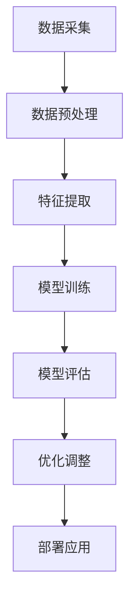

                 


# AI驱动的个人财富积累路径规划器

**关键词**: AI, 财富管理, 机器学习, 个人财务, 路径规划

**摘要**: 本文深入探讨了如何利用人工智能技术来优化个人财富积累路径。通过分析AI在数据处理、算法选择和系统架构设计中的应用，本文为读者提供了一套完整的AI驱动的财富规划解决方案，涵盖从理论到实践的各个方面。

---

# 第一部分: 背景与概述

## 第1章: AI与个人财富管理的结合

### 1.1 AI技术的基本概念
- 1.1.1 人工智能的定义与核心原理
- 1.1.2 机器学习与深度学习的区别
- 1.1.3 当前AI技术在金融领域的应用现状

### 1.2 个人财富管理的基本概念
- 1.2.1 财富管理的定义与目标
- 1.2.2 传统财富管理的模式与挑战
- 1.2.3 数字化财富管理的发展趋势

### 1.3 AI驱动财富管理的必要性
- 1.3.1 数据驱动的财富管理需求
- 1.3.2 AI技术在财富管理中的优势
- 1.3.3 个性化财富规划的实现路径

### 1.4 本章小结
- 本章通过介绍AI技术和财富管理的基本概念，阐述了AI在财富管理中的重要性。

---

# 第二部分: AI驱动的财富规划器核心概念与原理

## 第2章: AI驱动财富规划器的核心概念

### 2.1 财富规划器的基本原理
- 2.1.1 数据采集与处理
- 2.1.2 风险评估与收益预测
- 2.1.3 投资组合优化策略

### 2.2 AI算法在财富规划中的应用
- 2.2.1 机器学习算法的选择与应用
- 2.2.2 自然语言处理在财务数据中的应用
- 2.2.3 图神经网络在财富关系中的应用

### 2.3 财富规划器的系统架构
- 2.3.1 前端交互界面设计
- 2.3.2 后端算法实现
- 2.3.3 数据存储与管理

### 2.4 核心概念与联系
- 2.4.1 AI算法与财务数据的关系
- 2.4.2 用户行为分析与投资策略的关联
- 2.4.3 财富规划器的实体关系图（ER图）

## 第3章: AI驱动财富规划器的算法原理

### 3.1 机器学习算法的核心原理
- 3.1.1 线性回归模型
  - 公式：$$ y = \beta_0 + \beta_1x + \epsilon $$
- 3.1.2 支持向量机（SVM）
  - 公式：$$ \min_{\theta} \frac{1}{2}\|\theta\|^2 + C \sum_{i=1}^n \xi_i $$
- 3.1.3 随机森林与梯度提升树

### 3.2 深度学习算法的应用
- 3.2.1 神经网络的基本结构
- 3.2.2 卷积神经网络（CNN）在图像识别中的应用
- 3.2.3 循环神经网络（RNN）在时间序列预测中的应用

### 3.3 财富预测的数学模型
- 3.3.1 线性回归模型公式
  - $$ y = \beta_0 + \beta_1x + \epsilon $$
- 3.3.2 支持向量机的优化目标
  - $$ \min_{\theta} \frac{1}{2}\|\theta\|^2 + C \sum_{i=1}^n \xi_i $$

### 3.4 算法流程图


---

# 第三部分: 系统架构设计

## 第4章: 系统架构设计与实现

### 4.1 问题场景介绍
- 4.1.1 财富规划器的功能需求
- 4.1.2 用户角色与权限管理
- 4.1.3 系统性能要求

### 4.2 系统功能设计
- 4.2.1 领域模型设计
  ```mermaid
  classDiagram
      class 用户 {
          用户ID
          用户名
          密码
      }
      class 账户 {
          账户ID
          余额
          账户类型
      }
      class 投资组合 {
          组合ID
          资产配置
          预期收益
      }
      用户 --> 账户: 拥有
      用户 --> 投资组合: 管理
  ```

### 4.3 系统架构设计
- 4.3.1 分层架构
  ```mermaid
  architecture
  Client
  Server
  Database
  ```
- 4.3.2 微服务架构
  ```mermaid
  service
      账户服务
      投资服务
      风险评估服务
  ```

### 4.4 系统接口设计
- 4.4.1 API接口定义
  ```mermaid
  sequenceDiagram
      用户 -->+ API Gateway: 调用投资组合查询
      API Gateway --> 账户服务: 获取账户信息
      账户服务 --> 投资服务: 获取投资组合
      投资服务 --> 返回结果
      API Gateway --> 用户: 返回投资组合
  ```

### 4.5 本章小结
- 本章详细介绍了系统架构设计，包括功能设计、架构选择和接口设计。

---

# 第四部分: 项目实战

## 第5章: 项目实战与实现

### 5.1 环境安装与配置
- 5.1.1 安装Python
- 5.1.2 安装机器学习库（如scikit-learn、TensorFlow）
- 5.1.3 安装数据处理工具（如Pandas、NumPy）

### 5.2 核心实现代码
```python
import pandas as pd
from sklearn.linear_model import LinearRegression

# 数据加载
data = pd.read_csv('wealth_data.csv')

# 特征与目标分离
X = data[['income', 'expenses']]
y = data['net_worth']

# 模型训练
model = LinearRegression()
model.fit(X, y)

# 预测
predictions = model.predict(X)
```

### 5.3 代码解读与分析
- 5.3.1 数据预处理
- 5.3.2 模型训练
- 5.3.3 模型评估

### 5.4 实际案例分析
- 5.4.1 数据来源与处理
- 5.4.2 模型训练与优化
- 5.4.3 结果分析与解读

### 5.5 本章小结
- 本章通过实际案例展示了如何实现一个AI驱动的财富规划器。

---

# 第五部分: 最佳实践与总结

## 第6章: 最佳实践与总结

### 6.1 实践中的注意事项
- 数据隐私保护
- 模型的可解释性
- 系统的可扩展性

### 6.2 小结
- 总结全书的核心内容
- 强调AI在财富管理中的重要性
- 展望未来的发展方向

### 6.3 拓展阅读
- 推荐相关书籍和资源
- 提供进一步学习的方向

---

# 作者

**作者：AI天才研究院/AI Genius Institute & 禅与计算机程序设计艺术 /Zen And The Art of Computer Programming**

---

通过以上目录结构，您可以逐步深入理解AI驱动的个人财富积累路径规划器的各个方面，从基础概念到系统设计，再到项目实战，全面掌握相关知识。

