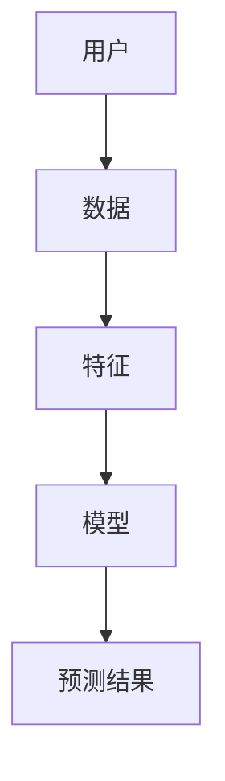
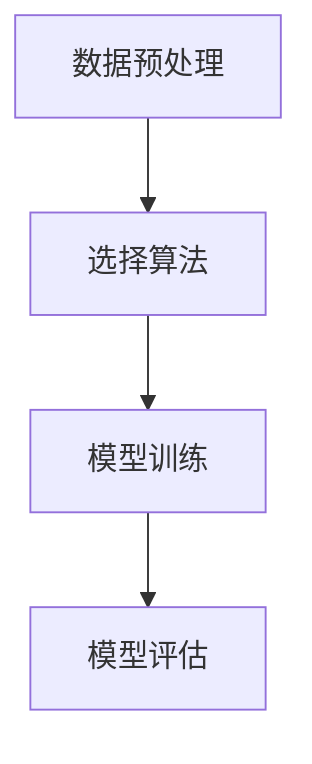
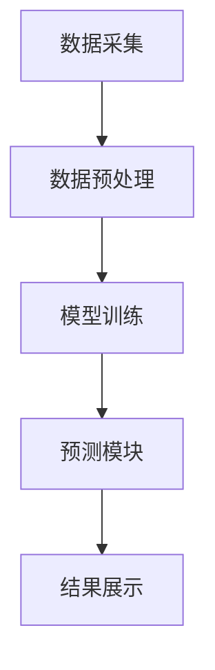
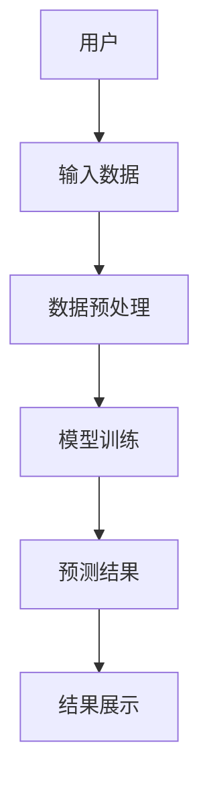

                 


# AI驱动的个人财富积累速度预测器

> 关键词：人工智能、财富预测、机器学习、数据分析、个人理财

> 摘要：本文将探讨如何利用人工智能技术预测个人财富积累的速度。通过分析影响财富积累的关键因素，结合机器学习算法和数据分析技术，构建一个AI驱动的预测模型，帮助个人优化理财策略，实现财富的高效增长。

---

# 第1章: AI驱动个人财富积累速度预测器的背景与核心概念

## 1.1 财富积累的基本概念

### 1.1.1 财富积累的定义与特征

财富积累是指通过投资、储蓄、资产增值等方式，使个人或家庭的财富总量随着时间的推移而增长的过程。其核心特征包括：

- **时间性**：财富积累是一个长期过程，需要持续的时间投入。
- **复利效应**：财富积累往往依赖于复利效应，即收益再投资带来的雪球效应。
- **多样性**：财富积累可以通过多种方式实现，如股票、房地产、创业等。

### 1.1.2 财富积累的影响因素分析

财富积累的速度受到多种因素的影响，包括：

- **个人收入水平**：收入越高，积累财富的能力越强。
- **投资选择**：选择高回报率的投资方式可以显著提升财富积累速度。
- **风险管理能力**：有效的风险管理可以避免重大损失，保障财富积累的稳定性。
- **经济环境**：宏观经济环境，如利率、通货膨胀、经济周期等，也会影响财富积累的速度。

### 1.1.3 传统财富积累预测方法的局限性

传统的财富积累预测方法主要依赖于简单的线性回归模型或基于历史数据的统计分析，存在以下局限性：

- **忽视复杂性**：传统方法难以捕捉财富积累过程中涉及的多变量非线性关系。
- **缺乏动态调整**：传统模型难以实时更新，无法适应快速变化的经济环境。
- **数据维度不足**：传统方法通常依赖少量的财务数据，难以充分利用其他潜在影响因素。

## 1.2 AI驱动预测的核心优势

### 1.2.1 AI技术在金融领域的应用现状

人工智能技术在金融领域的应用已经取得了显著进展，尤其是在预测、交易、风险控制等方面。AI驱动的预测器能够通过深度学习模型分析海量数据，捕捉传统方法难以察觉的模式和趋势。

### 1.2.2 AI驱动预测的理论基础

AI驱动的预测器主要基于以下理论基础：

- **机器学习**：利用监督学习、无监督学习和强化学习等方法，从数据中学习财富积累的规律。
- **数据挖掘**：通过数据挖掘技术发现隐藏在数据中的有价值的信息。
- **统计学习**：结合统计学方法，对数据进行建模和分析。

### 1.2.3 个人财富积累预测的AI驱动目标

AI驱动的个人财富积累速度预测器的目标是通过分析个人的财务数据、投资行为、市场环境等多种因素，预测未来的财富增长速度，并提供建议，帮助用户优化理财策略。

## 1.3 问题背景与应用场景

### 1.3.1 个人财富积累预测的现实需求

随着经济全球化和金融市场的复杂化，个人财富管理的需求日益增长。然而，传统的财富管理方法往往缺乏个性化和实时性，难以满足现代人的需求。

### 1.3.2 AI驱动预测的潜在价值

AI驱动的预测器可以提供以下潜在价值：

- **个性化预测**：根据个人的财务状况和投资偏好，提供个性化的财富积累预测。
- **实时更新**：基于最新的市场数据和用户行为，实时更新预测结果。
- **风险预警**：通过分析潜在风险，提前预警可能的财务危机。

### 1.3.3 预测器的应用场景与边界

AI驱动的预测器可以在以下场景中应用：

- **个人理财规划**：帮助用户制定长期的财务目标。
- **投资决策支持**：为用户提供投资建议，优化资产配置。
- **风险管理**：帮助用户识别潜在风险，制定应对策略。

需要注意的是，AI预测器的应用边界包括：

- **数据隐私**：用户数据的隐私保护是应用中的重要问题。
- **模型局限**：AI模型的预测结果受到数据质量和模型假设的限制，可能存在误差。

## 1.4 本章小结

本章介绍了财富积累的基本概念、影响因素以及传统预测方法的局限性。同时，阐述了AI驱动预测的核心优势和应用场景，为后续章节的分析奠定了基础。

---

# 第2章: AI驱动个人财富积累预测的核心概念与联系

## 2.1 核心概念的定义与属性

### 2.1.1 数据特征与属性分析

AI驱动的预测器需要收集和分析多种类型的数据，包括：

- **个人数据**：收入、支出、资产、负债等。
- **市场数据**：股票价格、债券收益率、通货膨胀率等。
- **行为数据**：投资决策、消费习惯等。

### 2.1.2 预测模型的核心要素

预测模型的核心要素包括：

- **输入数据**：用于训练和预测的数据。
- **模型算法**：用于分析数据的算法，如线性回归、随机森林等。
- **目标函数**：用于评估模型预测结果的指标，如均方误差（MSE）。

### 2.1.3 系统架构的关键组件

系统架构的关键组件包括：

- **数据采集模块**：负责收集用户数据。
- **数据预处理模块**：对数据进行清洗和转换。
- **模型训练模块**：利用机器学习算法训练预测模型。
- **预测模块**：基于训练好的模型进行财富积累速度预测。

## 2.2 核心概念之间的关系

### 2.2.1 数据、模型与系统的联系

数据是模型训练的基础，模型通过学习数据中的模式和规律，提供预测结果。系统则通过整合数据采集、模型训练和预测模块，实现预测器的完整功能。

### 2.2.2 模型性能与数据质量的关系

模型性能与数据质量密切相关。高质量的数据可以提高模型的预测精度，而低质量的数据可能导致模型性能下降。

### 2.2.3 系统架构与预测效果的关联

系统架构的设计直接影响预测器的运行效率和预测效果。合理的架构设计可以提高系统的稳定性和扩展性，从而提升预测效果。

## 2.3 核心概念的ER实体关系图



---

# 第3章: AI驱动个人财富积累预测的算法原理

## 3.1 算法原理概述

### 3.1.1 线性回归算法

线性回归是一种常用的时间序列预测算法，适用于线性关系的场景。其基本公式为：

$$ y = \beta_0 + \beta_1x + \epsilon $$

其中，$y$ 是目标变量，$x$ 是自变量，$\beta_0$ 和 $\beta_1$ 是回归系数，$\epsilon$ 是误差项。

### 3.1.2 时间序列分析

时间序列分析是一种基于历史数据预测未来趋势的方法。常用的方法包括ARIMA（自回归积分滑动平均）和GARCH（广义自回归条件异方差）模型。

## 3.2 算法实现步骤

### 3.2.1 数据预处理

- 数据清洗：处理缺失值、异常值。
- 数据转换：对数据进行标准化或归一化处理。

### 3.2.2 模型训练

- 选择合适的算法。
- 调参：优化模型参数。
- 训练模型：利用训练数据训练模型。

### 3.2.3 模型评估

- 评估指标：均方误差（MSE）、平均绝对误差（MAE）等。
- 交叉验证：验证模型的泛化能力。

## 3.3 算法流程图



---

# 第4章: AI驱动个人财富积累预测的数学模型

## 4.1 预测模型的数学基础

### 4.1.1 线性回归模型

线性回归模型可以表示为：

$$ y = \beta_0 + \beta_1x + \epsilon $$

其中，$\beta_0$ 和 $\beta_1$ 是回归系数，通过最小二乘法求解。

### 4.1.2 时间序列模型

时间序列模型可以表示为：

$$ y_t = \phi_1 y_{t-1} + \phi_2 y_{t-2} + \epsilon_t $$

其中，$\phi_1$ 和 $\phi_2$ 是自回归系数，$\epsilon_t$ 是白噪声。

## 4.2 模型的优化与改进

### 4.2.1 正则化方法

为了防止过拟合，可以采用正则化方法，如Lasso（L1正则化）和Ridge（L2正则化）。

### 4.2.2 深度学习模型

对于复杂的数据关系，可以采用深度学习模型，如LSTM（长短期记忆网络）。

---

# 第5章: AI驱动个人财富积累预测的系统分析与架构设计

## 5.1 系统架构设计

### 5.1.1 系统功能模块

系统功能模块包括：

- 数据采集模块
- 数据预处理模块
- 模型训练模块
- 预测模块
- 结果展示模块

### 5.1.2 系统架构图



## 5.2 系统功能设计

### 5.2.1 数据采集模块

- 功能：从多种数据源采集用户数据。
- 关键技术：数据抽取、数据清洗。

### 5.2.2 数据预处理模块

- 功能：对数据进行清洗、转换和标准化。
- 关键技术：特征选择、数据增强。

## 5.3 系统交互设计

### 5.3.1 用户界面设计

- 输入界面：用户输入个人信息和财务数据。
- 输出界面：展示预测结果和建议。

### 5.3.2 系统交互流程图



---

# 第6章: AI驱动个人财富积累预测的项目实战

## 6.1 项目环境安装

### 6.1.1 安装Python

安装Python 3.8或更高版本。

### 6.1.2 安装依赖库

安装以下依赖库：

```bash
pip install numpy pandas scikit-learn matplotlib
```

## 6.2 核心代码实现

### 6.2.1 数据预处理代码

```python
import pandas as pd
import numpy as np

# 加载数据
data = pd.read_csv('wealth.csv')

# 数据清洗
data.dropna(inplace=True)

# 标准化处理
from sklearn.preprocessing import StandardScaler
scaler = StandardScaler()
scaled_data = scaler.fit_transform(data[['income', 'assets']])
```

### 6.2.2 模型训练代码

```python
from sklearn.linear_model import LinearRegression
from sklearn.metrics import mean_squared_error

# 训练模型
model = LinearRegression()
model.fit(scaled_data, data['wealth_growth'])

# 预测结果
predictions = model.predict(scaled_data)
print('均方误差:', mean_squared_error(data['wealth_growth'], predictions))
```

## 6.3 项目实战案例分析

### 6.3.1 数据来源与预处理

数据来源包括用户提供的收入、资产、投资组合等信息。预处理步骤包括数据清洗和标准化。

### 6.3.2 模型训练与评估

通过训练数据训练模型，并在测试数据上评估模型的性能。

### 6.3.3 预测结果分析

分析预测结果，提供个性化的财富积累建议。

---

# 第7章: AI驱动个人财富积累预测的最佳实践与小结

## 7.1 最佳实践

### 7.1.1 数据隐私保护

确保用户数据的安全性和隐私性。

### 7.1.2 模型优化

定期更新模型，优化算法参数，提升预测精度。

## 7.2 小结

本文详细介绍了AI驱动的个人财富积累速度预测器的背景、核心概念、算法原理、系统架构和项目实战。通过结合机器学习和数据分析技术，可以显著提升财富积累预测的准确性和实用性。

---

# 作者：AI天才研究院 & 禅与计算机程序设计艺术

--- 

本文版权归作者所有，转载请注明出处。

