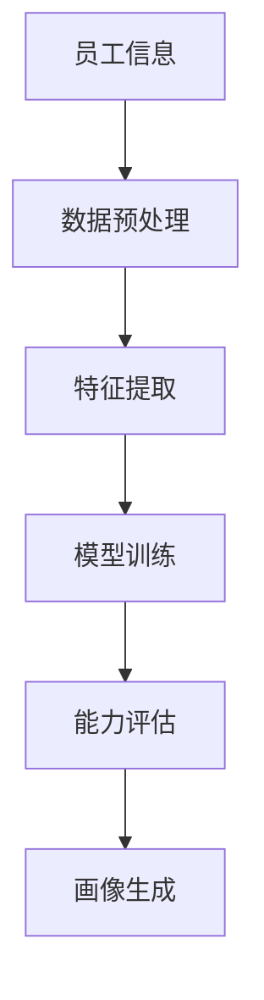
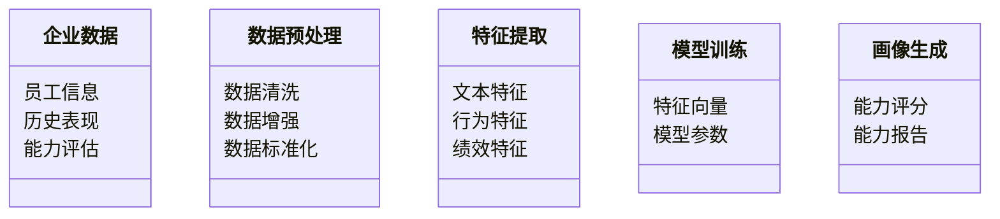
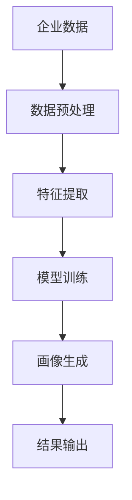

                 


# AI驱动的企业人才画像系统：全方位员工能力评估

## 关键词：AI, 人才画像, 能力评估, 系统架构, 算法原理

## 摘要：
随着企业对人才管理需求的不断增长，AI驱动的企业人才画像系统成为提升员工能力评估效率和精度的关键工具。本篇文章将从背景介绍、核心概念、算法原理、系统架构到项目实战，全面解析AI在企业人才画像系统中的应用，帮助读者深入了解如何利用AI技术实现全方位的员工能力评估。

---

# 第一部分: 企业人才画像系统背景与问题背景

## 第1章: 企业人才画像系统背景与问题背景

### 1.1 企业人才画像系统的核心概念

#### 1.1.1 问题背景与问题描述
在企业环境中，人才评估一直是管理中的核心挑战。传统的评估方法依赖主观判断，存在效率低下、结果不准确的问题。随着AI技术的发展，如何利用自动化和智能化的方法，构建一个客观、全面的人才画像系统成为亟待解决的问题。

#### 1.1.2 问题解决的必要性与目标
通过AI技术，企业可以实现对员工能力的全方位评估，包括技能水平、潜力预测、团队协作能力等。这不仅提高了评估效率，还能帮助企业做出更精准的人才管理决策。

#### 1.1.3 人才画像系统的边界与外延
人才画像系统不仅关注员工的技能和表现，还包括心理素质、职业发展路径等多维度信息。系统通过整合企业内部数据和外部数据，构建员工的全面画像。

---

### 1.2 人才画像系统的核心要素与概念结构

#### 1.2.1 核心概念的定义与属性
- **员工信息**：包括基本信息（姓名、职位）、历史表现、教育背景等。
- **能力评估**：基于数据的分析结果，对员工的能力进行评分和分类。
- **画像构建**：通过算法将多维度数据整合，形成员工的能力画像。

#### 1.2.2 概念属性特征对比表格

| 属性 | 描述 |
|------|------|
| 数据来源 | 企业内部数据、外部数据 |
| 数据类型 | 结构化数据、非结构化数据 |
| 评估维度 | 技能、潜力、团队合作 |
| 输出结果 | 画像报告、能力评分 |

#### 1.2.3 ER实体关系图架构

```mermaid
erd
    顾客
    产品
    订单
    支付方式
    地区
```

---

## 第2章: AI驱动的人才画像系统原理与核心概念

### 2.1 AI驱动的人才画像系统原理

#### 2.1.1 系统的基本原理与工作流程

1. **数据收集**：整合员工的历史表现、技能测试结果、项目反馈等数据。
2. **数据预处理**：清洗数据，去除噪声，标准化数据格式。
3. **特征提取**：从数据中提取关键特征，如技能得分、项目完成率等。
4. **模型训练**：利用机器学习算法训练模型，生成员工能力评分。
5. **画像生成**：将评分结果整合，形成员工的能力画像。

#### 2.1.2 AI技术在人才评估中的应用

- **机器学习**：用于预测员工的潜力和未来表现。
- **自然语言处理**：分析员工的反馈和项目报告，提取情感倾向和关键词。

#### 2.1.3 数据驱动的画像构建方法

- **监督学习**：基于标注数据训练模型，预测员工的能力评分。
- **无监督学习**：通过聚类分析，将员工分为不同的能力层次。

---

### 2.2 核心概念的联系与系统架构

#### 2.2.1 核心概念的联系与依赖关系

- **员工信息**与**能力评估**之间存在双向依赖，评估结果依赖于员工信息，同时评估结果也丰富了员工信息。
- **画像构建**依赖于数据预处理和特征提取，同时又为后续的应用提供数据支持。

#### 2.2.2 系统架构的Mermaid流程图



---

## 第3章: 人才画像系统中的算法原理

### 3.1 算法原理概述

#### 3.1.1 算法的基本原理与流程

1. **数据预处理**：清洗和标准化数据。
2. **特征提取**：提取关键特征，如技能得分、项目完成率。
3. **模型训练**：利用机器学习算法训练模型。
4. **结果输出**：生成能力评分和画像报告。

#### 3.1.2 算法的核心步骤与实现

- **特征提取**：使用主成分分析（PCA）降低数据维度。
- **模型训练**：使用随机森林算法进行分类和回归分析。

### 3.2 算法的数学模型与公式

#### 3.2.1 线性回归模型

$$ y = \beta_0 + \beta_1x + \epsilon $$

其中，$y$是目标变量，$x$是自变量，$\beta_0$和$\beta_1$是回归系数，$\epsilon$是误差项。

#### 3.2.2 支持向量机模型

$$ \text{最大化} \quad \frac{1}{\|\mathbf{w}\|^2} $$
$$ \text{约束} \quad y_i(\mathbf{w} \cdot \mathbf{x}_i + b) \geq 1 $$

其中，$\mathbf{w}$是权重向量，$b$是偏置项，$y_i$是标签，$\mathbf{x}_i$是输入数据。

---

## 第4章: 系统分析与架构设计方案

### 4.1 系统需求分析

#### 4.1.1 问题场景介绍

- **目标**：构建一个AI驱动的人才画像系统。
- **范围**：涵盖数据收集、处理、分析和输出。
- **用户**：企业HR、管理者。

#### 4.1.2 项目介绍与目标

- **项目目标**：实现员工能力的全方位评估。
- **项目范围**：包括数据预处理、模型训练、结果输出。

#### 4.1.3 系统功能需求

- **数据管理**：支持数据的导入和导出。
- **模型训练**：支持多种机器学习算法。
- **结果输出**：生成能力报告和画像。

### 4.2 系统架构设计

#### 4.2.1 领域模型Mermaid类图



#### 4.2.2 系统架构的Mermaid流程图



---

## 第5章: 项目实战

### 5.1 环境安装

```bash
pip install numpy pandas scikit-learn
```

### 5.2 系统核心实现源代码

```python
import pandas as pd
from sklearn.ensemble import RandomForestClassifier
from sklearn.metrics import accuracy_score

# 数据加载
data = pd.read_csv('employee_data.csv')

# 数据预处理
data.dropna(inplace=True)
data = pd.get_dummies(data)

# 特征提取
X = data.drop('performance_score', axis=1)
y = data['performance_score']

# 模型训练
model = RandomForestClassifier()
model.fit(X, y)

# 模型预测
y_pred = model.predict(X)
print("准确率:", accuracy_score(y, y_pred))
```

### 5.3 案例分析

- **数据预处理**：处理缺失值和异常值。
- **特征提取**：提取关键特征，如技能得分和项目完成率。
- **模型训练**：使用随机森林算法进行分类和回归分析。
- **结果输出**：生成员工能力评分和画像报告。

---

## 第6章: 最佳实践、小结、注意事项和拓展阅读

### 6.1 最佳实践

- **数据质量**：确保数据的准确性和完整性。
- **模型选择**：根据具体需求选择合适的算法。
- **结果解释**：确保评估结果的可解释性。

### 6.2 小结

本文详细介绍了AI驱动的企业人才画像系统的构建过程，从背景分析到算法实现，再到系统设计和项目实战，为读者提供了全面的指导。

### 6.3 注意事项

- 数据隐私保护是系统设计中的重要考虑。
- 模型的可解释性对实际应用至关重要。

### 6.4 拓展阅读

- 《机器学习实战》
- 《深入浅出人工智能》

---

# 作者：AI天才研究院/AI Genius Institute & 禅与计算机程序设计艺术 /Zen And The Art of Computer Programming

---

希望这篇文章能为您提供有价值的信息和启发！

