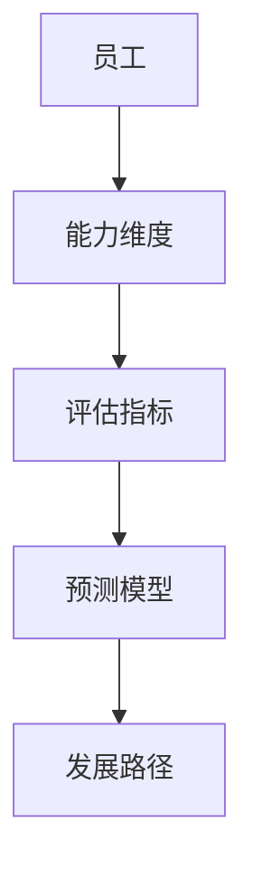
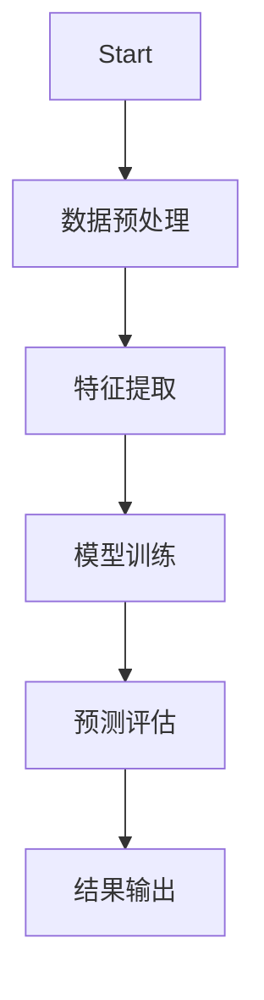
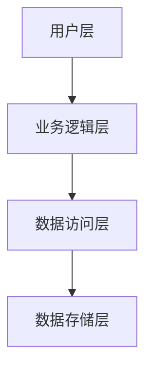
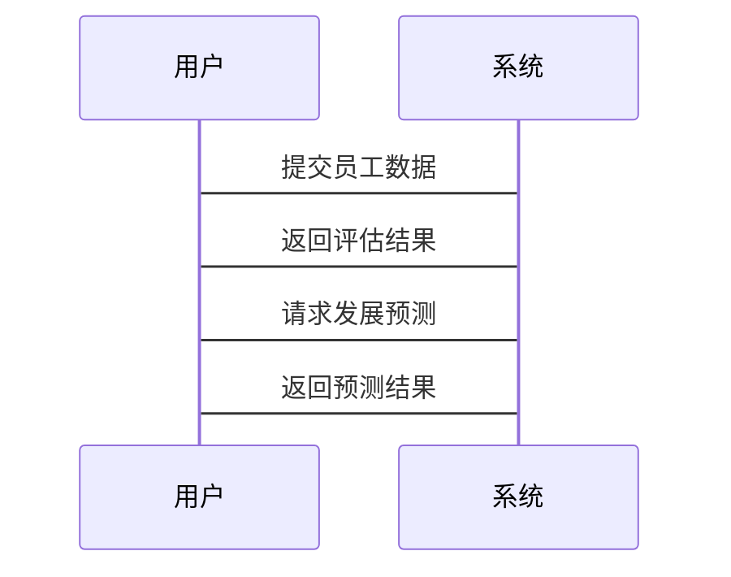

                 


# AI驱动的企业人才画像系统：多维度能力评估与发展预测

**关键词**：AI驱动，企业人才画像，多维度能力评估，发展预测，机器学习，深度学习，系统架构

**摘要**：随着人工智能技术的飞速发展，企业人才管理正在经历一场深刻的变革。传统的基于经验的人才评估方法逐渐被数据驱动的AI系统所取代。本书将深入探讨如何利用AI技术构建多维度的人才画像系统，实现对员工能力的全面评估与发展路径的精准预测。通过结合机器学习、深度学习等先进技术，我们能够更科学地识别人才潜力，优化人力资源管理流程，为企业创造更大的价值。

---

## 第一章：背景介绍

### 1.1 问题背景

#### 1.1.1 传统企业人才评估的局限性  
传统的企业人才评估主要依赖于主观判断和经验，这种方式存在以下问题：  
- **主观性**：评估结果受评估者主观因素影响，可能导致不公。  
- **低效性**：人工评估耗时长，难以覆盖大规模员工。  
- **片面性**：仅关注部分维度，无法全面反映员工能力。  

#### 1.1.2 AI技术在人才管理中的应用潜力  
人工智能技术的快速发展为人才管理带来了新的可能性：  
- **数据驱动**：通过分析海量数据，提供客观、精准的评估结果。  
- **自动化**：AI能够快速处理大量数据，提升评估效率。  
- **动态调整**：实时更新员工画像，适应企业需求变化。  

#### 1.1.3 当前企业人才画像系统的痛点  
尽管AI技术的应用前景广阔，但在实际落地过程中仍面临以下挑战：  
- **数据质量**：数据来源多样，清洗和预处理难度大。  
- **模型精度**：如何提高预测模型的准确率是关键问题。  
- **隐私保护**：员工数据的安全性和隐私性需严格保护。  

### 1.2 核心概念与定义

#### 1.2.1 企业人才画像的定义  
企业人才画像是基于员工的多维度数据，构建的反映其能力、潜力和特点的数字化模型。  

#### 1.2.2 多维度能力评估的内涵  
多维度能力评估是指从多个维度（如知识、技能、态度、业绩等）对员工能力进行全面评价的过程。  

#### 1.2.3 发展预测的核心逻辑  
发展预测是基于历史数据和机器学习模型，预测员工未来的职业发展路径和潜力。  

---

## 第二章：核心概念与联系

### 2.1 核心概念原理

#### 2.1.1 数据驱动的人才画像构建方法  
数据驱动的人才画像是通过收集和分析员工的行为数据、绩效数据、技能数据等，构建员工的数字化画像。  

#### 2.1.2 多维度能力评估的数学模型  
多维度能力评估模型通常采用因子分析或聚类分析方法，将多个评估指标转化为少数几个核心维度。  

#### 2.1.3 发展预测的算法逻辑  
发展预测的核心算法是基于机器学习的回归模型或分类模型，通过历史数据训练模型，预测员工未来的表现。  

### 2.2 核心概念属性对比

#### 2.2.1 能力维度与评估指标对比表  
| 能力维度 | 评估指标 |
|----------|----------|
| 技术能力 | 技术考试成绩、项目经验 |
| 沟通能力 | 沟通评分、团队反馈 |
| 学习能力 | 学习曲线、知识更新速度 |

#### 2.2.2 不同评估模型的优劣势分析  
| 模型类型 | 优势 | 劣势 |
|----------|-------|------|
| 线性回归 | 简单易懂 | 高维数据表现不佳 |
| 支持向量机 | 高精度 | 计算复杂 |
| 神经网络 | 强大学习能力 | 需要大量数据 |

### 2.3 ER实体关系图



---

## 第三章：算法原理讲解

### 3.1 算法流程



### 3.2 数学模型与公式

#### 3.2.1 线性回归模型
$$ y = \beta_0 + \beta_1x + \epsilon $$

#### 3.2.2 神经网络模型
$$ a^{(l)} = \sigma(w^{(l)}a^{(l-1)} + b^{(l)}) $$

#### 3.2.3 聚类分析公式
$$ \text{距离} = \sqrt{\sum_{i=1}^{n}(x_i - y_i)^2} $$

---

## 第四章：系统分析与架构设计

### 4.1 系统功能设计

#### 4.1.1 领域模型


### 4.2 系统架构设计



### 4.3 系统接口设计

#### 4.3.1 输入接口
- **员工信息输入**：收集员工的基本信息、绩效数据等。  
- **模型参数输入**：设置模型的超参数，如学习率、迭代次数等。  

#### 4.3.2 输出接口
- **评估结果输出**：输出员工的多维度能力评估结果。  
- **预测结果输出**：输出员工的职业发展预测结果。  

### 4.4 系统交互流程



---

## 第五章：项目实战

### 5.1 环境安装

#### 5.1.1 安装Python
```bash
pip install python3
```

#### 5.1.2 安装机器学习库
```bash
pip install numpy scikit-learn tensorflow
```

### 5.2 系统核心实现源代码

#### 5.2.1 数据预处理代码
```python
import numpy as np
import pandas as pd

# 读取数据
data = pd.read_csv('employee_data.csv')

# 数据清洗
data.dropna(inplace=True)

# 标准化处理
from sklearn.preprocessing import StandardScaler
scaler = StandardScaler()
data_scaled = scaler.fit_transform(data)
```

#### 5.2.2 模型训练代码
```python
from sklearn.model_selection import train_test_split
from sklearn.linear_model import LinearRegression

# 划分训练集和测试集
X_train, X_test, y_train, y_test = train_test_split(data_scaled, data['target'], test_size=0.2)

# 训练模型
model = LinearRegression()
model.fit(X_train, y_train)

# 预测结果
y_pred = model.predict(X_test)
```

### 5.3 案例分析

#### 5.3.1 案例背景
某互联网公司希望利用AI技术对员工进行能力评估和职业发展预测。  

#### 5.3.2 数据分析
通过分析员工的历史绩效数据和行为数据，构建员工画像，预测其未来的职业发展潜力。  

#### 5.3.3 结果解读
模型预测结果显示，部分员工具备较高的管理潜力，适合晋升为团队领导。

---

## 第六章：最佳实践与注意事项

### 6.1 最佳实践

#### 6.1.1 数据质量的重要性
确保数据的准确性和完整性，数据清洗是关键步骤。  

#### 6.1.2 模型调优技巧
通过交叉验证和超参数优化提升模型性能。  

#### 6.1.3 隐私保护措施
严格遵守数据隐私保护法规，确保员工数据的安全性。  

### 6.2 小结
AI驱动的企业人才画像系统能够显著提升企业的人才管理水平，但其成功实施依赖于高质量的数据和先进的算法。  

### 6.3 注意事项

#### 6.3.1 数据隐私风险
员工数据的泄露可能导致严重的法律问题。  

#### 6.3.2 模型过拟合问题
避免模型过拟合，确保模型的泛化能力。  

### 6.4 拓展阅读
推荐阅读《机器学习实战》和《深度学习入门》等书籍，进一步提升对AI技术的理解。

---

## 结语

AI驱动的企业人才画像系统是未来人力资源管理的重要发展方向。通过多维度能力评估与发展预测，企业能够更科学地管理员工，挖掘人才潜力，提升整体竞争力。希望本书能够为读者提供有价值的参考和启发。

**作者**：AI天才研究院/AI Genius Institute & 禅与计算机程序设计艺术 /Zen And The Art of Computer Programming

