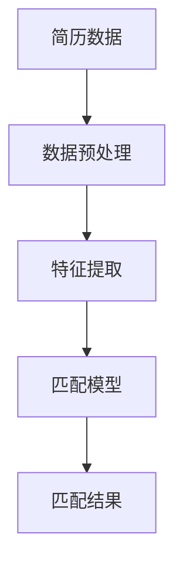
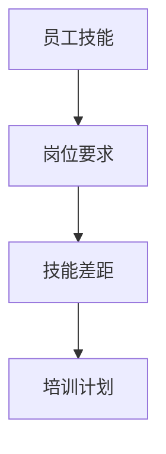
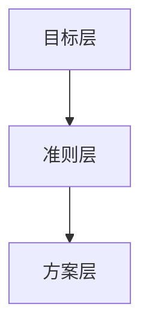
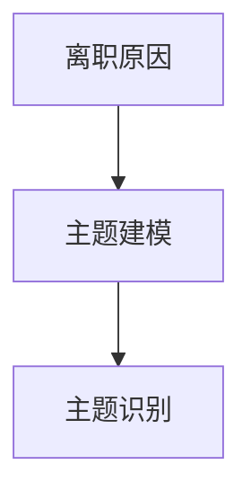
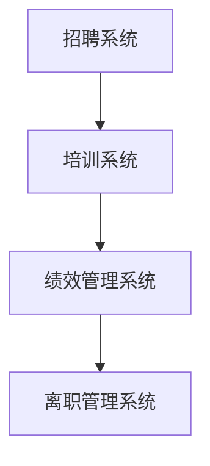
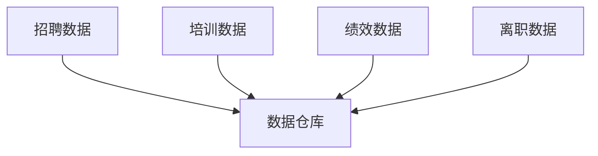

                 


# AI驱动的企业人才管理：从招聘到离职的全周期智能化

> 关键词：AI, 人才管理, 智能化, 招聘, 绩效管理, 离职预测

> 摘要：本文深入探讨了AI技术在企业人才管理中的应用，从招聘到离职的全周期智能化管理。通过分析智能化招聘系统、员工培养与绩效管理的智能化、离职管理与人才保留等关键环节，展示了AI如何优化企业人才管理流程。文章结合了实际案例、系统架构设计和算法实现，为读者提供了全面的技术解析。

---

# 第1章: 从传统到智能：企业人才管理的数字化转型

## 1.1 企业人才管理的数字化背景

### 1.1.1 传统企业人才管理的挑战

企业在传统的人才管理中面临诸多挑战，包括：

1. **低效性**：手动处理简历筛选、面试安排等流程耗时耗力。
2. **主观性**：人工评估可能存在偏见，导致招聘决策失误。
3. **数据孤岛**：各部门数据分散，难以形成统一的人才视图。
4. **缺乏预测性**：无法有效预测员工表现和离职风险。

### 1.1.2 数字化转型的必要性

随着企业数字化转型的推进，AI技术的应用为企业人才管理带来了新的可能性：

1. **提升效率**：自动化处理招聘流程，缩短时间。
2. **降低主观性**：通过数据驱动的决策减少人为偏见。
3. **数据整合**：统一数据平台，形成完整的人才视图。
4. **精准预测**：利用AI预测员工绩效和离职风险，提前采取措施。

### 1.1.3 AI技术在人才管理中的应用前景

AI技术在人才管理中的应用前景广阔，尤其是在以下几个方面：

1. **智能化招聘**：通过AI筛选简历、安排面试，提升招聘效率。
2. **个性化培养**：根据员工特点制定个性化培训计划。
3. **实时绩效监控**：利用AI分析员工表现，动态调整管理策略。
4. **离职预测与保留**：通过数据分析识别高风险员工，制定保留策略。

---

## 1.2 AI驱动人才管理的核心概念

### 1.2.1 什么是AI驱动的人才管理

AI驱动的人才管理是指利用人工智能技术，从招聘、入职、培训、绩效管理到离职的全生命周期中，自动化、智能化地进行人才管理。通过AI技术，企业能够更高效地识别、培养和保留优秀人才。

### 1.2.2 AI在人才管理中的关键作用

AI在人才管理中的关键作用体现在以下几个方面：

1. **数据驱动决策**：通过分析大量数据，帮助企业做出更精准的人才决策。
2. **自动化流程**：从简历筛选到绩效评估，AI可以自动化处理大量重复性工作。
3. **个性化体验**：根据员工的特点和需求，提供个性化的管理方案。

### 1.2.3 企业人才管理的全周期模型

企业人才管理的全周期模型包括以下几个阶段：

1. **招聘阶段**：从简历筛选到面试安排。
2. **入职阶段**：帮助新员工快速适应企业环境。
3. **培养阶段**：根据员工能力和发展需求制定培训计划。
4. **绩效管理阶段**：监控员工绩效，制定奖励和改进措施。
5. **离职阶段**：预测离职风险，制定保留策略。

---

## 1.3 本章小结

本章介绍了企业人才管理从传统模式向数字化转型的必要性，以及AI技术在其中的核心作用。通过分析全周期管理模型，为企业实现智能化人才管理提供了理论基础。

---

# 第2章: 招聘流程的智能化

## 2.1 智能化招聘系统的核心技术

### 2.1.1 自然语言处理在简历分析中的应用

自然语言处理（NLP）技术在简历分析中的应用主要体现在以下几点：

1. **关键词提取**：从简历中提取关键技能和经验。
2. **情感分析**：分析简历中的情感倾向，评估候选人的积极性。
3. **语义理解**：理解简历内容的深层含义，提高匹配度。

### 2.1.2 基于深度学习的简历匹配算法

基于深度学习的简历匹配算法通常包括以下步骤：

1. **数据预处理**：清洗和标注简历数据。
2. **特征提取**：使用深度学习模型提取简历特征。
3. **匹配模型训练**：训练深度学习模型，预测简历与岗位的匹配度。

### 2.1.3 简历筛选的数学模型

简历筛选的数学模型可以通过以下公式表示：

$$
\text{匹配度} = \sum_{i=1}^{n} w_i \cdot x_i
$$

其中，\( w_i \) 是第 \( i \) 个特征的权重，\( x_i \) 是第 \( i \) 个特征的值。

---

### 2.1.4 简历筛选的系统架构

以下是简历筛选系统的架构图：



---

## 2.2 面试安排与人才推荐

### 2.2.1 基于时间序列的面试安排算法

基于时间序列的面试安排算法可以通过以下步骤实现：

1. **数据收集**：收集面试官的时间安排和候选人的时间偏好。
2. **时间序列预测**：预测面试官和候选人的空闲时间。
3. **匹配与安排**：根据预测结果，安排最优的面试时间。

### 2.2.2 多目标优化的推荐系统

多目标优化的推荐系统可以通过以下公式表示：

$$
\max \sum_{i=1}^{n} w_i \cdot x_i
$$

其中，\( w_i \) 是目标权重，\( x_i \) 是目标的实现情况。

---

## 2.3 招聘系统实战

### 2.3.1 系统实现

以下是招聘系统的实现代码：

```python
def resume_screening(resume, job_description):
    # 数据预处理
    resume = preprocess(resume)
    job_description = preprocess(job_description)
    
    # 特征提取
    features = extract_features(resume, job_description)
    
    # 匹配模型
    score = match_model.predict(features)
    
    return score
```

---

## 2.4 本章小结

本章详细介绍了AI在招聘流程中的应用，包括简历筛选、面试安排和人才推荐的核心技术。通过实际案例分析，展示了AI如何提升招聘效率和精准度。

---

# 第3章: 基于AI的员工培训与绩效管理

## 3.1 基于AI的员工培训系统

### 3.1.1 培训需求分析

通过分析员工的技能差距，制定个性化的培训计划。以下是技能差距分析的流程图：



---

### 3.1.2 培训效果评估

培训效果评估可以通过以下公式表示：

$$
\text{培训效果} = \frac{\text{培训后绩效} - \text{培训前绩效}}{\text{培训前绩效}}
$$

---

## 3.2 基于AI的绩效管理系统

### 3.2.1 绩效目标设定

绩效目标设定可以通过层次分析法（AHP）实现。以下是层次分析法的流程图：



---

### 3.2.2 绩效评估与反馈

绩效评估可以通过以下公式表示：

$$
\text{绩效评分} = \sum_{i=1}^{n} w_i \cdot x_i
$$

其中，\( w_i \) 是评估指标的权重，\( x_i \) 是评估指标的得分。

---

## 3.3 绩效管理系统实战

### 3.3.1 系统实现

以下是绩效管理系统的实现代码：

```python
def performance_assessment(employee, performance_metrics):
    # 数据预处理
    employee_data = preprocess(employee)
    
    # 绩效评估
    score = assessment_model.predict(employee_data, performance_metrics)
    
    return score
```

---

## 3.4 本章小结

本章探讨了AI在员工培训和绩效管理中的应用，通过分析培训需求和绩效评估的核心技术，展示了AI如何提升员工能力和发展。

---

# 第4章: 离职管理与人才保留

## 4.1 员工离职预测与分析

### 4.1.1 离职预测模型

离职预测模型可以通过以下步骤实现：

1. **数据收集**：收集员工的历史数据和离职记录。
2. **特征工程**：提取离职相关的特征。
3. **模型训练**：训练离职预测模型。

### 4.1.2 离职原因分析

离职原因分析可以通过主题模型实现。以下是主题模型的流程图：



---

## 4.2 人才保留策略

### 4.2.1 个性化保留策略

个性化保留策略可以通过以下公式表示：

$$
\text{保留概率} = \sum_{i=1}^{n} w_i \cdot x_i
$$

其中，\( w_i \) 是保留因素的权重，\( x_i \) 是保留因素的得分。

---

## 4.3 离职管理系统实战

### 4.3.1 系统实现

以下是离职管理系统的实现代码：

```python
def churn_prediction(employee_data):
    # 数据预处理
    processed_data = preprocess(employee_data)
    
    # 离职预测
    prediction = model.predict(processed_data)
    
    return prediction
```

---

## 4.4 本章小结

本章分析了离职预测和人才保留的关键技术，通过实际案例展示了如何利用AI技术降低员工流失率，提升企业竞争力。

---

# 第5章: AI驱动的人才管理系统的整合与优化

## 5.1 系统整合

### 5.1.1 系统模块整合

以下是人才管理系统的模块整合图：



---

### 5.1.2 数据整合与共享

数据整合与共享可以通过数据仓库实现。以下是数据仓库的架构图：



---

## 5.2 系统优化

### 5.2.1 持续优化策略

持续优化策略包括：

1. **实时监控**：实时监控系统运行状态，及时发现和解决问题。
2. **反馈机制**：根据系统反馈，不断优化算法和流程。
3. **数据更新**：定期更新数据，保持系统的准确性。

---

## 5.3 本章小结

本章总结了AI驱动的人才管理系统的整合与优化策略，强调了系统模块整合和数据共享的重要性，并提出了持续优化的建议。

---

# 第6章: 未来趋势与挑战

## 6.1 未来趋势

### 6.1.1 技术融合

未来，AI技术将与区块链、物联网等技术深度融合，进一步提升人才管理的智能化水平。

### 6.1.2 个性化管理

个性化管理将更加普及，员工体验将更加注重。

---

## 6.2 挑战与解决方案

### 6.2.1 数据隐私

数据隐私问题需要通过法律法规和技术手段加以解决。

### 6.2.2 技术瓶颈

技术瓶颈需要通过技术创新和合作来突破。

---

## 6.3 本章小结

本章分析了AI驱动的人才管理的未来趋势和面临的挑战，并提出了相应的解决方案。

---

# 作者：AI天才研究院 & 禅与计算机程序设计艺术

---

以上是文章的完整目录和部分章节内容，具体内容可以根据实际需求进一步扩展和补充。

