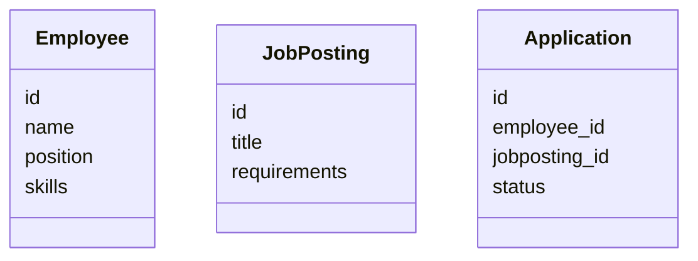
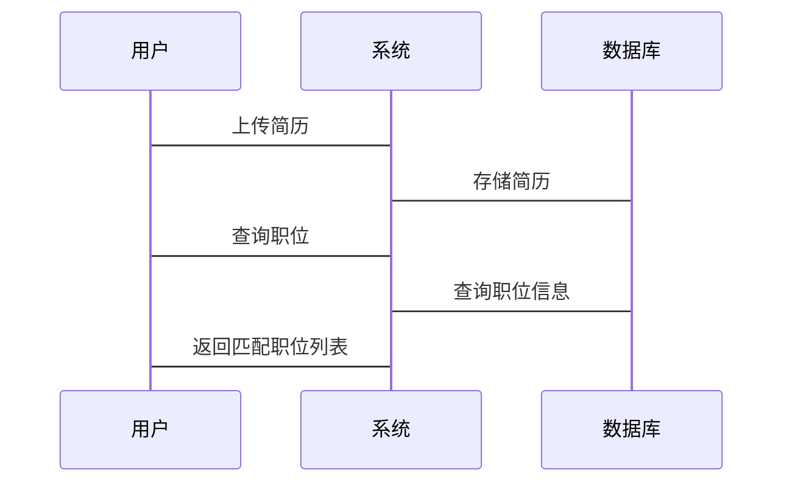

                 


# AI驱动的企业人才管理：招聘、培训到绩效评估

**关键词：** AI驱动，企业人才管理，招聘，培训，绩效评估，机器学习，自然语言处理

**摘要：**  
本文探讨了AI在企业人才管理中的应用，涵盖招聘、培训和绩效评估三个阶段。通过结合机器学习和自然语言处理技术，分析了AI如何优化企业人才管理流程，提升效率和准确性。

---

## 第一部分: AI驱动的企业人才管理背景与概述

### 第1章: AI驱动的企业人才管理概述

#### 1.1 企业人才管理的数字化转型

##### 1.1.1 传统企业人才管理的挑战

传统企业人才管理依赖人工操作，存在效率低、主观性强、数据分散等问题。招聘过程中，HR需手动筛选简历，耗时且容易遗漏优秀候选人；培训计划难以精准匹配员工需求；绩效评估依赖主观评分，缺乏客观依据。

##### 1.1.2 数字化转型的必要性

企业面临快速变化的市场环境和人才竞争加剧，数字化转型成为必然选择。AI技术的应用可以提高招聘效率、优化培训计划和提升绩效评估的准确性，从而提升整体人才管理水平。

##### 1.1.3 AI技术在人才管理中的应用前景

AI技术在人才管理中的应用前景广阔，特别是在招聘、培训和绩效评估方面。通过自然语言处理（NLP）和机器学习（ML）技术，企业可以更高效地处理大量数据，提高决策的科学性。

#### 1.2 AI驱动人才管理的核心概念

##### 1.2.1 什么是AI驱动的人才管理

AI驱动的人才管理是指利用人工智能技术，通过数据驱动的方法，优化企业人才管理的各个环节，包括招聘、培训和绩效评估等。AI技术能够帮助HR部门更高效地处理事务，提升人才管理的精准度和效果。

##### 1.2.2 AI在招聘、培训与绩效评估中的作用

- **招聘：** AI可以通过简历筛选、职位匹配和面试安排等流程，提高招聘效率和准确性。
- **培训：** AI可以根据员工的能力和需求，推荐个性化的培训计划，提升员工技能。
- **绩效评估：** AI可以通过数据分析，提供客观的绩效评估结果，帮助管理者制定合理的奖励和改进计划。

##### 1.2.3 AI驱动人才管理的边界与外延

AI驱动的人才管理的边界主要在于数据质量和模型的准确性。外延则包括与其他企业管理系统的集成，如ERP、CRM等，形成完整的数字化管理平台。

#### 1.3 企业人才管理的核心要素

##### 1.3.1 人才招聘的核心要素

- **简历筛选：** 包括关键词提取、简历匹配度评分等。
- **职位匹配：** 基于职位需求和候选人能力的匹配度分析。

##### 1.3.2 人才培养的核心要素

- **培训需求分析：** 基于员工技能缺口分析。
- **培训计划制定：** 包括课程推荐、学习路径规划等。

##### 1.3.3 绩效评估的核心要素

- **绩效指标设定：** 包括定量和定性指标。
- **绩效数据分析：** 利用数据挖掘技术分析绩效结果。

---

## 第二部分: AI驱动人才管理的核心概念与联系

### 第2章: AI驱动人才管理的核心原理

#### 2.1 AI在人才管理中的核心机制

##### 2.1.1 数据驱动的决策

AI通过分析大量数据，提供基于数据的决策支持，帮助HR做出更明智的人才管理决策。

##### 2.1.2 自然语言处理在简历筛选中的应用

NLP技术可以自动提取简历中的关键词和职位匹配度，提高简历筛选的效率和准确性。

##### 2.1.3 机器学习在绩效预测中的应用

通过机器学习模型预测员工的绩效表现，帮助企业提前制定绩效改进计划。

#### 2.2 AI驱动人才管理的实体关系分析

##### 2.2.1 实体关系图（ER图）分析

```mermaid
erDiagram
    employee {
        id : int
        name : string
        position : string
        department : string
        skills : string
       绩效评分 : float
    }
    jobposting {
        id : int
        title : string
        requirements : string
        responsibilities : string
        salary : float
    }
    application {
        id : int
        employee_id : int
        jobposting_id : int
        status : string
        submission_date : date
    }
    trainingplan {
        id : int
        title : string
        duration : int
        target_skills : string
        employees : Employee
    }
```

##### 2.2.2 关键实体之间的关系

- **员工（employee）与职位招聘（jobposting）：** 应用关系，通过application表关联。
- **培训计划（trainingplan）与员工：** 关联关系，表示员工参与的培训计划。

---

## 第三部分: AI驱动人才管理的算法原理与实现

### 第3章: 招聘系统的算法原理

#### 3.1 招聘系统的算法概述

##### 3.1.1 监督学习在简历筛选中的应用

监督学习模型（如逻辑回归）用于分类任务，如简历筛选中的职位匹配度评分。

##### 3.1.2 无监督学习在简历聚类中的应用

无监督学习（如K-means）用于将相似简历聚类，便于HR快速浏览。

##### 3.1.3 深度学习在职位匹配中的应用

深度学习模型（如神经网络）用于复杂特征的提取，如简历中隐含的能力匹配。

#### 3.2 招聘系统的核心算法实现

##### 3.2.1 基于TF-IDF的简历关键词提取

TF-IDF用于提取简历中的关键词，计算每个关键词的重要性，帮助简历筛选。

##### 3.2.2 基于Word2Vec的简历向量化

Word2Vec将简历文本转换为向量表示，便于机器学习模型处理。

##### 3.2.3 基于逻辑回归的职位匹配模型

逻辑回归模型用于分类任务，如简历是否适合职位。

#### 3.3 招聘系统算法的数学模型

##### 3.3.1 TF-IDF计算公式

$$
TF-IDF = \frac{tf \times idf}{N}
$$

##### 3.3.2 Word2Vec模型训练公式

$$
P(word_i|word_{i-1}) = \frac{exp(w^T x)}{sum(exp(w^T x))}
$$

---

## 第四部分: 系统分析与架构设计方案

### 第4章: 招聘系统架构设计

#### 4.1 问题场景介绍

企业需要高效筛选大量简历，提高招聘效率。

#### 4.2 项目介绍

开发一个基于AI的招聘系统，实现简历自动筛选和职位匹配。

#### 4.3 系统功能设计

##### 4.3.1 领域模型



#### 4.4 系统架构设计

##### 4.4.1 分层架构

- **数据层：** 存储简历、职位信息。
- **业务逻辑层：** 实现简历筛选、职位匹配逻辑。
- **应用层：** 提供用户界面，展示筛选结果。

#### 4.5 系统接口设计

- **API接口：** 提供简历上传、职位查询等接口。

#### 4.6 系统交互设计

##### 4.6.1 序列图



---

## 第五部分: 项目实战

### 第5章: 招聘系统项目实战

#### 5.1 环境安装

- **Python：** 3.8+
- **库：** scikit-learn、spaCy、Flask

#### 5.2 核心代码实现

##### 5.2.1 TF-IDF实现

```python
from sklearn.feature_extraction.text import TfidfVectorizer

vectorizer = TfidfVectorizer()
tfidf_matrix = vectorizer.fit_transform(resumes)
```

##### 5.2.2 Word2Vec实现

```python
from gensim.models import Word2Vec

model = Word2Vec(sentences, vector_size=100, window=5, min_count=1, workers=4)
```

#### 5.3 项目小结

通过项目实战，展示了AI技术在招聘系统中的应用，证明了其在提高招聘效率和准确性方面的优势。

---

## 第六部分: 最佳实践与总结

### 第6章: 最佳实践与总结

#### 6.1 小结

AI技术在企业人才管理中的应用前景广阔，能够显著提升招聘、培训和绩效评估的效率和准确性。

#### 6.2 注意事项

- **数据隐私：** 注意保护员工数据隐私。
- **模型解释性：** 确保模型结果的可解释性。
- **持续优化：** 定期更新模型，提升准确性。

#### 6.3 拓展阅读

建议进一步学习机器学习和自然语言处理技术，深入了解AI在企业管理中的更多应用。

---

## 作者

**作者：** AI天才研究院/AI Genius Institute & 禅与计算机程序设计艺术/Zen And The Art of Computer Programming

