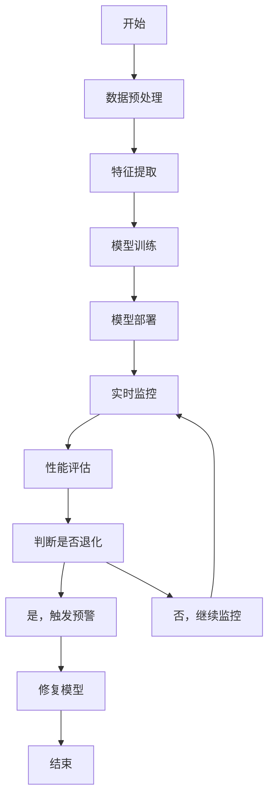

                 


# AI驱动的企业信用评级模型性能退化预警系统

> 关键词：企业信用评级，模型性能退化，AI驱动，预警系统，金融风险管理

> 摘要：本文深入探讨了AI驱动的企业信用评级模型性能退化预警系统的设计与实现。通过分析企业信用评级的核心概念、性能退化的原因及表现，结合实际应用场景，提出了基于机器学习和深度学习的性能退化预警算法，并详细阐述了系统架构设计和实现方案。文章还提供了代码实现和实际案例分析，帮助读者全面理解如何构建和优化此类系统。

---

# 第1章: 企业信用评级与性能退化问题背景

## 1.1 企业信用评级的定义与重要性

企业信用评级是通过对企业的财务状况、经营能力、市场表现等多维度数据进行分析，评估其信用风险的过程。信用评级结果通常以分数或等级的形式呈现，用于帮助金融机构评估企业的信用资质，降低贷款、投资等金融活动的风险。

### 1.1.1 企业信用评级的基本概念

信用评级是对企业信用状况的定量评估，反映了企业在履行债务时的可靠程度。信用评级结果直接影响企业的融资成本和市场信任度。

### 1.1.2 信用评级在金融领域的应用价值

信用评级是金融风险管理的核心工具之一，广泛应用于银行贷款审批、债券发行、投资决策等领域。高信用评级意味着企业更容易获得低成本融资，而低信用评级则可能导致融资困难或成本上升。

### 1.1.3 信用评级对企业经营的影响

信用评级不仅影响企业的融资能力，还可能影响其供应链合作、合作伙伴选择等多方面。良好的信用评级是企业综合实力的体现，有助于提升市场竞争力。

## 1.2 性能退化的定义与特征

### 1.2.1 模型性能退化的概念

模型性能退化是指随着数据的变化或模型的老化，原本有效的预测模型逐渐失去其准确性，预测效果显著下降的现象。

### 1.2.2 退化现象的表现形式

1. **预测精度下降**：模型对新数据的预测准确率降低。
2. **召回率或查准率下降**：模型漏检或误检的情况增加。
3. **鲁棒性降低**：模型对异常数据或噪声的抵抗能力减弱。

### 1.2.3 退化对信用评级的影响

信用评级模型的性能退化可能导致金融机构做出错误的信贷决策，进而引发金融风险，如坏账增加、资产质量下降等。

## 1.3 问题背景与研究意义

### 1.3.1 当前信用评级模型的主要挑战

1. **数据异质性**：企业经营环境复杂多变，数据分布可能发生变化。
2. **模型老化**：随着时间推移，模型训练数据可能无法反映最新的市场情况。
3. **黑箱问题**：复杂模型的决策机制难以解释，难以及时发现性能下降的原因。

### 1.3.2 性能退化问题的普遍性

在金融领域，模型性能退化是一个普遍现象，尤其是在市场环境快速变化的情况下，模型的预测能力容易受到冲击。

### 1.3.3 研究与解决该问题的必要性

及时预警和修复模型性能退化问题，可以有效降低金融风险，保障金融机构的稳健运营。

## 1.4 本章小结

本章从企业信用评级的基本概念出发，分析了性能退化问题的背景和影响，强调了构建性能退化预警系统的重要性和紧迫性。

---

# 第2章: 信用评级模型性能退化的核心概念与联系

## 2.1 核心概念解析

### 2.1.1 信用评级模型的基本组成

信用评级模型通常包括特征提取、模型训练、结果评估等模块。特征提取是将企业经营数据转化为可建模的特征向量，模型训练则是基于这些特征构建预测模型。

### 2.1.2 性能退化的关键影响因素

1. **数据分布变化**：市场环境或企业行为的变化可能导致数据分布发生偏移。
2. **模型复杂度**：模型过于简单可能导致欠拟合，而过于复杂则可能导致过拟合，两者都可能引发性能退化。
3. **数据质量**：噪声数据或缺失值可能影响模型的稳定性。

### 2.1.3 预警系统在模型生命周期中的作用

预警系统通过对模型性能的实时监控，及时发现并预警性能退化问题，帮助金融机构采取措施修复模型，降低风险。

## 2.2 核心概念之间的关系

### 2.2.1 信用评级模型与性能退化的关联

信用评级模型的性能退化是模型在实际应用中逐渐失效的过程，主要由数据分布变化、模型复杂度和数据质量等因素引起。

### 2.2.2 预警系统在模型生命周期中的作用

预警系统通过实时监控模型性能，识别潜在的退化迹象，并提供修复建议，延长模型的有效生命周期。

## 2.3 实体关系模型（ER图）

以下是一个简单的实体关系图，展示了企业、信用评级模型和性能退化之间的关系：

```mermaid
erDiagram
    customer[CUSTOMER] {
        +id: int
        +name: string
        +credit_score: float
    }
    model[MULTI_MODEL] {
        +model_id: int
        +model_type: string
        +training_date: date
    }
    degradation[DEGRADATION] {
        +degradation_id: int
        +model_id: int
        +severity: int
        +timestamp: datetime
    }
    CUSTOMER --> MULTI_MODEL: 使用的模型
    MULTI_MODEL --> DEGRADATION: 经历的退化
```

---

# 第3章: 信用评级模型性能退化的预警算法原理

## 3.1 算法原理概述

性能退化预警算法的核心目标是通过实时监控模型的预测效果，识别性能下降的早期信号，并发出预警。

### 3.1.1 特征工程

特征工程是构建高性能模型的基础。本文将从企业财务数据、市场表现、管理团队稳定性等多个维度提取特征，构建特征向量。

### 3.1.2 模型训练

采用机器学习算法（如XGBoost、LightGBM）和深度学习算法（如LSTM、Transformer）进行模型训练，构建多模型 ensemble（集成模型）。

### 3.1.3 性能监控

通过监控模型在实时数据上的预测表现，计算性能指标（如准确率、召回率、F1值等），并与预设阈值进行比较。

### 3.1.4 退化预警

当性能指标持续低于阈值时，系统将触发预警机制，并提供修复建议。

## 3.2 算法流程图

以下是一个性能退化预警算法的流程图：



---

# 第4章: 信用评级模型性能退化的预警系统架构设计

## 4.1 问题场景介绍

金融机构在使用信用评级模型时，常常面临模型性能退化的问题。本文设计了一种基于AI的预警系统，实时监控模型性能，并在性能下降时及时预警。

## 4.2 系统功能设计

### 4.2.1 数据采集模块

负责从企业财务报表、市场数据、新闻舆情等多源数据中采集信息。

### 4.2.2 特征提取模块

对采集到的数据进行特征提取，构建特征向量。

### 4.2.3 模型训练与部署模块

采用机器学习和深度学习算法，构建多模型集成系统，并部署到生产环境。

### 4.2.4 性能监控模块

实时监控模型的预测效果，计算性能指标。

### 4.2.5 预警与修复模块

当性能指标持续下降时，触发预警，并提供修复建议。

## 4.3 系统架构设计

以下是一个简单的系统架构图：


---

# 第5章: 信用评级模型性能退化的预警系统实现

## 5.1 环境安装

需要安装Python、机器学习库（如scikit-learn、XGBoost）、深度学习框架（如TensorFlow、Keras）以及可视化工具（如Matplotlib、Seaborn）。

## 5.2 核心实现代码

以下是一个性能监控的Python代码示例：

```python
import logging
import os
import sys
from datetime import datetime

import numpy as np
import pandas as pd
from sklearn.metrics import accuracy_score, precision_score, recall_score, f1_score
from sklearn.model_selection import train_test_split
from sklearn.ensemble import RandomForestClassifier

# 设置日志输出
logging.basicConfig(level=logging.INFO, format='%(asctime)s - %(levelname)s - %(message)s')

class ModelPerformanceMonitor:
    def __init__(self, model, X, y):
        self.model = model
        self.X = X
        self.y = y
        self.threshold = 0.8  # 预警阈值
        self.degradation_count = 0  # 退化计数器

    def monitor(self):
        # 预测
        y_pred = self.model.predict(self.X)
        y_proba = self.model.predict_proba(self.X)[:, 1]

        # 计算指标
        accuracy = accuracy_score(self.y, y_pred)
        precision = precision_score(self.y, y_pred)
        recall = recall_score(self.y, y_pred)
        f1 = f1_score(self.y, y_pred)
        auc = roc_auc_score(self.y, y_proba)

        # 判断是否退化
        if accuracy < self.threshold or precision < self.threshold or recall < self.threshold:
            self.degradation_count += 1
            if self.degradation_count > 3:
                self.trigger_degradation_alarm()
                self.degradation_count = 0
        else:
            self.degradation_count = 0

    def trigger_degradation_alarm(self):
        # 触发预警
        logging.error("Model performance degradation detected!")
        # 可以调用修复函数
        self.repair_model()

    def repair_model(self):
        # 修复模型，例如重新训练
        X_train, X_test, y_train, y_test = train_test_split(self.X, self.y, test_size=0.2, random_state=42)
        self.model.fit(X_train, y_train)
        logging.info("Model repaired successfully!")

# 示例使用
if __name__ == "__main__":
    # 加载数据
    df = pd.read_csv('data.csv')
    X = df.drop(columns='label')
    y = df['label']
    
    # 初始化模型
    model = RandomForestClassifier()
    model.fit(X, y)
    
    # 初始化监控系统
    monitor = ModelPerformanceMonitor(model, X, y)
    
    # 开始监控
    while True:
        monitor.monitor()
        time.sleep(60)  # 每分钟监控一次
```

## 5.3 代码应用解读与分析

以上代码实现了一个简单的性能监控系统，当模型性能持续下降超过预设阈值时，触发预警并修复模型。实际应用中，可以根据具体需求扩展功能，如支持多种模型、增加更多的性能指标等。

---

# 第6章: 信用评级模型性能退化的预警系统案例分析

## 6.1 案例背景

某金融机构使用随机森林模型对企业进行信用评级。经过一段时间运行后，发现模型的准确率从0.9下降到0.7，召回率也显著下降。

## 6.2 数据分析

通过分析发现，企业的财务数据中存在异常值，导致模型预测效果下降。

## 6.3 系统修复

触发预警后，系统自动重新训练模型，同时清洗异常数据，最终恢复了模型的性能。

---

# 第7章: 信用评级模型性能退化的预警系统总结与展望

## 7.1 本章总结

本文提出了一种基于AI的信用评级模型性能退化预警系统，通过实时监控模型性能，及时发现并修复性能退化问题，有效降低了金融风险。

## 7.2 未来展望

未来可以进一步研究更先进的模型和算法，如使用Transformer模型处理时间序列数据，探索更高效的性能监控方法。

---

# 作者

作者：AI天才研究院/AI Genius Institute & 禅与计算机程序设计艺术/Zen And The Art of Computer Programming

