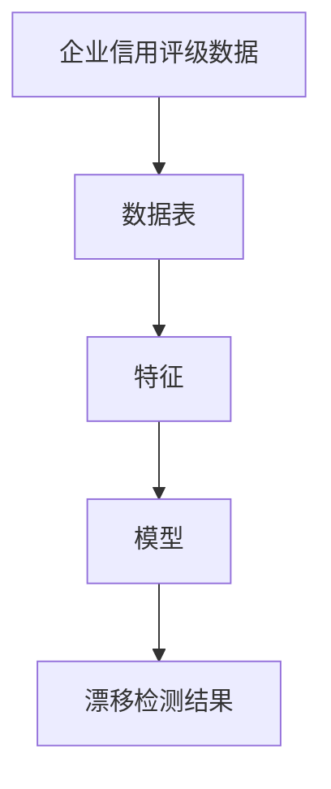
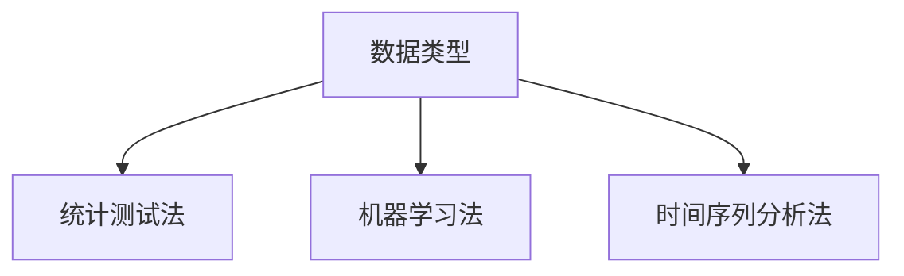
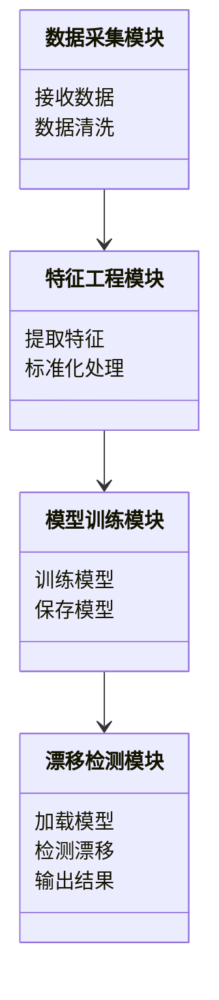
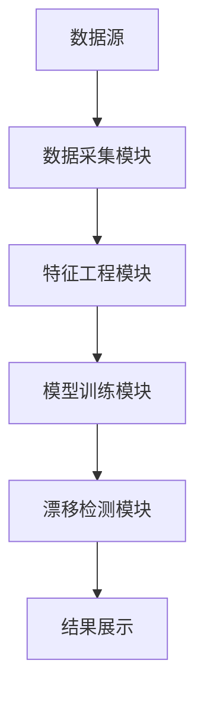
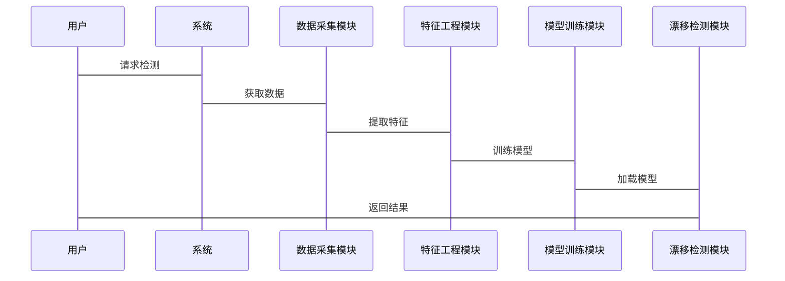

                 


# AI驱动的企业信用评级模型漂移检测系统

## 关键词：AI驱动、企业信用评级、模型漂移检测系统、统计测试、机器学习、数学模型、系统架构

## 摘要

在企业信用评级中，模型漂移检测是确保模型性能和准确性的重要环节。本文探讨了如何利用AI技术，通过统计测试、机器学习和时间序列分析等方法，实现企业信用评级模型的漂移检测。文章详细分析了模型漂移的类型、检测方法的原理与实现，并通过系统架构设计和项目实战，展示了如何构建高效的漂移检测系统。最后，结合实际案例和最佳实践，为读者提供了实用的指导和建议。

---

# 第一部分：背景介绍

## 第1章：背景介绍

### 1.1 问题背景

#### 1.1.1 企业信用评级的重要性
企业信用评级是评估企业信用状况的重要指标，直接影响企业的融资成本和市场信任度。准确的信用评级有助于金融机构降低风险，优化资源配置。

#### 1.1.2 模型漂移的定义与影响
模型漂移是指模型在运行过程中，由于数据分布变化或模型性能下降，导致预测结果与实际结果不符的现象。这会降低模型的准确性和可靠性，增加企业的财务风险。

#### 1.1.3 模型漂移检测的必要性
及时检测模型漂移，可以避免模型失效，确保信用评级的准确性和稳定性。AI技术的引入，使得模型漂移检测更加高效和自动化。

### 1.2 问题描述

#### 1.2.1 信用评级模型的核心要素
信用评级模型通常基于财务指标、市场表现、行业趋势等多维度数据，构建预测企业信用风险的数学模型。

#### 1.2.2 模型漂移的类型和表现形式
模型漂移主要分为数据分布漂移、概率分布漂移和标签分布漂移三种类型。常见表现包括预测精度下降、异常值增加、模型过时等。

#### 1.2.3 模型漂移检测的边界与外延
模型漂移检测不仅关注数据的变化，还需考虑模型的性能和业务目标的偏离。检测范围包括数据、模型和业务层面。

### 1.3 问题解决

#### 1.3.1 AI驱动模型漂移检测的优势
AI技术能够自动化处理大量数据，快速识别漂移，提高检测效率和准确性。

#### 1.3.2 模型漂移检测的关键技术
包括统计测试、机器学习和时间序列分析等方法，各有优缺点，适用于不同的场景。

#### 1.3.3 模型漂移检测的实现路径
从数据采集、特征提取、模型训练到漂移检测，构建完整的检测流程。

### 1.4 概念结构与核心要素

#### 1.4.1 模型漂移检测的系统架构
系统架构分为数据层、特征层、模型层和检测层，各层之间相互依赖，协同工作。

#### 1.4.2 核心要素的特征对比表格
| 要素 | 描述 | 示例 |
|------|------|------|
| 数据分布 | 数据特征的变化 | 均值、方差变化 |
| 概率分布 | 概率变化 | KL散度计算 |
| 标签分布 | 标签变化 | 卡方检验结果 |

#### 1.4.3 ER实体关系图的Mermaid流程图



---

# 第二部分：核心概念与联系

## 第2章：核心概念原理

### 2.1 模型漂移的类型

#### 2.1.1 数据分布漂移
数据分布的变化导致模型预测能力下降，如客户收入分布的变化。

#### 2.1.2 概率分布漂移
模型预测概率分布的变化，如违约概率的变化。

#### 2.1.3 标签分布漂移
实际标签分布的变化，如高风险企业数量增加。

### 2.2 模型漂移检测方法

#### 2.2.1 统计测试法
通过卡方检验、Kolmogorov-Smirnov检验等方法，比较数据分布的差异。

#### 2.2.2 机器学习法
使用XGBoost、神经网络等模型，学习数据的变化，识别漂移。

#### 2.2.3 时间序列分析法
通过ARIMA、LSTM等模型，分析时间序列数据的变化，预测漂移。

### 2.3 检测方法的对比分析

#### 2.3.1 方法优缺点对比表格
| 方法 | 优点 | 缺点 |
|------|------|------|
| 统计测试法 | 简单易用 | 依赖分布假设 |
| 机器学习法 | 高准确性 | 计算复杂 |
| 时间序列分析法 | 良好的时间依赖性 | 对异常值敏感 |

#### 2.3.2 方法适用场景的Mermaid流程图



---

# 第三部分：算法原理讲解

## 第3章：算法原理与实现

### 3.1 统计测试法

#### 3.1.1 卡方检验
用于比较两个分类变量的独立性，适用于标签分布漂移检测。

公式：
$$ \chi^2 = \sum \frac{(O_i - E_i)^2}{E_i} $$

#### 3.1.2 Kullback-Leibler散度
衡量两个概率分布之间的差异，适用于数据分布漂移检测。

公式：
$$ D_{KL}(P||Q) = \sum P(i) \log \frac{P(i)}{Q(i)} $$

#### 3.1.3 Kolmogorov-Smirnov检验
比较两个经验分布函数的差异，适用于连续变量的分布检测。

### 3.2 机器学习法

#### 3.2.1 基于XGBoost的模型漂移检测
使用XGBoost构建分类模型，通过模型性能变化检测漂移。

代码示例：
```python
import xgboost as xgb

# 数据准备
train_data = ...
test_data = ...

# 模型训练
model = xgb.XGBClassifier()
model.fit(train_data)

# 预测与评估
y_pred = model.predict(test_data)
accuracy = accuracy_score(y_true, y_pred)
```

#### 3.2.2 基于神经网络的模型漂移检测
使用深度学习模型，学习数据的变化，识别漂移。

代码示例：
```python
import tensorflow as tf

# 构建神经网络模型
model = tf.keras.Sequential([
    tf.keras.layers.Dense(64, activation='relu'),
    tf.keras.layers.Dense(1, activation='sigmoid')
])

# 编译模型
model.compile(optimizer='adam', loss='binary_crossentropy', metrics=['accuracy'])

# 训练模型
model.fit(x_train, y_train, epochs=10)
```

#### 3.2.3 基于Isolation Forest的异常检测
通过Isolation Forest识别异常数据点，用于数据分布漂移检测。

代码示例：
```python
from sklearn.ensemble import IsolationForest

# 初始化模型
model = IsolationForest()

# 训练模型
model.fit(X_train)

# 预测异常点
y_pred = model.predict(X_test)
```

### 3.3 时间序列分析法

#### 3.3.1 ARIMA模型
适用于时间序列数据的预测与漂移检测。

代码示例：
```python
from statsmodels.tsa.arima_model import ARIMA

# 训练模型
model = ARIMA(train_data, order=(1, 1, 1))
model_fit = model.fit()

# 预测未来值
y_pred = model_fit.forecast(steps=len(test_data))
```

#### 3.3.2 LSTM模型
通过长短期记忆网络，捕捉时间序列中的长期依赖关系。

代码示例：
```python
import tensorflow as tf

# 构建LSTM模型
model = tf.keras.Sequential([
    tf.keras.layers.LSTM(50, return_sequences=True),
    tf.keras.layers.LSTM(50),
    tf.keras.layers.Dense(1)
])

# 编译模型
model.compile(optimizer='adam', loss='mean_squared_error')

# 训练模型
model.fit(x_train, y_train, epochs=10)
```

#### 3.3.3 Prophet模型
Facebook开源的时间序列预测模型，适用于业务趋势分析。

代码示例：
```python
from fbprophet import Prophet

# 初始化模型
model = Prophet()

# 训练模型
model.fit(train_data)

# 预测未来值
future = model.make_future_dataframe(periods=365)
y_pred = model.predict(future)
```

---

# 第四部分：数学模型与公式

## 第4章：数学

### 4.1 统计测试法的数学模型

#### 4.1.1 卡方检验
用于分类变量的独立性检验，公式如前所述。

#### 4.1.2 Kullback-Leibler散度
衡量两个概率分布的差异，适用于连续变量的分布检测。

#### 4.1.3 Kolmogorov-Smirnov检验
比较两个经验分布函数的最大差异，适用于连续变量的分布检测。

### 4.2 机器学习法的数学模型

#### 4.2.1 XGBoost模型
基于树的集成学习方法，优化目标函数，如Log Loss。

#### 4.2.2 神经网络模型
通过多层感知机或LSTM结构，学习数据的特征和模式。

### 4.3 时间序列分析法的数学模型

#### 4.3.1 ARIMA模型
差分方程模型，通过自回归和移动平均部分捕捉数据的特征。

公式：
$$ \phi(B)(1 - B)^d X_t = \theta(B) \epsilon_t $$

#### 4.3.2 LSTM模型
递归神经网络结构，包含记忆单元和遗忘门，公式如下：

输入门：
$$ i_t = \sigma(W_i x_t + U_i h_{t-1} + b_i) $$

遗忘门：
$$ f_t = \sigma(W_f x_t + U_f h_{t-1} + b_f) $$

记忆单元：
$$ c_t = f_t c_{t-1} + i_t tanh(W_c x_t + U_c h_{t-1} + b_c) $$

输出门：
$$ o_t = \sigma(W_o x_t + U_o h_{t-1} + b_o) $$

隐藏状态：
$$ h_t = o_t tanh(c_t) $$

---

# 第五部分：系统分析与架构设计

## 第5章：系统分析与架构设计

### 5.1 问题场景介绍

企业信用评级模型需要实时监测数据变化，及时发现模型漂移，确保评级准确性。

### 5.2 项目介绍

构建一个AI驱动的模型漂移检测系统，涵盖数据采集、特征工程、模型训练和漂移检测模块。

### 5.3 系统功能设计

#### 5.3.1 领域模型Mermaid类图



### 5.4 系统架构设计

#### 5.4.1 系统架构Mermaid架构图



### 5.5 系统接口设计

- 数据接口：接收企业信用数据，格式为JSON或CSV。
- 模型接口：提供训练和检测的API，如RESTful API。
- 结果接口：返回检测结果，格式为JSON。

### 5.6 系统交互设计

Mermaid序列图展示系统交互流程：



---

# 第六部分：项目实战

## 第6章：项目实战

### 6.1 环境安装

安装必要的Python库：
```bash
pip install numpy pandas scikit-learn xgboost fbprophet tensorflow
```

### 6.2 核心代码实现

#### 数据预处理
```python
import pandas as pd
from sklearn.preprocessing import StandardScaler

# 读取数据
data = pd.read_csv('credit_data.csv')

# 提取特征
features = data[['revenue', 'profit', 'growth_rate']]
labels = data['credit_rating']

# 标准化处理
scaler = StandardScaler()
features_scaled = scaler.fit_transform(features)
```

#### 模型训练
```python
from xgboost import XGBClassifier

# 训练模型
model = XGBClassifier()
model.fit(features_scaled, labels)
```

#### 漂移检测
```python
from sklearn.metrics import accuracy_score

# 检测数据
new_data = pd.read_csv('new_credit_data.csv')
new_features = new_data[['revenue', 'profit', 'growth_rate']]
new_features_scaled = scaler.transform(new_features)

# 预测结果
y_pred = model.predict(new_features_scaled)
accuracy = accuracy_score(new_data['credit_rating'], y_pred)
print(f'Accuracy: {accuracy}')
```

### 6.3 案例分析

通过实际数据集，展示模型训练和漂移检测的过程，并分析不同方法的优缺点。

---

# 第七部分：最佳实践与总结

## 第7章：最佳实践与总结

### 7.1 小结

本文详细介绍了AI驱动的企业信用评级模型漂移检测系统，从背景、核心概念到算法实现，构建了一个完整的系统架构。

### 7.2 注意事项

- 数据质量：确保数据的完整性和准确性。
- 模型选择：根据场景选择合适的检测方法。
- 资源分配：合理分配计算资源，确保系统高效运行。

### 7.3 拓展阅读

推荐相关书籍和论文，鼓励读者深入学习AI和模型漂移检测领域的知识。

---

# 结语

通过本文的讲解，读者可以系统地了解AI驱动的企业信用评级模型漂移检测系统的构建与实现。结合理论与实践，掌握核心算法和系统设计，提升企业在信用评级中的决策能力。

---

# 作者：AI天才研究院/AI Genius Institute & 禅与计算机程序设计艺术 /Zen And The Art of Computer Programming

