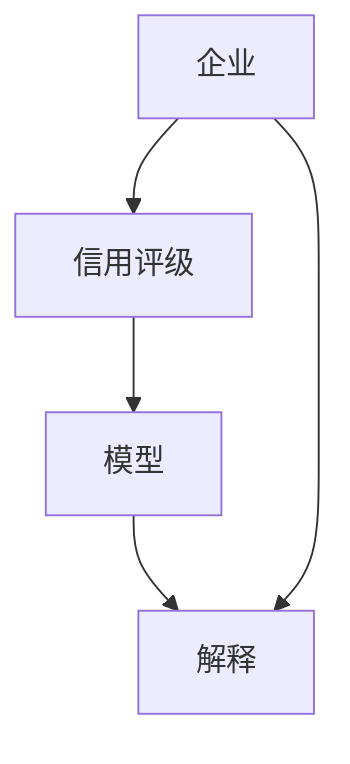
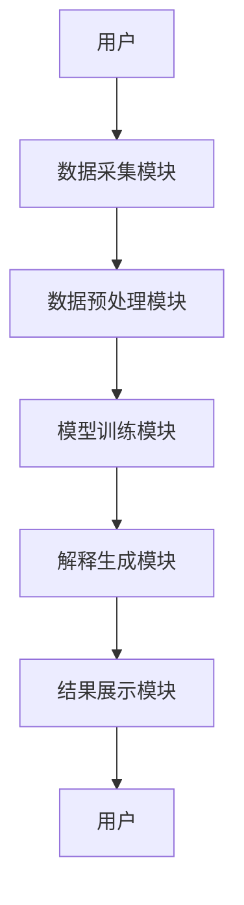

                 


# AI驱动的企业信用评级模型解释系统

> **关键词**：AI驱动、企业信用评级、模型解释、机器学习、NLP、系统架构

> **摘要**：本文将详细探讨如何利用人工智能技术构建一个可解释的企业信用评级模型解释系统。通过对背景介绍、核心概念、算法原理、系统架构设计及项目实战的逐步分析，揭示AI在企业信用评级中的潜力及实现路径。

---

# 第一部分: 企业信用评级与AI驱动解释系统背景

## 第1章: 企业信用评级的重要性

### 1.1 企业信用评级的定义与作用

企业信用评级是通过对企业的财务状况、经营能力、管理团队和市场环境等多方面进行综合评估，确定其信用等级的过程。信用评级结果直接影响企业的融资成本、合作伙伴的选择以及投资者的决策。

- **信用评级的定义**：信用评级是对企业信用风险的量化评估，反映了企业在履行债务时的可靠性。
- **信用评级的作用**：帮助金融机构识别风险，优化资源配置，降低违约风险。

### 1.2 传统信用评级的局限性

传统信用评级方法主要依赖于财务数据和经验判断，存在以下问题：

- **主观性**：依赖评级人员的主观判断，可能导致结果不一致。
- **数据局限性**：仅依赖财务数据，忽略了非结构化数据（如新闻、社交媒体）的价值。
- **透明度低**：评级过程缺乏透明，难以解释结果。

### 1.3 AI技术在信用评级中的潜力

AI技术，特别是机器学习和自然语言处理（NLP），可以有效解决传统信用评级的局限性：

- **数据处理能力**：AI能够处理结构化和非结构化数据，提供更全面的评估。
- **自动化与客观性**：AI算法减少人为干预，提高评估的客观性和一致性。
- **实时更新**：AI模型可以实时更新，捕捉市场变化，提高评级的及时性。

---

## 第2章: AI驱动解释系统的必要性

### 2.1 解释性AI（XAI）的概念

解释性AI（Explainable AI，XAI）是指AI系统能够以人类可理解的方式解释其决策过程。对于企业信用评级，XAI能够揭示模型的决策依据，增强信任度。

- **XAI的核心目标**：使用户能够理解AI模型的决策过程，确保结果的透明性和可解释性。
- **XAI在信用评级中的应用**：帮助用户理解模型如何得出信用评级，发现潜在风险。

### 2.2 企业信用评级中解释性的需求

- **监管合规性**：金融行业需要符合监管要求，解释模型的决策过程。
- **用户信任**：企业客户希望了解评级结果的依据，增强信任。
- **风险管理**：通过解释模型，识别潜在风险点，优化风险管理策略。

### 2.3 AI驱动解释系统的应用场景

- **贷款审批**：银行可以解释AI模型的决策，确保贷款审批的透明性。
- **投资决策**：投资者可以通过解释模型了解投资风险。
- **风险管理**：企业可以实时监控信用风险，采取预防措施。

---

## 第3章: 核心概念与联系

### 3.1 核心概念原理

- **输入数据**：包括企业的财务数据、市场数据、新闻数据等。
- **AI算法**：如随机森林、神经网络等，用于构建信用评级模型。
- **解释性方法**：如LIME和SHAP，用于解释模型的决策过程。

### 3.2 核心概念属性特征对比表

| 概念         | 输入数据 | AI算法 | 解释性方法 | 输出结果 |
|--------------|----------|--------|------------|----------|
| 传统信用评级 | 财务数据 | 专家判断 | 无         | 信用等级 |
| AI驱动模型 | 结构化+非结构化数据 | 机器学习模型 | LIME/SHAP | 信用等级+解释 |

### 3.3 ER实体关系图



---

## 第4章: 算法原理讲解

### 4.1 LIME算法详细讲解

LIME（Local Interpretable Model-agnostic Explanations）是一种用于解释机器学习模型的算法。其核心思想是通过扰动输入数据，生成局部可解释的模型。

- **LIME算法步骤**：
  1. 扰动输入数据，生成新的样本。
  2. 对新样本进行预测。
  3. 使用线性模型拟合扰动数据，生成解释。
  4. 输出解释结果。

- **数学模型**：
  $$ \text{权重} = \sum_{i=1}^{n} w_i x_i $$
  其中，$w_i$是权重，$x_i$是输入特征。

### 4.2 SHAP值详细讲解

SHAP（Shapley Additive exPlanations）是基于博弈论的解释方法，用于衡量每个特征对模型预测的贡献。

- **SHAP值计算公式**：
  $$ \text{SHAP值} = \phi_i = \sum_{S \subseteq \{i\}} \frac{|S|}{2^{n-1}} (f(S) - f(S \setminus \{i\})) $$

---

## 第5章: 系统分析与架构设计

### 5.1 系统功能设计

- **数据采集**：收集企业的财务数据、新闻数据等。
- **模型构建**：训练信用评级模型。
- **解释生成**：使用LIME或SHAP生成解释。

### 5.2 系统架构图



---

## 第6章: 项目实战

### 6.1 环境安装

- **安装Python**：确保安装Python 3.8以上版本。
- **安装依赖库**：`pip install pandas numpy scikit-learn lime`

### 6.2 核心代码实现

```python
import pandas as pd
from lime.lime_express import LimeExpress

# 示例数据加载
data = pd.read_csv('企业数据.csv')

# 训练模型
model = train_model(data)

# 使用LIME进行解释
explainer = LimeExpress()
explanation = explainer.explain_instance(data, model, "企业A")

# 输出解释
print(explanation)
```

### 6.3 案例分析

通过实际案例分析，展示AI驱动解释系统的应用效果，如识别关键风险因素，优化信用评级策略。

---

## 第7章: 总结与展望

### 7.1 最佳实践 tips

- **选择合适的解释方法**：根据需求选择LIME或SHAP等方法。
- **数据质量**：确保输入数据的准确性和完整性。

### 7.2 小结

AI驱动的企业信用评级模型解释系统通过结合机器学习和解释性方法，提高了信用评级的透明性和准确性，为企业和金融机构提供了有力支持。

### 7.3 注意事项

- **模型解释的局限性**：AI解释方法只能提供局部解释，无法完全替代人类判断。
- **数据隐私**：确保数据处理符合隐私保护法规。

### 7.4 拓展阅读

- 推荐阅读《可解释的机器学习》（Interpretable Machine Learning）。

---

**作者**：AI天才研究院 & 禅与计算机程序设计艺术

---

通过以上步骤，我们详细探讨了AI驱动的企业信用评级模型解释系统的各个方面，从背景到实现，为读者提供了全面的技术指导。

