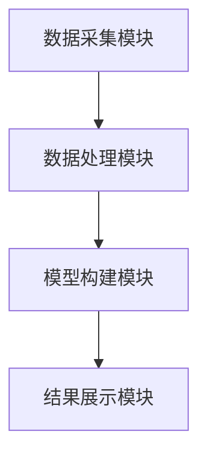
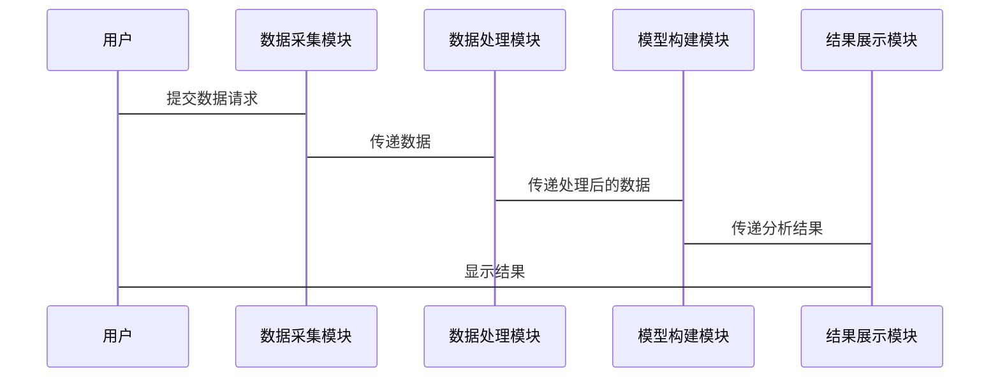

                 


# AI驱动的企业信用风险传导分析

## 关键词：人工智能，信用风险，风险传导，机器学习，金融分析

## 摘要：随着人工智能技术的快速发展，企业信用风险分析的手段也在不断进步。本文探讨了AI在信用风险传导分析中的应用，重点分析了AI驱动的信用风险传导模型及其在企业风险管理中的优势与挑战。通过详细讲解模型构建、算法原理、系统架构和项目实战，本文为读者提供了从理论到实践的全面指导。

---

# 第1章: 企业信用风险概述

## 1.1 信用风险的基本概念

### 1.1.1 信用风险的定义
信用风险是指债权人因债务人无法履行债务义务而可能遭受的损失。在企业经营中，信用风险贯穿于供应链管理、客户授信、投资决策等各个环节。

### 1.1.2 信用风险的表现形式
信用风险主要表现为：
- **客户违约风险**：客户未能按时偿还债务。
- **交易对手风险**：交易对手的信用状况变化导致的风险。
- **供应链风险**：供应链中的某一方出现问题，可能导致连锁反应。

### 1.1.3 信用风险对企业的影响
- **财务损失**：直接导致企业收入减少或资产损失。
- **声誉损失**：信用风险事件可能损害企业声誉。
- **运营风险**：信用问题可能影响企业的正常运营。

---

## 1.2 信用风险传导机制

### 1.2.1 信用风险传导的定义
信用风险传导是指信用风险从一个企业或行业向其他企业或行业扩散的过程。这种传导可能通过供应链、金融市场或宏观经济因素实现。

### 1.2.2 信用风险传导的路径
- **直接传导**：风险直接从一个企业传递到其供应商或客户。
- **间接传导**：风险通过金融市场（如债券市场、股票市场）传递到其他企业。
- **系统性传导**：整个金融系统中信用风险的扩散。

### 1.2.3 信用风险传导的影响因素
- **企业间关联性**：企业之间的依赖程度越高，风险传导越快。
- **市场流动性**：流动性不足时，风险传导可能加剧。
- **政策环境**：政策变化可能影响信用风险的传导路径。

---

## 1.3 传统信用风险分析方法

### 1.3.1 传统信用评分模型
传统的信用评分模型（如FICO评分）基于历史数据和统计分析，评估客户的信用状况。

### 1.3.2 传统信用风险分析的局限性
- 数据维度有限，难以捕捉复杂的风险因素。
- 模型的解释性较强，但预测能力较弱。
- 无法实时更新，难以应对快速变化的市场环境。

### 1.3.3 传统方法与AI驱动方法的对比
| 特性 | 传统方法 | AI驱动方法 |
|------|----------|------------|
| 数据使用 | 结构化数据为主 | 结构化、非结构化数据结合 |
| 模型复杂度 | 简单线性模型 | 高复杂度模型（如随机森林、神经网络） |
| 实时性 | 较差 | 较好 |
| 解释性 | 较高 | 较低（取决于模型类型） |

---

## 1.4 本章小结
本章介绍了信用风险的基本概念、传导机制以及传统分析方法。信用风险的复杂性和多样性使得传统方法难以满足现代企业的需求，AI技术的引入为信用风险分析提供了新的思路。

---

# 第2章: AI技术与信用风险分析

## 2.1 人工智能在信用风险分析中的应用

### 2.1.1 机器学习在信用评分中的应用
机器学习模型（如随机森林、XGBoost）能够处理大量非结构化数据，提高信用评分的准确性。

### 2.1.2 自然语言处理在信用风险分析中的应用
NLP技术可以分析企业财报、新闻报道等文本数据，提取潜在风险信号。

### 2.1.3 深度学习在信用风险预测中的应用
深度学习模型（如LSTM）能够捕捉时间序列数据中的复杂模式，适用于信用风险预测。

---

## 2.2 AI驱动信用风险分析的优势

### 2.2.1 数据处理能力的提升
AI技术能够处理海量数据，提取更多潜在风险因素。

### 2.2.2 模型复杂度的增加
AI模型能够捕捉非线性关系，提高预测精度。

### 2.2.3 实时分析能力的增强
AI技术支持实时数据分析，能够快速响应风险事件。

---

## 2.3 AI驱动信用风险分析的挑战

### 2.3.1 数据质量的问题
数据缺失、噪声等问题可能影响模型的准确性。

### 2.3.2 模型解释性的问题
复杂模型的可解释性较差，可能影响风险管理决策。

### 2.3.3 模型过拟合的风险
训练数据不足可能导致模型过拟合，降低泛化能力。

---

## 2.4 本章小结
AI技术为信用风险分析带来了显著优势，但在实际应用中仍需克服数据质量和模型解释性等挑战。

---

# 第3章: 企业信用风险传导的AI驱动分析模型

## 3.1 信用风险传导模型的构建

### 3.1.1 模型构建的基本思路
基于企业间的关联关系，构建信用风险传导模型，分析风险的扩散路径和影响程度。

### 3.1.2 模型构建的步骤
1. 数据收集：获取企业间的关联数据。
2. 关联关系分析：识别企业间的依赖关系。
3. 风险传导路径建模：使用图论方法建模风险传导路径。
4. 风险影响评估：评估风险传导对企业的影响。

---

## 3.2 基于机器学习的信用风险传导模型

### 3.2.1 机器学习算法的选择
常用的算法包括随机森林、XGBoost和LSTM。

### 3.2.2 模型训练与优化
- 数据预处理：特征选择、数据标准化。
- 模型训练：使用训练数据训练模型。
- 模型优化：调整超参数，提高预测精度。

### 3.2.3 模型评估与验证
- 评估指标：准确率、召回率、F1值。
- 验证方法：交叉验证、ROC曲线。

---

## 3.3 模型的可解释性与优化

### 3.3.1 模型解释性的提升方法
- 使用SHAP值解释模型预测结果。
- 可视化模型决策过程。

### 3.3.2 模型优化的策略
- 增加数据多样性。
- 优化特征选择。
- 调整模型结构。

### 3.3.3 模型稳定性的保障措施
- 数据分层抽样。
- 多模型融合。

---

## 3.4 本章小结
本章介绍了AI驱动的信用风险传导模型的构建过程，重点分析了机器学习算法的应用和模型优化策略。

---

# 第4章: 信用风险传导的系统架构与实现

## 4.1 系统架构设计

### 4.1.1 系统模块划分
- 数据采集模块：采集企业数据。
- 数据处理模块：清洗和预处理数据。
- 模型构建模块：构建信用风险传导模型。
- 结果展示模块：可视化分析结果。

### 4.1.2 系统功能设计
- 数据管理：支持数据上传、清洗和存储。
- 模型训练：支持多种算法训练模型。
- 风险分析：生成风险报告和可视化图表。
- 结果展示：展示风险传导路径和影响。

### 4.1.3 系统架构图


---

## 4.2 数据流与交互设计

### 4.2.1 数据流设计
- 数据从数据源流向数据采集模块。
- 数据经过处理后流向模型构建模块。
- 模型输出结果流向结果展示模块。

### 4.2.2 系统交互设计


---

## 4.3 系统实现与优化

### 4.3.1 系统实现的关键技术
- 数据处理：使用Python的Pandas库。
- 模型构建：使用Scikit-learn和XGBoost。
- 可视化：使用Matplotlib和Plotly。

### 4.3.2 系统优化的策略
- 优化数据处理流程。
- 采用分布式计算加速模型训练。
- 使用云平台部署系统。

### 4.3.3 系统实现的注意事项
- 数据安全：确保数据隐私。
- 系统稳定性：避免单点故障。

---

## 4.4 本章小结
本章详细介绍了信用风险传导分析系统的架构设计、数据流设计和实现优化策略。

---

# 第5章: 项目实战——AI驱动信用风险传导分析系统开发

## 5.1 项目环境搭建

### 5.1.1 开发环境的选择
推荐使用Python 3.8及以上版本，安装必要的库（如Pandas、Scikit-learn、XGBoost）。

### 5.1.2 开发工具的安装
安装Jupyter Notebook、PyCharm等开发工具。

### 5.1.3 数据集的准备
获取企业信用数据和关联数据，确保数据格式为CSV或Excel。

---

## 5.2 系统核心实现

### 5.2.1 数据预处理与特征提取
```python
import pandas as pd
from sklearn.preprocessing import StandardScaler

# 加载数据
data = pd.read_csv('credit_data.csv')

# 数据清洗
data.dropna(inplace=True)

# 特征选择
selected_features = ['revenue', 'profit', 'debt']
X = data[selected_features]
y = data['credit_risk']

# 数据标准化
scaler = StandardScaler()
X_scaled = scaler.fit_transform(X)
```

### 5.2.2 模型训练与优化
```python
from sklearn.ensemble import RandomForestClassifier
from sklearn.metrics import accuracy_score

# 训练模型
model = RandomForestClassifier(n_estimators=100, max_depth=5)
model.fit(X_scaled, y)

# 模型预测
y_pred = model.predict(X_scaled)

# 模型评估
print(accuracy_score(y, y_pred))
```

---

## 5.3 项目小结
本章通过实战项目，展示了AI驱动的信用风险传导分析系统的开发过程，包括环境搭建、数据处理、模型训练和结果展示。

---

# 作者：AI天才研究院 & 禅与计算机程序设计艺术

---

**本文通过系统化的分析和实践，深入探讨了AI技术在信用风险传导分析中的应用。从理论到实践，为读者提供了全面的指导。未来，随着AI技术的不断发展，信用风险分析将更加精准和高效。**

