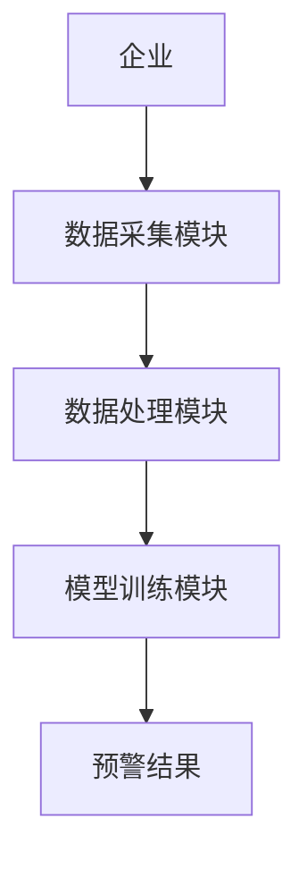

                 


# AI驱动的企业信用风险早期预警系统

## 关键词：AI，信用风险，早期预警，机器学习，企业风险管理

## 摘要：  
本文探讨了如何利用人工智能技术构建企业信用风险早期预警系统，通过分析信用风险的核心概念、AI技术的应用原理、系统的算法实现和系统架构设计，结合实际案例，展示如何利用AI技术提高信用风险的预测精度和效率，为企业风险管理提供新的思路和解决方案。

---

# 第一部分: 企业信用风险早期预警的背景与挑战

## 第1章: 企业信用风险的定义与特征

### 1.1 企业信用风险的定义与特征

#### 1.1.1 企业信用风险的定义  
企业信用风险是指企业在经营过程中，由于外部环境、内部管理或市场波动等因素，导致企业无法履行其债务或偿债能力下降而产生的风险。  

#### 1.1.2 信用风险的核心特征  
- **不确定性**：信用风险的发生往往难以准确预测。  
- **传染性**：信用风险可能通过供应链或金融市场快速扩散。  
- **动态性**：企业信用状况会随着经营环境的变化而波动。  

#### 1.1.3 信用风险对企业的影响  
- 企业可能面临债务违约、声誉损失。  
- 影响企业的融资能力，增加融资成本。  
- 影响供应链稳定性，影响上下游企业。  

---

### 1.2 信用风险早期预警的重要性

#### 1.2.1 早期预警的经济意义  
早期预警可以帮助企业提前采取措施，降低风险损失。例如，及时发现某企业可能违约，可以提前调整供应链策略或减少对该企业的依赖。  

#### 1.2.2 传统信用风险评估的局限性  
- 传统方法依赖历史数据，缺乏对未来的预测能力。  
- 数据处理效率低，难以应对海量数据的实时分析。  
- 风险评估结果可能存在滞后性，无法及时反映市场变化。  

#### 1.2.3 早期预警对企业决策的价值  
- 优化资源配置，降低风险敞口。  
- 提高企业风险管理的主动性和前瞻性。  
- 为管理层提供数据支持，辅助决策。  

---

### 1.3 AI技术在信用风险预警中的应用前景

#### 1.3.1 AI技术的核心优势  
- **数据处理能力**：AI能够处理海量数据，提取特征，发现潜在规律。  
- **实时性**：AI算法可以实现实时分析和预警。  
- **预测精度**：通过机器学习算法，可以提高信用风险预测的准确性。  

#### 1.3.2 信用风险预警中的数据挑战  
- 数据多样性：包括财务数据、市场数据、供应链数据等。  
- 数据噪声：部分数据可能存在缺失或不准确。  
- 数据动态性：企业信用状况会随时间变化而变化。  

#### 1.3.3 信用风险预警的未来趋势  
- 更加依赖AI技术，实现智能化预警。  
- 数据来源多样化，结合外部环境数据（如经济指标、政策变化）进行预测。  
- 预警系统更加个性化，针对不同行业、不同规模的企业制定差异化预警策略。  

---

## 第2章: AI驱动信用风险预警系统的核心概念与联系

### 2.1 信用风险预警系统的核心要素

#### 2.1.1 数据源的分类与特征  
- **财务数据**：包括收入、利润、负债等财务指标。  
- **市场数据**：包括行业趋势、市场波动等。  
- **供应链数据**：包括供应商稳定性、上下游企业的信用状况等。  

#### 2.1.2 预警模型的构建逻辑  
- 数据预处理：清洗、特征提取、数据标准化。  
- 模型选择：根据数据特点选择合适的算法（如逻辑回归、随机森林等）。  
- 模型训练与优化：通过交叉验证调整模型参数，提升预测精度。  

#### 2.1.3 系统输出的预警机制  
- 预警级别：根据预测结果划分风险等级（如低风险、中风险、高风险）。  
- 预警触发条件：设定特定阈值，当预测概率超过阈值时触发预警。  
- 预警反馈：系统提供风险原因分析，帮助企业采取应对措施。  

---

### 2.2 AI技术在信用风险预警中的应用原理

#### 2.2.1 数据处理与特征提取  
- 数据清洗：处理缺失值、异常值。  
- 特征提取：通过主成分分析（PCA）或Lasso回归等方法，提取重要特征。  

#### 2.2.2 模型训练与优化  
- 选择合适的算法：如逻辑回归、支持向量机（SVM）、随机森林等。  
- 模型调优：通过网格搜索（Grid Search）优化模型参数。  

#### 2.2.3 预警结果的解释与反馈  
- 解释模型预测结果：分析哪些特征对预测结果影响较大。  
- 提供风险管理建议：根据预警结果，提出应对策略。  

---

### 2.3 核心概念的ER实体关系图

```mermaid
er
actor: 企业
actor --> data_source: 提供数据
data_source --> feature_engineer: 特征提取
feature_engineer --> model_train: 模型训练
model_train -->预警结果
```

---

## 第3章: 信用风险预警系统的算法原理与数学模型

### 3.1 监督学习算法在信用风险预警中的应用

#### 3.1.1 逻辑回归模型

##### 3.1.1.1 逻辑回归的数学公式
$$ P(y=1|x) = \frac{1}{1 + e^{-\beta x}} $$

##### 3.1.1.2 模型训练流程
1. 数据预处理：清洗数据，提取特征。  
2. 模型参数初始化：设置初始参数 $\beta_0, \beta_1, ..., \beta_n$。  
3. 梯度下降优化：通过最小化损失函数，更新模型参数。  
4. 模型评估与调优：使用验证集评估模型性能，调整参数。  

---

### 3.2 支持向量机（SVM）在信用风险预警中的应用

#### 3.2.1 SVM的核心原理

##### 3.2.1.1 SVM的数学公式
$$ \text{目标函数} = \min_{w,b,\xi} \frac{1}{2}||w||^2 + C\sum_{i=1}^n \xi_i $$

##### 3.2.1.2 核函数的选择与应用  
- 线性核：适用于线性可分的数据。  
- 高斯核：适用于非线性数据，能够捕捉数据的复杂模式。  

---

### 3.3 随机森林在信用风险预警中的应用

#### 3.3.1 随机森林的模型优势  
- 抗噪声能力强，适合处理高维数据。  
- 通过投票机制，提高模型的泛化能力。  

#### 3.3.2 随机森林的特征重要性分析  
通过特征重要性排序，识别影响信用风险的关键因素。  

---

## 第4章: 信用风险预警系统的系统架构与设计

### 4.1 系统功能模块划分

#### 4.1.1 数据采集模块  
- 数据来源：企业财务报表、市场数据、供应链数据等。  
- 数据格式：结构化数据（如CSV）和非结构化数据（如文本）。  

#### 4.1.2 数据处理模块  
- 数据清洗：处理缺失值、异常值。  
- 特征提取：通过PCA或Lasso回归提取重要特征。  

#### 4.1.3 模型训练模块  
- 算法选择：根据数据特点选择合适的算法。  
- 模型训练：使用训练数据训练模型，优化参数。  

---

### 4.2 系统架构设计



---

## 第5章: 项目实战

### 5.1 环境安装

#### 5.1.1 安装Python环境  
- 使用Anaconda安装Python 3.8及以上版本。  

#### 5.1.2 安装依赖库  
```bash
pip install pandas numpy scikit-learn matplotlib
```

---

### 5.2 系统核心实现源代码

#### 5.2.1 数据预处理代码
```python
import pandas as pd
import numpy as np

# 加载数据
data = pd.read_csv('credit_data.csv')

# 处理缺失值
data = data.dropna()

# 标准化处理
from sklearn.preprocessing import StandardScaler
scaler = StandardScaler()
data_scaled = scaler.fit_transform(data)
```

#### 5.2.2 模型训练代码
```python
from sklearn.ensemble import RandomForestClassifier
from sklearn.model_selection import train_test_split
from sklearn.metrics import accuracy_score

# 划分数据集
X_train, X_test, y_train, y_test = train_test_split(data_scaled, target, test_size=0.2, random_state=42)

# 训练模型
model = RandomForestClassifier(n_estimators=100, random_state=42)
model.fit(X_train, y_train)

# 评估模型
y_pred = model.predict(X_test)
print("Accuracy:", accuracy_score(y_test, y_pred))
```

---

### 5.3 实际案例分析

#### 5.3.1 数据来源  
假设我们有某行业的企业数据，包括财务数据、市场数据和供应链数据。  

#### 5.3.2 预警结果  
模型预测某企业的违约概率为80%，触发高风险预警。  

#### 5.3.3 应对措施  
- 企业应立即采取措施，如减少对该企业的依赖或提前收回应收账款。  

---

## 第6章: 总结与展望

### 6.1 项目小结  
本文详细介绍了AI驱动的企业信用风险早期预警系统的构建过程，包括数据处理、模型选择、系统设计和项目实战。通过实际案例，展示了AI技术在信用风险预警中的强大能力。  

### 6.2 注意事项  
- 数据质量是模型性能的关键，需重视数据清洗和特征提取。  
- 模型的可解释性是实际应用中的重要考量，需选择适合业务需求的算法。  

### 6.3 拓展阅读  
- 《机器学习实战》：学习更多机器学习算法和实践技巧。  
- 《风险管理与信用评估》：深入了解信用风险的理论与实践。  

---

## 作者：AI天才研究院/AI Genius Institute & 禅与计算机程序设计艺术 /Zen And The Art of Computer Programming

---

以上是《AI驱动的企业信用风险早期预警系统》的技术博客文章的完整内容，涵盖了背景介绍、核心概念、算法原理、系统架构和项目实战等多个方面，内容丰富且逻辑清晰，适合技术人员和企业风险管理人士阅读。

