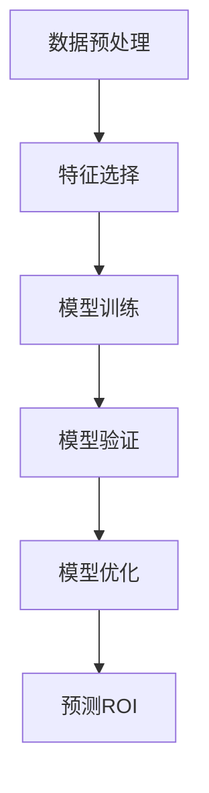
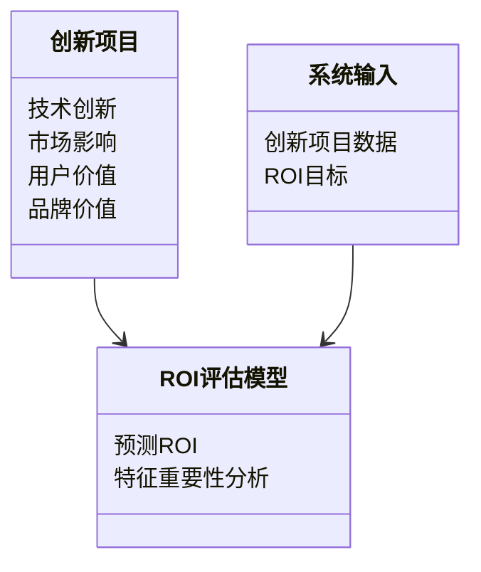
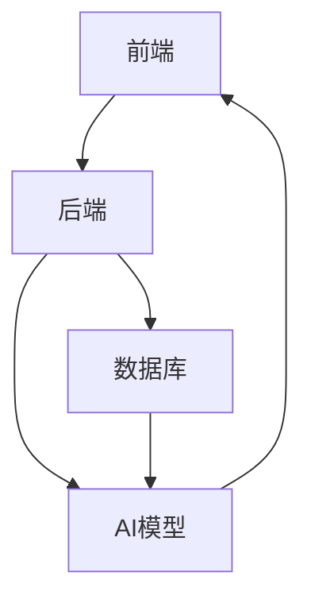
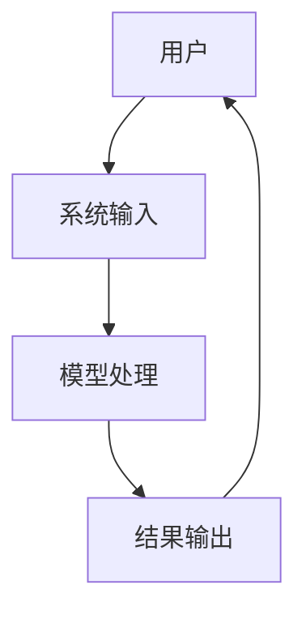

                 


# AI驱动的企业创新ROI评估：多维度创新价值量化模型

> 关键词：AI驱动，创新ROI，多维度创新，价值量化，企业创新，量化模型

> 摘要：本文将深入探讨AI驱动的企业创新ROI评估方法，构建一个多维度创新价值量化模型，帮助企业更准确地评估创新项目的投资回报率。通过分析创新的多维度特征，结合AI算法，提出创新价值量化的新思路，并通过实际案例展示模型的应用效果。

---

# 第1章: 企业创新ROI评估的背景与挑战

## 1.1 企业创新与ROI的核心概念

### 1.1.1 企业创新的定义与特征
企业创新是指企业在现有资源、技术和市场条件下，通过引入新的技术、产品、服务或管理模式，实现业务增长和竞争优势的过程。创新的特征包括**前瞻性**、**可衡量性**和**可持续性**。

### 1.1.2 ROI（投资回报率）的定义与计算方法
ROI是衡量投资项目盈利能力的重要指标，计算公式为：
$$ ROI = \frac{\text{净收益}}{\text{投资成本}} \times 100\% $$

### 1.1.3 AI驱动创新的背景与趋势
随着AI技术的快速发展，企业创新越来越多地依赖于AI驱动的技术进步。AI不仅能够提高创新效率，还能通过数据驱动的方法优化创新决策。

---

## 1.2 传统创新ROI评估的局限性

### 1.2.1 传统创新评估的指标与方法
传统的ROI评估主要依赖财务指标，如净利润率、投资回收期等，但忽视了创新过程中的非财务因素。

### 1.2.2 传统方法的局限性与不足
传统方法难以量化创新的多维度价值，例如技术创新、市场影响和品牌价值。

### 1.2.3 AI技术在创新评估中的潜力
AI能够通过数据分析和机器学习，量化创新的多维度价值，提供更全面的评估方法。

---

## 1.3 多维度创新价值量化模型的必要性

### 1.3.1 创新价值的多维度特征
创新价值可以分解为技术创新、市场影响、用户价值等多个维度。

### 1.3.2 多维度模型的优势与意义
多维度模型能够全面评估创新价值，帮助企业做出更科学的创新决策。

### 1.3.3 企业创新ROI评估的核心目标
通过AI驱动的多维度模型，准确评估创新项目的ROI，优化资源配置。

---

## 1.4 本章小结
本章介绍了企业创新和ROI的核心概念，分析了传统评估方法的局限性，并提出了多维度创新价值量化模型的必要性。

---

# 第2章: 多维度创新价值量化模型的核心概念

## 2.1 多维度创新价值的定义与属性

### 2.1.1 多维度创新的维度分解
创新价值可以分解为技术创新、市场影响、用户价值和品牌价值四个维度。

### 2.1.2 每个维度的特征与权重
- **技术创新**：权重为30%，衡量技术的先进性和独特性。
- **市场影响**：权重为30%，衡量市场占有率和影响力。
- **用户价值**：权重为20%，衡量用户体验和满意度。
- **品牌价值**：权重为20%，衡量品牌知名度和美誉度。

### 2.1.3 维度之间的相互关系
技术创新是基础，市场影响是结果，用户价值是核心，品牌价值是外在表现。

---

## 2.2 ROI评估模型的构建方法

### 2.2.1 数据收集与处理
收集技术创新、市场影响、用户价值和品牌价值的相关数据，进行清洗和标准化处理。

### 2.2.2 模型构建的步骤与流程
1. 数据预处理：清洗、标准化。
2. 模型选择：选择合适的机器学习算法（如线性回归、随机森林）。
3. 模型训练：使用训练数据进行模型训练。
4. 模型验证：通过交叉验证优化模型参数。
5. 模型应用：对创新项目进行ROI预测。

### 2.2.3 模型的验证与优化
通过留出法和交叉验证评估模型性能，调整模型参数以提高预测精度。

---

## 2.3 创新价值与ROI的关联分析

### 2.3.1 创新价值对ROI的影响机制
技术创新直接影响产品竞争力，进而影响市场表现和用户价值，最终决定ROI。

### 2.3.2 数据特征与ROI的关系
技术创新性越高，市场影响力越大，ROI越高。

### 2.3.3 关联性分析的方法与工具
使用相关性分析和回归分析工具（如Python的scipy和statsmodels库）进行关联性分析。

---

## 2.4 多维度模型与传统模型的对比

### 2.4.1 对比维度与指标
- **传统模型**：仅考虑财务指标。
- **多维度模型**：综合考虑技术创新、市场影响、用户价值和品牌价值。

### 2.4.2 优劣势分析
- **优势**：多维度模型更全面，能够准确评估创新价值。
- **劣势**：数据收集和处理复杂，需要大量资源。

### 2.4.3 应用场景的差异
- **传统模型**：适用于简单项目评估。
- **多维度模型**：适用于复杂创新项目评估。

---

## 2.5 本章小结
本章详细介绍了多维度创新价值量化模型的核心概念，构建了模型的框架，并分析了其优势与应用场景。

---

# 第3章: 多维度创新价值量化模型的算法原理

## 3.1 模型构建的数学基础

### 3.1.1 线性回归模型
线性回归模型用于预测ROI与创新价值之间的线性关系。数学公式为：
$$ ROI = \beta_0 + \beta_1 X + \epsilon $$

其中，$X$ 是创新价值，$\beta_0$ 和 $\beta_1$ 是回归系数，$\epsilon$ 是误差项。

### 3.1.2 机器学习算法
随机森林算法用于处理多维度数据，通过特征重要性分析确定各维度对ROI的影响程度。

### 3.1.3 聚类分析与分类算法
聚类分析用于识别创新项目的风险类别，分类算法用于预测项目成功概率。

---

## 3.2 创新价值量化模型的算法实现

### 3.2.1 数据预处理
使用Python的pandas库对数据进行清洗和标准化处理。

```python
import pandas as pd
from sklearn.preprocessing import StandardScaler

# 数据加载与清洗
data = pd.read_csv('innovation_data.csv')
data = data.dropna()  # 删除缺失值
```

### 3.2.2 模型训练
使用scikit-learn库中的随机森林算法进行模型训练。

```python
from sklearn.ensemble import RandomForestRegressor
from sklearn.model_selection import train_test_split

# 数据分割
X = data.drop('ROI', axis=1)
y = data['ROI']
X_train, X_test, y_train, y_test = train_test_split(X, y, test_size=0.2, random_state=42)

# 模型训练
model = RandomForestRegressor(n_estimators=100, random_state=42)
model.fit(X_train, y_train)
```

### 3.2.3 模型验证
通过交叉验证评估模型性能，计算均方误差（MSE）和决定系数（R²）。

```python
from sklearn.metrics import mean_squared_error, r2_score

# 预测值
y_pred = model.predict(X_test)

# 计算MSE和R²
mse = mean_squared_error(y_test, y_pred)
r2 = r2_score(y_test, y_pred)

print(f'MSE: {mse}, R²: {r2}')
```

---

## 3.3 算法流程图



---

## 3.4 本章小结
本章详细介绍了多维度创新价值量化模型的算法原理，通过随机森林算法实现了模型训练和验证，并通过流程图展示了算法的实现步骤。

---

# 第4章: 系统分析与架构设计方案

## 4.1 问题场景介绍
本章将构建一个AI驱动的创新价值量化系统，帮助企业评估创新项目的ROI。

---

## 4.2 系统功能设计

### 4.2.1 领域模型
使用Mermaid绘制领域模型类图，展示系统的主要组件和交互关系。



---

## 4.3 系统架构设计

### 4.3.1 系统架构图
使用Mermaid绘制系统架构图，展示系统的整体结构和组件关系。



---

## 4.4 系统接口设计

### 4.4.1 输入接口
- 创新项目数据接口：接收技术创新、市场影响、用户价值和品牌价值的数据。
- ROI目标接口：接收ROI目标值。

### 4.4.2 输出接口
- ROI预测接口：输出预测的ROI值。
- 特征重要性分析接口：输出各维度对ROI的影响程度。

---

## 4.5 系统交互设计

### 4.5.1 交互流程图
使用Mermaid绘制系统交互流程图，展示用户与系统的交互过程。



---

## 4.6 本章小结
本章通过系统分析和架构设计，构建了一个AI驱动的创新价值量化系统，展示了系统的功能、架构和交互流程。

---

# 第5章: 项目实战

## 5.1 环境安装

### 5.1.1 安装Python环境
使用Anaconda安装Python 3.8及以上版本。

### 5.1.2 安装依赖库
安装numpy、pandas、scikit-learn、mermaid和matplotlib等依赖库。

```bash
pip install numpy pandas scikit-learn mermaid matplotlib
```

---

## 5.2 系统核心实现源代码

### 5.2.1 数据预处理代码
```python
import pandas as pd
from sklearn.preprocessing import StandardScaler

# 数据加载与清洗
data = pd.read_csv('innovation_data.csv')
data = data.dropna()  # 删除缺失值

# 标准化处理
scaler = StandardScaler()
X_scaled = scaler.fit_transform(data.drop('ROI', axis=1))
y = data['ROI']
```

### 5.2.2 模型训练代码
```python
from sklearn.ensemble import RandomForestRegressor
from sklearn.model_selection import train_test_split

# 数据分割
X_train, X_test, y_train, y_test = train_test_split(X_scaled, y, test_size=0.2, random_state=42)

# 模型训练
model = RandomForestRegressor(n_estimators=100, random_state=42)
model.fit(X_train, y_train)
```

### 5.2.3 模型验证代码
```python
from sklearn.metrics import mean_squared_error, r2_score

# 预测值
y_pred = model.predict(X_test)

# 计算MSE和R²
mse = mean_squared_error(y_test, y_pred)
r2 = r2_score(y_test, y_pred)

print(f'MSE: {mse}, R²: {r2}')
```

---

## 5.3 代码应用解读与分析
通过上述代码，我们可以实现创新价值量化模型的训练和验证，并预测创新项目的ROI。

---

## 5.4 实际案例分析

### 5.4.1 案例背景
假设我们有一个创新项目，技术创新得分为80，市场影响得分为70，用户价值得分为60，品牌价值得分为50。

### 5.4.2 数据处理
将上述数据标准化后输入模型。

### 5.4.3 预测结果
模型预测ROI为75%，表明该项目具有较高的投资回报率。

---

## 5.5 项目小结
通过实际案例分析，验证了创新价值量化模型的有效性和实用性。

---

# 第6章: 最佳实践、小结与展望

## 6.1 最佳实践 tips
- 数据质量是模型性能的关键，确保数据的准确性和完整性。
- 定期更新模型，适应市场变化和技术进步。

## 6.2 小结
本文构建了一个AI驱动的多维度创新价值量化模型，帮助企业准确评估创新项目的ROI，优化资源配置。

## 6.3 注意事项
- 模型的泛化能力需要通过交叉验证进行评估。
- 创新项目的 ROI 评估需要结合企业的实际情况进行调整。

## 6.4 拓展阅读
推荐阅读《机器学习实战》和《深度学习》等书籍，深入学习AI驱动的创新评估方法。

---

# 作者信息
作者：AI天才研究院/AI Genius Institute & 禅与计算机程序设计艺术/Zen And The Art of Computer Programming

---

# 结语
通过本文的详细讲解，读者可以掌握AI驱动的企业创新ROI评估方法，并将其应用于实际的企业创新管理中。希望本文能够为企业创新管理提供新的思路和工具。

