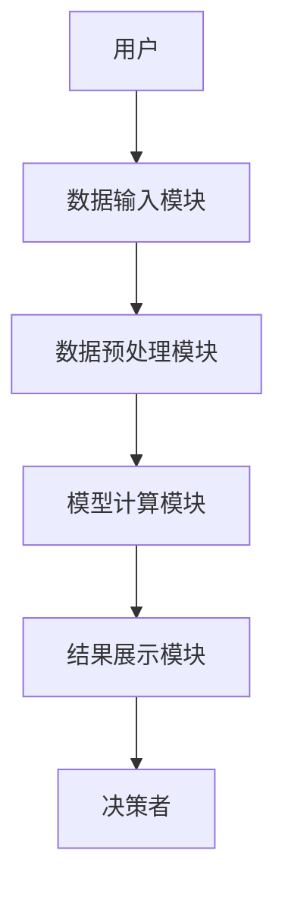

                 


# AI驱动的企业创新ROI评估：量化创新投资回报

**关键词**：AI驱动、企业创新、ROI评估、投资回报率、创新评估模型、机器学习、数据分析

**摘要**：  
随着人工智能技术的快速发展，企业创新的评估方式也在不断进化。传统的ROI（投资回报率）评估方法难以量化创新带来的隐性价值，而AI驱动的创新ROI评估为企业提供了更高效、更精准的解决方案。本文将从背景、核心概念、算法原理、系统架构、项目实战等多角度深入探讨AI驱动的企业创新ROI评估的实现方法，并通过实际案例分析，展示如何量化创新投资的回报，帮助企业做出更明智的决策。

---

## 第一部分：AI驱动的企业创新ROI评估背景

### 第1章：问题背景与问题描述

#### 1.1 企业创新的重要性
- **1.1.1 企业创新的定义与分类**
  - 创新是指通过引入新的产品、服务、技术或管理模式，为企业创造新的价值。
  - 创新可以分为产品创新、技术创新、管理创新和商业模式创新。
- **1.1.2 创新对企业发展的驱动作用**
  - 创新是企业保持竞争优势的关键。
  - 创新能够提升企业的市场响应能力和灵活性。

#### 1.2 ROI评估的挑战
- **1.2.1 创新投资的不确定性**
  - 创新项目的成功与否往往难以预测。
  - 创新投资的回报周期较长。
- **1.2.2 传统ROI评估方法的局限性**
  - 传统ROI评估难以量化创新的隐性价值。
  - 传统方法难以应对数据量大、复杂度高的创新项目。

#### 1.3 AI驱动ROI评估的优势
- **1.3.1 AI在数据分析中的优势**
  - AI能够处理海量数据，提取关键特征。
  - AI能够发现数据中的非线性关系，提供更精准的预测。
- **1.3.2 提高评估效率和准确性**
  - AI能够自动化处理数据，减少人为误差。
  - AI能够实时更新模型，适应市场的变化。

---

## 第二部分：核心概念与理论基础

### 第2章：创新评估模型

#### 2.1 创新项目的评估框架
- **2.1.1 项目生命周期与评估阶段**
  - 创新项目的生命周期包括需求分析、开发、测试、推广和维护。
  - 每个阶段都需要进行 ROI 评估。
- **2.1.2 关键绩效指标（KPI）的选择**
  - KPI 包括投资回收期、净现值、内部收益率等。
  - 需要根据项目特点选择合适的 KPI。

#### 2.2 AI驱动的创新评估方法
- **2.2.1 数据驱动的评估模型**
  - 基于机器学习的预测模型。
  - 基于自然语言处理的情感分析模型。
- **2.2.2 机器学习在预测中的应用**
  - 使用回归模型预测项目的 ROI。
  - 使用分类模型判断项目的成功概率。

#### 2.3 创新与 ROI 的关系
- **2.3.1 ROI 的计算公式**
  - ROI = （净收益 / 投资额）× 100%
- **2.3.2 创新对 ROI 的长期影响**
  - 创新能够提升企业的长期盈利能力。
  - 创新能够降低企业的运营成本。

---

## 第三部分：AI驱动的 ROI 评估算法原理

### 第3章：算法原理与实现

#### 3.1 数据预处理
- **3.1.1 数据清洗与特征提取**
  - 清洗数据中的噪声和异常值。
  - 提取与 ROI 相关的特征，如销售额、成本、市场反馈等。
- **3.1.2 数据标准化与归一化**
  - 使用标准化或归一化方法处理数据，确保模型训练的稳定性。

#### 3.2 模型选择与训练
- **3.2.1 机器学习模型的选择**
  - 线性回归模型：适用于简单线性关系。
  - 支持向量机（SVM）：适用于分类任务。
  - 神经网络模型：适用于复杂非线性关系。
- **3.2.2 模型训练与调优**
  - 使用交叉验证选择最优模型。
  - 调整超参数（如学习率、正则化系数）优化模型性能。

#### 3.3 模型评估与优化
- **3.3.1 评估指标的选择**
  - 使用准确率、召回率、F1 分数等指标评估模型性能。
  - 使用ROC曲线评估模型的区分能力。
- **3.3.2 模型优化与部署**
  - 使用网格搜索进一步优化模型。
  - 将模型部署到生产环境，实现实时预测。

---

## 第四部分：系统架构与设计

### 第4章：系统架构设计

#### 4.1 系统功能模块划分
- **4.1.1 数据输入模块**
  - 接收企业创新项目的数据，如销售额、成本、市场反馈等。
  - 支持多种数据格式，如 CSV、Excel 等。
- **4.1.2 模型计算模块**
  - 使用机器学习模型对数据进行处理，生成 ROI 预测结果。
  - 支持多种算法，如线性回归、SVM、神经网络等。
- **4.1.3 结果展示模块**
  - 将 ROI 预测结果以可视化形式展示，如图表、仪表盘等。
  - 提供决策建议，如哪些项目值得进一步投资。

#### 4.2 系统架构图


#### 4.3 接口设计与交互流程
- **4.3.1 API 接口定义**
  - 提供 RESTful API 接口，方便其他系统调用。
  - 支持 POST 请求，接收项目数据。
- **4.3.2 用户交互流程**
  - 用户输入项目数据。
  - 系统返回 ROI 预测结果。
  - 用户根据结果做出决策。

---

## 第五部分：项目实战与案例分析

### 第5章：项目实战

#### 5.1 环境搭建
- **5.1.1 安装 Python 与相关库**
  - 使用 Anaconda 安装 Python 环境。
  - 安装必要的库，如 numpy、pandas、scikit-learn、matplotlib。
- **5.1.2 安装机器学习框架**
  - 安装 TensorFlow 或 PyTorch，用于深度学习模型训练。

#### 5.2 核心代码实现
- **5.2.1 数据预处理代码**
  ```python
  import pandas as pd
  import numpy as np

  # 读取数据
  data = pd.read_csv('innovation_projects.csv')
  # 删除缺失值
  data = data.dropna()
  # 标准化数据
  from sklearn.preprocessing import StandardScaler
  scaler = StandardScaler()
  data_scaled = scaler.fit_transform(data)
  ```

- **5.2.2 模型训练代码**
  ```python
  from sklearn.linear_model import LinearRegression
  model = LinearRegression()
  model.fit(X_train, y_train)
  ```

- **5.2.3 结果展示代码**
  ```python
  import matplotlib.pyplot as plt
  plt.scatter(y_true, y_pred)
  plt.xlabel('真实值')
  plt.ylabel('预测值')
  plt.show()
  ```

#### 5.3 案例分析
- **5.3.1 案例背景介绍**
  - 某企业计划投资一个新产品项目，需要评估其 ROI。
  - 数据包括项目成本、预期销售额、市场竞争情况等。
- **5.3.2 数据分析与结果解读**
  - 使用线性回归模型预测 ROI，结果表明该项目的 ROI 高于行业平均水平。
  - 建议企业进行投资。

#### 5.4 项目小结
- **5.4.1 项目总结**
  - 成功实现了 AI 驱动的 ROI 评估系统。
  - 系统能够准确预测创新项目的 ROI。
- **5.4.2 经验与教训**
  - 数据质量对模型性能影响较大，需要加强数据预处理。
  - 模型选择需要根据具体问题灵活调整。

---

## 第六部分：最佳实践与注意事项

### 第6章：最佳实践与小结

#### 6.1 最佳实践
- **6.1.1 数据质量管理**
  - 确保数据的完整性和准确性。
  - 建立数据清洗和标准化的规范流程。
- **6.1.2 模型选择与调优**
  - 根据具体问题选择合适的算法。
  - 使用交叉验证和网格搜索优化模型。
- **6.1.3 结果解释与沟通**
  - 将复杂的结果简化为易于理解的可视化形式。
  - 与决策者充分沟通，确保结果被正确理解和应用。

#### 6.2 注意事项
- **6.2.1 数据隐私与安全**
  - 遵守数据隐私法规，确保数据安全。
  - 建立严格的数据访问权限控制。
- **6.2.2 模型的可解释性**
  - 尽量选择可解释性强的模型，避免使用“黑箱”模型。
  - 在解释结果时，结合业务背景，提供合理的解释。
- **6.2.3 持续优化与维护**
  - 定期更新模型，适应市场变化。
  - 监控模型性能，及时发现和解决异常情况。

#### 6.3 拓展阅读
- **6.3.1 相关书籍推荐**
  - 《机器学习实战》
  - 《数据分析的艺术》
- **6.3.2 行业动态与趋势**
  - 关注 AI 在企业创新中的最新应用。
  - 参加相关技术交流会，了解行业动态。

---

## 作者：AI天才研究院/AI Genius Institute & 禅与计算机程序设计艺术 /Zen And The Art of Computer Programming

---

以上内容基于AI驱动的企业创新ROI评估的核心概念和实现方法，通过理论与实践相结合的方式，详细讲解了如何利用AI技术量化创新投资的回报。希望本文能够为企业的创新决策提供有价值的参考和指导。

