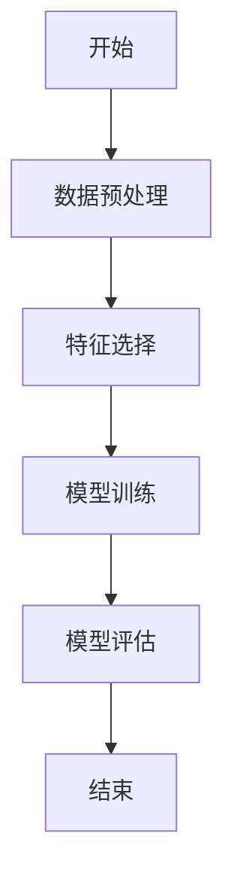
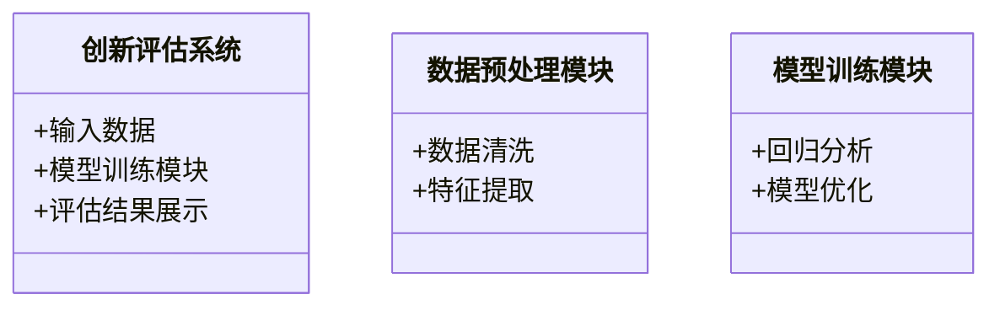

                 


# AI驱动的企业创新ROI评估：量化创新投资回报的多维度模型

> 关键词：AI驱动，创新ROI，多维度模型，企业创新，投资回报

> 摘要：本文深入探讨了如何利用人工智能技术构建多维度模型，量化企业创新投资回报（ROI）。通过分析创新投入与产出的关系，结合机器学习算法和数学建模，提出了一种能够覆盖多个维度的创新ROI评估模型，并详细阐述了该模型的构建逻辑、算法实现和实际应用。

---

# 第一部分：AI驱动的企业创新ROI评估背景与概念

## 第1章：AI驱动的企业创新ROI评估背景

### 1.1 问题背景与挑战

#### 1.1.1 传统企业创新评估的局限性
传统的创新评估方法往往依赖于主观判断和单维度指标，难以全面衡量创新的实际价值。企业创新涉及技术、市场、组织等多个维度，传统方法难以捕捉这些复杂因素的交互作用。

#### 1.1.2 数字化与AI驱动的创新评估趋势
随着人工智能技术的快速发展，企业开始利用AI技术来分析海量数据，提取创新活动的关键指标，从而实现更精准的创新评估。

#### 1.1.3 企业创新ROI评估的核心问题
创新ROI评估的核心问题是如何将创新活动与实际收益联系起来。传统方法难以量化创新活动对业务的实际贡献，而AI技术可以通过数据驱动的方法，实现创新投入与产出的动态关联。

---

### 1.2 问题描述与目标

#### 1.2.1 创新投资回报的定义与范围
创新ROI（Return on Innovation，ROI）是指创新活动为企业带来的净收益与创新投入的比值。它不仅包括直接的经济效益，还包括间接的组织能力提升和品牌价值。

#### 1.2.2 多维度评估模型的需求
为了全面评估创新ROI，需要构建一个包含技术、市场、组织等多个维度的模型，确保评估结果能够覆盖创新活动的全生命周期。

#### 1.2.3 模型的目标与应用场景
模型的目标是通过AI技术量化创新活动的投入与产出，为企业提供数据支持的决策依据。应用场景包括新产品开发、技术创新、组织优化等。

---

### 1.3 概念结构与核心要素

#### 1.3.1 创新投入的核心要素
创新投入包括研发投入、人力资源投入、时间投入等。

#### 1.3.2 创新产出的关键维度
创新产出包括新产品销量、市场份额、专利数量等。

#### 1.3.3 ROI评估的指标体系
ROI评估指标包括创新净现值（NPV）、投资回收期（ROI）、内部收益率（IRR）等。

---

# 第二部分：AI驱动的创新ROI评估模型构建

## 第2章：核心概念与联系

### 2.1 多维度模型的原理

#### 2.1.1 创新投入的多维度分解
创新投入可以分解为技术研发投入、人才培养投入、市场推广投入等。

#### 2.1.2 创新产出的多维度评估
创新产出可以评估为市场表现、技术领先性、组织能力提升等。

#### 2.1.3 ROI的综合计算方法
通过加权平均的方式，将各维度的评估结果综合起来，计算创新ROI。

---

### 2.2 模型核心概念对比

#### 2.2.1 创新投入与产出的对比分析
| 维度     | 创新投入       | 创新产出       |
|----------|----------------|----------------|
| 技术     | 研发投入       | 技术领先性     |
| 市场     | 市场推广投入   | 市场份额增长    |
| 组织     | 人力资源投入   | 组织能力提升    |

#### 2.2.2 模型的灵活性与可扩展性
模型可以根据企业的具体需求进行调整，支持不同维度的权重动态变化。

---

## 第3章：算法原理

### 3.1 回归分析模型

#### 3.1.1 线性回归模型
$$ ROI = \beta_0 + \beta_1x_1 + \beta_2x_2 + \dots + \beta_nx_n $$

其中，$x_i$代表创新投入的不同维度，$\beta_i$为回归系数。

#### 3.1.2 算法实现步骤


代码示例：
```python
import numpy as np
from sklearn.linear_model import LinearRegression

# 数据预处理
X = np.array([[x1, x2, x3], ...])
y = np.array([target_values])

# 模型训练
model = LinearRegression()
model.fit(X, y)

# 模型评估
score = model.score(X, y)
```

---

## 第4章：数学模型与公式

### 4.1 创新投入与产出的关系
创新投入与产出之间存在非线性关系，可以通过多元回归模型进行建模。

#### 4.1.1 创新净现值公式
$$ NPV = \sum_{t=1}^{n} \frac{CF_t}{(1+r)^t} $$

其中，$CF_t$为第$t$年的现金流，$r$为折现率。

#### 4.1.2 内部收益率公式
$$ IRR = r \text{ 使得 } NPV=0 $$

---

## 第5章：系统分析与架构设计

### 5.1 项目背景与需求分析

#### 5.1.1 项目背景
本项目旨在通过AI技术构建创新ROI评估系统，帮助企业量化创新活动的价值。

#### 5.1.2 系统功能设计


---

## 第6章：项目实战

### 6.1 环境配置与数据准备

#### 6.1.1 环境安装
需要安装Python、NumPy、Scikit-learn等依赖库。

#### 6.1.2 数据来源
可以从企业内部数据或公开数据集中获取创新投入与产出数据。

---

## 第7章：最佳实践与总结

### 7.1 小结
本文提出了一种基于AI的创新ROI评估模型，通过多维度分析和算法实现，为企业创新评估提供了新的思路。

### 7.2 注意事项
在实际应用中，需要根据企业的具体情况调整模型参数和权重。

### 7.3 未来趋势
随着AI技术的不断发展，创新ROI评估将更加智能化和精准化。

### 7.4 扩展阅读
推荐阅读相关领域的书籍和论文，深入理解AI在企业创新中的应用。

---

# 作者：AI天才研究院 & 禅与计算机程序设计艺术

