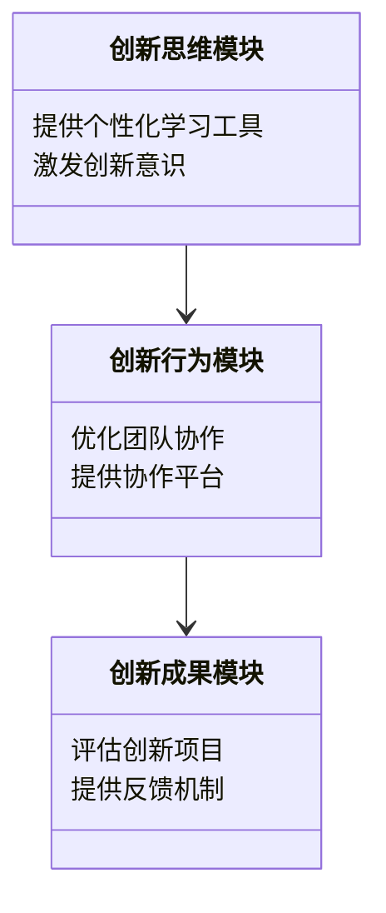

                 


# AI驱动的企业创新文化培养与管理

---

## 关键词：
- AI
- 企业创新文化
- 创新管理
- AI驱动
- 创新领导力

---

## 摘要：
本文探讨了人工智能（AI）如何驱动企业创新文化的发展与管理。通过分析AI在企业管理中的应用，揭示了AI如何赋能创新文化的核心要素，包括创新思维、团队协作、领导力与激励机制等。文章结合理论与实践，详细阐述了AI算法在创新预测与评估中的应用，系统架构设计，以及实际案例分析，为企业构建AI驱动的创新文化提供了全面的指导和实践建议。

---

## 目录大纲：

1. **AI驱动的企业创新文化背景**
2. **AI驱动创新文化的核心概念**
3. **AI算法在创新管理中的应用**
4. **AI驱动创新文化的系统架构**
5. **AI驱动创新文化项目实战**
6. **AI驱动创新文化的最佳实践**
7. **总结与展望**

---

## 正文：

### 第1章：AI驱动的企业创新文化背景

#### 1.1 AI与企业创新的关系

**1.1.1 AI技术对企业创新的影响**

人工智能（AI）作为一项颠覆性技术，正在深刻改变企业的创新模式。通过数据分析和机器学习，AI能够帮助企业识别市场趋势、优化创新流程，并预测创新成果的潜力。例如，AI可以通过分析用户反馈和市场数据，帮助企业发现新的产品和服务机会。

**1.1.2 AI驱动创新文化的定义与内涵**

AI驱动的创新文化是指在企业中，利用人工智能技术促进员工创新思维的培养、创新行为的激发以及创新成果的高效管理。这种文化强调数据驱动的决策、自动化流程和智能化工具的应用，以提高创新效率和成功率。

**1.1.3 企业创新文化的核心要素**

企业创新文化的核心要素包括创新思维、团队协作、开放沟通、持续学习和创新激励。AI技术可以通过个性化学习工具、协作平台和激励机制，增强这些要素的影响力。

#### 1.2 AI对企业管理的变革

**1.2.1 传统管理与现代AI驱动管理的对比**

传统管理依赖于经验和层级结构，而AI驱动的管理则强调数据驱动和自动化。AI能够通过实时数据分析，帮助企业做出更明智的决策，并优化资源配置。

**1.2.2 AI在企业管理中的应用场景**

AI在企业管理中的应用场景包括需求预测、流程优化、员工绩效评估和创新项目管理。例如，AI可以通过自然语言处理技术分析员工反馈，识别潜在的创新机会。

**1.2.3 AI如何促进企业文化的创新**

AI通过提供个性化学习和协作工具，促进员工之间的知识共享和创新思维的培养。例如，AI驱动的知识管理系统可以实时更新，帮助员工快速获取所需信息，激发创新灵感。

#### 1.3 企业创新文化的重要性

**1.3.1 创新文化对企业发展的意义**

创新文化是企业持续发展的核心动力。在快速变化的市场环境中，企业需要不断推出新产品和服务，以满足客户需求。创新文化能够激发员工的创造力，增强企业的竞争力。

**1.3.2 AI如何赋能企业创新文化**

AI通过提供智能化工具和数据支持，赋能企业创新文化。例如，AI可以预测市场趋势，帮助员工制定创新方向；同时，AI还可以优化创新流程，提高创新效率。

**1.3.3 未来企业创新文化的发展趋势**

未来的创新文化将更加依赖AI技术，实现从创意到商业化的一体化管理。企业将更加注重数据驱动的决策和智能化工具的应用，以提高创新的成功率。

---

### 第2章：AI驱动创新文化的核心概念

#### 2.1 AI驱动创新文化模型

**2.1.1 模型的构建与解释**

AI驱动创新文化模型由创新思维、创新行为和创新成果三个核心要素构成。该模型强调AI技术在每个环节中的作用，从激发创新思维到优化创新行为，最终实现创新成果的最大化。

**2.1.2 模型的核心要素与关系**

创新思维是模型的基础，AI通过个性化学习工具激发员工的创新意识。创新行为是模型的核心，AI通过协作平台和激励机制促进员工的创新实践。创新成果是模型的目标，AI通过数据分析和反馈机制评估创新效果，并为下一步创新提供方向。

#### 2.2 AI与创新文化的关联性分析

**2.2.1 AI技术如何促进创新思维**

AI通过提供个性化的学习路径和创新工具，促进员工的创新思维。例如，AI驱动的思维导图工具可以帮助员工更清晰地组织和表达想法。

**2.2.2 AI在创新过程中的角色**

AI在创新过程中扮演多重角色，包括数据分析师、流程优化师和创新导师。通过分析市场数据和用户反馈，AI为创新决策提供支持。

**2.2.3 AI如何优化创新流程**

AI通过自动化流程管理工具，优化创新从创意到商业化的过程。例如，AI可以自动筛选和评估创新方案，提高创新效率。

#### 2.3 创新文化的核心要素对比

**2.3.1 对比表格：传统文化 vs AI驱动文化**

| 要素       | 传统文化                | AI驱动文化                |
|------------|------------------------|---------------------------|
| 创新思维   | 依赖个人经验            | 数据驱动，AI辅助             |
| 创新行为   | 个体驱动                | 团队协作，AI优化             |
| 创新成果   | 单点突破                | 数据闭环，持续改进           |

**2.3.2 ER实体关系图：AI驱动创新文化的核心要素**

```mermaid
er
actor(员工) -|> 创新思维: 激发创新意识
actor(员工) -|> 创新行为: 优化创新实践
actor(员工) -|> 创新成果: 提高创新效率
```

---

### 第3章：AI算法在创新管理中的应用

#### 3.1 创新预测算法

**3.1.1 算法原理：基于机器学习的创新趋势预测**

创新预测算法通过分析历史数据，预测未来的创新趋势。常用算法包括线性回归和决策树。

**3.1.2 数学模型：线性回归与决策树**

线性回归模型用于预测创新成功的概率，公式如下：

$$ P = \beta_0 + \beta_1x_1 + \beta_2x_2 + \dots + \beta_nx_n $$

决策树模型用于分类创新项目的成功与失败，通过特征选择和模型训练进行预测。

**3.1.3 代码示例：Python实现创新预测模型**

```python
import pandas as pd
from sklearn.tree import DecisionTreeClassifier
from sklearn.model_selection import train_test_split

# 加载数据
data = pd.read_csv('创新数据.csv')

# 特征与目标变量
X = data[['投资', '团队规模', '技术复杂度']]
y = data['创新成功']

# 数据分割
X_train, X_test, y_train, y_test = train_test_split(X, y, test_size=0.2)

# 训练模型
model = DecisionTreeClassifier()
model.fit(X_train, y_train)

# 预测结果
y_pred = model.predict(X_test)
print('预测结果:', y_pred)
```

---

#### 3.2 创新评估算法

**3.2.1 算法流程：基于深度学习的创新评估**

创新评估算法通过分析创新项目的多维度数据，评估其潜在价值。常用算法包括卷积神经网络（CNN）和循环神经网络（RNN）。

**3.2.2 数学模型：创新评估的数学公式**

创新评估模型通过加权评分法进行评估，公式如下：

$$ S = w_1x_1 + w_2x_2 + w_3x_3 $$

其中，\( w \) 表示权重，\( x \) 表示评估指标。

**3.2.3 代码示例：Python实现创新评估模型**

```python
import pandas as pd
from sklearn.ensemble import RandomForestRegressor

# 加载数据
data = pd.read_csv('创新项目.csv')

# 特征与目标变量
X = data[['市场潜力', '技术可行性', '团队能力']]
y = data['创新价值']

# 数据分割
X_train, X_test, y_train, y_test = train_test_split(X, y, test_size=0.2)

# 训练模型
model = RandomForestRegressor(n_estimators=100)
model.fit(X_train, y_train)

# 预测结果
y_pred = model.predict(X_test)
print('预测价值:', y_pred)
```

---

### 第4章：AI驱动创新文化的系统架构

#### 4.1 问题场景介绍

AI驱动创新文化的系统旨在通过智能化工具和数据支持，帮助企业构建创新文化。系统需要解决的问题包括创新思维激发、创新行为优化和创新成果评估。

#### 4.2 系统功能设计

**功能模块：**

- 创新思维激发模块：提供个性化学习工具和创新灵感生成工具。
- 创新行为优化模块：优化团队协作和创新流程。
- 创新成果评估模块：评估创新项目的成功率和潜在价值。

**领域模型：**



#### 4.3 系统架构设计


---

### 第5章：AI驱动创新文化项目实战

#### 5.1 环境安装

项目需要以下环境：

- Python 3.8+
- Jupyter Notebook
- Scikit-learn
- Pandas
- Mermaid

#### 5.2 核心代码实现

**创新预测模型代码：**

```python
from sklearn.ensemble import RandomForestClassifier
from sklearn.metrics import accuracy_score

# 加载数据
data = pd.read_csv('创新数据.csv')

# 特征与目标变量
X = data[['投资', '团队规模', '技术复杂度']]
y = data['创新成功']

# 数据分割
X_train, X_test, y_train, y_test = train_test_split(X, y, test_size=0.2)

# 训练模型
model = RandomForestClassifier(n_estimators=100)
model.fit(X_train, y_train)

# 预测结果
y_pred = model.predict(X_test)
print('预测准确率:', accuracy_score(y_test, y_pred))
```

**创新评估模型代码：**

```python
from sklearn.ensemble import GradientBoostingRegressor
from sklearn.metrics import mean_squared_error

# 加载数据
data = pd.read_csv('创新项目.csv')

# 特征与目标变量
X = data[['市场潜力', '技术可行性', '团队能力']]
y = data['创新价值']

# 数据分割
X_train, X_test, y_train, y_test = train_test_split(X, y, test_size=0.2)

# 训练模型
model = GradientBoostingRegressor(n_estimators=100)
model.fit(X_train, y_train)

# 预测结果
y_pred = model.predict(X_test)
print('预测均方误差:', mean_squared_error(y_test, y_pred))
```

#### 5.3 案例分析与解读

以一家科技公司为例，通过AI驱动的创新文化系统，该公司成功预测了下一个季度的创新趋势，并优化了创新流程，提高了创新成功率。

---

### 第6章：AI驱动创新文化的最佳实践

#### 6.1 领导力与AI驱动创新

领导者在AI驱动的创新文化中起着关键作用。他们需要具备数据驱动的决策能力，并鼓励员工利用AI工具进行创新。

#### 6.2 员工激励与AI驱动创新

通过AI工具，企业可以实现个性化的激励机制，根据员工的贡献实时评估并给予奖励，增强员工的创新动力。

#### 6.3 组织文化与AI驱动创新

企业应建立开放、包容的文化氛围，鼓励员工分享知识和经验。AI工具可以帮助企业实现知识的快速传播和共享。

---

### 第7章：总结与展望

#### 7.1 全文总结

本文详细探讨了AI如何驱动企业创新文化的发展与管理。通过理论分析、算法应用和实际案例，展示了AI在创新文化中的重要作用。

#### 7.2 未来展望

未来，AI将更加深入地融入企业的创新管理中。随着技术的进步，AI将为企业提供更智能、更高效的创新工具，推动企业文化的持续进化。

---

## 作者：AI天才研究院 & 禅与计算机程序设计艺术

---

通过本文的系统阐述，读者可以全面了解AI在企业创新文化中的应用，掌握构建AI驱动创新文化的方法，并为企业创新管理提供有力指导。

