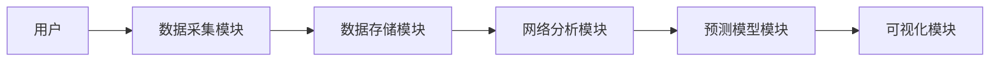
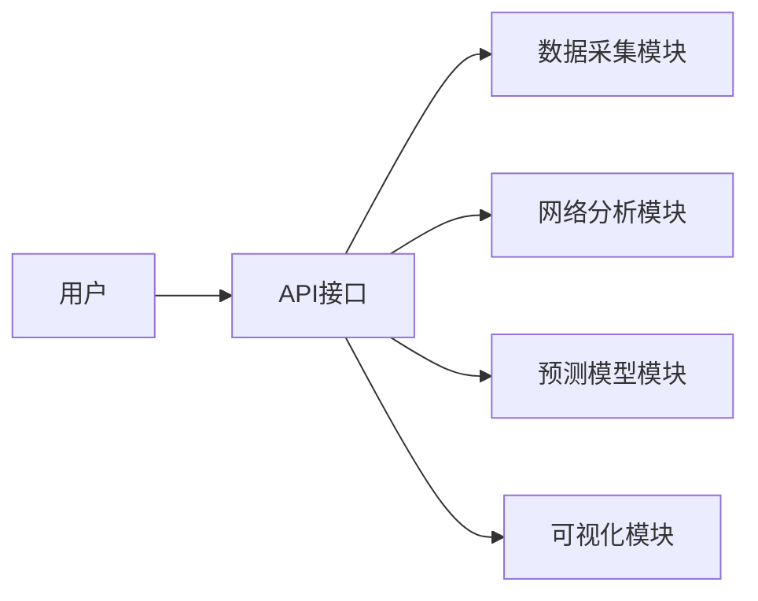

                 


# AI驱动的企业创新生态系统分析：内外部创新网络

> 关键词：AI驱动，企业创新生态系统，内部创新网络，外部创新网络，创新预测模型，社会网络分析

> 摘要：本文探讨了AI驱动的企业创新生态系统，重点分析了内部与外部创新网络的协同作用。通过社会网络分析和AI算法，我们揭示了创新网络的动态关系，并构建了基于AI的创新预测模型。文章还详细介绍了系统架构设计和项目实战，为企业的创新管理提供了理论与实践指导。

---

## 第1章: AI驱动的企业创新生态系统背景

### 1.1 企业创新生态系统的基本概念

#### 1.1.1 企业创新的定义与特征
企业创新是指企业在产品、服务、技术、管理等各个方面进行改进和革新的过程。其核心特征包括：

- **持续性**：创新是一个持续的过程，而非一次性事件。
- **多样性**：创新可以是 incremental（渐进式）或 radical（突破式）。
- **系统性**：创新涉及企业内外部的多个要素和系统。

#### 1.1.2 企业创新生态系统的核心要素
企业创新生态系统由以下核心要素构成：

1. **企业内部资源**：包括技术、资金、人才等。
2. **外部资源**：包括合作伙伴、供应商、客户、学术机构等。
3. **创新网络**：内部与外部资源的连接与协作。

#### 1.1.3 AI在企业创新中的作用
AI通过数据分析、模式识别和自动化工具，帮助企业发现创新机会、优化创新流程并提升创新效率。

---

### 1.2 内部与外部创新网络的定义

#### 1.2.1 内部创新网络的构成
内部创新网络是指企业在内部形成的创新协作网络，包括：

- **员工**：研发团队、产品经理等。
- **部门**：技术部门、市场部门等。
- **项目**：创新项目之间的协作。

#### 1.2.2 外部创新网络的构成
外部创新网络是指企业外部的创新资源，包括：

- **合作伙伴**：供应商、客户、渠道商。
- **创新生态系统**：学术机构、孵化器、创投机构。
- **市场**：竞争对手、行业趋势。

#### 1.2.3 内外部创新网络的协同作用
内外部创新网络的协同作用体现在：

- **资源共享**：内部资源与外部资源的结合。
- **知识流动**：内部与外部知识的共享与传播。
- **创新加速**：通过内外部协作，加快创新速度。

---

## 第2章: AI驱动企业创新生态系统的核心概念

### 2.1 AI与企业创新的结合点

#### 2.1.1 数据驱动的创新
AI通过分析企业内外部数据，识别潜在的创新机会。例如：

- **市场数据**：分析消费者需求，发现新产品机会。
- **技术数据**：分析技术趋势，预测技术发展方向。

#### 2.1.2 智能化创新工具的应用
AI工具可以帮助企业进行：

- **创新预测**：预测哪些创新项目可能成功。
- **创新路径优化**：优化创新流程，减少资源浪费。
- **创新协作**：通过AI辅助的协作平台，提升内部与外部的协作效率。

#### 2.1.3 创新网络的优化
AI可以帮助企业优化创新网络的结构，例如：

- **网络密度优化**：通过分析网络密度，找到最佳协作模式。
- **网络模块化优化**：将网络划分为多个模块，提升协作效率。

---

## 第3章: AI驱动企业创新生态系统的算法原理

### 3.1 创新网络分析的算法基础

#### 3.1.1 社会网络分析（SNA）简介
社会网络分析（SNA）是一种研究网络结构的方法，常用于分析创新网络。以下是SNA的核心概念：

- **节点**：网络中的个体或组织。
- **边**：节点之间的连接。
- **网络密度**：边的数量与可能边数的比值。

#### 3.1.2 图论在创新网络中的应用
图论是分析创新网络的重要工具，以下是常见的图论概念：

- **连通性**：网络中节点是否连通。
- **中心性**：节点在网络中的重要程度。
- **模块化**：网络的分簇程度。

#### 3.1.3 AI算法在创新网络分析中的应用
AI算法（如机器学习）可以用于创新网络分析，例如：

- **聚类分析**：将相似的节点分组。
- **分类算法**：预测节点的创新潜力。

---

### 3.2 基于AI的创新预测模型

#### 3.2.1 创新潜力评估模型
创新潜力评估模型用于预测某个创新项目成功的可能性。以下是模型的公式：

$$ P = \frac{\sum_{i=1}^{n} w_i x_i}{\sum_{i=1}^{n} w_i} $$

其中，$P$ 是创新潜力，$w_i$ 是权重，$x_i$ 是特征值。

#### 3.2.2 创新路径预测模型
创新路径预测模型用于预测创新项目的路径。以下是模型的公式：

$$ P(path) = \prod_{i=1}^{m} P(step_i) $$

其中，$P(step_i)$ 是第 $i$ 步的概率。

#### 3.2.3 创新成果预测模型
创新成果预测模型用于预测创新项目的成果。以下是模型的公式：

$$ R = \beta_0 + \beta_1 X_1 + \beta_2 X_2 + \cdots + \beta_n X_n $$

其中，$R$ 是创新成果，$\beta_i$ 是回归系数，$X_i$ 是特征变量。

---

## 第4章: 系统分析与架构设计方案

### 4.1 创新生态系统分析的系统架构

#### 4.1.1 系统功能模块划分
创新生态系统分析系统包括以下功能模块：

- **数据采集模块**：采集企业内外部数据。
- **网络分析模块**：分析创新网络结构。
- **预测模型模块**：预测创新潜力和路径。
- **可视化模块**：展示分析结果。

#### 4.1.2 系统架构设计
以下是系统架构的mermaid图：



#### 4.1.3 系统接口设计
以下是系统接口的mermaid图：



---

## 第5章: 项目实战——基于AI的创新网络分析

### 5.1 项目背景与目标

#### 5.1.1 项目背景
某科技公司希望通过AI技术优化其创新网络，提升创新效率。

#### 5.1.2 项目目标
- 分析内部与外部创新网络。
- 构建创新预测模型。
- 提供创新管理建议。

---

### 5.2 系统实现

#### 5.2.1 环境安装
以下是项目所需的环境：

- Python 3.8+
- Pandas、NetworkX、Scikit-learn、Plotly

```bash
pip install pandas networkx scikit-learn plotly
```

#### 5.2.2 核心代码实现

以下是创新预测模型的代码实现：

```python
import pandas as pd
from sklearn.linear_model import LinearRegression
from sklearn.metrics import r2_score

# 数据加载
data = pd.read_csv('innovation.csv')

# 特征选择
X = data[['R&D Investment', 'Collaboration Frequency']]
y = data['Innovation Success']

# 模型训练
model = LinearRegression()
model.fit(X, y)

# 模型评估
y_pred = model.predict(X)
print(f"R² Score: {r2_score(y, y_pred)}")
```

#### 5.2.3 案例分析
以某科技公司为例，分析其创新网络：

- **内部网络**：研发团队协作紧密，创新效率较高。
- **外部网络**：与合作伙伴协作较少，创新潜力未完全释放。

---

## 第6章: 最佳实践与未来展望

### 6.1 最佳实践 tips

1. **数据质量**：确保数据的准确性和完整性。
2. **模型选择**：根据实际需求选择合适的模型。
3. **网络优化**：定期优化创新网络结构。

### 6.2 小结
本文详细探讨了AI驱动的企业创新生态系统，重点分析了内部与外部创新网络的协同作用，并通过实际案例展示了AI在创新管理中的应用。

### 6.3 注意事项
- 创新网络分析需要结合企业的实际情况。
- AI模型需要不断更新和优化。

### 6.4 拓展阅读
- 《Network Science》
- 《Machine Learning for Business》

---

## 作者：AI天才研究院/AI Genius Institute & 禅与计算机程序设计艺术 /Zen And The Art of Computer Programming

