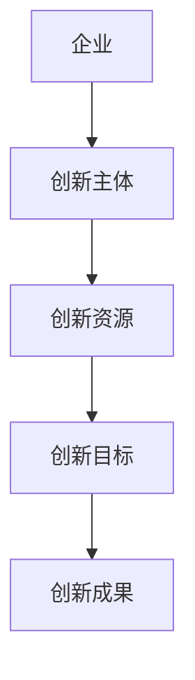
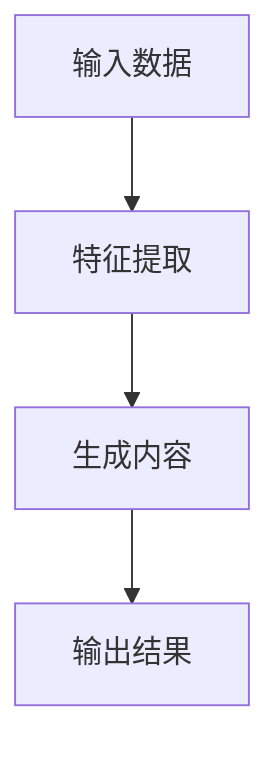
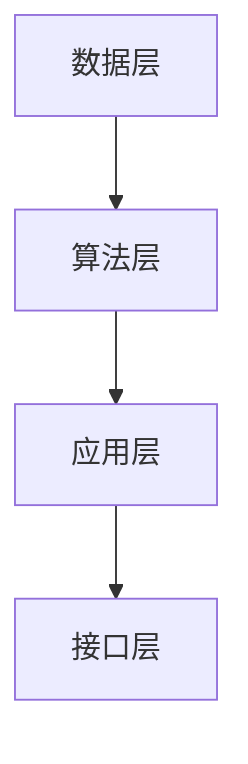
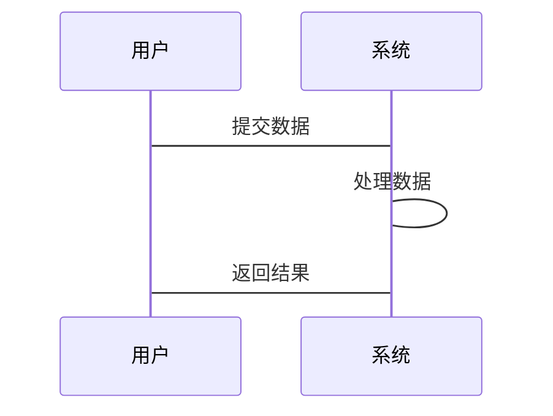

                 


# AI驱动的企业创新生态系统构建与管理

---

## 关键词
- AI驱动
- 企业创新
- 生态系统
- 系统构建
- 管理策略
- 创新管理

---

## 摘要
随着人工智能技术的快速发展，企业创新模式正在发生深刻变革。AI不仅能够提升企业的创新能力，还能优化创新过程，构建高效的企业创新生态系统。本文将从背景、核心概念、算法原理、系统架构、项目实战、最佳实践等多个维度，详细探讨如何利用AI技术构建和管理企业创新生态系统。通过理论分析与实践案例相结合，本文旨在为企业提供一套系统化的创新管理方法，助力企业在数字化转型中保持竞争优势。

---

# 第1章: AI驱动的企业创新生态系统概述

## 1.1 问题背景与问题描述
### 1.1.1 传统企业创新模式的局限性
- 传统创新依赖线性思维，忽视跨领域协作
- 内部资源有限，难以快速响应市场变化
- 创新过程缺乏数据驱动，效率低下

### 1.1.2 AI技术对企业创新的驱动作用
- 数据分析与预测提升创新方向准确性
- 自动化处理加速创新过程
- 跨领域知识整合激发创新灵感

### 1.1.3 企业创新生态系统的核心问题
- 如何整合内部与外部资源
- 如何利用AI技术优化创新流程
- 如何构建可持续的创新机制

## 1.2 问题解决与边界
### 1.2.1 AI驱动企业创新的解决方案
- 数据驱动的创新机会识别
- 智能化创新过程管理
- 跨界协作的创新生态构建

### 1.2.2 企业创新生态系统的边界与外延
- 内部创新 vs 外部创新
- 短期目标 vs 长期目标
- 局部优化 vs 全局优化

### 1.2.3 核心要素与系统结构
- 核心要素：数据、算法、人才、资源
- 系统结构：数据层、算法层、应用层

## 1.3 核心概念与联系
### 1.3.1 AI驱动的创新生态系统原理
- 数据是基础，算法是工具，人才是关键
- 跨界协作是手段，可持续发展是目标

### 1.3.2 核心概念属性对比
| 概念       | 属性1：数据驱动 | 属性2：智能化 | 属性3：协作性 |
|------------|----------------|--------------|--------------|
| 传统创新   | 低             | 低            | 有限          |
| AI驱动创新 | 高             | 高            | 强            |

### 1.3.3 ER实体关系图


## 1.4 本章小结
本章通过分析AI技术对企业创新的驱动作用，阐述了企业创新生态系统的核心问题和解决思路，为后续章节的系统构建奠定了基础。

---

# 第2章: AI驱动的企业创新生态系统构建原理

## 2.1 核心概念原理
### 2.1.1 AI技术在企业创新中的应用
- 数据分析与预测：识别市场趋势，优化资源配置
- 自然语言处理：挖掘文本数据，提取创新灵感
- 生成式模型：辅助创意生成，加速产品开发

### 2.1.2 创新生态系统构建的理论基础
- 复杂自适应系统理论
- 网络理论与协作创新
- 数据驱动决策理论

### 2.1.3 AI驱动的创新机制
- 数据驱动的决策支持
- 智能化的协作平台
- 自适应的创新流程

## 2.2 算法原理讲解
### 2.2.1 生成式模型
#### 算法流程


#### 代码实现
```python
def generate(content):
    features = extract_features(content)
    model = load_model("ai_model")
    result = model.predict(features)
    return result
```

#### 数学模型
$$P(\text{output}) = \prod_{i=1}^{n} P(y_i|x_{\text{prev}}, y_{\text{prev}})$$

#### 示例分析
- 输入：市场需求报告
- 输出：创新产品概念
- 应用：辅助产品设计

### 2.2.2 算法优缺点
| 算法类型     | 优点                   | 缺点                     |
|--------------|------------------------|--------------------------|
| 生成式模型   | 高度创造性，多样化输出   | 训练复杂，计算资源消耗大 |
| 基于规则的模型 | 简单易控，可解释性高     | 创新能力有限             |

## 2.3 系统分析与架构设计
### 2.3.1 问题场景介绍
- 问题场景：如何利用AI技术优化企业的创新流程
- 问题目标：提升创新效率，降低创新成本

### 2.3.2 系统功能设计
- 数据采集与处理：收集市场、技术、用户数据
- 算法应用：分析数据，生成创新建议
- 应用展示：可视化创新结果，辅助决策

### 2.3.3 系统架构设计


### 2.3.4 系统接口设计
- 数据接口：REST API
- 应用接口：图形界面

### 2.3.5 系统交互流程


## 2.4 本章小结
本章详细讲解了AI驱动的企业创新生态系统的核心原理，包括算法选择与实现，系统架构设计等内容，为后续的系统实现奠定了基础。

---

# 第3章: 项目实战——AI驱动的智能客服系统

## 3.1 项目背景与目标
- 项目背景：传统客服效率低，客户体验差
- 项目目标：利用AI技术提升客服效率与客户满意度

## 3.2 环境安装与配置
- 安装Python、TensorFlow、Keras等工具
- 配置开发环境

## 3.3 核心代码实现
### 3.3.1 数据预处理
```python
import pandas as pd

data = pd.read_csv('customer_data.csv')
```

### 3.3.2 模型训练
```python
from tensorflow.keras import layers

model = tf.keras.Sequential([
    layers.Dense(64, activation='relu'),
    layers.Dense(1, activation='sigmoid')
])
model.compile(optimizer='adam', loss='binary_crossentropy')
model.fit(data, labels, epochs=10, batch_size=32)
```

### 3.3.3 模型部署
```python
def predict(data):
    return model.predict(data)
```

## 3.4 代码解读与分析
- 数据预处理：清洗、归一化
- 模型训练：深度学习模型，分类任务
- 模型部署：API接口，实时预测

## 3.5 案例分析与结果展示
- 案例分析：客户咨询分类
- 结果展示：分类准确率，客户满意度提升

## 3.6 项目小结
通过本项目，验证了AI技术在企业创新中的应用价值，提升了企业的运营效率。

---

# 第4章: 最佳实践与注意事项

## 4.1 最佳实践
### 4.1.1 数据质量管理
- 数据清洗、去重、标注
- 数据安全与隐私保护

### 4.1.2 模型优化策略
- 调参、数据增强、模型融合

### 4.1.3 系统维护与升级
- 定期更新模型
- 监控系统性能

## 4.2 注意事项
### 4.2.1 数据隐私与合规性
- 遵守数据保护法规
- 确保数据使用合规

### 4.2.2 系统稳定性与可靠性
- 定期备份
- 容错设计

## 4.3 拓展阅读
- 推荐书籍：《人工智能：一种现代方法》
- 推荐博客：AI与创新管理

## 4.4 本章小结
本章总结了AI驱动的企业创新生态系统构建与管理中的最佳实践和注意事项，为企业实际应用提供了参考。

---

## 作者：AI天才研究院 & 禅与计算机程序设计艺术

---

通过以上思考过程，我逐步构建了《AI驱动的企业创新生态系统构建与管理》的目录大纲，确保内容全面、逻辑清晰，从理论到实践，为企业提供系统的创新管理方法。

