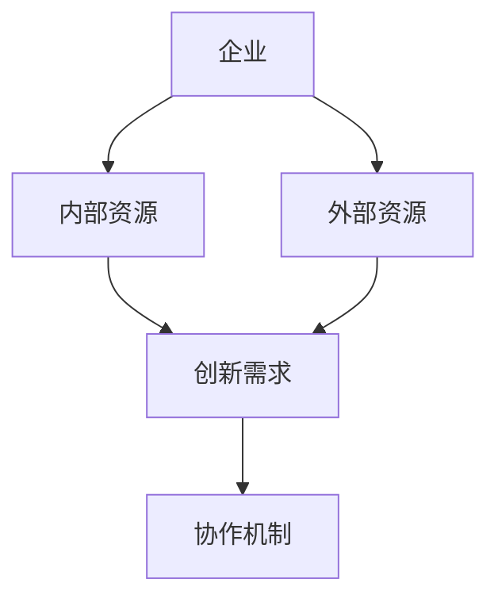
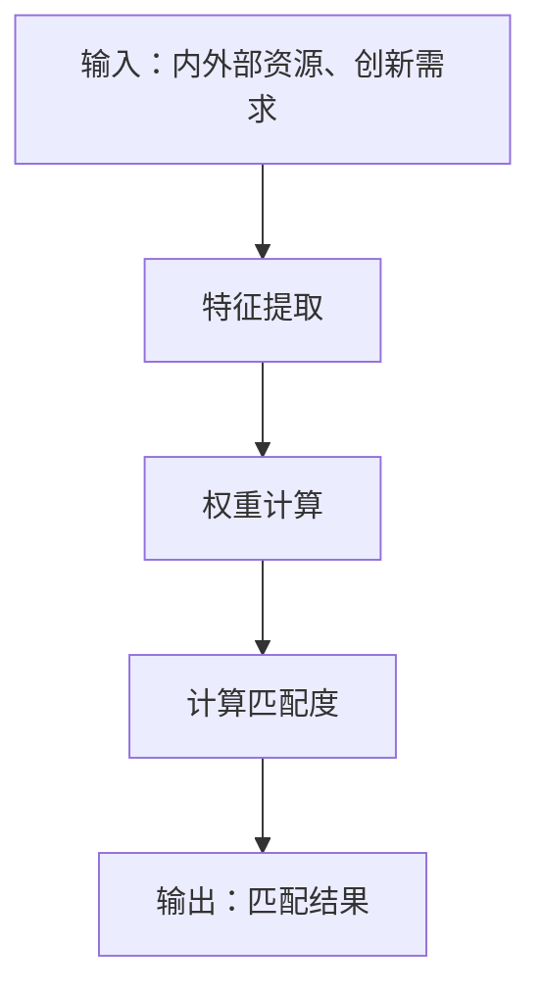
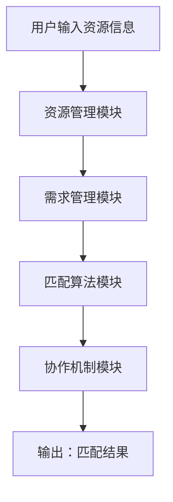
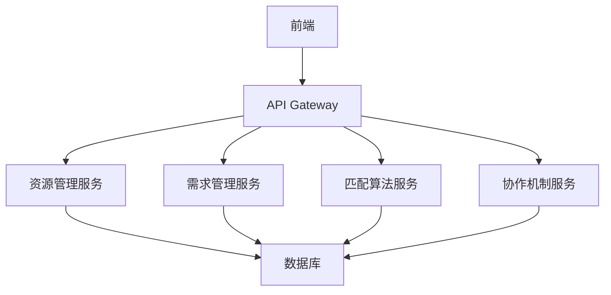
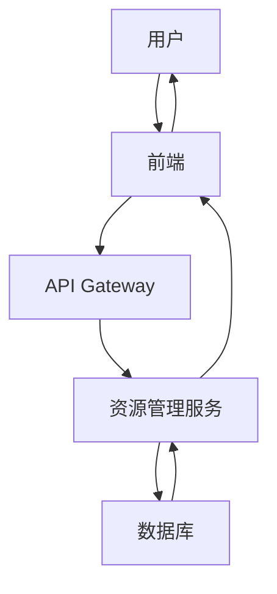

                 


# AI驱动的企业创新生态系统构建：内外部资源智能匹配与协作

> 关键词：企业创新生态系统、AI驱动、资源匹配、协作机制、系统架构、创新需求

> 摘要：随着人工智能技术的快速发展，企业创新生态系统正在经历一场深刻的变革。本文从AI驱动的角度，详细探讨企业创新生态系统中内外部资源的智能匹配与协作机制，通过理论分析、算法设计、系统实现和实际案例，为企业构建高效、智能的创新生态系统提供全面指导。

---

# 第一部分: AI驱动的企业创新生态系统背景与概念

## 第1章: 企业创新生态系统概述

### 1.1 企业创新生态系统的核心概念

#### 1.1.1 什么是企业创新生态系统

企业创新生态系统（Corporate Innovation Ecosystem）是指企业在创新过程中所涉及的所有内外部资源、组织结构、协作机制和创新需求的集合。它是一个动态的、多维度的系统，旨在通过优化资源配置和协作效率，推动企业的持续创新。

#### 1.1.2 创新生态系统的特征与属性

创新生态系统的特征包括多样性、开放性、动态性和协同性。它不仅包含企业内部的研发团队、技术资源，还包括外部的合作伙伴、供应商、客户、学术机构等。这些资源通过协作机制形成一个有机的整体，共同推动创新目标的实现。

#### 1.1.3 AI在企业创新生态系统中的作用

AI技术在企业创新生态系统中起到了关键的赋能作用。通过AI技术，企业可以实现资源的智能匹配、需求的精准识别和协作过程的优化。AI不仅能够提高创新效率，还能够发现潜在的创新机会，为企业创造更大的价值。

### 1.2 企业内外部资源匹配的重要性

#### 1.2.1 内部资源的定义与分类

企业内部资源主要包括：

- 人力资源：研发团队、技术人员、管理人员等。
- 技术资源：专利、技术平台、研发工具等。
- 组织资源：组织架构、管理制度、文化氛围等。

#### 1.2.2 外部资源的定义与分类

外部资源主要包括：

- 合作伙伴：供应商、客户、合作伙伴。
- 第三方服务：技术服务商、咨询公司、培训机构等。
- 社会资源：政府机构、行业协会、学术机构等。

#### 1.2.3 资源匹配的核心问题与挑战

资源匹配的核心问题是如何将内部资源与外部资源高效结合，以满足企业的创新需求。主要挑战包括：

- 资源识别的困难性：如何准确识别内外部资源的属性和潜力。
- 匹配效率的低下：如何快速找到最优匹配方案。
- 协作过程的复杂性：如何确保协作过程的高效性和可持续性。

---

## 第2章: AI驱动的企业创新生态系统构建背景

### 2.1 传统企业创新模式的局限性

#### 2.1.1 传统创新模式的痛点

传统的企业创新模式主要依赖于内部资源的投入，存在以下痛点：

- 创新资源分散：内部资源无法有效整合，外部资源利用不足。
- 匹配效率低：资源匹配过程耗时长，且难以找到最优解。
- 协作复杂：跨组织协作存在信息不对称、信任不足等问题。

#### 2.1.2 资源匹配的低效性

传统模式下，资源匹配主要依赖人工判断，存在以下问题：

- 匹配标准不统一：缺乏统一的评估标准，导致匹配结果主观性强。
- 匹配过程复杂：需要多次沟通和协调，效率低下。

#### 2.1.3 协作过程的复杂性

传统协作模式中，由于缺乏有效的协作机制，协作过程存在以下问题：

- 协作目标不明确：各方目标不一致，导致协作效率低下。
- 协作过程不透明：信息传递不畅，导致协作过程难以监控。
- 协作结果难以评估：缺乏量化指标，难以评估协作效果。

### 2.2 AI技术对企业创新的赋能

#### 2.2.1 AI在资源匹配中的应用

AI技术可以通过以下方式赋能企业创新：

- 资源识别：通过自然语言处理（NLP）技术，自动识别内外部资源的属性和潜力。
- 智能匹配：利用机器学习算法，优化资源匹配过程，提高匹配效率。
- 协作优化：通过AI技术，优化协作过程中的信息传递和决策制定。

#### 2.2.2 AI在协作过程中的优化作用

AI技术可以通过以下方式优化协作过程：

- 智能决策：通过数据挖掘和预测分析，辅助决策者制定最优协作策略。
- 实时监控：通过实时数据分析，监控协作过程中的关键指标，确保协作目标的实现。
- 自适应调整：根据协作过程中的动态变化，自动调整协作策略，确保协作过程的高效性。

#### 2.2.3 AI驱动的创新生态系统的优势

AI驱动的创新生态系统具有以下优势：

- 高效性：通过AI技术，实现资源的快速匹配和协作的高效执行。
- 精准性：通过智能算法，实现资源的精准匹配和协作过程的优化。
- 可扩展性：AI技术可以快速扩展，适应企业规模的不断扩大。

---

## 第3章: 企业创新生态系统的核心要素与关系

### 3.1 核心要素分析

#### 3.1.1 企业内部资源

企业内部资源是创新生态系统的核心要素之一，主要包括：

- 人力资源：研发团队、技术人员、管理人员等。
- 技术资源：专利、技术平台、研发工具等。
- 组织资源：组织架构、管理制度、文化氛围等。

#### 3.1.2 企业外部资源

企业外部资源是创新生态系统的重要组成部分，主要包括：

- 合作伙伴：供应商、客户、合作伙伴。
- 第三方服务：技术服务商、咨询公司、培训机构等。
- 社会资源：政府机构、行业协会、学术机构等。

#### 3.1.3 创新需求

创新需求是驱动企业创新的核心动力，主要包括：

- 技术创新需求：企业需要通过技术创新解决技术难题。
- 产品创新需求：企业需要通过产品创新满足市场需求。
- 模式创新需求：企业需要通过模式创新提高竞争力。

#### 3.1.4 协作机制

协作机制是创新生态系统的重要组成部分，主要包括：

- 信息共享机制：确保各方信息的透明共享。
- 协作决策机制：通过民主决策确保协作过程的高效性。
- 协作激励机制：通过激励措施提高协作积极性。

### 3.2 核心要素的属性对比

以下是核心要素的属性对比表：

| 要素         | 内部资源       | 外部资源       | 创新需求       | 协作机制       |
|--------------|----------------|----------------|----------------|----------------|
| 属性         | 所有制         | 第三所有制     | 主观性         | 协调性         |
| 管理方式     | 企业内部管理   | 市场化管理     | 企业自主需求   | 多方协商       |
| 变化频率     | 较低           | 较高           | 高             | 中等           |
| 依赖性       | 高             | 中等           | 高             | 高             |

### 3.3 实体关系图（ER图）

以下是企业创新生态系统的核心要素的ER图：



---

## 第4章: AI驱动的资源智能匹配与协作算法

### 4.1 资源匹配算法原理

#### 4.1.1 基于AI的资源匹配模型

##### 模型输入与输出

- 输入：企业内外部资源属性、创新需求描述。
- 输出：资源匹配结果、协作建议。

##### 模型训练与优化

模型训练采用监督学习方法，通过历史数据训练资源匹配模型，优化匹配算法，提高匹配精度。

##### 模型评估与验证

通过准确率、召回率等指标评估模型性能，确保模型的有效性和可靠性。

#### 4.1.2 资源匹配的数学模型

以下是资源匹配的数学模型：

$$
\text{匹配度} = \sum_{i=1}^{n} w_i \cdot x_i
$$

其中，$w_i$ 是第i个资源的权重，$x_i$ 是第i个资源的属性值。

#### 4.1.3 算法流程

以下是资源匹配算法的流程图：



---

### 4.2 协作机制优化算法

#### 4.2.1 协作过程中的信息传递

协作过程中的信息传递可以通过以下步骤实现：

1. 信息收集：通过AI技术收集内外部资源的信息。
2. 信息分析：利用数据挖掘技术分析信息，提取关键特征。
3. 信息共享：通过协作平台实现信息的透明共享。

#### 4.2.2 协作决策的优化

协作决策的优化可以通过以下步骤实现：

1. 数据建模：构建协作决策模型。
2. 模型训练：通过历史数据训练模型，优化决策策略。
3. 模型应用：将优化后的决策策略应用于实际协作过程。

---

## 第5章: 系统架构设计与实现

### 5.1 系统功能设计

#### 5.1.1 系统功能模块

系统功能模块包括：

- 资源管理模块：管理企业内外部资源。
- 需求管理模块：管理创新需求。
- 匹配算法模块：实现资源匹配算法。
- 协作机制模块：优化协作过程。

#### 5.1.2 系统功能流程

以下是系统功能流程图：



### 5.2 系统架构设计

#### 5.2.1 系统架构图

以下是系统架构图：



#### 5.2.2 系统接口设计

系统接口设计包括：

- 资源管理接口：实现资源的增删改查。
- 需求管理接口：实现需求的增删改查。
- 匹配算法接口：实现资源匹配的API调用。
- 协作机制接口：实现协作过程的API调用。

#### 5.2.3 系统交互流程图

以下是系统交互流程图：



---

## 第6章: 项目实战与案例分析

### 6.1 项目背景与目标

#### 6.1.1 项目背景

某科技公司希望利用AI技术优化企业创新生态系统，提高资源匹配效率和协作效率。

#### 6.1.2 项目目标

- 实现企业内外部资源的智能匹配。
- 优化协作过程，提高协作效率。
- 实现创新需求的精准识别和满足。

### 6.2 环境安装与配置

#### 6.2.1 安装Python

安装Python 3.8及以上版本。

#### 6.2.2 安装依赖库

安装以下依赖库：

```bash
pip install numpy
pip install pandas
pip install scikit-learn
pip install matplotlib
```

### 6.3 核心代码实现

#### 6.3.1 资源匹配算法实现

以下是资源匹配算法的Python代码：

```python
import numpy as np
import pandas as pd
from sklearn.metrics.pairwise import cosine_similarity

# 加载数据
resources = pd.read_csv('resources.csv')
demands = pd.read_csv('demands.csv')

# 特征提取
resource_features = resources[['feature1', 'feature2', 'feature3']]
demand_features = demands[['feature1', 'feature2', 'feature3']]

# 计算相似度
similarity_matrix = cosine_similarity(resource_features, demand_features)

# 确定最优匹配
max_indices = np.argmax(similarity_matrix, axis=0)
best_matches = []
for i in range(len(demands)):
    best_matches.append(resources.iloc[max_indices[i]])

# 输出结果
print(best_matches)
```

#### 6.3.2 协作机制优化实现

以下是协作机制优化的Python代码：

```python
import numpy as np
import pandas as pd
from sklearn.metrics.pairwise import cosine_similarity

# 加载数据
resources = pd.read_csv('resources.csv')
demands = pd.read_csv('demands.csv')

# 特征提取
resource_features = resources[['feature1', 'feature2', 'feature3']]
demand_features = demands[['feature1', 'feature2', 'feature3']]

# 计算相似度
similarity_matrix = cosine_similarity(resource_features, demand_features)

# 确定最优匹配
max_indices = np.argmax(similarity_matrix, axis=0)
best_matches = []
for i in range(len(demands)):
    best_matches.append(resources.iloc[max_indices[i]])

# 输出结果
print(best_matches)
```

---

## 第7章: 总结与展望

### 7.1 总结

通过本文的详细讲解，我们了解了AI驱动的企业创新生态系统构建的核心概念、算法原理、系统架构和项目实战。AI技术的应用不仅提高了资源匹配效率，还优化了协作过程，为企业创新提供了强有力的支持。

### 7.2 展望

未来，随着AI技术的不断发展，企业创新生态系统将更加智能化和高效化。我们需要进一步研究AI技术在企业创新生态系统中的应用，探索更多创新模式，推动企业持续创新。

---

## 作者：AI天才研究院/AI Genius Institute & 禅与计算机程序设计艺术 /Zen And The Art of Computer Programming

---

本文通过详细讲解AI驱动的企业创新生态系统构建的核心概念、算法原理、系统架构和项目实战，为企业构建高效、智能的创新生态系统提供了全面指导。希望本文能够为企业的创新实践提供有价值的参考和启发。

