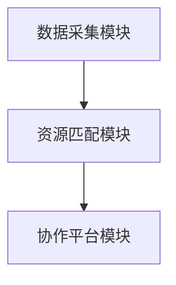
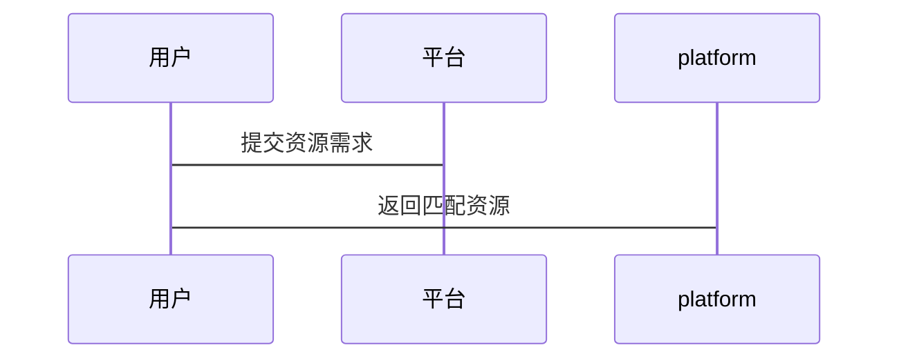
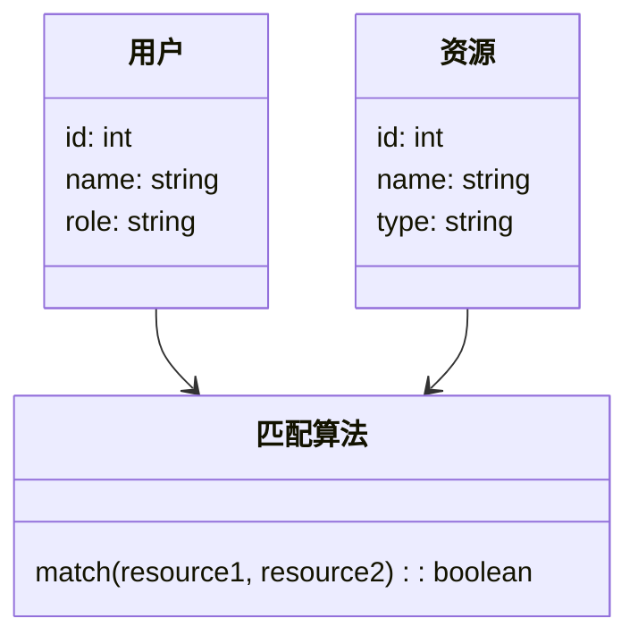
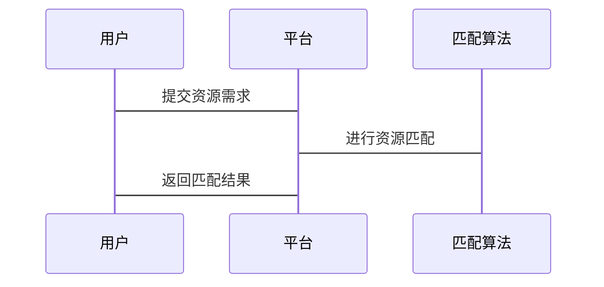

                 


# AI驱动的企业创新生态系统构建：内外部资源智能匹配与协作平台

> 关键词：AI, 企业创新, 资源匹配, 协作平台, 智能系统

> 摘要：本文深入探讨了如何利用人工智能技术构建企业创新生态系统，实现内外部资源的智能匹配与协作。通过分析资源匹配的算法原理、系统架构设计以及实际项目案例，本文为企业提供了一套完整的解决方案，助力企业提升创新效率和竞争力。

---

## 第一章：企业创新生态系统概述

### 1.1 问题背景与挑战

#### 1.1.1 企业创新面临的资源匹配问题
企业在创新过程中常常面临资源匹配的难题。内部资源如人才、技术、资金等，与外部资源如合作伙伴、客户、市场机会等需要高效协同。传统的资源匹配方式效率低下，难以满足快速变化的市场需求。

#### 1.1.2 内外部资源协同的难点
- 内部资源分散，难以统一管理。
- 外部资源复杂多样，难以精准匹配。
- 资源匹配缺乏数据支持，难以实现最优配置。

#### 1.1.3 AI驱动的解决方案
通过AI技术，企业可以实现资源的智能化匹配与协作，提升创新效率。AI可以通过数据分析和预测，优化资源配置，降低协作成本。

### 1.2 企业创新生态系统的核心要素

#### 1.2.1 创新生态系统的定义
创新生态系统是指由企业内部资源和外部资源构成的有机整体，通过协同合作实现创新目标。

#### 1.2.2 核心要素与关系分析
- **核心要素**：人才、技术、资金、合作伙伴。
- **关系分析**：通过AI驱动的匹配算法，内部资源与外部资源形成高效协同。

#### 1.2.3 系统边界与外延
- 系统边界：企业内部资源的整合与外部资源的引入。
- 外延：扩展至合作伙伴、客户和市场机会。

### 1.3 AI驱动创新的潜力与价值

#### 1.3.1 AI在资源匹配中的作用
AI可以通过数据挖掘和机器学习，实现资源的精准匹配。

#### 1.3.2 智能协作平台的优势
- 提高资源利用效率。
- 降低协作成本。
- 实现资源的动态优化。

#### 1.3.3 企业的创新效率提升
通过AI驱动的协作平台，企业可以快速响应市场需求，提升创新能力。

---

## 第二章：AI驱动的资源匹配机制

### 2.1 内部资源分析与优化

#### 2.1.1 企业内部资源的识别
- 人才：员工技能、经验。
- 技术：专利、研发能力。
- 资金：预算、投资。

#### 2.1.2 资源属性特征分析
- 内部资源的特征提取：如技术领域的专业性、团队的能力等。

#### 2.1.3 内部资源优化策略
- 数据驱动的资源分配。
- AI辅助的资源调度。

### 2.2 外部资源引入与整合

#### 2.2.1 外部资源的获取渠道
- 合作伙伴：供应商、客户。
- 市场机会：新兴技术、市场需求。

#### 2.2.2 资源匹配模型构建
- 数据清洗与特征工程。
- 模型训练与优化。

#### 2.2.3 外部资源引入的挑战与解决方案
- 数据不足：通过数据增强技术解决。
- 算法优化：提升模型的匹配精度。

### 2.3 资源匹配算法原理

#### 2.3.1 基于协同过滤的推荐算法
协同过滤是一种基于用户行为的推荐算法，通过分析用户的相似性，推荐相关资源。

#### 2.3.2 基于内容的推荐算法
基于内容的推荐算法通过分析资源的特征，推荐相似资源。

#### 2.3.3 深度学习模型在资源匹配中的应用
深度学习模型如神经网络，可以通过非线性特征提取，提升资源匹配的精度。

---

## 第三章：智能协作平台的构建

### 3.1 平台架构设计

#### 3.1.1 系统功能模块划分
- 数据采集模块：采集内外部资源数据。
- 资源匹配模块：实现资源的智能匹配。
- 协作平台模块：提供协作界面。

#### 3.1.2 系统架构图（Mermaid）



#### 3.1.3 关键模块实现原理
- 数据采集：通过API接口获取资源数据。
- 资源匹配：基于算法模型实现匹配。
- 协作平台：提供用户交互界面。

### 3.2 资源匹配模型的实现

#### 3.2.1 数据预处理与特征提取
- 数据清洗：去除无效数据。
- 特征提取：提取资源的关键特征。

#### 3.2.2 模型训练与优化
- 选择合适的算法模型。
- 通过交叉验证优化模型参数。

#### 3.2.3 模型评估与调优
- 评估指标：准确率、召回率。
- 调优方法：超参数优化。

### 3.3 平台的接口设计与交互流程

#### 3.3.1 系统接口定义
- API接口：提供RESTful API。
- 数据格式：JSON格式。

#### 3.3.2 用户交互流程图（Mermaid）



#### 3.3.3 接口调用与数据流分析
- 接口调用：用户提交需求，平台返回匹配结果。
- 数据流：数据从用户端传输到平台，处理后返回结果。

---

## 第四章：系统分析与架构设计方案

### 4.1 问题场景介绍

#### 4.1.1 系统功能需求
- 资源采集、匹配、协作。

#### 4.1.2 项目介绍
- 项目目标：构建AI驱动的协作平台。
- 项目范围：涵盖内部和外部资源。

### 4.2 系统功能设计

#### 4.2.1 领域模型（Mermaid类图）



#### 4.2.2 系统架构设计（Mermaid架构图）

```mermaid
context diagram
    context 协作平台 {
        includes 数据采集模块
        includes 资源匹配模块
        includes 用户界面模块
    }
```

#### 4.2.3 系统接口设计
- 接口1：资源采集接口。
- 接口2：资源匹配接口。

#### 4.2.4 系统交互流程（Mermaid序列图）



---

## 第五章：项目实战

### 5.1 环境安装

#### 5.1.1 安装Python
```bash
python --version
pip install requests
```

#### 5.1.2 安装依赖库
```bash
pip install numpy
pip install scikit-learn
```

### 5.2 系统核心实现源代码

#### 5.2.1 数据采集模块
```python
import requests
import json

def get_external_resources():
    response = requests.get("https://api.example.com/resources")
    return json.loads(response.text)
```

#### 5.2.2 资源匹配模块
```python
from sklearn.metrics.pairwise import cosine_similarity

def resource_matching(resources):
    # 特征矩阵
    matrix = ...  # 具体实现
    similarity = cosine_similarity(matrix)
    return similarity
```

#### 5.2.3 用户界面模块
```python
from flask import Flask, render_template

app = Flask(__name__)

@app.route('/')
def index():
    return render_template('index.html')

if __name__ == '__main__':
    app.run()
```

### 5.3 案例分析与实际应用

#### 5.3.1 案例分析
- 某企业通过协作平台匹配技术合作伙伴，提升了创新效率。

#### 5.3.2 实际应用效果
- 资源匹配效率提升。
- 创新项目成功率提高。

### 5.4 项目总结

#### 5.4.1 项目成果
- 成功构建协作平台。
- 提升企业创新效率。

#### 5.4.2 经验总结
- 数据质量影响匹配效果。
- 算法选择需结合实际场景。

---

## 第六章：最佳实践、小结与注意事项

### 6.1 最佳实践

#### 6.1.1 数据质量管理
- 数据清洗、特征提取。

#### 6.1.2 算法选择
- 根据场景选择合适的算法。

#### 6.1.3 系统优化
- 提升系统性能、安全性。

### 6.2 小结

本文详细介绍了AI驱动的企业创新生态系统构建方法，通过资源匹配算法和协作平台的设计与实现，为企业提供了高效的创新解决方案。

### 6.3 注意事项

- 数据隐私保护。
- 系统安全防护。
- 持续优化算法。

### 6.4 拓展阅读

- AI在企业中的其他应用。
- 更先进的资源匹配算法。

---

## 作者：AI天才研究院 & 禅与计算机程序设计艺术

---

通过以上步骤，文章逐步构建了AI驱动的企业创新生态系统，详细讲解了资源匹配的算法、系统架构设计和实际项目案例。希望这篇文章能够为企业创新提供有价值的参考和指导。

