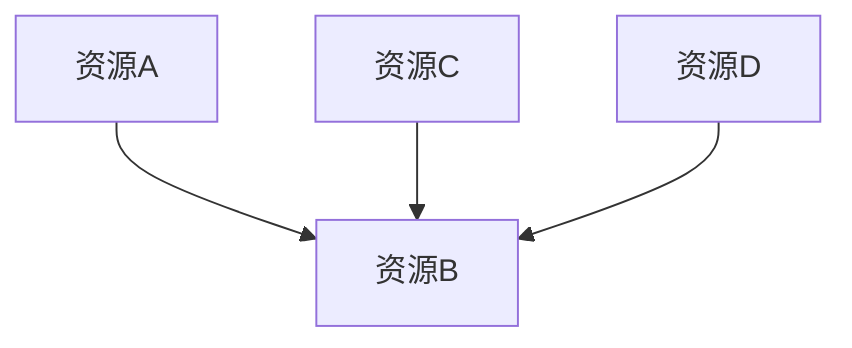
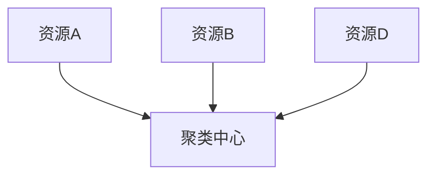
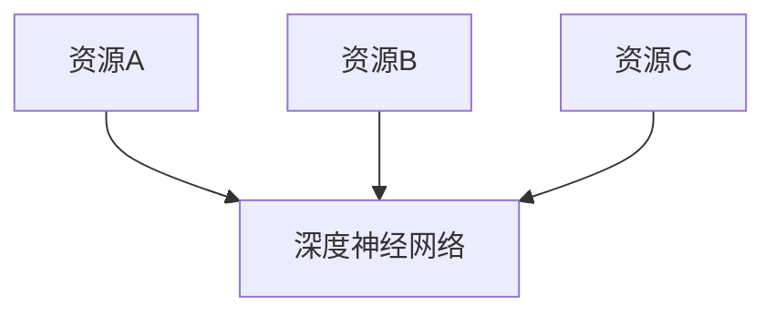
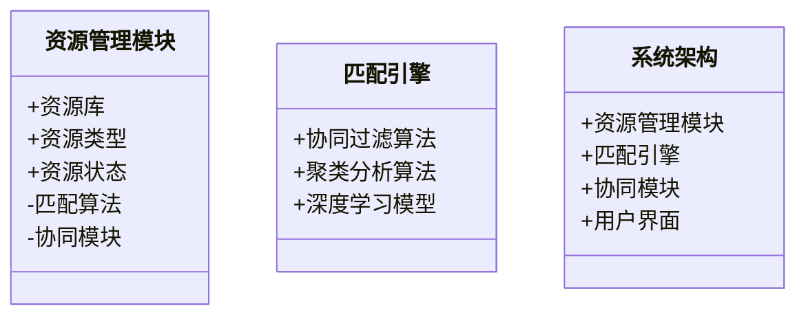
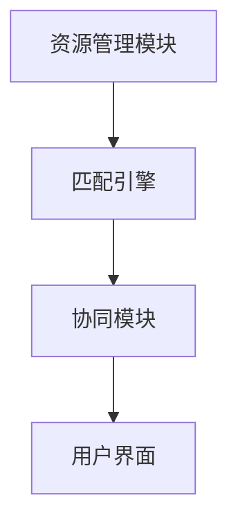
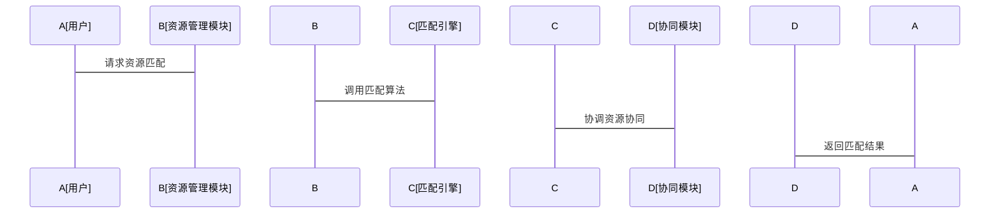

                 


# AI驱动的企业创新生态系统构建：内外部资源智能匹配与协同

## 关键词：AI、企业创新、资源匹配、协同创新、生态系统、系统架构

## 摘要：本文系统阐述了AI驱动的企业创新生态系统构建方法，重点分析了如何利用AI技术实现企业内外部资源的智能匹配与协同。通过算法原理、系统架构设计和项目实战，详细讲解了资源匹配的数学模型、系统实现方案和实际应用案例，为企业创新提供了理论和实践指导。

---

# 第一部分: AI驱动的企业创新生态系统概述

## 第1章: 企业创新生态系统的核心概念

### 1.1 企业创新生态系统的基本概念

#### 1.1.1 企业创新生态系统的定义
企业创新生态系统是一个由企业内外部资源、技术、流程和组织结构构成的动态系统，通过AI技术实现资源的智能匹配与协同，以推动企业的持续创新。

#### 1.1.2 创新生态系统的核心要素
- **内部资源**：包括企业的人才、技术、资金、数据等。
- **外部资源**：包括合作伙伴、供应商、客户、第三方服务提供商等。
- **AI技术**：作为核心驱动力，实现资源的智能匹配与协同。

#### 1.1.3 企业内外部资源的分类与特点
- **内部资源**：可控性高，但可能存在资源浪费和协同效率低的问题。
- **外部资源**：灵活性高，但难以有效整合和协调。

---

### 1.2 AI驱动创新生态系统的重要性

#### 1.2.1 传统企业创新模式的局限性
传统模式依赖人工协调，效率低、成本高，难以快速响应市场需求。

#### 1.2.2 AI技术对企业创新的推动作用
AI技术通过数据分析和智能匹配，提高资源利用效率，降低创新成本。

#### 1.2.3 内外部资源智能匹配的必要性
通过AI技术实现资源的精准匹配，打破企业内外部资源的壁垒，提升创新效率。

---

### 1.3 企业创新生态系统的目标与边界

#### 1.3.1 系统目标的设定
- 提高资源利用效率。
- 降低创新成本。
- 提升创新速度和质量。

#### 1.3.2 系统边界与外延
- 系统边界：企业内外部资源的整合范围。
- 系统外延：延伸至供应链、合作伙伴网络等更广泛的社会资源。

#### 1.3.3 核心要素的组成与关系
- **核心要素**：资源、技术、流程、组织。
- **关系**：资源通过技术实现匹配，技术通过流程实现协同，组织通过流程实现管理。

---

## 第2章: 企业内外部资源的智能匹配与协同

### 2.1 内部资源的优化与整合

#### 2.1.1 企业内部资源的分类与特点
- **人才资源**：员工的知识、技能和经验。
- **技术资源**：企业的技术储备和研发能力。
- **数据资源**：企业的数据资产。

#### 2.1.2 内部资源匹配的逻辑与流程
1. **需求识别**：识别内部资源的需求。
2. **资源匹配**：基于AI算法，匹配最优资源。
3. **协同实施**：实现资源的协同使用。

#### 2.1.3 内部资源协同的实现方式
- **协同计划**：制定协同计划。
- **协同执行**：执行协同计划。
- **协同监控**：监控协同过程。

---

### 2.2 外部资源的引入与管理

#### 2.2.1 外部资源的获取渠道
- **合作伙伴**：通过合作获取外部资源。
- **供应商**：通过采购获取外部资源。
- **客户**：通过客户反馈获取外部资源。

#### 2.2.2 外部资源匹配的挑战与解决方案
- **挑战**：外部资源的多样性和不确定性。
- **解决方案**：通过AI技术实现外部资源的精准匹配。

#### 2.2.3 外部资源协同的机制与策略
- **协同机制**：建立协同机制，实现外部资源的有效整合。
- **协同策略**：制定协同策略，提升外部资源的利用效率。

---

### 2.3 内外部资源协同的实现路径

#### 2.3.1 资源识别与需求分析
- **资源识别**：识别企业内外部资源。
- **需求分析**：分析资源需求。

#### 2.3.2 资源匹配的算法与模型
- **算法选择**：基于协同过滤的推荐算法。
- **模型构建**：构建资源匹配模型。

#### 2.3.3 协同过程的监控与优化
- **协同监控**：监控协同过程。
- **协同优化**：优化协同过程。

---

## 第3章: AI驱动的资源智能匹配算法原理

### 3.1 资源匹配的核心算法

#### 3.1.1 基于协同过滤的推荐算法



#### 3.1.2 基于聚类分析的资源分组算法



#### 3.1.3 基于深度学习的特征提取算法



---

### 3.2 算法实现的数学模型

#### 3.2.1 协同过滤算法的数学公式

$$相似度计算公式：sim(i,j) = \frac{\sum_{k} r_{ik} r_{jk}}{\sqrt{\sum_{k} r_{ik}^2} \sqrt{\sum_{k} r_{jk}^2}}$$

#### 3.2.2 聚类分析的数学模型

$$距离计算公式：d(i,j) = \sqrt{\sum_{k=1}^{n} (x_{ik} - x_{jk})^2}$$

---

# 第二部分: 系统分析与架构设计

## 第4章: 企业创新生态系统系统分析与架构设计

### 4.1 项目介绍

#### 4.1.1 项目背景
- **背景**：企业内外部资源分散，难以高效协同。
- **目标**：构建一个AI驱动的企业创新生态系统，实现资源的智能匹配与协同。

---

#### 4.1.2 系统功能设计



---

#### 4.1.3 系统架构图



---

### 4.2 系统接口设计

#### 4.2.1 系统接口



---

## 第5章: 项目实战

### 5.1 环境安装

```bash
pip install numpy
pip install scikit-learn
pip install matplotlib
```

---

### 5.2 核心代码实现

#### 5.2.1 协同过滤算法实现

```python
import numpy as np
from sklearn.metrics.pairwise import cosine_similarity

def collaborative_filtering(matrix):
    similarity = cosine_similarity(matrix)
    return similarity
```

---

#### 5.2.2 聚类分析算法实现

```python
from sklearn.cluster import KMeans

def kmeans_clustering(matrix, n_clusters):
    model = KMeans(n_clusters=n_clusters)
    model.fit(matrix)
    return model.labels_
```

---

#### 5.2.3 深度学习模型实现

```python
import tensorflow as tf
from tensorflow.keras import layers

def deep_learning_model(input_shape):
    model = tf.keras.Sequential()
    model.add(layers.Dense(64, activation='relu', input_shape=input_shape))
    model.add(layers.Dense(32, activation='relu'))
    model.add(layers.Dense(1, activation='sigmoid'))
    model.compile(optimizer='adam', loss='binary_crossentropy', metrics=['accuracy'])
    return model
```

---

### 5.3 案例分析

#### 5.3.1 案例背景

某企业希望通过AI技术实现内部研发团队与外部合作伙伴的资源匹配。

---

#### 5.3.2 数据准备

```python
import pandas as pd

data = pd.read_csv('resources.csv')
```

---

#### 5.3.3 模型训练

```python
model = deep_learning_model((input_dim,))
model.fit(X_train, y_train, epochs=100, batch_size=32)
```

---

#### 5.3.4 模型应用

```python
predictions = model.predict(X_test)
```

---

## 第6章: 总结与展望

### 6.1 总结

本文详细介绍了AI驱动的企业创新生态系统构建方法，通过算法原理、系统架构设计和项目实战，展示了如何利用AI技术实现企业内外部资源的智能匹配与协同。

---

### 6.2 未来展望

随着AI技术的不断发展，企业创新生态系统将更加智能化和自动化，未来的研究方向包括更高效的资源匹配算法和更智能的协同机制。

---

## 作者：AI天才研究院/AI Genius Institute & 禅与计算机程序设计艺术 /Zen And The Art of Computer Programming

---

**本文是基于“禅与计算机程序设计艺术”理念撰写的系列技术博客文章之一，转载请注明出处。**

