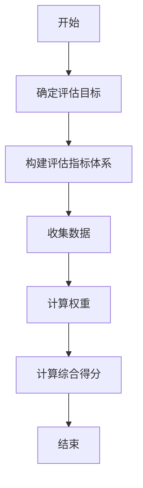
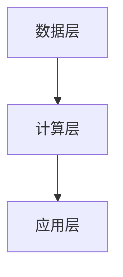
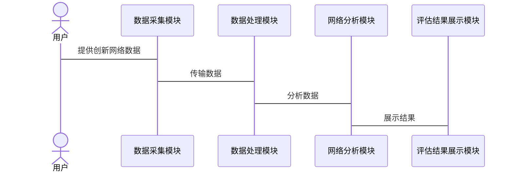

                 


# AI驱动的企业创新生态系统评估：内外部创新网络分析

> 关键词：AI驱动、企业创新、生态系统评估、内外部创新网络、网络分析、系统架构、算法原理

> 摘要：本文将探讨AI如何驱动企业创新生态系统评估，重点分析内外部创新网络的结构、关系与优化方法。通过系统化的分析框架、创新网络评估算法、AI技术的深度融合，我们提出了一套完整的创新生态系统评估解决方案，并展示了其在实际应用中的价值。

---

## 第1章: 企业创新生态系统与AI驱动的创新网络概述

### 1.1 企业创新生态系统的基本概念

#### 1.1.1 企业创新的定义与特征
企业创新是指企业通过引入新技术、新产品、新市场或新商业模式，以实现业务增长和竞争优势的过程。创新的核心特征包括：

- **动态性**：创新是一个动态的过程，涉及持续的改进和适应。
- **系统性**：创新不仅依赖于个体，还依赖于组织的结构、文化、资源等多个方面。
- **多样性**：创新可以发生在技术、管理、商业模式等多个维度。

#### 1.1.2 企业创新生态系统的核心要素
企业创新生态系统由多个相互关联的要素构成，包括：

- **企业内部创新网络**：包括研发团队、职能部门、内部资源等。
- **企业外部创新网络**：包括合作伙伴、供应商、客户、行业专家等。
- **创新环境**：包括政策、市场、技术趋势等因素。

#### 1.1.3 AI在企业创新中的作用
AI技术在企业创新中的作用日益重要，主要体现在：

- **数据驱动的决策支持**：通过分析海量数据，AI可以帮助企业识别创新机会和风险。
- **自动化创新流程**：AI可以优化创新过程中的重复性任务，提高效率。
- **跨网络协作**：AI可以帮助企业在内部和外部网络之间建立更高效的协作机制。

### 1.2 创新网络的内外部结构分析

#### 1.2.1 内部创新网络的定义与特点
内部创新网络是指企业内部的创新主体及其之间的协作关系。其特点包括：

- **封闭性**：内部网络主要由企业内部的资源和人员构成。
- **协作性强**：内部网络中的创新主体通常具有较高的协作意愿和能力。
- **可控性**：企业可以对内部网络的资源和流程进行较强的控制。

#### 1.2.2 外部创新网络的定义与特点
外部创新网络是指企业外部的创新主体及其之间的协作关系。其特点包括：

- **开放性**：外部网络涉及企业外部的合作伙伴、供应商、客户等。
- **多样性**：外部网络中的创新主体具有较高的异质性，能够为企业带来多样化的创新资源。
- **复杂性**：外部网络的协作关系较为复杂，涉及多个利益相关者。

#### 1.2.3 内外部创新网络的交互机制
内部和外部创新网络之间存在复杂的交互机制，主要体现在：

- **资源流动**：企业可以通过内部网络整合外部资源，形成创新合力。
- **知识共享**：内部和外部网络之间的知识共享可以促进创新的扩散和应用。
- **风险分担**：通过内外部网络的协作，企业可以更好地分担创新风险。

### 1.3 企业创新生态系统评估的必要性

#### 1.3.1 企业创新生态系统评估的目的
企业创新生态系统评估的目的是为了帮助企业识别创新机会和挑战，优化创新资源配置，提升创新效率和效果。

#### 1.3.2 企业创新生态系统评估的挑战
企业创新生态系统评估面临以下挑战：

- **数据获取难度**：创新网络中的数据通常分散且难以获取。
- **网络复杂性**：创新网络的结构复杂，难以建模和分析。
- **动态性**：创新网络是一个动态变化的系统，评估结果需要及时更新。

#### 1.3.3 企业创新生态系统评估的边界与外延
企业创新生态系统评估的边界通常包括企业内部和外部的创新主体及其协作关系，而其外延则可能延伸到更广泛的创新生态系统，如行业生态系统、区域创新生态系统等。

---

## 第2章: AI驱动的创新网络分析框架

### 2.1 创新网络分析的核心概念

#### 2.1.1 创新网络的节点与关系
创新网络由节点和关系构成。节点代表创新主体，关系代表创新主体之间的协作关系。

- **节点类型**：包括企业、研发团队、合作伙伴等。
- **关系类型**：包括协作关系、竞争关系、供应链关系等。

#### 2.1.2 创新网络的结构特征
创新网络的结构特征包括：

- **中心性**：节点在创新网络中的中心性反映了其在创新过程中的重要性。
- **密度**：创新网络的密度反映了网络中节点之间的连接程度。
- **模块化**：创新网络的模块化反映了网络中不同部分的分工与协作。

#### 2.1.3 创新网络的动态演化
创新网络是一个动态演化的系统，其结构和功能会随着时间的推移而发生变化。

### 2.2 AI在创新网络分析中的应用

#### 2.2.1 AI驱动的网络数据处理
AI技术可以用于处理创新网络中的海量数据，包括：

- **数据清洗**：去除噪声数据，提高数据质量。
- **数据集成**：整合来自不同来源的数据，形成统一的网络数据集。
- **数据建模**：构建创新网络的数学模型，为后续分析提供基础。

#### 2.2.2 AI驱动的网络关系挖掘
AI技术可以帮助挖掘创新网络中的深层关系，包括：

- **关联规则挖掘**：发现创新网络中节点之间的关联规则。
- **聚类分析**：将创新网络中的节点分为不同的聚类，识别潜在的协作机会。
- **路径分析**：分析创新网络中的关键路径，识别创新资源的流动方向。

#### 2.2.3 AI驱动的网络预测与优化
AI技术可以用于预测创新网络的演化趋势，并进行优化设计，包括：

- **网络预测**：基于历史数据，预测创新网络的未来演化。
- **网络优化**：通过算法优化，提升创新网络的协作效率和创新效果。

### 2.3 企业创新生态系统评估的指标体系

#### 2.3.1 内部创新网络评估指标
内部创新网络评估指标包括：

- **创新速度**：内部创新项目从构思到实施的时间。
- **协作效率**：内部创新团队之间的协作效率。
- **资源分配合理性**：内部资源的分配是否合理。

#### 2.3.2 外部创新网络评估指标
外部创新网络评估指标包括：

- **合作伙伴质量**：合作伙伴的技术实力和创新能力。
- **外部资源获取速度**：企业获取外部资源的速度。
- **外部协作效率**：企业与外部合作伙伴的协作效率。

#### 2.3.3 综合创新生态系统评估指标
综合创新生态系统评估指标包括：

- **整体创新效率**：企业整体创新效率的综合指标。
- **创新生态系统韧性**：创新生态系统在面对外部冲击时的适应能力。
- **创新生态系统活力**：创新生态系统中的创新活力和潜力。

---

## 第3章: 创新网络分析的核心概念与联系

### 3.1 创新网络分析的核心原理

#### 3.1.1 创新网络的层次分析
创新网络的层次分析包括：

- **目标层**：企业创新生态系统评估的目标。
- **准则层**：评估创新网络的各个准则。
- **方案层**：具体的创新网络评估方案。

#### 3.1.2 创新网络的拓扑结构
创新网络的拓扑结构包括：

- **中心网络**：创新网络的核心部分，通常包括关键节点和关键关系。
- **外围网络**：创新网络的外围部分，包括次要节点和关系。
- **连接网络**：连接中心网络和外围网络的桥梁节点和关系。

#### 3.1.3 创新网络的动态演化模型
创新网络的动态演化模型包括：

- **增长模型**：描述创新网络中节点和关系的增加过程。
- **演化模型**：描述创新网络的结构和功能的动态变化。
- **消亡模型**：描述创新网络中节点和关系的减少过程。

### 3.2 创新网络核心概念对比表

#### 表3.1: 内部创新网络与外部创新网络的核心要素对比

| **要素**         | **内部创新网络**                          | **外部创新网络**                          |
|------------------|------------------------------------------|------------------------------------------|
| **节点类型**     | 研发团队、职能部门                         | 合作伙伴、供应商、客户                     |
| **关系类型**     | 协作关系、资源分配                         | 供应链关系、合作关系                   |
| **可控性**       | 高                                        | 较低                                       |
| **开放性**       | 低                                        | 高                                        |
| **协作难度**     | 较低                                       | 较高                                       |

### 3.3 创新网络的ER实体关系图

```mermaid
er
actor: 企业创新主体
relation: 参与
project: 创新项目
role: 角色
```

---

## 第4章: 创新网络评估的算法原理

### 4.1 基于层次分析法的创新网络评估

#### 4.1.1 层次分析法的基本原理
层次分析法（AHP）是一种用于结构化决策问题的分析方法。其基本原理包括：

- **构建层次结构**：将决策问题分解为多个层次，包括目标层、准则层和方案层。
- **确定权重**：通过比较各个层次中的元素，确定它们的相对权重。
- **计算综合得分**：根据权重计算各方案的综合得分，确定最优方案。

#### 4.1.2 创新网络评估的层次结构分解
创新网络评估的层次结构分解包括：

- **目标层**：企业创新生态系统评估。
- **准则层**：创新网络的结构特征、协作效率、创新效果。
- **方案层**：具体的创新网络评估方案。

#### 4.1.3 创新网络评估的权重计算
创新网络评估的权重计算可以通过以下步骤进行：

1. **构建比较矩阵**：根据准则层的各个准则，构建比较矩阵。
2. **计算特征向量**：通过求解比较矩阵的最大特征值，得到特征向量。
3. **计算权重**：通过归一化特征向量，得到各个准则的权重。

### 4.2 创新网络评估的算法流程图



### 4.3 创新网络评估的Python实现

```python
import numpy as np

def ahp(criteria, alternatives):
    # 构建比较矩阵
    n = len(criteria)
    matrix = np.zeros((n, n))
    for i in range(n):
        for j in range(n):
            # 假设输入的是矩阵中的元素
            matrix[i][j] = input(f"请输入比较矩阵第{i+1}行第{j+1}列的值：")
    # 计算特征向量
    eigenvalues, eigenvectors = np.linalg.eig(matrix)
    # 计算权重
    weights = eigenvectors[:, np.argmax(eigenvalues)] / np.sum(eigenvectors[:, np.argmax(eigenvalues)])
    return weights

# 示例
criteria = ["创新速度", "协作效率", "资源分配合理性"]
alternatives = ["内部创新网络", "外部创新网络"]
weights = ahp(criteria, alternatives)
print("权重为：", weights)
```

---

## 第5章: 创新网络分析的系统架构设计

### 5.1 问题场景介绍
企业需要对内外部创新网络进行评估，以优化创新生态系统。通过AI技术，企业可以更高效地分析和优化创新网络。

### 5.2 系统功能设计

#### 5.2.1 领域模型设计
领域模型设计包括：

- **数据采集模块**：负责采集创新网络中的数据。
- **数据处理模块**：负责处理和清洗数据。
- **网络分析模块**：负责分析创新网络的结构和关系。
- **评估结果展示模块**：负责展示评估结果。

#### 5.2.2 系统架构设计
系统架构设计包括：

- **数据层**：存储创新网络的数据。
- **计算层**：负责数据的计算和分析。
- **应用层**：负责与用户的交互和结果展示。

#### 5.2.3 系统架构图



### 5.3 系统接口设计
系统接口设计包括：

- **数据输入接口**：用于输入创新网络的数据。
- **数据处理接口**：用于处理和清洗数据。
- **网络分析接口**：用于分析创新网络的结构和关系。
- **结果展示接口**：用于展示评估结果。

### 5.4 系统交互流程图



---

## 第6章: 项目实战

### 6.1 项目背景与目标
本项目旨在通过AI技术对企业内外部创新网络进行评估，优化企业创新生态系统。

### 6.2 环境安装
- **Python**：安装Python 3.8及以上版本。
- **NumPy**：安装NumPy库，用于数据处理和计算。
- **Mermaid**：安装Mermaid CLI，用于生成图表。

### 6.3 核心代码实现

```python
import numpy as np

def ahp(criteria, alternatives):
    n = len(criteria)
    matrix = np.zeros((n, n))
    for i in range(n):
        for j in range(n):
            matrix[i][j] = int(input(f"请输入比较矩阵第{i+1}行第{j+1}列的值："))
    eigenvalues, eigenvectors = np.linalg.eig(matrix)
    weights = eigenvectors[:, np.argmax(eigenvalues)] / np.sum(eigenvectors[:, np.argmax(eigenvalues)])
    return weights

criteria = ["创新速度", "协作效率", "资源分配合理性"]
alternatives = ["内部创新网络", "外部创新网络"]
weights = ahp(criteria, alternatives)
print("权重为：", weights)
```

### 6.4 代码解读与分析
- **数据输入**：用户需要输入比较矩阵的元素。
- **特征值计算**：通过NumPy库计算矩阵的特征值和特征向量。
- **权重计算**：通过归一化特征向量，计算各个准则的权重。

### 6.5 案例分析
假设我们有一个企业的创新网络数据，包括内部和外部创新网络的节点和关系。我们可以通过上述代码计算出各个创新网络的权重，从而得出最优的创新网络评估方案。

### 6.6 项目小结
通过本项目，我们可以看到AI技术在企业创新生态系统评估中的巨大潜力。通过层次分析法和Python代码实现，我们可以高效地评估创新网络的结构和关系，为企业的创新决策提供支持。

---

## 第7章: 总结与展望

### 7.1 全文总结
本文详细探讨了AI驱动的企业创新生态系统评估，分析了内外部创新网络的结构和关系，提出了基于层次分析法的创新网络评估方法，并通过Python代码实现了算法。

### 7.2 本文重点
本文的重点包括：

- 创新网络的核心概念与联系
- AI在创新网络分析中的具体应用
- 创新网络评估的算法原理与实现
- 系统架构设计与项目实战

### 7.3 展望
未来的研究可以进一步探索以下方向：

- **更复杂的网络模型**：研究更复杂的创新网络模型，如多层网络和时空网络。
- **动态评估方法**：开发动态的创新网络评估方法，以适应网络的动态演化。
- **多目标优化**：研究创新网络的多目标优化问题，以实现创新网络的全局最优。

---

## 作者：AI天才研究院/AI Genius Institute & 禅与计算机程序设计艺术 /Zen And The Art of Computer Programming

