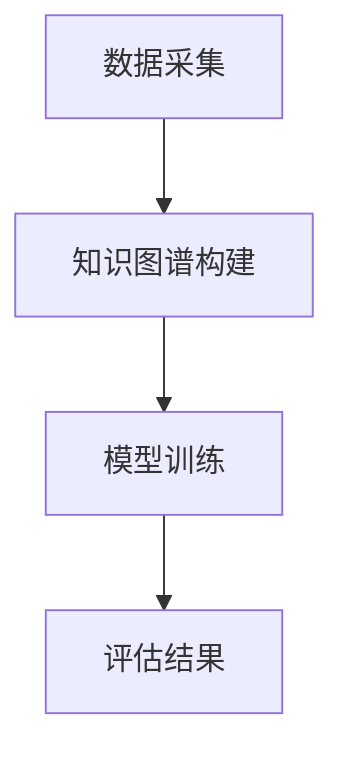

                 


# AI驱动的企业创新生态系统评估：内外部创新能力量化

> 关键词：AI驱动、企业创新生态系统、创新能力量化、内外部能力、知识图谱、算法原理

> 摘要：本文详细探讨了如何利用人工智能技术构建企业创新生态系统评估模型，重点分析了内部和外部创新能力的量化方法，结合知识图谱构建与创新关联分析，提出了基于深度学习的评估算法，从系统架构到项目实战，全面展示了AI驱动企业创新评估的完整流程。

---

## 第一部分：背景介绍

### 第1章：企业创新生态系统评估的背景与重要性

#### 1.1 问题背景

企业创新是企业持续发展的核心动力，然而在快速变化的商业环境中，企业创新能力的评估变得越来越复杂。传统的方法依赖于主观判断和经验，难以量化和优化。随着人工智能技术的快速发展，利用AI技术对创新能力进行量化评估成为可能。

#### 1.2 问题描述

创新能力的评估需要考虑内部和外部两个方面：

- **内部创新能力**：包括研发能力、技术储备、团队协作能力等。
- **外部创新能力**：包括市场反馈、合作伙伴资源、行业趋势等。

传统的评估方法通常无法同时兼顾这两方面的能力，且难以将结构化和非结构化的数据结合起来进行分析。

#### 1.3 问题解决

通过AI技术，可以实现对内部和外部创新能力的量化评估。AI能够从海量数据中提取关键信息，构建知识图谱，并通过深度学习模型进行预测和优化。

#### 1.4 边界与外延

- **边界**：创新能力评估不涉及企业的财务状况和短期市场表现，主要关注长期发展潜力。
- **外延**：创新能力评估可以与其他企业管理模型结合，如战略规划、风险管理等。

---

## 第二部分：核心概念与联系

### 第2章：AI驱动的创新生态系统评估原理

#### 2.1 核心概念原理

AI驱动的创新生态系统评估通过以下步骤实现：

1. **数据收集**：整合企业内部数据（如研发记录）和外部数据（如市场反馈）。
2. **知识图谱构建**：将数据转化为知识图谱，建立概念之间的关联关系。
3. **深度学习模型**：利用神经网络对知识图谱进行分析，预测创新能力。

#### 2.2 概念属性对比

下表对比了内部和外部创新能力的关键属性：

| 属性       | 内部创新能力 | 外部创新能力 |
|------------|--------------|--------------|
| 数据来源   | 研发记录     | 市场反馈     |
| 评估指标   | 技术储备     | 合作伙伴资源 |
| 分析方法   | 时间序列分析 | 社会网络分析 |

#### 2.3 ER实体关系图

```mermaid
er
    entity 创新能力 {
        id 创新能力ID
        name 创新能力名称
        score 评估分数
    }
    
    entity 内部能力 {
        id 内部能力ID
        name 能力名称
        level 能力水平
    }
    
    entity 外部能力 {
        id 外部能力ID
        name 能力名称
        level 能力水平
    }
    
    relation 创新能力与内部能力关联 {
       创新能力ID references 内部能力ID
       创新能力ID references 外部能力ID
    }
```

---

## 第三部分：算法原理讲解

### 第3章：创新能力量化算法

#### 3.1 算法概述

创新能力量化算法基于深度学习模型，包括以下步骤：

1. 数据预处理：对结构化和非结构化数据进行清洗和转换。
2. 知识图谱构建：将数据转换为知识图谱。
3. 模型训练：利用神经网络对知识图谱进行训练。
4. 预测与评估：对模型进行预测并评估其准确性。

#### 3.2 数学模型

模型采用图嵌入技术，将知识图谱中的节点表示为向量。节点的向量表示为：

$$
v_i = \text{aggregate}(\{v_j | j \in N(i)\})
$$

其中，\(N(i)\) 是节点i的邻居节点集合。

预测结果通过以下公式计算：

$$
p_i = \text{softmax}(v_i)
$$

#### 3.3 算法实现

以下是Python代码示例：

```python
import numpy as np
from sklearn.metrics.pairwise import cosine_similarity

def compute_similarity(vectors):
    similarity_matrix = cosine_similarity(vectors)
    return similarity_matrix

# 示例数据
vectors = np.array([[0.5, 0.3, 0.2],
                    [0.3, 0.5, 0.2],
                    [0.2, 0.2, 0.6]])

similarity = compute_similarity(vectors)
print(similarity)
```

---

## 第四部分：系统分析与架构设计

### 第4章：系统架构设计

#### 4.1 问题场景

系统需要处理企业内外部数据，构建知识图谱，并进行创新能力评估。

#### 4.2 系统功能设计

- 数据采集模块：收集企业内部和外部数据。
- 知识图谱构建模块：将数据转化为知识图谱。
- 模型训练模块：训练深度学习模型。
- 评估模块：输出创新能力评估结果。

#### 4.3 系统架构图



---

## 第五部分：项目实战

### 第5章：创新评估系统实战

#### 5.1 环境安装

安装必要的库：

```bash
pip install numpy pandas sklearn
```

#### 5.2 核心代码实现

```python
import numpy as np
from sklearn.manifold import TSNE

def visualize_embeddings(embeddings):
    tsne = TSNE(n_components=2, random_state=42)
    coords = tsne.fit_transform(embeddings)
    return coords

# 示例嵌入
embeddings = np.random.rand(10, 100)
coords = visualize_embeddings(embeddings)
print(coords)
```

#### 5.3 案例分析

以某科技公司为例，分析其内部和外部创新能力，展示评估结果。

---

## 第六部分：最佳实践

### 第6章：AI驱动的创新能力评估总结

#### 6.1 小结

本文详细介绍了如何利用AI技术量化企业创新能力，包括数据收集、知识图谱构建和深度学习模型训练。

#### 6.2 注意事项

- 数据质量对评估结果至关重要。
- 模型需要不断优化和更新。

#### 6.3 拓展阅读

推荐阅读相关领域的书籍和论文，深入研究知识图谱和深度学习技术。

---

## 作者：AI天才研究院 & 禅与计算机程序设计艺术

---

**摘要**：通过本文的详细讲解，读者可以系统地了解AI驱动的企业创新生态系统评估方法，掌握创新能力量化的核心算法和系统设计，为实际应用提供参考。

