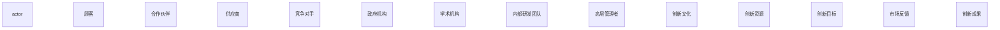

                 


# AI驱动的企业创新生态系统评估：内外部创新能力量化模型

## 关键词：企业创新生态系统，创新能力量化，AI驱动，内部创新能力，外部创新能力

## 摘要：  
本文探讨了如何利用人工智能技术构建企业创新生态系统，重点分析了企业内外部创新能力的量化模型。通过系统化的模型构建、算法设计和案例分析，展示了如何通过AI技术实现企业创新能力的全面评估与优化。

---

# 第一部分: AI驱动的企业创新生态系统评估背景与概念

## 第1章: 问题背景与研究现状

### 1.1 企业创新生态系统的重要性

#### 1.1.1 企业创新生态系统的核心概念  
企业创新生态系统（Corporate Innovation Ecosystem）是指企业在创新过程中所依赖的内外部资源、组织结构、文化和技术环境的总和。它包括企业内部的研发团队、外部合作伙伴、客户、供应商、学术机构、政府机构等多个利益相关者，共同构成了一个动态的创新网络。

#### 1.1.2 企业创新生态系统的关键特征  
- **动态性**：生态系统会随着市场变化和技术进步而不断调整。  
- **网络化**：创新活动往往不是单个企业独立完成，而是通过与外部合作伙伴的协作实现。  
- **多样性**：生态系统中的参与者具有多样性，能够为企业提供丰富的创新资源和视角。  

#### 1.1.3 企业创新生态系统与企业绩效的关系  
研究表明，一个健康的创新生态系统能够显著提升企业的市场竞争力、产品创新能力和抗风险能力。通过构建创新生态系统，企业可以更高效地整合内外资源，快速响应市场变化，从而实现可持续发展。

---

### 1.2 企业创新能力的内涵与外延

#### 1.2.1 内部创新能力的定义与范围  
内部创新能力是指企业内部的研发团队、技术能力和组织结构对企业创新活动的支持程度。它包括技术创新能力、管理创新能力、组织协调能力等多个维度。

#### 1.2.2 外部创新能力的定义与范围  
外部创新能力是指企业在外部环境中获取创新资源、合作伙伴和市场机会的能力。它包括技术合作能力、资源整合能力、市场洞察力等维度。

#### 1.2.3 内外部创新能力的相互作用  
内部创新能力是企业创新的根基，而外部创新能力则是企业拓展创新资源的重要途径。两者的结合能够形成强大的创新合力，推动企业的持续创新。

---

### 1.3 现有研究的局限性

#### 1.3.1 现有企业创新能力评估方法的不足  
传统的创新能力评估方法往往过于依赖主观判断，缺乏量化标准，难以提供具体的改进方向。

#### 1.3.2 现有模型在实际应用中的挑战  
现有的模型大多关注单一维度的创新能力，难以全面评估企业内外部创新能力的动态变化。

#### 1.3.3 本文研究的创新点  
本文通过引入AI技术，构建了一个全面量化企业内外部创新能力的模型，能够帮助企业更精准地识别创新机会和改进方向。

---

## 第2章: 企业创新生态系统评估的核心概念

### 2.1 企业创新生态系统的基本构成

#### 2.1.1 核心要素分析  
企业创新生态系统由以下核心要素构成：  
- **内部创新资源**：研发团队、技术平台、管理制度等。  
- **外部创新资源**：合作伙伴、供应商、客户、学术机构等。  
- **创新文化**：企业的创新氛围、员工激励机制等。  

#### 2.1.2 各要素之间的关系  
各要素之间相互作用，共同构成了企业的创新生态系统。例如，内部创新资源为企业提供技术基础，外部创新资源为企业提供市场反馈，创新文化则激励员工积极参与创新活动。

#### 2.1.3 系统的整体架构  
通过绘制 **Mermaid** 实体关系图，可以清晰地展示企业创新生态系统的核心要素及其相互关系。



---

### 2.2 内部创新能力与外部创新能力的对比

#### 2.2.1 内部创新能力的维度  
- **技术创新能力**：企业自主研发新技术的能力。  
- **管理创新能力**：企业通过管理优化提升创新效率的能力。  
- **组织协调能力**：企业内部团队协作的能力。  

#### 2.2.2 外部创新能力的维度  
- **资源整合能力**：企业整合外部资源的能力。  
- **市场洞察力**：企业捕捉市场机会的能力。  
- **合作伙伴关系**：企业与外部合作伙伴的合作深度。  

#### 2.2.3 内外部创新能力的异同分析  
- **相同点**：两者都是企业创新能力的重要组成部分，都需要通过资源的整合与优化来提升创新能力。  
- **不同点**：内部创新能力侧重于企业内部资源的优化，而外部创新能力侧重于外部资源的获取与利用。  

---

### 2.3 创新能力量化模型的构建逻辑

#### 2.3.1 模型构建的基本思路  
通过引入AI技术，将企业内外部创新能力分解为多个可量化的指标，并通过权重分配和综合评估，得出企业的创新能力指数。

#### 2.3.2 模型构建的关键假设  
- 企业创新能力可以被分解为多个可量化的指标。  
- 各个指标之间存在一定的权重关系，可以根据企业实际情况进行调整。  

#### 2.3.3 模型构建的目标与意义  
通过量化模型，企业可以更直观地评估自身的创新能力，识别改进方向，并制定针对性的创新策略。

---

# 第二部分: 创新能力量化模型的数学基础

## 第3章: 创新能力量化模型的数学框架

### 3.1 创新能力的综合评估指标

#### 3.1.1 指标的选择标准  
- **可量化性**：指标必须能够被量化评估。  
- **相关性**：指标必须与创新能力密切相关。  
- **可操作性**：指标必须易于收集和计算。  

#### 3.1.2 指标权重的确定方法  
- **层次分析法（AHP）**：通过专家评分确定各指标的权重。  
- **熵值法**：基于数据的离散程度确定权重。  

#### 3.1.3 综合评估公式  
企业创新能力指数（CIE）的计算公式为：  
$$ CIE = \sum_{i=1}^{n} w_i \cdot x_i $$  
其中，$w_i$ 是第 $i$ 个指标的权重，$x_i$ 是第 $i$ 个指标的评估值，$n$ 是指标总数。

---

### 3.2 内部创新能力的量化方法

#### 3.2.1 内部创新能力的分解模型  
内部创新能力可以分解为技术创新能力、管理创新能力、组织协调能力三个维度。

#### 3.2.2 内部创新能力的评估公式  
内部创新能力指数（ICE）的计算公式为：  
$$ ICE = w_{tech} \cdot x_{tech} + w_{manage} \cdot x_{manage} + w_{coord} \cdot x_{coord} $$  
其中，$w_{tech}$、$w_{manage}$、$w_{coord}$ 是各维度的权重，$x_{tech}$、$x_{manage}$、$x_{coord}$ 是各维度的评估值。

#### 3.2.3 内部创新能力的计算步骤  
1. 确定各维度的权重。  
2. 收集各维度的评估数据。  
3. 计算各维度的评分。  
4. 综合各维度的评分，计算内部创新能力指数。

---

### 3.3 外部创新能力的量化方法

#### 3.3.1 外部创新能力的分解模型  
外部创新能力可以分解为资源整合能力、市场洞察力、合作伙伴关系三个维度。

#### 3.3.2 外部创新能力的评估公式  
外部创新能力指数（ECE）的计算公式为：  
$$ ECE = w_{resource} \cdot x_{resource} + w_{insight} \cdot x_{insight} + w_{partner} \cdot x_{partner} $$  
其中，$w_{resource}$、$w_{insight}$、$w_{partner}$ 是各维度的权重，$x_{resource}$、$x_{insight}$、$x_{partner}$ 是各维度的评估值。

#### 3.3.3 外部创新能力的计算步骤  
1. 确定各维度的权重。  
2. 收集各维度的评估数据。  
3. 计算各维度的评分。  
4. 综合各维度的评分，计算外部创新能力指数。

---

### 3.4 综合创新能力的计算公式

#### 3.4.1 综合创新能力的定义  
综合创新能力是指企业在内外部资源的整合下，实现持续创新的能力。

#### 3.4.2 综合创新能力的计算公式  
综合创新能力指数（OCE）的计算公式为：  
$$ OCE = \alpha \cdot ICE + \beta \cdot ECE $$  
其中，$\alpha$ 和 $\beta$ 是内部和外部能力的权重系数，$ICE$ 是内部创新能力指数，$ECE$ 是外部创新能力指数。

#### 3.4.3 综合创新能力的影响因素  
- 内部创新能力的强弱。  
- 外部创新能力的强弱。  
- 内外部能力的协调性。  

---

## 项目实战: 创新能力量化模型的实现

### 3.5.1 环境安装与数据准备

#### 3.5.1.1 Python环境安装  
需要安装以下Python库：  
- `numpy`：用于数值计算。  
- `pandas`：用于数据处理。  
- `scipy`：用于科学计算。  
- `matplotlib`：用于数据可视化。  
- `sklearn`：用于机器学习算法。  

#### 3.5.1.2 数据准备  
收集企业的内外部创新能力相关数据，包括技术创新能力、管理创新能力、资源整合能力等指标。

---

### 3.5.2 创新能力量化模型的实现

#### 3.5.2.1 内部创新能力的计算  
```python
import numpy as np
import pandas as pd

# 示例数据：内部创新能力评估指标
data = {
    '技术创新': [8, 7, 9, 6],
    '管理创新': [7, 8, 6, 7],
    '组织协调': [9, 8, 7, 8]
}

df = pd.DataFrame(data)

# 确定各维度的权重
weights = [0.4, 0.3, 0.3]

# 计算内部创新能力指数
ice = np.dot(df.values, weights)

print("内部创新能力指数:", ice)
```

#### 3.5.2.2 外部创新能力的计算  
```python
import numpy as np
import pandas as pd

# 示例数据：外部创新能力评估指标
data = {
    '资源整合': [8, 7, 9, 6],
    '市场洞察': [7, 8, 6, 7],
    '合作伙伴关系': [9, 8, 7, 8]
}

df = pd.DataFrame(data)

# 确定各维度的权重
weights = [0.4, 0.3, 0.3]

# 计算外部创新能力指数
ece = np.dot(df.values, weights)

print("外部创新能力指数:", ece)
```

#### 3.5.2.3 综合创新能力的计算  
```python
# 示例数据：综合创新能力计算
ice = [10, 8, 9, 7]
ece = [9, 7, 8, 6]

# 确定内外部能力的权重
alpha = 0.6
beta = 0.4

# 计算综合创新能力指数
oce = alpha * ice + beta * ece

print("综合创新能力指数:", oce)
```

---

### 3.5.3 案例分析与结果解读

#### 3.5.3.1 案例分析  
假设某企业的内部创新能力指数为8，外部创新能力指数为7，综合创新能力指数为7.8。这表明该企业的创新能力较为均衡，但仍有提升空间。

#### 3.5.3.2 结果解读  
- 如果综合创新能力指数较高，说明企业的创新能力较强，创新生态系统较为完善。  
- 如果综合创新能力指数较低，说明企业需要进一步优化内部和外部创新能力。

---

### 3.5.4 项目总结

#### 3.5.4.1 模型的优势  
- 量化模型能够帮助企业更直观地评估创新能力。  
- AI技术的应用能够提高评估的准确性和效率。  

#### 3.5.4.2 模型的局限性  
- 模型的准确性依赖于数据的质量和模型的假设。  
- 模型需要根据企业的实际情况进行调整和优化。

---

## 总结与展望

### 总结  
本文通过构建AI驱动的企业创新生态系统评估模型，详细探讨了企业内外部创新能力的量化方法。通过数学模型和算法实现，帮助企业更高效地评估创新能力，并制定针对性的创新策略。

### 展望  
未来的研究可以进一步优化模型，引入更多AI技术，如机器学习和深度学习，提升创新能力评估的准确性和智能化水平。同时，可以结合企业实际应用场景，开发更具实用价值的创新管理系统。

---

## 作者：AI天才研究院/AI Genius Institute & 禅与计算机程序设计艺术 /Zen And The Art of Computer Programming

---

通过以上内容，我们可以看到，本文从理论到实践，详细介绍了如何利用AI技术构建企业创新生态系统评估模型，并通过具体的代码实现和案例分析，展示了模型的应用价值。

