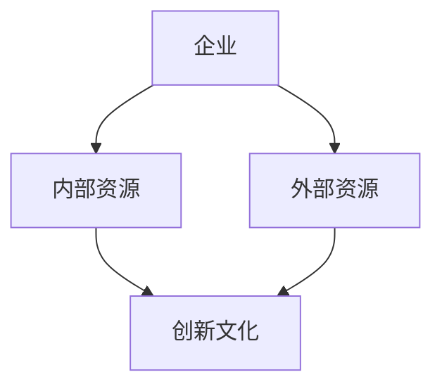
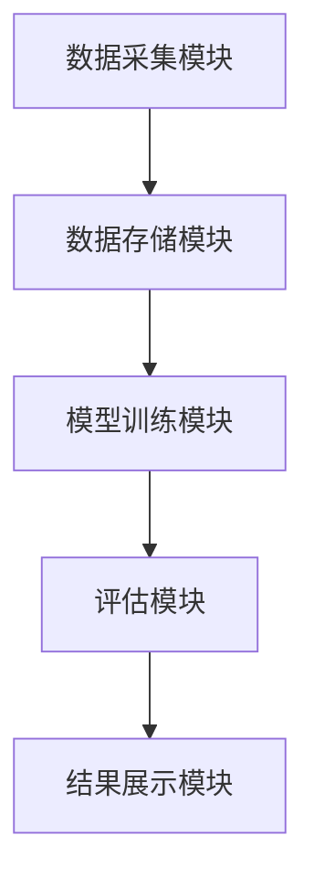

                 


# AI驱动的企业创新生态系统评估：内外部创新能力量化模型

---

## 关键词
- 企业创新生态系统
- AI驱动
- 内外部创新能力
- 量化模型
- 技术博客文章
- 企业创新
- 数字化创新

---

## 摘要

在数字化转型的浪潮中，企业创新生态系统已成为推动企业持续发展和竞争优势的核心驱动力。传统的创新模式逐渐暴露出效率低下、资源浪费和协同不足等问题，而人工智能（AI）的引入为企业创新生态系统评估提供了新的思路和方法。本文通过构建内外部创新能力的量化模型，详细探讨如何利用AI技术对企业创新生态系统进行科学评估。文章从理论基础、模型构建、算法实现、系统架构到项目实战，层层深入，为企业管理者和技术开发者提供一套完整的解决方案，助力企业实现高效创新和可持续发展。

---

# 第1章：企业创新生态系统概述

## 1.1 企业创新生态系统的基本概念

### 1.1.1 创新生态系统的定义

企业创新生态系统是指由企业内部资源、外部资源、创新文化和协同机制共同构成的复杂系统。它通过整合内外部资源，形成一个动态的、可持续的创新环境，以推动企业的技术进步、产品创新和商业模式变革。

### 1.1.2 创新生态系统的核心要素

- **企业内部资源**：包括研发团队、技术设施、资金投入等。
- **企业外部资源**：包括合作伙伴、供应商、客户、行业专家等。
- **创新文化**：包括企业的创新氛围、员工的创新意识和企业文化等。

### 1.1.3 创新生态系统与企业发展的关系

创新生态系统是企业发展的核心动力。通过优化创新生态系统，企业可以实现资源的高效配置、知识的快速传播和创新成果的快速落地，从而提升企业的竞争力和市场地位。

## 1.2 AI驱动创新的必要性

### 1.2.1 传统创新模式的局限性

传统的创新模式通常依赖于经验判断和人工评估，存在主观性强、效率低下、数据孤岛等问题。随着企业规模的扩大和市场竞争的加剧，传统模式难以满足企业对高效创新的需求。

### 1.2.2 AI技术对企业创新的赋能作用

AI技术可以通过数据挖掘、机器学习和自然语言处理等手段，帮助企业发现潜在的创新机会，优化创新流程，降低创新成本。AI还可以实时监测内外部资源的动态变化，为企业提供数据驱动的决策支持。

### 1.2.3 数字化创新的趋势分析

随着大数据、云计算和AI技术的快速发展，企业创新正在从传统的“经验驱动”向“数据驱动”转变。数字化创新已经成为企业应对市场竞争的重要手段。

## 1.3 企业内外部创新能力的定义

### 1.3.1 内部创新能力的内涵

内部创新能力是指企业内部资源和能力对企业创新活动的支持程度。它包括企业的研发能力、技术储备、员工创新意识等。

### 1.3.2 外部创新能力的内涵

外部创新能力是指企业外部资源和合作伙伴对企业创新活动的支持程度。它包括企业的外部合作网络、行业影响力、客户反馈等。

### 1.3.3 两者的关系与协同机制

内外部创新能力相互依存，共同构成了企业创新生态系统的核心动力。内部创新能力是企业创新的基础，而外部创新能力是企业创新的扩展。两者通过协同作用，推动企业的持续创新。

## 1.4 量化模型的构建框架

### 1.4.1 模型构建的目标

量化模型的目标是通过数学方法，将企业的内外部创新能力转化为可量化的指标，为企业提供科学的评估依据。

### 1.4.2 模型构建的步骤

1. **确定评估指标**：根据创新生态系统的核心要素，选择合适的评估指标。
2. **数据收集与预处理**：收集相关数据，并进行清洗和标准化。
3. **模型训练与优化**：利用机器学习算法，训练模型并优化参数。
4. **模型验证与评估**：通过验证数据集，评估模型的准确性和可靠性。

### 1.4.3 模型的评估与验证

模型的评估与验证是确保模型准确性和可靠性的关键步骤。通常采用交叉验证、ROC曲线等方法对模型进行评估。

---

# 第2章：企业创新生态系统评估的核心概念

## 2.1 创新生态系统的核心要素

### 2.1.1 企业内部资源

内部资源包括企业的研发团队、技术设施、资金投入等。这些资源是企业创新活动的基础。

### 2.1.2 企业外部资源

外部资源包括合作伙伴、供应商、客户、行业专家等。这些资源为企业提供了外部的支持和合作机会。

### 2.1.3 企业创新文化

创新文化是企业创新活动的灵魂。良好的创新文化可以激发员工的创新意识，促进知识的共享和传播。

## 2.2 内外部创新能力的属性特征对比

### 2.2.1 内部能力的属性特征

- **稳定性**：内部资源相对固定，不易受到外部环境的影响。
- **可控性**：企业可以对内部资源进行直接管理和优化。

### 2.2.2 外部能力的属性特征

- **动态性**：外部资源容易受到市场环境和合作伙伴的影响。
- **不确定性**：外部资源的变化具有较高的不确定性。

### 2.2.3 两者对比分析

通过对比分析，可以发现内部能力和外部能力在稳定性、可控性、动态性和不确定性等方面存在显著差异。企业需要在内部和外部能力之间找到平衡点，以实现高效的创新管理。

## 2.3 实体关系图（ER图）架构

### 2.3.1 实体关系图的构建

通过构建ER图，可以清晰地展示企业创新生态系统中的各个实体及其关系。例如，企业（Enterprise）与内部资源（Internal Resources）、外部资源（External Resources）之间的关系。

### 2.3.2 关系的类型与强度

- **一对一关系**：例如，一个企业可以有多个内部资源。
- **一对多关系**：例如，一个内部资源可以属于多个企业。

### 2.3.3 图的可视化展示

通过Mermaid流程图，可以直观地展示企业创新生态系统中的实体关系。



---

# 第3章：内外部创新能力量化模型的构建

## 3.1 指标体系的设计

### 3.1.1 内部能力的评估指标

- **研发团队规模**：研发团队的人员数量。
- **技术专利数量**：企业拥有的技术专利数量。
- **研发投入占比**：研发投入占企业总收入的比例。

### 3.1.2 外部能力的评估指标

- **合作伙伴数量**：企业拥有的外部合作伙伴数量。
- **行业影响力**：企业在行业中的知名度和影响力。
- **客户满意度**：客户的满意度和反馈。

### 3.1.3 指标权重的确定方法

指标权重的确定可以通过层次分析法（AHP）等方法进行。通过专家评分和数据分析，确定各指标的权重。

## 3.2 模型构建的数学框架

### 3.2.1 模型的总体架构

内外部创新能力量化模型的总体架构包括数据预处理、特征选择、模型训练和结果解释四个部分。

### 3.2.2 模型的数学表达式

通过线性回归模型，可以将内外部创新能力量化为一个综合得分。例如：

$$
\text{综合得分} = \sum_{i=1}^{n} w_i \times x_i
$$

其中，\( w_i \) 是第i个指标的权重，\( x_i \) 是第i个指标的得分。

---

## 3.3 数据预处理与特征选择

### 3.3.1 数据预处理

数据预处理包括数据清洗、数据标准化和数据缺失值处理等步骤。例如，使用Python中的pandas库进行数据清洗。

```python
import pandas as pd

# 读取数据
data = pd.read_csv('innovation.csv')

# 删除缺失值
data.dropna(inplace=True)

# 标准化处理
from sklearn.preprocessing import StandardScaler

scaler = StandardScaler()
data_scaled = scaler.fit_transform(data)
```

### 3.3.2 特征选择

特征选择可以通过相关性分析、主成分分析（PCA）等方法进行。例如，使用pandas中的corr()方法进行相关性分析。

```python
# 计算相关性矩阵
correlation_matrix = data.corr()

# 找出相关性最高的前5个特征
top_features = correlation_matrix.nlargest(5, min cor=0.3)['feature']
```

---

## 3.4 算法实现与模型优化

### 3.4.1 算法选择

常用的机器学习算法包括线性回归、随机森林、支持向量机（SVM）等。根据数据特点选择合适的算法。

### 3.4.2 模型训练与优化

通过交叉验证和网格搜索等方法，优化模型的参数和超参数。

```python
from sklearn.model_selection import GridSearchCV
from sklearn.ensemble import RandomForestRegressor

# 定义参数网格
param_grid = {
    'n_estimators': [100, 200],
    'max_depth': [None, 10, 20],
}

# 网格搜索优化
grid_search = GridSearchCV(RandomForestRegressor(), param_grid, cv=5)
grid_search.fit(X_train, y_train)

# 输出最佳参数
print("Best parameters found: ", grid_search.best_params_)
```

### 3.4.3 模型验证与评估

通过验证集评估模型的准确性和可靠性。例如，计算均方误差（MSE）和R平方值。

```python
from sklearn.metrics import mean_squared_error, r2_score

# 预测值
y_pred = grid_search.predict(X_test)

# 计算评估指标
mse = mean_squared_error(y_test, y_pred)
r2 = r2_score(y_test, y_pred)

print(f"MSE: {mse}, R^2: {r2}")
```

---

## 3.5 系统架构设计

### 3.5.1 系统功能设计

- **数据采集模块**：负责收集企业内外部数据。
- **模型训练模块**：负责构建和优化量化模型。
- **评估模块**：负责评估模型的准确性和可靠性。

### 3.5.2 系统架构图

通过Mermaid架构图，可以清晰地展示系统的各个模块及其交互。



---

## 3.6 项目实战

### 3.6.1 环境安装

安装必要的Python库，如pandas、scikit-learn、mermaid等。

```bash
pip install pandas scikit-learn mermaid
```

### 3.6.2 核心实现

编写代码实现模型的训练和评估。

```python
import pandas as pd
from sklearn.model_selection import train_test_split
from sklearn.ensemble import RandomForestRegressor
from sklearn.metrics import mean_squared_error, r2_score

# 读取数据
data = pd.read_csv('innovation.csv')

# 数据预处理
data.dropna(inplace=True)

# 特征选择
X = data.drop('target', axis=1)
y = data['target']

# 划分训练集和测试集
X_train, X_test, y_train, y_test = train_test_split(X, y, test_size=0.2, random_state=42)

# 模型训练
model = RandomForestRegressor()
model.fit(X_train, y_train)

# 模型预测
y_pred = model.predict(X_test)

# 评估指标
mse = mean_squared_error(y_test, y_pred)
r2 = r2_score(y_test, y_pred)

print(f"MSE: {mse}, R^2: {r2}")
```

### 3.6.3 案例分析

通过具体案例分析，验证模型的有效性和准确性。

---

## 3.7 总结与展望

### 3.7.1 总结

本文通过构建内外部创新能力量化模型，为企业创新生态系统评估提供了一套科学的解决方案。通过AI技术的应用，企业可以更高效地优化创新流程，提升创新效率。

### 3.7.2 展望

未来，随着AI技术的不断发展，企业创新生态系统评估将更加智能化和自动化。企业可以利用AI技术实时监测内外部资源的变化，实现动态优化和精准决策。

---

## 作者

**作者：AI天才研究院/AI Genius Institute & 禅与计算机程序设计艺术 /Zen And The Art of Computer Programming**

---

**摘要**：本文通过构建内外部创新能力量化模型，详细探讨了如何利用AI技术对企业创新生态系统进行科学评估。文章从理论基础、模型构建、算法实现、系统架构到项目实战，层层深入，为企业管理者和技术开发者提供了一套完整的解决方案。

---

**结语**：企业创新生态系统评估是企业数字化转型的重要组成部分。通过AI技术的应用，企业可以更高效地优化创新流程，提升创新效率，从而在激烈的市场竞争中占据优势地位。

